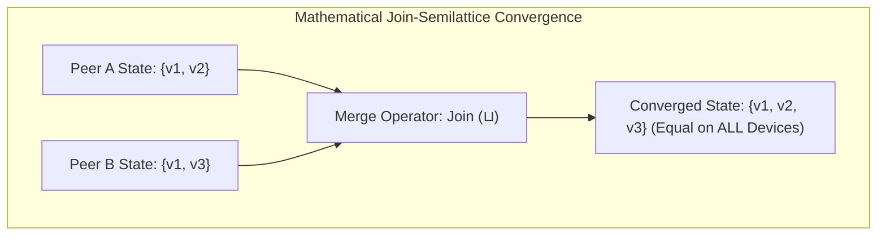

# Local-First Architecture: CRDTs (Conflict-Free Replicated Data Types) vs Operational Transformation (OT)

For two decades, modern web applications were architected around a single, centralized dogma: **the cloud server is the single source of truth**.

In traditional cloud apps (early Google Docs, Jira, Salesforce):
* Every keystroke, mouse click, and state change requires a network round-trip to a centralized PostgreSQL or Redis instance.
* When a user boards an airplane or loses Wi-Fi connection, the application locks up, displaying a dreaded *"You are offline"* modal.
* Collaboration requires pessimistic database row locking or complex centralized conflict resolution servers.

In modern high-performance creative software (**Figma**, **Linear**, **Notion**, **Apple Notes**, **VS Code Live Share**), this paradigm has been inverted into **Local-First Architecture**.

By keeping data stored locally on device and synchronizing changes asynchronously using **Conflict-Free Replicated Data Types (CRDTs)**, local-first applications achieve **instant $0\text{ms}$ latency**, **flawless offline capability**, and **provable peer-to-peer mathematical convergence**.

```mermaid
graph TD
  subgraph Centralized Cloud vs Local-First CRDTs
    subgraph 1. Centralized Cloud / Operational Transformation (OT)
      ClientA[Client A] -->|100ms RTT| CentralServer[(Centralized Server / DB Lock)]
      ClientB[Client B] -->|100ms RTT| CentralServer
      Note1[Offline = Broken App]
    end

    subgraph 2. Local-First CRDTs (Peer-to-Peer Convergence)
      NodeA[Client A: Local SQLite / IndexedDB (0ms)] <-->|Async WebRTC / WebSocket Sync| NodeB[Client B: Local SQLite / IndexedDB (0ms)]
      NodeA --> MathSync["Join-Semilattice Merge (Commutative, Associative, Idempotent)"]
      NodeB --> MathSync
      MathSync --> EqualState[Provably Identical Converged State!]
    end
  end
```

---

## 1. The 7 Local-First Software Principles (Kleppmann et al.)

Coined in 2019 by Martin Kleppmann, Adam Wiggins, Peter van Hardenberg, and Mark McGranaghan, the Local-First Manifesto defines the standard for modern reactive applications:

```
> **THE 7 LOCAL-FIRST CORE PRINCIPLES**
| 1. No Waiting (0ms Local I/O) : All reads and writes hit local memory/disk instantly.              |
| 2. Multi-Device Sync          : Changes sync seamlessly across phone, laptop, and tablet.          |
| 3. Network Optional (Offline) : App retains 100% functionality without internet connection.       |
| 4. Seamless Collaboration     : Multiple peers edit concurrently without write locks.              |
| 5. Longevity / Data Ownership : Users retain physical copies of data even if company shuts down.   |
| 6. Security & Privacy         : End-to-end encryption (E2EE) possible because server is a dumb pipe|
| 7. Ultimate User Control      : Clear migration, backup, and local file access.                    |

```

---

## 2. Operational Transformation (OT) vs CRDTs

To support real-time collaborative text editing, computer scientists invented two competing paradigms:

```
> **OT vs CRDT COMPARISON MATRIX**
| Dimension            | Operational Transformation (OT) | Conflict-Free Replicated Data Types (CRDT)|
| Central Server?      | MANDATORY (Single sequencer)    | OPTIONAL (True Peer-to-Peer / Decentralized) |
| Mathematical Basis   | Transformation Functions T(a,b) | Join-Semilattice (Partial Order Sets)    |
| Offline Scaling      | Poor (Huge transformation trees)| Flawless (State merges deterministically) |
| Memory Overhead      | Low (Stores raw text + history) | Higher (Unique IDs + Tombstones)          |
| Leading Engines      | Google Docs, Etherpad           | Yjs, Automerge, Loro, Figma, Linear       |

```

---

### The Mathematical Magic of CRDTs: The Join-Semilattice
A data structure is a valid State-Based CRDT (CvRDT) if its merge operator ($\sqcup$) forms a **bounded join-semilattice**, satisfying three algebraic laws:

1. **Commutativity ($A \sqcup B = B \sqcup A$)**: The order in which peer updates arrive does not matter.
2. **Associativity ($(A \sqcup B) \sqcup C = A \sqcup (B \sqcup C)$)**: Packet grouping over the network does not alter the result.
3. **Idempotence ($A \sqcup A = A$)**: Receiving duplicate network packets has zero side effects.



---

## 3. State-Based (CvRDT) vs Operation-Based (CmRDT)

### 1. State-Based CRDTs (CvRDT)
* Replicas synchronize by transmitting their **entire local state** (or state delta) to peers.
* The receiver executes `local_state = local_state.merge(remote_state)`.
* Highly resilient to packet drops and out-of-order networks.

### 2. Operation-Based CRDTs (CmRDT)
* Replicas synchronize by broadcasting **discrete immutable operations** (e.g. `Insert(id: 42, char: 'a', after: 41)`).
* Requires causal exactly-once delivery guarantees (often backed by vector clocks).

---

## 4. The Tombstone Problem & Compact Run-Length Encoding

When a user deletes a character in a sequence CRDT, the system cannot simply erase the memory address—because a concurrent peer might insert a character relative to that deleted item.

The system marks the character as a **Tombstone** (`visible = false`).

* **The Tombstone Bloat Problem**: In a long editing session where 100,000 characters are typed and deleted, memory usage can balloon to $50\text{ MB}$ for a $2\text{ KB}$ text document!
* **The Modern Solution (Yjs & Automerge)**: Modern engines use **Run-Length Encoding (RLE)** and block-based linked lists, compressing adjacent operations into single contiguous memory structs, reducing RAM overhead to **$< 2\text{ MB}$**.

---

## Python Implementation: State-Based LWW-Element-Set CRDT Engine

Here is a Python implementation of a **Last-Write-Wins Element-Set (LWW-Element-Set) CRDT** demonstrating concurrent offline mutations, network partition healing, and mathematical convergence:

```python
import time
from dataclasses import dataclass, field
from typing import Dict, Set

@dataclass(frozen=True)
class ElementRecord:
    value: str
    timestamp: float

class LWWElementSetCRDT:
    """
    Last-Write-Wins Element-Set (LWW-Set) CRDT.
    Guarantees Commutative, Associative, and Idempotent state convergence.
    """
    def __init__(self, node_id: str):
        self.node_id = node_id
        # Value -> ElementRecord (Add Set)
        self.add_set: Dict[str, float] = {}
        # Value -> ElementRecord (Remove Set)
        self.remove_set: Dict[str, float] = {}

    def add(self, element: str, timestamp: float = None):
        ts = timestamp or time.time()
        # Monotonically store latest timestamp
        if element not in self.add_set or self.add_set[element] < ts:
            self.add_set[element] = ts
            print(f" 🟢 [{self.node_id}] Added '{element}' at t={ts:.4f}")

    def remove(self, element: str, timestamp: float = None):
        ts = timestamp or time.time()
        if element not in self.remove_set or self.remove_set[element] < ts:
            self.remove_set[element] = ts
            print(f" 🔴 [{self.node_id}] Removed '{element}' at t={ts:.4f}")

    def lookup(self, element: str) -> bool:
        # Element exists if it is in Add-Set and has higher timestamp than in Remove-Set
        if element not in self.add_set:
            return False
        if element not in self.remove_set:
            return True
        return self.add_set[element] > self.remove_set[element]

    def read_all_elements(self) -> Set[str]:
        return {elem for elem in self.add_set if self.lookup(elem)}

    def merge(self, remote: 'LWWElementSetCRDT'):
        print(f"\n🔄 [CRDT Sync] Merging state from [{remote.node_id}] into [{self.node_id}]...")
        # Merge Add-Sets (take max timestamp for each element)
        for elem, ts in remote.add_set.items():
            if elem not in self.add_set or self.add_set[elem] < ts:
                self.add_set[elem] = ts

        # Merge Remove-Sets (take max timestamp for each element)
        for elem, ts in remote.remove_set.items():
            if elem not in self.remove_set or self.remove_set[elem] < ts:
                self.remove_set[elem] = ts

# Demonstration Execution: Simulating Offline Partition & Healing
if __name__ == "__main__":
    # Create two isolated peer replicas (e.g. Laptop and Phone)
    laptop = LWWElementSetCRDT("Laptop-Client")
    phone = LWWElementSetCRDT("Phone-Client")

    # 1. Initial Synchronized State
    t0 = 1000.0
    laptop.add("Shopping List: Milk", timestamp=t0)
    laptop.add("Shopping List: Bread", timestamp=t0)
    phone.merge(laptop)

    print(f"\n📱 Phone Initial State : {phone.read_all_elements()}")

    # 2. Network Partition! (Both devices go offline)
    print("\n✈️ --- Network Disconnected (Offline Concurrent Edits) ---")
    # Laptop user removes Milk and adds Coffee
    laptop.remove("Shopping List: Milk", timestamp=t0 + 5.0)
    laptop.add("Shopping List: Coffee", timestamp=t0 + 6.0)

    # Phone user simultaneously adds Eggs and removes Bread
    phone.add("Shopping List: Eggs", timestamp=t0 + 4.0)
    phone.remove("Shopping List: Bread", timestamp=t0 + 7.0)

    print(f" 💻 Laptop Local State: {laptop.read_all_elements()}")
    print(f" 📱 Phone Local State : {phone.read_all_elements()}")

    # 3. Network Reconnects & Merges Asynchronously
    print("\n🌐 --- Network Reconnected: Bidirectional CRDT Merge ---")
    laptop.merge(phone)
    phone.merge(laptop)

    print("\n✨ Final Converged States:")
    print(f" 💻 Laptop Final State : {laptop.read_all_elements()}")
    print(f" 📱 Phone Final State  : {phone.read_all_elements()}")
    assert laptop.read_all_elements() == phone.read_all_elements(), "CRDTs must mathematically converge!"
    print(" ✅ Mathematical Convergence Verified: States are 100% Identical!")
```

---

## Summary: Cloud Monolith vs Local-First CRDTs

| Dimension | Centralized Cloud Architecture | Local-First CRDT Architecture |
|---|---|---|
| **Read/Write Latency** | $50\text{--}200\text{ms}$ (Network RTT) | **$0\text{ms}$ (Instant local memory/disk)** |
| **Offline Usability** | Read-only or completely broken | **$100\%$ Fully functional read/write** |
| **Conflict Resolution** | Server-side database locks | Mathematical join-semilattice ($A \sqcup B$) |
| **Data Ownership** | Central database silo | User owns local SQLite/IndexedDB files |
| **Server Infrastructure** | Heavy application compute clusters | Lightweight, dumb WebRTC/WebSocket sync pipes |

---

## Architectural Takeaway
Local-First is not merely an optimization—**it is the future of collaborative software engineering**.

By replacing fragile client-server request/response loops with **Conflict-Free Replicated Data Types**, developers deliver consumer software that feels instantaneous, operates reliably anywhere on Earth, and guarantees flawless mathematical data convergence.
