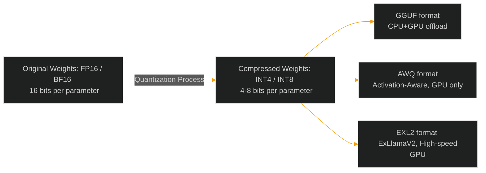

# Local LLM Serving: GGUF vs. EXL2 vs. AWQ Quantization

> [!NOTE]
> **📖 Article Overview**
> Deploying open-source LLMs (like Llama-3, Mistral, or DeepSeek) locally or on private server infrastructure requires compressing the model weights to fit into available GPU VRAM. This compression is called **quantization**. Choosing the wrong format can cause slow token-generation speeds or degraded output quality. This article breaks down the three primary quantization standards — **GGUF**, **AWQ**, and **EXL2** — explaining their execution engines, VRAM usage calculations, and how to serve them in production using vLLM.

---

## What is Quantization?

An LLM's weights are originally stored as 16-bit floating-point numbers (FP16 or BF16). A 70-billion parameter model requires around 140 GB of VRAM just to load. Quantization compresses these weights into lower bit-depth integers (like 4-bit, 5-bit, or 8-bit), allowing massive models to run on single consumer or enterprise GPUs.



---

## GGUF vs. AWQ vs. EXL2: The Trade-Off Matrix

### 1. GGUF (GPT-Generated Unified Format)
* **Best For**: CPU-only or mixed CPU+GPU environments.
* **Engine**: llama.cpp
* **Key Benefit**: Allows you to split the model layers, loading part in GPU VRAM and offloading the remainder to slower system RAM (CPU).
* **Limitations**: CPU execution is slow.

### 2. AWQ (Activation-Aware Weight Quantization)
* **Best For**: GPU server deployments (vLLM, TGI).
* **Engine**: vLLM, TensorRT-LLM
* **Key Benefit**: Observes model activations during calibration to preserve the most critical weights, keeping accuracy high.
* **Limitations**: Requires dedicated GPUs (CUDA).

### 3. EXL2 (ExLlamaV2 Format)
* **Best For**: Maximum token generation speeds on GPUs.
* **Engine**: ExLlamaV2, TabbyAPI
* **Key Benefit**: Supports variable-bitrate quantization (e.g., 4.65 bits per parameter), allowing fine-grained VRAM target matching.
* **Limitations**: GPU only.

---

## VRAM Sizing Calculation formula

To calculate how much VRAM you need to load a model:

\[\text{VRAM (GB)} = \left( \frac{\text{Parameters (B)} \times \text{Bits per Parameter}}{8} \right) \times 1.2\]

*Note: The \(1.2\) multiplier represents a 20% overhead buffer for the context window (KV Cache) and model activations during runtime.*

Here is a simple Python function to run this estimation before deployment:

```python
# vram_calculator.py
def estimate_vram_requirements(param_count_billions: float, bits_per_param: float) -> float:
    # Base weight size in Gigabytes
    model_size_gb = (param_count_billions * bits_per_param) / 8.0
    
    # 20% buffer for KV Cache (assuming 8k context) and activation layers
    total_vram_needed = model_size_gb * 1.2
    
    return total_vram_needed

# Example: Llama-3 8B model quantized to 4-bit (GGUF or AWQ)
needed = estimate_vram_requirements(param_count_billions=8.0, bits_per_param=4.0)
print(f"Estimated VRAM: {needed:.2f} GB (Fits on a single 16GB or 24GB VRAM GPU)")
```

---

## Serving AWQ Models with vLLM in Production

vLLM is a high-performance LLM serving engine. It natively supports AWQ and GPTQ quantized models, providing extreme throughput using PagedAttention.

### Docker Run Config:
Here is how to spin up a Docker container serving an 8B AWQ model locally:

```bash
docker run --gpus all \
  -v ~/.cache/huggingface:/root/.cache/huggingface \
  -p 8000:8000 \
  --ipc=host \
  vllm/vllm-openai:latest \
  --model casperhansen/llama-3-8b-instruct-awq \
  --quantization awq \
  --max-model-len 8192
```

Once running, the container exposes an OpenAI-compatible API on port `8000`, allowing you to route user prompts instantly.

---

## 🏁 Conclusion & Takeaways

Selecting the right quantization format is critical for local LLM cost and speed:
* [ ] **Choose GGUF for edge/local client dev**: GGUF is perfect for running on laptops (macOS/Windows) because it allows CPU RAM offloading.
* [ ] **Choose AWQ for server-scale production**: vLLM handles AWQ natively, delivering the highest concurrent token throughput.
* [ ] **Compute your KV Cache buffer**: Always leave a 20% VRAM buffer above the model weight size to prevent Out-Of-Memory (OOM) crashes when context windows fill up.
