# Local LLM Fallback: Scaling Bulk Document Processing with Local vLLM & Ollama Runtimes

> [!NOTE]
> **📖 Article Overview**
> While frontier API models (like Claude 3.5 Sonnet) are unmatched in reasoning, querying them for high-volume offline tasks—like processing millions of system logs or parsing PDF catalogs—quickly generates unsustainable token bills. In this article, we show how to scale bulk processing workloads by deploying local inference runtimes (**vLLM** and **Ollama**). We evaluate GPU memory trade-offs and provide a complete Python failover wrapper that routes requests to local servers when cloud APIs time out or hit rate limits.

---

## The Economics of High-Volume Token Processing

When building interactive applications (like chat interfaces or secure code executors), we require the highest possible reasoning capabilities. For these tasks, querying a cloud API makes sense.

However, for bulk offline data tasks:
1.  **Batch Ingestion**: Parsing 10,000 PDF invoices, extracting key-value data, and indexing them.
2.  **Telemetry Analysis**: Scanning database query logs to identify lock contentions.

At large scale, paying $\$3.00$ to $\$15.00$ per million tokens results in thousands of dollars in API bills. By contrast, open-source models (like LLaMA-3 or DeepSeek-V3) can be run locally on dedicated GPUs (like RTX 490s, A10s, or rented runtimes). 

To maximize system availability and cost-efficiency, you need a **hybrid gateway**: send high-priority user-facing tasks to cloud models, while routing batch background processes to a local inference cluster, with automatic failover gates in case of network outages or rate limits.

---

## Hybrid Failover Gateway Architecture

A failover gateway routes inbound requests to cloud APIs based on priority, automatically failing over to a local vLLM or Ollama node if the API service throws rate-limit (`429`) or timeout exceptions.

```mermaid
%%{init: {'theme': 'dark', 'themeVariables': { 'primaryColor': '#0ea5e9', 'primaryTextColor': '#f3f4f6', 'primaryBorderColor': '#38bdf8', 'lineColor': '#0ea5e9', 'secondaryColor': '#111827', 'tertiaryColor': '#111827'}}}%%
graph TD
    A[Incoming Task Request] --> B{Check Task Priority}
    
    B -->|Batch / Low-Priority| C[Local Inference Cluster]
    B -->|High-Priority / User| D[Cloud API Gate: Claude]
    
    C -->|vLLM / Ollama Node| E[Local GPU Cluster]
    
    D -->|Success| F[Return Response]
    D -->|Timeout / Rate Limit 429| G{Fallback Activated?}
    G -->|Yes| C
    G -->|No| H[Return Gateway Error]
    
    E --> F

    style A fill:#1e293b,stroke:#0ea5e9,stroke-width:2px
    style B fill:#1e293b,stroke:#a855f7,stroke-width:2px
    style C fill:#111827,stroke:#eab308,stroke-width:2px
    style D fill:#111827,stroke:#0ea5e9,stroke-width:2px
    style E fill:#0ea5e9,stroke:#0f172a,stroke-width:2px,color:#0f172a
    style F fill:#10b981,stroke:#0f172a,stroke-width:2px
```



### Local Runtimes Comparison
*   **vLLM**: An enterprise-grade, high-throughput model server that implements **PagedAttention** (which manages KV-cache memory blocks dynamically to prevent GPU fragmentation). Ideal for concurrent multi-user serving and batch operations.
*   **Ollama**: A lightweight runtime built on `llama.cpp` that wraps model quantization and loading into simple CLI commands. Ideal for local development, local edge nodes, and single-worker processes.

---

## What's Good & What's Not

| What's Good (Pros) | What's Not (Cons) |
| --- | --- |
| * Zero API Costs: Unlimited batch token processing without pay-per-token overhead. | * High Capital Cost: Demands purchasing or leasing expensive GPU servers (Nvidia A100/H100 or high-end consumer cards). |
| * High Ingestion Speed: Local vLLM servers process thousands of tokens/sec using PagedAttention. | * System Maintenance: Managing local hardware, model updates, and server health requires dedicated devops resource hours. |
| * Data Privacy: Content remains inside local VPCs, complying with strict security constraints. | * Reasoning Gap: Quantized open-source models require active prompt tuning to match frontier API reasoning. |

---

## Technical Implementation: Failover Gateway Wrapper in Python

Below is a complete Python implementation using the standard `openai` library client. The wrapper class attempts to complete a task using a cloud API (e.g. GPT-4o-mini), intercepting connection and rate-limit errors to fall back to a local **vLLM** endpoint.

```python
import os
import time
from openai import OpenAI, APIConnectionError, RateLimitError

# 1. Configuration Constants
CLOUD_API_KEY = os.environ.get("OPENAI_API_KEY", "your-openai-api-key")
LOCAL_VLLM_URL = "http://localhost:8000/v1" # Local vLLM/Ollama OpenAI-compatible endpoint
LOCAL_MODEL_NAME = "meta-llama/Llama-3-8B-Instruct"

class AIInferenceGateway:
    def __init__(self):
        # Initialize cloud and local clients (vLLM exposes an OpenAI-compatible API)
        self.cloud_client = OpenAI(api_key=CLOUD_API_KEY)
        self.local_client = OpenAI(api_key="local-token-not-required", base_url=LOCAL_VLLM_URL)

    def generate_completion(self, system_prompt: str, user_prompt: str, use_fallback: bool = True):
        messages = [
            {"role": "system", "content": system_prompt},
            {"role": "user", "content": user_prompt}
        ]

        # Try Cloud API first
        try:
            print("[*] Attempting execution on Cloud API...")
            response = self.cloud_client.chat.completions.create(
                model="gpt-4o-mini",
                messages=messages,
                temperature=0.1,
                timeout=10.0 # Set aggressive timeout to prevent long hangs
            )
            print("[+] Cloud API execution succeeded.")
            return response.choices[0].message.content

        except (APIConnectionError, RateLimitError, Exception) as e:
            # 2. Intercept Errors and Failover
            print(f"[-] Cloud API execution failed: {str(e)}")
            if not use_fallback:
                raise e
                
            print(f"[*] Failing over to Local vLLM Cluster ({LOCAL_VLLM_URL})...")
            try:
                start_time = time.time()
                response = self.local_client.chat.completions.create(
                    model=LOCAL_MODEL_NAME,
                    messages=messages,
                    temperature=0.1
                )
                duration = time.time() - start_time
                print(f"[+] Local vLLM execution succeeded in {duration:.2f}s.")
                return response.choices[0].message.content
            except Exception as local_err:
                print(f"[-] Local execution failed: {str(local_err)}")
                raise Exception("Both Cloud API and Local Fallback cluster failed.")

if __name__ == "__main__":
    # Mocking execution example
    # Ensure a local vLLM or Ollama endpoint is running on http://localhost:8000/v1
    
    gateway = AIInferenceGateway()
    sys_p = "You are a database log analyzer. Extract database anomalies."
    user_p = "Log: 2026-06-10 12:40:11 ERROR: deadlock detected on pg_advisory_xact_lock"
    
    try:
        # Runs query, falling back to local server if cloud is down
        output = gateway.generate_completion(sys_p, user_p, use_fallback=True)
        print("\n[+] Extraction Output:")
        print(output)
    except Exception as err:
        print(f"\n[-] Execution failed: {err}")
```

---

## Conclusion & Key Takeaways

Running local LLM runtimes changes the economics of agentic applications. By deploying vLLM or Ollama alongside your cloud connections, you ensure maximum uptime and zero variable costs for batch work.

*   **Implement PagedAttention**: Always deploy vLLM rather than raw python wrapper scripts for concurrent pipelines to prevent memory out-of-memory crashes.
*   **Create Priority Routes**: Map your tasks. Let cloud engines handle client interactions, and let local GPU clusters scan logs, run evaluations, and parse bulk PDF files in the background.

To review the comparative parameter bounds of local small language models vs cloud-hosted platforms, check out our baseline guide: [Edge SLMs vs. Cloud LLMs: Navigating the Spectrum of Parameter Budgets](file:///G:/ReplitProjects/akmalkhaniub.github.io/blog/edge-slms-vs-cloud-llms-parameter-budgets.html).

---

### Research References & Resources
*   **vLLM Paper**: *Efficient Memory Management for Large Language Model Serving with PagedAttention* (Kwon et al., Berkeley) — [arXiv:2309.06180](https://arxiv.org/abs/2309.06180)
*   **vLLM Project**: [High-throughput serving engine github repo](https://github.com/vllm-project/vllm)
*   **Ollama Portal**: [Local llama.cpp inference runtime portal](https://ollama.com/)
