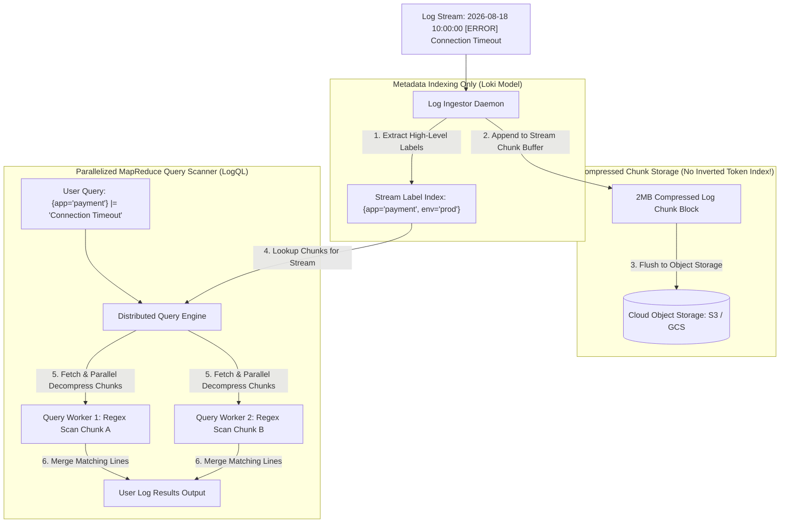

# Log Aggregation at Petabyte Scale: Columnar Storage & Indexless Logs

When operating infrastructure ingesting terabytes or petabytes of application log lines per day, traditional full-text search engines (like **Elasticsearch** or **Splunk**) run into severe cost and write scalability ceilings.

Elasticsearch builds a comprehensive inverted index for *every single token* across every log line. At petabyte scale:
1. **Index Bloat**: The inverted index size can equal or exceed the size of the raw uncompressed log text ($100\text{ TB}$ of logs requires $100\text{ TB}+$ of index RAM/disk).
2. **Ingestion Bottlenecks**: Indexing token strings consumes massive CPU resources, causing log ingestion stalls during outage incidents when logging volume spikes $10\times$.

To scale log collection cost-effectively, modern observability systems (**Grafana Loki**, **ClickHouse**, **Vector**) adopted **Indexless Log Aggregation** and **Columnar Storage**.

Instead of indexing every word, systems like Loki index *only* high-level stream metadata labels, storing raw logs in compressed chunk blocks and executing parallelized map-reduce grep operations during queries.

This article details indexless log aggregation architecture and columnar chunk compression.

---

## Indexless Log Aggregation Architecture

How Loki-style indexless log engines partition streams and execute parallel query scans:



### Core Indexless Log Engine Principles
1. **Stream Label Partitioning**: Logs are grouped into distinct streams identified by a minimal set of key-value labels (e.g., `{app="frontend", environment="production"}`). Only the stream labels are indexed in memory—the log message content itself is *never* tokenized or inverted.
2. **Compressed Chunk Archiving**: As log lines arrive, they are formatted and appended to active stream chunks. When a chunk reaches a size threshold (e.g. $2\text{ MB}$) or time limit (e.g. $2$ hours), it is compressed using high-speed algorithms (**Snappy** or **ZSTD**) and written to low-cost cloud object storage (AWS S3 or GCS).
3. **Parallelized Distributed Grep**: Because disk and memory are freed from index overhead, query performance is driven by **Parallel Processing Bandwidth**. When a user executes a LogQL query (`{app="payment"} |= "database error"`), the query engine identifies matching chunk object keys and distributes chunk decompression and regex matching across hundreds of worker CPUs simultaneously using SIMD vector instructions.
4. **Columnar Log Storage (ClickHouse)**: For structured logs, columnar engines store each JSON log field (`status_code`, `response_time_ms`) in separate, contiguous disk blocks with dictionary encoding. Queries analyzing specific fields read *only* the target columns, skipping $95\%$ of unneeded disk bytes.

---

## Python Implementation: Indexless Log Aggregation Engine

Here is a production-grade Python implementation of an Indexless Log Aggregation Engine featuring Stream Label Sharding, Compressed Chunk Archiving, and Parallel Regexp Query Scanners:

```python
import re
import zlib
import time
from typing import List, Dict, Tuple, Optional
from pydantic import BaseModel

class LogLine(BaseModel):
    timestamp: float
    message: str

class CompressedLogChunk:
    """
    Compressed block storing raw log lines for a specific stream.
    """
    def __init__(self, stream_id: str, chunk_id: str):
        self.stream_id = stream_id
        self.chunk_id = chunk_id
        self.uncompressed_lines: List[LogLine] = []
        self.compressed_bytes: Optional[bytes] = None
        self.is_closed = False

    def add_line(self, line: LogLine):
        if self.is_closed:
            raise RuntimeError("Cannot write to closed chunk")
        self.uncompressed_lines.append(line)

    def flush_and_compress(self):
        """Compresses log lines using zlib/Snappy and clears raw objects."""
        raw_text = "\n".join(f"{l.timestamp}:{l.message}" for l in self.uncompressed_lines)
        self.compressed_bytes = zlib.compress(raw_text.encode('utf-8'))
        self.is_closed = True
        print(f" 💾 [Chunk Flush] Stream '{self.stream_id}' -> Compressed {len(self.uncompressed_lines)} lines ({len(self.compressed_bytes)} bytes)")
        self.uncompressed_lines.clear()

    def decompress_and_scan(self, regex_pattern: str) -> List[Tuple[float, str]]:
        """Decompresses chunk on-demand and scans using compiled regex."""
        if not self.compressed_bytes:
            return []

        raw_text = zlib.decompress(self.compressed_bytes).decode('utf-8')
        compiled_re = re.compile(regex_pattern)
        matches = []

        for row in raw_text.split("\n"):
            if not row:
                continue
            parts = row.split(":", 1)
            ts, msg = float(parts[0]), parts[1]
            if compiled_re.search(msg):
                matches.append((ts, msg))
        return matches

class IndexlessLogEngine:
    """
    Simulates a Grafana Loki-style Indexless Log Aggregator.
    """
    def __init__(self, chunk_line_limit: int = 3):
        self.chunk_line_limit = chunk_line_limit
        # stream_labels_str -> List of CompressedLogChunk
        self.stream_chunks: Dict[str, List[CompressedLogChunk]] = {}
        # Active uncompressed chunk per stream
        self.active_chunks: Dict[str, CompressedLogChunk] = {}
        self.chunk_counter = 0

    def _format_labels(self, labels: Dict[str, str]) -> str:
        sorted_pairs = sorted(labels.items())
        return "{" + ",".join(f'{k}="{v}"' for k, v in sorted_pairs) + "}"

    def push_log(self, labels: Dict[str, str], message: str):
        stream_id = self._format_labels(labels)
        if stream_id not in self.stream_chunks:
            self.stream_chunks[stream_id] = []

        if stream_id not in self.active_chunks:
            self.chunk_counter += 1
            chunk_id = f"chunk-{self.chunk_counter}"
            chunk = CompressedLogChunk(stream_id, chunk_id)
            self.active_chunks[stream_id] = chunk
            self.stream_chunks[stream_id].append(chunk)

        active_chunk = self.active_chunks[stream_id]
        active_chunk.add_line(LogLine(timestamp=time.time(), message=message))

        if len(active_chunk.uncompressed_lines) >= self.chunk_line_limit:
            active_chunk.flush_and_compress()
            del self.active_chunks[stream_id]

    def query(self, labels: Dict[str, str], regex_filter: str) -> List[Tuple[float, str]]:
        """
        Executes parallelized chunk scanner query across matching stream chunks.
        """
        stream_id = self._format_labels(labels)
        chunks = self.stream_chunks.get(stream_id, [])
        print(f"\n🔍 [LogQL Query] Executing Regex Scan '{regex_filter}' across {len(chunks)} Stream Chunks for {stream_id}...")

        all_matches = []
        for chunk in chunks:
            if not chunk.is_closed:
                chunk.flush_and_compress()
            matches = chunk.decompress_and_scan(regex_filter)
            all_matches.extend(matches)

        return all_matches

# Demonstration Execution
if __name__ == "__main__":
    loki = IndexlessLogEngine(chunk_line_limit=3)

    print("🚀 Demonstrating Indexless Log Aggregation & Compressed Chunks...")
    print("=" * 75)

    # 1. Ingest Log Lines for Stream {app="payment-api", env="prod"}
    labels = {"app": "payment-api", "env": "prod"}
    loki.push_log(labels, "HTTP GET /health 200 OK")
    loki.push_log(labels, "HTTP POST /checkout 500 Connection Timeout to DB")
    loki.push_log(labels, "HTTP GET /metrics 200 OK")  # Triggers Chunk #1 Flush!

    loki.push_log(labels, "HTTP POST /checkout 500 Out of Memory Exception")
    loki.push_log(labels, "HTTP GET /users 200 OK")
    loki.push_log(labels, "HTTP POST /checkout 200 OK")  # Triggers Chunk #2 Flush!

    # 2. Execute Query with Regex Filter for "500" Errors
    results = loki.query(labels, regex_filter="500")

    print(f"\n📊 Query Search Results (Found {len(results)} matching lines):")
    for ts, msg in results:
        print(f"   • [Match] {msg}")
```

---

## Indexless Log Engine Gotchas & Best Practices

When designing petabyte-scale logging pipelines:

> [!IMPORTANT]
> **Keep Stream Labels Minimal**: Do not convert log content fields into stream labels (such as `user_id` or `order_id`). Adding high-cardinality labels to indexless log engines like Loki creates **Stream Explosion**, defeating the memory advantages of indexless log architectures.

> [!CAUTION]
> **Use Snappy/ZSTD for Fast Decompression**: Log queries are bottlenecked by chunk decompression speed. Choose fast decompression algorithms like **Snappy** or **ZSTD** (which decompress at $>2\text{ GB/sec}$ per CPU core) rather than high-compression/slow-decompression algorithms like Gzip.

---

## Real-World Enterprise Impact
Log aggregation systems utilizing indexless compressed chunks (such as **Grafana Loki**) report:
* **Over 90% Storage Cost Reduction**: Storing raw compressed log chunks on cloud object storage (S3) costs $10\times$ less than maintaining full-text inverted indexes on SSDs.
* **Unstoppable Log Ingestion Rates**: Eliminating word-level inverted indexing allows log ingestors to ingest millions of log lines per second without suffering write-throttling during system outages.
