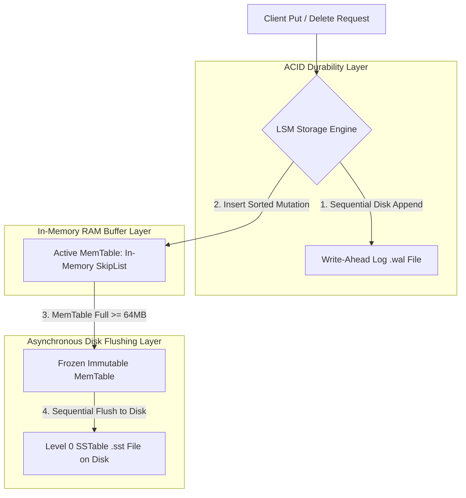

# LSM-Tree Architecture: MemTable, Write-Ahead Log (WAL) & SSTable Ingestion

In high-throughput write-heavy storage platforms (such as **RocksDB**, **LevelDB**, **Apache Cassandra**, and **Google Bigtable**), traditional B-Tree index storage engines encounter severe performance bottlenecks.

B-Trees perform **random in-place updates** to fixed-size $4\text{ KB}$ or $16\text{ KB}$ page files on disk. On modern Solid State Drives (SSDs) and NVMe storage, random writes trigger excessive NAND block erasing and write amplification, limiting write throughput to a fraction of hardware capabilities.

To transform expensive random writes into lightning-fast **sequential disk appends**, modern database engines adopt the **Log-Structured Merge-Tree (LSM-Tree)** architecture.

By combining an in-memory **MemTable** (SkipList), a sequential **Write-Ahead Log (WAL)**, and immutable **Sorted String Tables (SSTables)** on disk, LSM-Trees achieve sub-millisecond write latencies.

This article details Write-Ahead Log persistence, MemTable SkipList indexing, and SSTable flush mechanics.

---

## LSM-Tree Write Path & Storage Architecture

How LSM-Tree storage engines handle writes, maintain ACID durability, and flush SSTables to disk:



### Core LSM-Tree Components
1. **Write-Ahead Log (WAL)**: Before modifying any in-memory data structures, every write operation (`PUT`, `DELETE`) is appended sequentially to an on-disk `.wal` file. If the node loses power or crashes unexpectedly, the engine replays the WAL upon reboot to fully restore lost in-memory state.
2. **In-Memory MemTable**: An active, in-memory concurrent data structure (typically a **SkipList** or **Red-Black Tree**) that maintains key-value pairs sorted in lexicographical order. Because all writes land in RAM, write latencies are measured in nanoseconds.
3. **Immutable MemTable & SSTable Flush**: When the active MemTable reaches a configured capacity threshold (e.g. $64\text{ MB}$), it is frozen into an **Immutable MemTable**. A background thread sequentially flushes the sorted entries from the Immutable MemTable to disk as a new **Sorted String Table (SSTable)** file, creating a fresh active MemTable to receive incoming writes.
4. **Sorted String Tables (SSTables)**: Immutable disk files containing sorted key-value pairs partitioned into data blocks. Because SSTables are strictly immutable, writes never overwrite existing files—eliminating lock contention and random disk I/O.
5. **Tombstones for Deletions**: Deleting a key in an LSM-Tree does not modify disk files. Instead, the engine writes a special marker called a **Tombstone** (`val = DELETED`). During subsequent reads or compaction runs, encountering a tombstone signals that the key has been removed.

---

## Python Implementation: LSM-Tree Storage Engine with WAL & Flush

Here is a production-grade Python implementation of an LSM-Tree Storage Engine featuring a Write-Ahead Log, SkipList-style MemTable, and SSTable Flush Engine:

```python
import os
import json
from typing import Dict, List, Optional
from pydantic import BaseModel

TOMBSTONE = "__DELETED__"

class LSMRecord(BaseModel):
    key: str
    value: str

class WriteAheadLog:
    """
    Append-only Write-Ahead Log (WAL) for ACID persistence.
    """
    def __init__(self, filepath: str):
        self.filepath = filepath
        self.file = open(filepath, "a")

    def append(self, key: str, value: str):
        log_line = json.dumps({"key": key, "value": value}) + "\n"
        self.file.write(log_line)
        self.file.flush()

    def close(self):
        self.file.close()

class LSMStorageEngine:
    """
    LSM-Tree Engine combining MemTable, WAL, and SSTable Ingestion.
    """
    def __init__(self, db_dir: str, memtable_capacity: int = 3):
        self.db_dir = db_dir
        self.memtable_capacity = memtable_capacity
        self.memtable: Dict[str, str] = {}  # Sorted in-memory dictionary
        self.sstable_counter = 0

        os.makedirs(db_dir, exist_ok=True)
        self.wal_path = os.path.join(db_dir, "current.wal")
        self.wal = WriteAheadLog(self.wal_path)

    def put(self, key: str, value: str):
        """1. Write to WAL, 2. Update MemTable, 3. Check Flush."""
        # Step 1: Append to WAL
        self.wal.append(key, value)

        # Step 2: Insert into Sorted MemTable
        self.memtable[key] = value
        print(f" 📥 [MemTable PUT] Key: '{key}' -> Value: '{value}' (MemTable Size: {len(self.memtable)}/{self.memtable_capacity})")

        # Step 3: Flush to SSTable if capacity reached
        if len(self.memtable) >= self.memtable_capacity:
            self._flush_memtable()

    def delete(self, key: str):
        """Deletes key by appending a Tombstone marker."""
        print(f" 🗑️ [MemTable DELETE] Inserting Tombstone for Key: '{key}'")
        self.put(key, TOMBSTONE)

    def get(self, key: str) -> Optional[str]:
        """Reads key from MemTable first, then scans SSTables."""
        # 1. Search MemTable
        if key in self.memtable:
            val = self.memtable[key]
            if val == TOMBSTONE:
                return None
            return val

        # 2. Search SSTables on Disk (Latest to Oldest)
        for i in range(self.sstable_counter - 1, -1, -1):
            sst_file = os.path.join(self.db_dir, f"sst_{i:04d}.json")
            if os.path.exists(sst_file):
                with open(sst_file, "r") as f:
                    data = json.load(f)
                    if key in data:
                        val = data[key]
                        return None if val == TOMBSTONE else val
        return None

    def _flush_memtable(self):
        """Flushes sorted MemTable to an immutable SSTable file."""
        sst_path = os.path.join(self.db_dir, f"sst_{self.sstable_counter:04d}.json")
        print(f"\n 💾 [SSTable Flush] Flushing MemTable to '{sst_path}'...")

        # Sort entries lexicographically
        sorted_data = dict(sorted(self.memtable.items()))
        with open(sst_path, "w") as f:
            json.dump(sorted_data, f, indent=2)

        # Clear MemTable & Reset WAL
        self.memtable.clear()
        self.wal.close()
        self.wal = WriteAheadLog(self.wal_path)
        self.sstable_counter += 1
        print(" ✅ SSTable Flush Complete!\n")

# Demonstration Execution
if __name__ == "__main__":
    db_path = "./lsm_demo_db"
    lsm = LSMStorageEngine(db_dir=db_path, memtable_capacity=3)

    print("🚀 Demonstrating LSM-Tree Storage Engine Architecture...")
    print("=" * 75)

    # 1. Insert 3 Items -> Triggers 1st SSTable Flush
    lsm.put("user_101", "Alice")
    lsm.put("user_102", "Bob")
    lsm.put("user_103", "Charlie")

    # 2. Insert More Items + Delete -> Triggers 2nd SSTable Flush
    lsm.put("user_104", "David")
    lsm.delete("user_102")
    lsm.put("user_105", "Eve")

    # 3. Read Queries
    print("\n🔍 Executing Point Lookups:")
    print(f"   • Read 'user_101': {lsm.get('user_101')}")
    print(f"   • Read 'user_102' (Deleted): {lsm.get('user_102')}")
    print(f"   • Read 'user_105': {lsm.get('user_105')}")
```

---

## LSM-Tree Storage Gotchas & Best Practices

When operating LSM-Tree databases:

> [!IMPORTANT]
> **Use Group Commits in Write-Ahead Logs**: Executing an `fsync()` system call on every single write operation limits write performance to disk IOPS limits. Combine multiple concurrent writes into a single batch `fsync()` (**Group Commit**) to maximize write throughput.

> [!CAUTION]
> **Beware of Space Amplification from Un-Compacted Tombstones**: Accumulating millions of deletion tombstones across un-compacted SSTables wastes disk space and slows down range scans. Configure aggressive background Compaction runs to purge obsolete tombstones.

---

## Real-World Enterprise Impact
Storage engines using LSM-Tree architecture (such as **RocksDB** at Meta and **Cassandra** at Netflix) report:
* **Over $10\times$ Higher Write Throughput**: Turning random disk updates into sequential writes allows nodes to ingest over $500,000$ writes/sec per SSD.
* **Extended SSD Hardware Lifespan**: Sequential writes minimize SSD Flash Translation Layer (FTL) wear and tear, reducing physical drive failures.
