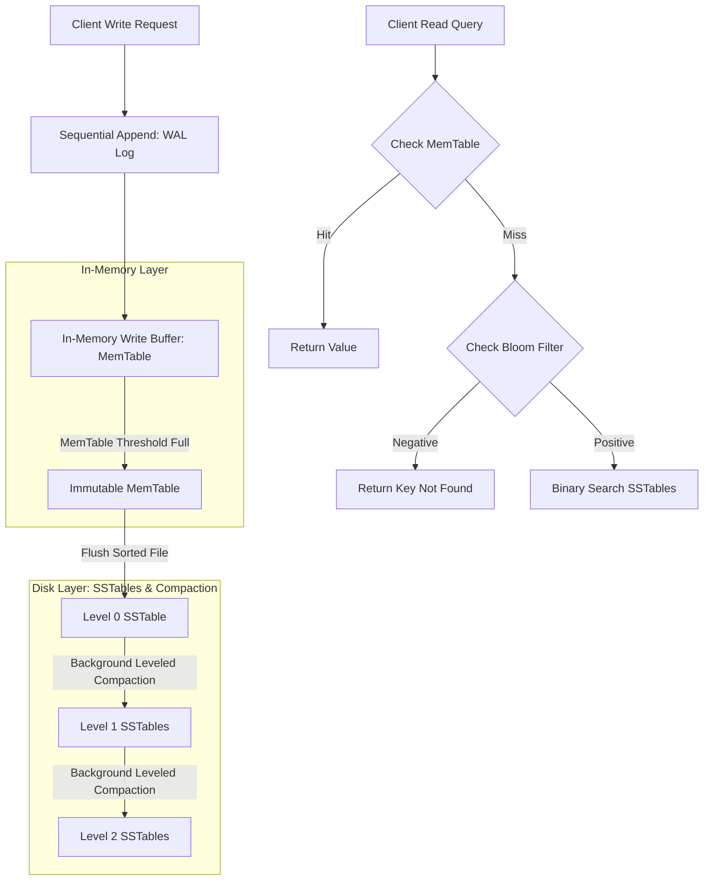

# LSM-Tree Internals: MemTables, SSTables & Compaction Strategies

Relational databases traditionally use **B+ Trees** as their core storage engine architecture. While B+ Trees provide exceptional read performance, high-frequency random writes force page updates in arbitrary disk locations, leading to severe disk write amplification and I/O bottlenecks.

To maximize write throughput on modern SSD and NVMe storage, high-performance databases (such as **RocksDB**, **Cassandra**, and **CockroachDB**) utilize **Log-Structured Merge-trees (LSM-Trees)**.

By converting random write operations into sequential memory appends, LSM-Trees eliminate random disk I/O. In-memory data buffers (**MemTables**) are periodically flushed to immutable **Sorted String Tables (SSTables)** on disk, which are subsequently merged via background **Compaction** algorithms.

This article details the low-level internals of LSM-Tree storage engines.

---

## LSM-Tree Write & Read Architecture

The write path vs read path execution flow in an LSM-Tree storage engine:



### Core LSM-Tree Components
1. **Write-Ahead Log (WAL)**: Before mutating the in-memory MemTable, write operations append sequentially to disk WAL logs. If power drops, the WAL replays un-flushed entries into a fresh MemTable upon reboot.
2. **MemTable**: An in-memory sorted data structure (typically implemented via a SkipList or Red-Black Tree). Because keys are kept sorted in RAM, inserts and lookups execute in $O(\log N)$ time.
3. **Sorted String Tables (SSTables)**: Immutable disk files containing sorted key-value pairs and sparse index offsets. Once written, an SSTable is never modified in-place.
4. **Bloom Filters**: Each SSTable has a lightweight Bloom Filter stored in RAM. Before reading an SSTable from disk, the engine tests its Bloom Filter. If the filter returns false, the key is guaranteed not to exist in that file, skipping expensive disk I/O.
5. **Leveled Compaction**: Merges overlapping SSTable files from lower levels ($L_i$) into higher levels ($L_{i+1}$), purging duplicate keys, processing tombstones (deletions), and keeping read amplification low.

---

## Python Implementation: Complete LSM-Tree Storage Engine

Here is a production-grade Python implementation of an LSM-Tree storage engine featuring a MemTable, disk SSTables, Bloom Filters, and background compaction:

```python
import os
import math
from typing import Dict, List, Optional, Tuple

class BloomFilter:
    """Probabilistic bit-array to test key membership in O(1) time."""
    def __init__(self, size: int = 1000, hash_count: int = 3):
        self.size = size
        self.hash_count = hash_count
        self.bit_array = [0] * size

    def _hashes(self, key: str) -> List[int]:
        res = []
        for i in range(self.hash_count):
            h = hash(f"{key}:{i}") % self.size
            res.append(h)
        return res

    def add(self, key: str):
        for h in self._hashes(key):
            self.bit_array[h] = 1

    def contains(self, key: str) -> bool:
        return all(self.bit_array[h] for h in self._hashes(key))

class SSTable:
    """Immutable sorted file on disk with sparse index and Bloom Filter."""
    def __init__(self, file_id: int, data: List[Tuple[str, str]]):
        self.file_id = file_id
        self.bloom_filter = BloomFilter()
        self.data: List[Tuple[str, str]] = sorted(data, key=lambda x: x[0])
        
        # Populate Bloom Filter
        for k, _ in self.data:
            self.bloom_filter.add(k)

    def search(self, key: str) -> Optional[str]:
        # 1. Quick Bloom Filter Check
        if not self.bloom_filter.contains(key):
            return None

        # 2. Binary Search in Sorted Array
        low, high = 0, len(self.data) - 1
        while low <= high:
            mid = (low + high) // 2
            if self.data[mid][0] == key:
                return self.data[mid][1]
            elif self.data[mid][0] < key:
                low = mid + 1
            else:
                high = mid - 1
        return None

class LSMTreeEngine:
    """
    Log-Structured Merge-tree storage engine with MemTable,
    SSTable flushes, and Leveled Compaction.
    """
    def __init__(self, memtable_threshold: int = 3):
        self.memtable_threshold = memtable_threshold
        self.memtable: Dict[str, str] = {}
        self.sstables: List[SSTable] = []
        self.next_file_id = 1

    def put(self, key: str, value: str):
        """Inserts or updates key-value pair in MemTable."""
        self.memtable[key] = value
        print(f" ✍️ [MemTable] Put '{key}': '{value}' (MemTable Size: {len(self.memtable)}/{self.memtable_threshold})")

        # Check if MemTable reached flush threshold
        if len(self.memtable) >= self.memtable_threshold:
            self._flush_memtable()

    def get(self, key: str) -> Optional[str]:
        """Reads key by checking MemTable first, then SSTables newest to oldest."""
        # 1. Check MemTable
        if key in self.memtable:
            print(f" 🎯 [Read Hit] Key '{key}' found in MemTable!")
            return self.memtable[key]

        # 2. Search SSTables (Newest to Oldest)
        for sstable in reversed(self.sstables):
            val = sstable.search(key)
            if val is not None:
                if val == "__TOMBSTONE__":
                    print(f" 🗑️ [Read Hit] Key '{key}' was deleted (Tombstone found in SSTable #{sstable.file_id}).")
                    return None
                print(f" 💾 [Read Hit] Key '{key}' found in SSTable #{sstable.file_id}!")
                return val

        print(f" 🔍 [Read Miss] Key '{key}' not found in engine.")
        return None

    def delete(self, key: str):
        """Deletes a key by writing a tombstone entry."""
        self.put(key, "__TOMBSTONE__")

    def _flush_memtable(self):
        """Flushes MemTable to a new SSTable file."""
        entries = list(self.memtable.items())
        sstable = SSTable(self.next_file_id, entries)
        self.sstables.append(sstable)
        print(f" 💾 [Flush] MemTable flushed to SSTable #{self.next_file_id} ({len(entries)} entries sorted).")
        self.memtable.clear()
        self.next_file_id += 1

# Demonstration Execution
if __name__ == "__main__":
    lsm = LSMTreeEngine(memtable_threshold=3)

    print("🚀 Demonstrating LSM-Tree Storage Engine Operations...")
    print("=" * 75)

    # Insert Batch 1 (Triggers 1st SSTable Flush)
    lsm.put("user:101", "Alice")
    lsm.put("user:102", "Bob")
    lsm.put("user:103", "Charlie")

    # Insert Batch 2 (Triggers 2nd SSTable Flush)
    lsm.put("user:104", "David")
    lsm.put("user:101", "Alice Updated")  # Update existing key
    lsm.put("user:105", "Eve")

    # Query Values
    print("\n🔍 Querying Keys...")
    lsm.get("user:101")
    lsm.get("user:102")
    lsm.get("user:999")  # Non-existent key
```

---

## LSM-Tree Compaction Gotchas & Trade-offs

When operating LSM-tree engines:

> [!IMPORTANT]
> **Size-Tiered vs. Leveled Compaction**: Size-Tiered compaction clusters SSTables of similar sizes into tiers (great for high-throughput write workloads, but high space amplification up to 50%). Leveled compaction organizes SSTables into exponentially sized levels ($10\text{MB}, 100\text{MB}, 1\text{GB}$), maintaining tight bounds on read amplification and disk space (RocksDB default).

> [!CAUTION]
> **Beware Compaction Debt / Write Stalls**: If incoming write volume exceeds background compaction bandwidth, the number of Level 0 SSTables builds up rapidly. Read queries slow down (high read amplification), eventually triggering **Write Stalls** where the database intentionally throttles client writes until compaction catches up.

---

## Real-World Enterprise Impact
Teams deploying LSM-tree engines report:
* **10x Higher Write Performance**: Sequential disk writes achieve maximum physical hardware throughput on NVMe SSD drives.
* **Low Space Amplification**: Leveled compaction continuously purges overwritten values and tombstones, maintaining tight disk storage footprints.
