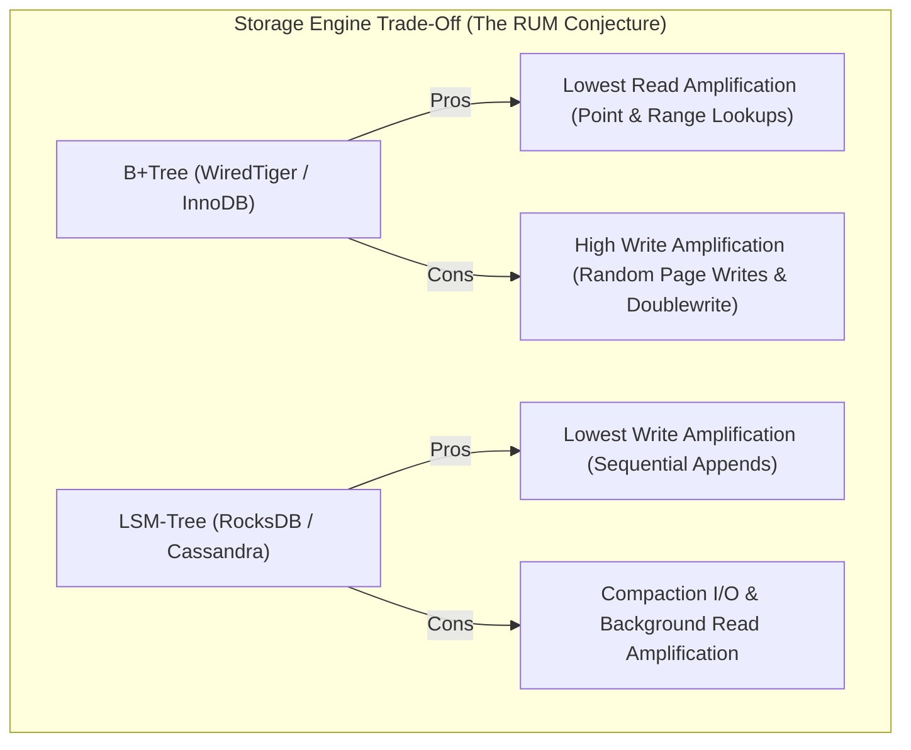

# LSM-Tree vs B+Tree Storage Engines: Write Amplification, Compaction Strategies & Kernel I/O (RocksDB vs WiredTiger)

At the heart of every modern database (**PostgreSQL**, **MySQL/InnoDB**, **MongoDB/WiredTiger**, **RocksDB**, **Apache Cassandra**, **CockroachDB**) lies an embedded storage engine responsible for translating abstract relational or key-value queries into physical byte layouts on NVMe SSDs.

For decades, database architectures have been defined by a fundamental structural divide:

1. **B+Tree Storage Engines (InnoDB, WiredTiger, SQLite)**: In-place page updates optimized for predictable read latency and low read amplification.
2. **Log-Structured Merge-Tree (LSM-Tree) Storage Engines (RocksDB, LevelDB, Cassandra)**: Append-only sequential disk writes optimized for extreme write throughput and maximum storage density.

According to the **RUM Conjecture** (Read, Update, Memory trade-off), no storage engine can optimize all three dimensions simultaneously.

This deep-dive architectural analysis explores the internal mechanics of B+Trees versus LSM-Trees, calculates exact Write, Read, and Space Amplification factors ($WAF, RAF, SAF$), and details the compaction algorithms that prevent disk saturation.



---

## 1. B+Tree Storage Engine Architecture: The In-Place Page Model

B+Trees (used in **MySQL InnoDB** and **MongoDB WiredTiger**) structure data into fixed-size disk blocks called **Pages** (typically $4\text{ KB}$ or $16\text{ KB}$).

```
B+Tree Structure (16 KB Pages):
               [ Root Node: Key 100 | Key 200 ]
                    /              \
       [ Branch: 50 | 75 ]     [ Branch: 150 | 175 ]
           /        \              /          \
     [Leaf: 1-49] [Leaf: 50-74] [Leaf: 100-149] [Leaf: 150-174] <---> Linked List
```

### Key Invariants:
* **Interior Nodes**: Store routing keys and child page pointers.
* **Leaf Nodes**: Store contiguous sorted key-value payloads and maintain doubly-linked list pointers to adjacent leaves for efficient range scans ($O(\log_B N)$).
* **In-Place Updates**: Modifying a single $32\text{-byte}$ record requires locating its containing $16\text{ KB}$ page in the in-memory **Buffer Pool**, modifying it in memory (creating a "dirty page"), and eventually flushing the entire $16\text{ KB}$ page back to disk.

### The B+Tree Write Amplification Penalty ($WAF$)
When a single $64\text{-byte}$ row is updated on an in-place $16\text{ KB}$ page:

$$WAF = \frac{\text{Bytes Written to Storage}}{\text{Bytes of User Write}} = \frac{16,384 \text{ bytes (Data Page)} + 16,384 \text{ bytes (Doublewrite Buffer)} + \text{WAL}}{64 \text{ bytes}} \approx \mathbf{300\times \text{ to } 500\times}$$

Under random-write workloads, B+Trees quickly saturate NVMe write bandwidth and cause flash memory endurance degradation.

---

## 2. LSM-Tree Storage Engine Architecture: The Append-Only Model

Log-Structured Merge-Trees (invented by Patrick O’Neil in 1996 and popularized by Google Bigtable, LevelDB, and Meta's **RocksDB**) convert all random writes into sequential disk operations.

```mermaid
graph TD
  subgraph SG2_LsmTreeWrite ["LSM-Tree Write Path (RocksDB)"]
    Write[Client Put Request: key, value] --> WAL[1. Write-Ahead Log WAL (Disk Append)]
    Write --> MemTable[2. MemTable (In-Memory Concurrent SkipList)]
    
    MemTable -->|When full (~64MB)| Flush[3. Flush to Disk (Immutable)]
    Flush --> L0["Level 0 (Unsorted SSTables: Range Overlaps)"]
    L0 -->|Leveled Compaction| L1["Level 1 (Sorted Disjoint SSTables: 10MB)"]
    L1 -->|Leveled Compaction 10x| L2["Level 2 (Sorted Disjoint SSTables: 100MB)"]
    L2 -->|Leveled Compaction 10x| L3["Level 3 (Sorted Disjoint SSTables: 1GB)"]
  end
```

### The LSM Write Flow:
1. **WAL Append**: Write operation is appended to an on-disk Write-Ahead Log for crash recovery.
2. **MemTable Insertion**: Record is inserted into an in-memory sorted data structure (typically a lock-free **Concurrent SkipList**).
3. **SSTable Flush**: Once the MemTable reaches capacity (e.g. $64\text{ MB}$), it is frozen into an immutable MemTable and flushed sequentially to disk as a **Sorted String Table (SSTable)** in Level 0 ($L_0$).

---

## 3. Compaction Algorithms: Leveled vs Size-Tiered

Because SSTables are immutable, updates and deletes (`tombstones`) accumulate across levels. **Compaction** is the background engine that merges overlapping SSTables, purges dead records, and re-sorts data.

```
> **COMPACTION STRATEGY COMPARISON**
| Feature                     | Leveled Compaction (LCS)         | Size-Tiered Compaction (STCS)   |
| Primary Database            | RocksDB, CockroachDB, LevelDB    | Apache Cassandra, ScyllaDB      |
| Space Amplification (SAF)   | Low (~1.1x to 1.3x)              | High (~2.0x, requires 50% free) |
| Read Amplification (RAF)    | Low (1 SSTable per level max)    | High (Must check all SSTables)  |
| Write Amplification (WAF)   | Higher (~10x to 30x)             | Lower (~5x to 10x)              |
| Best Workload               | Read-Heavy / Mixed OLTP          | Write-Heavy Logging / Ingestion |

```

### Leveled Compaction (LCS) Mechanics:
* Each level $L_i$ has a strict capacity limit growing by a factor of 10:
  $$L_1 = 10\text{ MB}, \quad L_2 = 100\text{ MB}, \quad L_3 = 1\text{ GB}, \quad L_4 = 10\text{ GB}$$
* In levels $L_1$ and beyond, **no two SSTables within the same level have overlapping key ranges**.
* A point lookup needs to search at most **one SSTable per level**, drastically reducing read amplification.

---

## 4. Mitigating Read Amplification: Bloom Filters & Block Caches

If a key does not exist in the database, a naive LSM-Tree would search the MemTable and every SSTable across all levels (Read Amplification $RAF = \text{number of SSTables}$).

### The Mathematical Bloom Filter Defense:
RocksDB embeds a **Bloom Filter** in every SSTable header.

To achieve a false positive probability $p = 1\%$ ($0.01$):
$$\text{Optimal Bits Per Key } m/n = -\frac{\ln p}{(\ln 2)^2} = -\frac{\ln(0.01)}{(0.6931)^2} \approx \mathbf{9.6 \text{ bits/key (10 bits/key)}}$$

With 10 bits per key, $99\%$ of non-existent key lookups terminate in memory without issuing a single NVMe disk I/O.

---

## Python Implementation: Complete LSM-Tree Storage Engine Simulator

Here is a Python implementation of a functional LSM-Tree storage engine featuring a MemTable, on-disk SSTable mock flushing, Bloom filter probes, and Level 0 → Level 1 merge compaction:

```python
import hashlib
import os
import struct
from typing import Dict, List, Optional, Tuple

class SimpleBloomFilter:
    def __init__(self, capacity: int = 1000, bits_per_key: int = 10):
        self.size = capacity * bits_per_key
        self.bit_array = bytearray((self.size + 7) // 8)

    def _hashes(self, key: str) -> List[int]:
        h1 = int(hashlib.md5(key.encode()).hexdigest(), 16)
        h2 = int(hashlib.sha1(key.encode()).hexdigest(), 16)
        return [(h1 + i * h2) % self.size for i in range(4)]

    def add(self, key: str):
        for bit_idx in self._hashes(key):
            self.bit_array[bit_idx // 8] |= (1 << (bit_idx % 8))

    def contains(self, key: str) -> bool:
        for bit_idx in self._hashes(key):
            if not (self.bit_array[bit_idx // 8] & (1 << (bit_idx % 8))):
                return False
        return True

class MockSSTable:
    def __init__(self, sstable_id: int, entries: List[Tuple[str, str]], level: int = 0):
        self.sstable_id = sstable_id
        self.level = level
        self.entries = sorted(entries, key=lambda x: x[0]) # Sorted keys
        self.bloom_filter = SimpleBloomFilter(capacity=len(entries) + 10)
        for k, _ in self.entries:
            self.bloom_filter.add(k)
        self.min_key = self.entries[0][0] if self.entries else ""
        self.max_key = self.entries[-1][0] if self.entries else ""

    def get(self, key: str) -> Optional[str]:
        # 1. Check Bloom Filter
        if not self.bloom_filter.contains(key):
            return None # Zero disk lookup!
        
        # 2. Binary search on sorted key entries
        low, high = 0, len(self.entries) - 1
        while low <= high:
            mid = (low + high) // 2
            mid_k, mid_v = self.entries[mid]
            if mid_k == key:
                return mid_v
            elif mid_k < key:
                low = mid + 1
            else:
                high = mid - 1
        return None

class LSMTreeEngine:
    """
    Log-Structured Merge-Tree Engine Simulator with Leveled Compaction.
    """
    def __init__(self, memtable_threshold: int = 4):
        self.memtable_threshold = memtable_threshold
        self.memtable: Dict[str, str] = {}
        self.sstables_level0: List[MockSSTable] = []
        self.sstables_level1: List[MockSSTable] = []
        self.next_sst_id = 1

    def put(self, key: str, value: str):
        self.memtable[key] = value
        print(f" ✍️ [MemTable Put] Key: '{key}' -> '{value}'")
        
        if len(self.memtable) >= self.memtable_threshold:
            self._flush_memtable()

    def get(self, key: str) -> Optional[str]:
        # 1. Search Active MemTable
        if key in self.memtable:
            val = self.memtable[key]
            print(f" 🎯 [Cache Hit: MemTable] Key '{key}' = '{val}'")
            return val if val != "__TOMBSTONE__" else None

        # 2. Search Level 0 SSTables (Newest to Oldest)
        for sst in reversed(self.sstables_level0):
            val = sst.get(key)
            if val is not None:
                print(f" 🎯 [Found in L0 SSTable {sst.sstable_id}] Key '{key}' = '{val}'")
                return val if val != "__TOMBSTONE__" else None

        # 3. Search Level 1 SSTables
        for sst in self.sstables_level1:
            val = sst.get(key)
            if val is not None:
                print(f" 🎯 [Found in L1 SSTable {sst.sstable_id}] Key '{key}' = '{val}'")
                return val if val != "__TOMBSTONE__" else None

        print(f" 🚫 [Not Found] Key '{key}' does not exist in any level.")
        return None

    def delete(self, key: str):
        print(f" 🗑️ [Tombstone Append] Key '{key}' marked deleted.")
        self.put(key, "__TOMBSTONE__")

    def _flush_memtable(self):
        print(f"\n 💧 [MemTable Flush] Flushing {len(self.memtable)} keys to Level 0 SSTable {self.next_sst_id}...")
        entries = list(self.memtable.items())
        sst = MockSSTable(self.next_sst_id, entries, level=0)
        self.next_sst_id += 1
        self.sstables_level0.append(sst)
        self.memtable.clear()

        # Trigger Compaction if Level 0 has > 2 SSTables
        if len(self.sstables_level0) >= 2:
            self._compact_l0_to_l1()

    def _compact_l0_to_l1(self):
        print("\n 🔄 [Compaction Triggered] Merging overlapping L0 SSTables into Level 1...")
        merged_entries: Dict[str, str] = {}
        
        # Merge all L0 SSTables (newer entries override older)
        for sst in self.sstables_level0:
            for k, v in sst.entries:
                merged_entries[k] = v

        # Remove tombstones in deep levels
        clean_entries = [(k, v) for k, v in merged_entries.items() if v != "__TOMBSTONE__"]

        new_l1_sst = MockSSTable(self.next_sst_id, clean_entries, level=1)
        self.next_sst_id += 1
        self.sstables_level1 = [new_l1_sst]
        self.sstables_level0.clear()
        print(f" ✨ [Compaction Complete] Level 1 now contains 1 unified SSTable with {len(clean_entries)} keys.")

# Demonstration Execution
if __name__ == "__main__":
    engine = LSMTreeEngine(memtable_threshold=3)

    # 1. Insert records to trigger flushes
    engine.put("user_101", "Alice")
    engine.put("user_102", "Bob")
    engine.put("user_103", "Charlie") # Triggers Flush 1 -> L0 SST 1

    engine.put("user_104", "Dave")
    engine.put("user_101", "Alice_Updated") # Update existing key
    engine.put("user_105", "Eve")     # Triggers Flush 2 -> L0 SST 2 -> Triggers Compaction to L1!

    # 2. Query data across levels
    print("\n🔍 Executing Point Lookups:")
    engine.get("user_101")
    engine.get("user_104")
    engine.get("user_999") # Non-existent key (filtered by Bloom filter)
```

---

## Summary: B+Tree vs LSM-Tree Decision Matrix

| Architectural Dimension | B+Tree (WiredTiger / InnoDB) | LSM-Tree (RocksDB / Cassandra) |
|---|---|---|
| **Primary Workload** | Read-Heavy / Low Ingestion OLTP | High-Throughput Write Ingestion / Time-Series |
| **Write Path** | In-place random page updates + Doublewrite | Sequential log append + In-memory SkipList |
| **Write Amplification ($WAF$)** | High ($30\times\text{--}100\times$) | Low ($10\times\text{--}30\times$ in Leveled, $< 8\times$ in Tiered) |
| **Read Amplification ($RAF$)** | Lowest ($O(\log_B N)$, 1 page I/O) | Higher (Checked across MemTable + SSTables via Bloom filter) |
| **Space Amplification ($SAF$)** | Moderate (Internal page fragmentation $\approx 30\%$) | Lowest in Leveled ($1.1\times$), High in Size-Tiered ($2.0\times$) |
| **Flash Endurance Impact** | High wear due to random $16\text{ KB}$ page rewrites | Low wear due to large contiguous sequential writes |

---

## Architectural Conclusion
Choosing between an LSM-Tree and a B+Tree is a deliberate trade-off between **write throughput and read predictability**.

If your application demands high-volume event ingestion, audit logs, or vector embeddings where disk write bandwidth is the bottleneck, **LSM-Trees (RocksDB)** deliver unmatched performance.

If your application requires deterministic sub-millisecond point reads and deep concurrent transactions across multi-column secondary indexes, **B+Trees (InnoDB / WiredTiger)** remain the gold standard.
