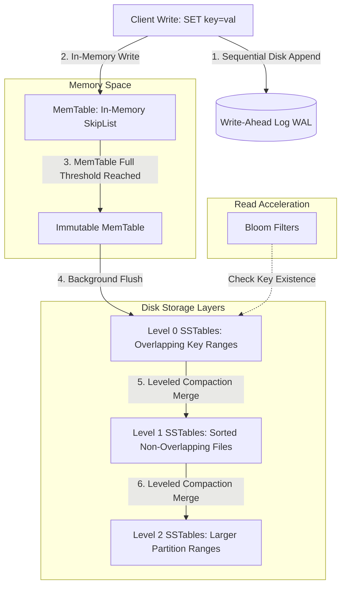

# Log-Structured Merge (LSM) Trees & Write-Ahead Logs (WAL) Internals

Traditional relational databases (like PostgreSQL or MySQL InnoDB) rely on **B-Tree** page structures for data storage. While B-Trees excel at fast read operations, they require modifying data pages **in place** on disk.

For write-heavy enterprise workloads (logging millions of metrics, processing financial transactions, or ingesting event streams), in-place disk updates cause heavy random write I/O, leading to severe storage performance bottlenecks.

To achieve maximum write throughput, high-performance database engines (**RocksDB**, **LevelDB**, **Apache Cassandra**, **ScyllaDB**) utilize **Log-Structured Merge (LSM) Trees**.

LSM Trees convert random write operations into sequential disk appends by buffering writes in memory and periodically flushing immutable **Sorted String Tables (SSTables)** to disk.

This article details the WAL, MemTable, SSTable, and Compaction mechanics of LSM Tree storage engines.

---

## LSM-Tree Write & Compaction Pipeline Architecture

How an LSM Tree processes writes via WAL + MemTable and flushes immutable SSTables to disk:



### Core LSM-Tree Components
1. **Write-Ahead Log (WAL)**: An append-only file on disk. Every incoming write operation is appended to the WAL before being inserted into memory. If the database crashes, the engine replays the WAL to reconstruct the in-memory state.
2. **MemTable**: An in-memory concurrent data structure (typically a SkipList or Red-Black Tree) that maintains key-value pairs in sorted order. All `SET` and `DELETE` operations are written to the MemTable.
3. **Sorted String Tables (SSTables)**: Immutable files stored on disk containing sorted key-value pairs grouped into blocks. SSTables include an index block for binary search lookups and a **Bloom Filter** to quickly reject queries for keys not present in the SSTable.
4. **Leveled Compaction**: Background processes that merge overlapping SSTables across levels ($L_0 → L_1 → L_2$). Compaction reclaims disk space by purging deleted tombstones and overwritten old key versions, maintaining bounded read amplification.

---

## Python Implementation: LSM-Tree Storage Engine

Here is a production-grade Python implementation of an LSM-Tree Storage Engine with WAL logging, in-memory MemTable, SSTables, and Bloom Filter checks:

```python
import os
import json
import hashlib
from typing import Dict, List, Optional, Tuple
from pydantic import BaseModel

class BloomFilter:
    """Simple bit-array Bloom Filter to prevent unnecessary disk reads."""
    def __init__(self, size: int = 1000):
        self.size = size
        self.bit_array = [False] * size

    def _hash(self, key: str, seed: int) -> int:
        return int(hashlib.md5(f"{seed}:{key}".encode()).hexdigest(), 16) % self.size

    def add(self, key: str):
        for seed in range(3):
            idx = self._hash(key, seed)
            self.bit_array[idx] = True

    def might_contain(self, key: str) -> bool:
        for seed in range(3):
            idx = self._hash(key, seed)
            if not self.bit_array[idx]:
                return False
        return True

class SSTable:
    """Immutable Sorted String Table file representation."""
    def __init__(self, file_id: str, data: Dict[str, str]):
        self.file_id = file_id
        # Data sorted by key
        self.sorted_data: List[Tuple[str, str]] = sorted(data.items())
        self.bloom_filter = BloomFilter()
        for k in data.keys():
            self.bloom_filter.add(k)

    def get(self, key: str) -> Optional[str]:
        if not self.bloom_filter.might_contain(key):
            return None  # Definitely not in this SSTable!

        # Binary Search on Sorted SSTable Data
        low, high = 0, len(self.sorted_data) - 1
        while low <= high:
            mid = (low + high) // 2
            k, v = self.sorted_data[mid]
            if k == key:
                return v
            elif k < key:
                low = mid + 1
            else:
                high = mid - 1
        return None

class LSMTreeEngine:
    """
    Log-Structured Merge Tree Engine with WAL and MemTable flushing.
    """
    def __init__(self, memtable_threshold: int = 3):
        self.memtable_threshold = memtable_threshold
        self.memtable: Dict[str, str] = {}
        self.wal: List[str] = []
        self.sstables: List[SSTable] = []
        self.sstable_counter = 0

    def put(self, key: str, value: str):
        # 1. Write to WAL (Sequential Write)
        wal_record = f"PUT {key}={value}"
        self.wal.append(wal_record)
        print(f" 📝 [WAL] Logged Record: {wal_record}")

        # 2. Write to MemTable (In-Memory Sorted Map)
        self.memtable[key] = value

        # 3. Check MemTable Flush Threshold
        if len(self.memtable) >= self.memtable_threshold:
            self._flush_memtable()

    def delete(self, key: str):
        """Deletes a key using a Tombstone record."""
        self.put(key, "__TOMBSTONE__")

    def _flush_memtable(self):
        """Flushes MemTable to an immutable SSTable on disk."""
        self.sstable_counter += 1
        sstable_id = f"sstable_L0_{self.sstable_counter}.db"
        print(f" 💾 [MemTable Flush] Flushing {len(self.memtable)} keys to Immutable {sstable_id}...")

        sstable = SSTable(file_id=sstable_id, data=dict(self.memtable))
        self.sstables.insert(0, sstable)  # Most recent SSTable first

        # Clear MemTable and WAL
        self.memtable.clear()
        self.wal.clear()

    def get(self, key: str) -> Optional[str]:
        """Reads key: MemTable -> Recent SSTable -> Older SSTables."""
        # 1. Check active MemTable
        if key in self.memtable:
            val = self.memtable[key]
            return None if val == "__TOMBSTONE__" else val

        # 2. Search SSTables in reverse chronological order
        for sstable in self.sstables:
            val = sstable.get(key)
            if val is not None:
                return None if val == "__TOMBSTONE__" else val

        return None

# Demonstration Execution
if __name__ == "__main__":
    db = LSMTreeEngine(memtable_threshold=3)

    print("🚀 Demonstrating LSM-Tree Storage Engine with WAL & SSTables...")
    print("=" * 75)

    # 1. Insert Key-Value Pairs
    db.put("user_101", "Alice")
    db.put("user_102", "Bob")
    db.put("user_103", "Charlie")  # Triggers MemTable Flush #1

    db.put("user_104", "David")
    db.put("user_101", "Alice_Updated")  # Update existing key
    db.put("user_105", "Eve")      # Triggers MemTable Flush #2

    # 2. Read Queries
    print("\n🔍 Executing LSM Read Lookups:")
    print(f"   • Read 'user_101': {db.get('user_101')} (Fetched updated value)")
    print(f"   • Read 'user_102': {db.get('user_102')} (Fetched from SSTable #1)")
    print(f"   • Read 'user_999': {db.get('user_999')} (Bloom Filter Bypassed Disk!)")

    # 3. Soft Delete via Tombstone
    print("\n🗑️ Executing Soft Delete for 'user_102'...")
    db.delete("user_102")
    print(f"   • Read 'user_102' After Delete: {db.get('user_102')} (Correctly returned None)")
```

---

## LSM-Tree Gotchas & Best Practices

When tuning LSM Tree databases:

> [!IMPORTANT]
> **Use Bloom Filters on All SSTables**: Without Bloom Filters, searching for a non-existent key forces the storage engine to read index blocks across every single SSTable file on disk. Bloom filters eliminate $99\%$ of false disk reads in nanoseconds.

> [!CAUTION]
> **Monitor Write Amplification & Compaction Lag**: Compaction reads SSTables, merges them, and writes new SSTables. If write ingestion rates exceed background compaction throughput, the number of $L_0$ SSTables accumulates, leading to **Write Stalls** where the database throttles incoming client writes.

---

## Real-World Enterprise Impact
High-throughput storage engines utilizing LSM Trees (such as **RocksDB**) report:
* **Over 500,000 Writes per Second per Node**: Transforming random disk I/O into sequential SSTable flushes saturates NVMe SSD write bandwidth.
* **$3\times$ Lower Disk Wear**: Sequential appends reduce SSD flash write amplification compared to in-place page overwrites.
