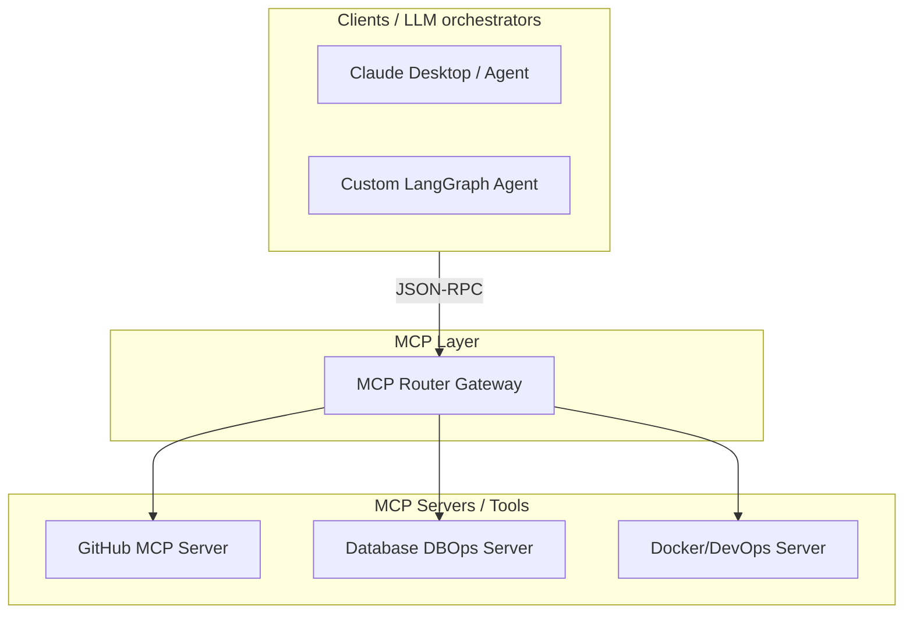

The biggest bottleneck in AI systems is integration. For every tool or database you want an agent to access, you have to write custom wrappers, format schemas, and manage connection keys. If you decide to switch models (e.g., from Claude to GPT), you frequently have to rewrite your tool-calling logic.

> ### 📖 Article Overview
> * **What this article is about:** This article explores how the Model Context Protocol (MCP) and emerging Agent-to-Agent (A2A) protocols are standardizing AI system integration and inter-agent communication.
> * **Why it matters:** These protocols solve AI fragmentation, reduce integration complexity, enable seamless model swapping, and facilitate secure, autonomous agent interactions.
> * **What we synthesized:** We synthesized the architectural shift MCP brings to tool integration and the critical role A2A protocols play in defining secure, structured communication for future autonomous agents.

To solve this fragmentation, the industry is moving to standardized communication protocols. The leading standard is Anthropic's open-source **Model Context Protocol (MCP)**, which acts as the "USB-C" for connecting LLMs to data and tools.

This article explores how MCP and emerging Agent-to-Agent (A2A) protocols are decoupling models from execution environments, drawing from designs implemented in my public [ops-mcp-suite](https://github.com/akmalkhaniub/ops-mcp-suite) repository.

---

## The Model Context Protocol (MCP) Shift

Before MCP, model integration was an N-to-M complexity problem. Every model client had to write custom code to connect to every tool or data source. With MCP, the architecture is decoupled into a clean client-server model:

*   **MCP Client**: An agent orchestrator (e.g., a FastAPI gateway) that queries the server to discover what tools are available and sends JSON-RPC execution requests.
*   **MCP Server**: A specialized microservice exposing structured tool schemas and resources.
*   **Why this matters**: You can swap models, update client code, or add new servers independently. The interface remains standard.

---

## Agent-to-Agent (A2A) Protocols

As agents become more autonomous, they will need to communicate across organization boundaries. If Company A's procurement agent needs to buy supplies, it must negotiate with Company B's sales agent.

Emerging **Agent-to-Agent (A2A)** protocols are defining standard schemas for this interaction:
1.  **Handoff Negotiation**: Defining how one agent hands over execution context to another.
2.  **Verification Contracts**: Allowing Agent A to verify that Agent B executed a task safely without sharing raw system prompts or database keys.
3.  **Conflict Resolution**: Structured message loops (e.g., bidding, proposal reviews) that allow agents to reach consensus on values and constraints.

---

## The Interoperability Checklist

*   **Standardize on MCP**: Instead of writing ad-hoc tool functions inside your Python or Node.js code, wrap tools as standard MCP servers. This ensures they can be reused by Claude, OpenAI, or custom LangGraph clients without code modifications.
*   **Implement Input Gating**: Treat every MCP tool call as an untrusted user input. Enforce strict parameter validation (regex, bounds checkers) to prevent prompt injection attacks from compromising your local systems.
*   **Log JSON-RPC payloads**: Enable full telemetry logging on your MCP proxy gateways to audit raw tool requests, latency, and returned data.

---

## Conclusion & Key Takeaways

The shift towards standardized protocols like MCP and emerging A2A frameworks is critical for building scalable, secure, and interoperable AI systems.
1.  **Standardized Integration with MCP:** MCP acts as a universal interface, decoupling LLMs from tools and data sources, significantly reducing integration complexity and enabling seamless model swapping.
2.  **Enabling Autonomous Agent Communication:** A2A protocols are essential for defining structured interactions, handoffs, and conflict resolution between autonomous agents across organizational boundaries.
3.  **Security and Observability are Paramount:** Implementing strict input validation and comprehensive logging on protocol gateways is crucial for preventing prompt injection and ensuring auditable, secure operations.

*Takeaway: Embracing standardized protocols is the key to unlocking the full potential of interoperable, secure, and scalable AI agent ecosystems.*

## References & Further Reading

*   **Model Context Protocol Specification**: Anthropic, 2024. [Model Context Protocol Website](https://modelcontextprotocol.io/).
*   **A2A Interoperability**: *Agent-to-Agent Communication Protocols: Deconstructing the Standards for Multi-Agent Negotiations* (2025/2026 research). Analyzes emerging agentic data exchange formats. (Needs verification)
*   **FastMCP Developer Guide**: [FastMCP GitHub Repository](https://github.com/modelcontextprotocol/python-sdk). The official python SDK for building fast MCP servers.

*To explore complete code implementations of our 6 production-ready MCP servers in a single gateway repository, check out the public [ops-mcp-suite](https://github.com/akmalkhaniub/ops-mcp-suite) repository.*