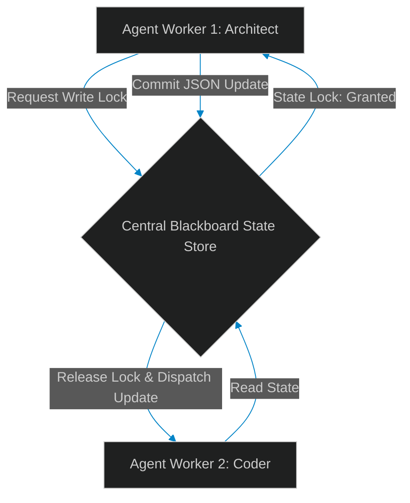

# The Blackboard Design Pattern: Sharing State Safely Across Agent Swarms

> [!NOTE]
> **📖 Article Overview**
> Basic multi-agent architectures rely on sequential message passing (e.g. Agent A sends a prompt to Agent B). While this works for simple linear workflows, it fails in complex, concurrent swarms where multiple agents need to cooperate on a shared task scope. Passing large contexts back and forth creates message bloat and leads to state drift. In this article, we analyze the **Blackboard Design Pattern**: a centralized state-machine architecture that allows agents to read and write to a shared state transactional store safely. We implement a concurrent blackboard manager in Python.

---

## The Message-Passing Bottleneck

When agents pass states sequentially:
* **State Drifts**: Agent C might run an action based on outdated parameters if Agent B updated the task scope without propagating the change.
* **Redundant Payload Bloat**: Chat histories are repeatedly appended and serialized across network requests, consuming unnecessary token bandwidth.
* **The Solution**: The **Blackboard Pattern**. Instead of direct communication, all agents read and write to a centralized shared memory store (the Blackboard). We enforce transaction locks to prevent concurrent write collisions.



---

## 1. Under the Hood: Structuring the Blackboard

The blackboard database schema holds the task context:
* **The State Document**: A structured JSON object containing variable matrices, code generation paths, and tool flags.
* **Version Pointer**: An incremental version number (`version_id`) used to enforce optimistic concurrency checks.
* **Lock Keys**: Status markers restricting write access while an agent performs multi-step modifications.

---

## 2. Concurrency Safety: Preventing Collision Drifts

When multiple agents write to the blackboard:
1. **Optimistic Concurrency Control (OCC)**: Before writing, the agent verifies that the `version_id` in the database matches the version it read. If the version has changed, it rolls back and retries.
2. **Subscription Triggers**: Agents subscribe to state changes, triggering execution loops automatically when other agents update dependency nodes.

---

## Code Demo: Concurrency-Safe Blackboard Manager

Below is a Python implementation of a blackboard state coordinator. It coordinates concurrent agent updates, evaluates version pointers, and handles transactional lock rollbacks.

```python
import json
from typing import Dict, Any, Tuple

class BlackboardStateStore:
    def __init__(self):
        # Central memory state, version, and lock tracking
        self.state: Dict[str, Any] = {
            "project_name": "API Migration",
            "db_schema_status": "PENDING",
            "api_endpoint_status": "PENDING"
        }
        self.version_id = 1
        self.is_locked = False

    def read_state(self) -> Tuple[Dict[str, Any], int]:
        return self.state.copy(), self.version_id

    def commit_state(self, new_state: Dict[str, Any], expected_version: int) -> Tuple[bool, str]:
        if self.is_locked:
            return False, "Commit Failed: Blackboard is locked by another agent."

        # Concurrency check: verify version has not changed
        if expected_version != self.version_id:
            return False, f"Concurrency Conflict: expected version {expected_version}, found {self.version_id}. Transaction aborted."

        self.state = new_state.copy()
        self.version_id += 1
        return True, f"Success: State updated to version {self.version_id}."

if __name__ == "__main__":
    bb = BlackboardStateStore()

    # Agent 1 (Architect) reads state to update database parameters
    state_arch, ver_arch = bb.read_state()
    print(f"📖 [Agent 1] Read State (Version: {ver_arch}): {state_arch}")

    # Agent 2 (Coder) reads state to write API parameters
    state_coder, ver_coder = bb.read_state()
    print(f"📖 [Agent 2] Read State (Version: {ver_coder}): {state_coder}")

    # Agent 1 commits schema change successfully
    state_arch["db_schema_status"] = "COMPLETED"
    success_1, msg_1 = bb.commit_state(state_arch, ver_arch)
    print(f"\n💾 [Agent 1] Commit Attempt: {msg_1}")

    # Agent 2 attempts to commit API changes using the old version pointer
    state_coder["api_endpoint_status"] = "IN_PROGRESS"
    success_2, msg_2 = bb.commit_state(state_coder, ver_coder)
    print(f"💾 [Agent 2] Commit Attempt: {msg_2}")
```

---

## Architectural Guidelines

* **Enforce Optimistic Locks**: Never permit direct, unversioned state writes. Always validate `version_id` properties before committing updates.
* **Isolate Task Sub-keys**: Divide the blackboard JSON structure into independent domains (e.g. `architecture`, `code`, `testing`) to minimize write conflicts.
* **Establish Event Logs**: Build audit logs tracking which agent updated which state key, facilitating debug trace analysis.
