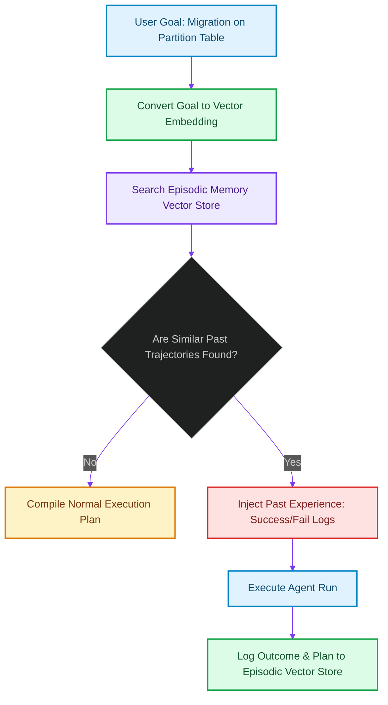

# Episodic Vector Memory: Retrieving Past Tool Trajectories for Production Agents

> [!NOTE]
> **📖 Article Overview**
> When executing multi-step tasks, autonomous agents frequently run into identical failure loops (e.g. attempting to call an API with deprecated parameters, hitting syntax exceptions, or writing conflicting schema keys). Without long-term memory, an agent repeats the same error trajectory multiple times across sessions. To prevent this, architects must build **Episodic Vector Memory**. By embedding agent trajectories (Goals, Executed Plans, and Outcomes) and querying them during planning, we guide agents around past pitfalls. In this article, we design an episodic retriever in Python.

---

## The Lack of Agent Experience Persistence

In naive architectures, every task starts with a blank slate:
* **Repetitive Failure Loops**: The agent repeatedly attempts to write a database script that violates a database table constraint because it has no memory of the migration failure in yesterday's session [1].
* **Redundant Discovery Phase**: The agent reconstructs API specifications on every run rather than caching successful call sequences.
* **The Solution**: **Episodic Memory**. We log completed task runs to a vector database. When a new task prompt is received, we fetch the top-k most similar past runs, extracting details of successful plans and warnings about failed paths.



---

## 1. Structuring Episodic Trajectory Entries

We define the episodic trace schema:
* **The Key (Goal/Prompt)**: The text input vector used to search the memory store.
* **The Episode (Trajectory)**: The exact sequence of tool calls and parameter changes that resolved the task.
* **The Critique**: Insights logged after execution (e.g. "This script failed on table lock timeouts; resolved by adding CONCURRENTLY").

---

## 2. Setting up Experience Injection Gates

The experience injection step runs during the **Plan Generation Phase**:
1. Search the vector database for past trajectories similar to the active query.
2. Filter for episodes with matching scope tags.
3. Prepend these episodes as system instructions: *"In a past run of a similar task, we encountered a table locking failure. Resolve by setting CONCURRENTLY."*

---

## Code Demo: Episodic Trajectory Memory Retriever

Below is a Python implementation of an episodic memory manager. It uses a mock vector similarity model to identify relevant past experiences, pulls plans/outcomes, and formats prompt alerts.

```python
import math
from typing import Dict, List, Tuple

class EpisodicMemoryStore:
    def __init__(self):
        # Database containing past agent runs
        # Embedded coordinates represent semantic task space
        self.episodic_db = [
            {
                "id": "run_101",
                "embedding": [0.85, 0.05, 0.10], # Table migration query profile
                "goal": "Add index to users table",
                "outcome": "FAILED",
                "critique": "Attempting to create index locked active table. Always use CREATE INDEX CONCURRENTLY."
            },
            {
                "id": "run_102",
                "embedding": [0.10, 0.90, 0.05], # Frontend UI adjustment profile
                "goal": "Fix button border alignment",
                "outcome": "SUCCESS",
                "critique": "Aligned items using Flexbox layout configuration."
            }
        ]

    def _cosine_similarity(self, v1: List[float], v2: List[float]) -> float:
        dot = sum(x * y for x, y in zip(v1, v2))
        mag1 = math.sqrt(sum(x * x for x in v1))
        mag2 = math.sqrt(sum(x * x for x in v2))
        if mag1 == 0 or mag2 == 0:
            return 0.0
        return dot / (mag1 * mag2)

    def retrieve_similar_episodes(self, query_vector: List[float], threshold: float = 0.70) -> List[Dict[str, Any]]:
        matches = []
        for episode in self.episodic_db:
            sim = self._cosine_similarity(query_vector, episode["embedding"])
            if sim >= threshold:
                matched_episode = episode.copy()
                matched_episode["similarity"] = sim
                matches.append(matched_episode)
                
        # Sort matches by similarity score descending
        matches.sort(key=lambda x: x["similarity"], reverse=True)
        return matches

if __name__ == "__main__":
    store = EpisodicMemoryStore()

    # Query: "Write DDL migration to index transactions table"
    # Query vector matches database operations semantic space
    query_vec = [0.88, 0.08, 0.04]

    print("🧠 Querying Episodic Vector Memory...")
    print("---------------------------------------")

    # Retrieve matching past runs
    related_runs = store.retrieve_similar_episodes(query_vec, threshold=0.75)

    print("\n--- Compiled Episodic Prompts ---")
    if not related_runs:
        print("No relevant experience found. Generating clean plan.")
    else:
        for idx, run in enumerate(related_runs, 1):
            print(f"[Experience #{idx}] Goal: '{run['goal']}' (Outcome: {run['outcome']})")
            print(f"👉 System Instruction Warning: {run['critique']}\n")
```

---

## Architectural Guidelines

* **Inject Before Planning**: Query episodic memory before planning phases to guide agents around past failures.
* **Deduplicate Records**: Clean up memory records to prevent agents from loading redundant files into prompt contexts.
* **Isolate Failures**: Explicitly tag failed runs with critiques to teach agents what execution paths to avoid. [2]

## References & Further Reading

1. **Malkov, Y. A., & Yashunin, D. A. (2018)**. *Efficient and Robust Approximate Nearest Neighbor Search Using Hierarchical Navigable Small World Graphs*. IEEE TPAMI. [https://arxiv.org/abs/1603.09320](https://arxiv.org/abs/1603.09320)
2. **Jégou, H., Douze, M., & Schmid, C. (2011)**. *Product Quantization for Nearest Neighbor Search*. IEEE TPAMI. [https://hal.inria.fr/inria-00514462v2/document](https://hal.inria.fr/inria-00514462v2/document)
3. **Johnson, J., Douze, M., & Jégou, H. (2019)**. *Billion-scale Similarity Search with GPUs*. IEEE Transactions on Big Data. [https://arxiv.org/abs/1702.08734](https://arxiv.org/abs/1702.08734)
4. **Fielding, R., Nottingham, M., & Reschke, J. (2014)**. *Hypertext Transfer Protocol (HTTP/1.1): Caching*. RFC 7234. [https://www.rfc-editor.org/rfc/rfc7234](https://www.rfc-editor.org/rfc/rfc7234)
5. **Vercel Documentation (2026)**. *Caching in Next.js*. Next.js Docs. [https://nextjs.org/docs/app/getting-started/caching](https://nextjs.org/docs/app/getting-started/caching)
6. **DeCandia, G., et al. (2007)**. *Dynamo: Amazon's Highly Available Key-value Store*. SOSP. [https://www.allthingsdistributed.com/files/amazon-dynamo-sosp2007.pdf](https://www.allthingsdistributed.com/files/amazon-dynamo-sosp2007.pdf)
