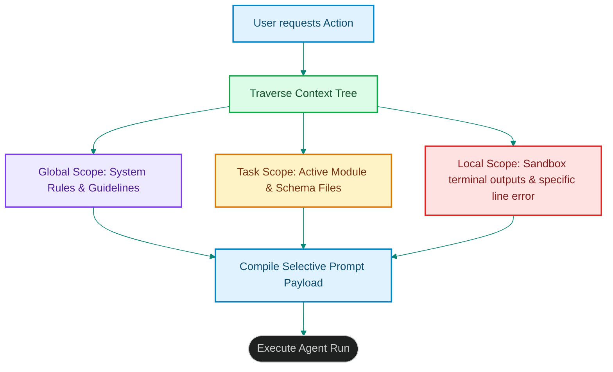

# Hierarchical Context Trees: Managing Multi-Tier Agent Memory Segments

> [!NOTE]
> **📖 Article Overview**
> Multi-agent pipelines suffer from context-window inflation. If a compiler system continuously appends raw transaction histories, project specifications, database schemas, and terminal execution outputs to every agent call, prompt sizes grow exponentially. This results in slow response times, high token costs, and degraded model retrieval accuracy. To optimize memory, architectures must transition to **Hierarchical Context Trees**. By structuring context scopes into nested parent-child trees, agents selectively query only the necessary parameters. In this article, we map memory hierarchy trees and implement a context compiler in Python.

---

## The Danger of Monolithic Prompt Contexts

In basic agent setups:
* **The "Lost in the Middle" Effect**: When context blocks exceed 30k tokens, LLMs frequently overlook instructions located in the middle of the prompt [1].
* **Redundant Token Consumption**: Supplying global workspace details (e.g. general library conventions) to a simple linting tool is highly inefficient.
* **The Solution**: **Hierarchical Context Trees**. We structure agent memory into three distinct tiers: Global Context, Task-level Context, and Local Step Context. The agent compiler dynamically builds the prompt payload by traversing these scopes.



---

## 1. Defining the Memory Scopes

We partition memory scopes cleanly:
* **Global Scope (Parent Node)**: Fixed system configurations, repository guidelines, and coding standards. This remains static across the entire session.
* **Task Scope (Child Node)**: The target file path, schema layout, or API endpoints. This is loaded only when executing that specific task branch.
* **Local Scope (Leaf Node)**: Temporary variables, short tool outputs, and AST compiler errors. This is cleared after each step execution.

---

## 2. Setting up Context Compilers

The context compiler runs before the agent's inference call:
1. It analyzes the target node path in the execution graph.
2. It aggregates parameters from leaf nodes up to the global root node.
3. It formats the outputs into distinct, prioritized prompt segments.

---

## Code Demo: Hierarchical Context Compiler

Below is a Python implementation of a hierarchical context builder. It structures parent-child memory nodes, selectively parses scopes, and outputs optimized prompt contexts.

```python
import json
from typing import Dict, Any, List

class ContextNode:
    def __init__(self, name: str, parent: 'ContextNode' = None):
        self.name = name
        self.parent = parent
        self.memory: Dict[str, Any] = {}

    def set_value(self, key: str, value: Any):
        self.memory[key] = value

    def compile_full_context(self) -> Dict[str, Any]:
        # Recursive compilation traversing up to the parent root node
        full_context = {}
        if self.parent:
            full_context.update(self.parent.compile_full_context())
        
        full_context.update(self.memory)
        return full_context

if __name__ == "__main__":
    # 1. Global Scope (System rules and conventions)
    global_node = ContextNode("GLOBAL_SCOPE")
    global_node.set_value("system_rules", "Use Python 3.10 and enforce PEP8.")
    global_node.set_value("auth_token", "sec_token_999")

    # 2. Task Scope (Active module and target database table)
    task_node = ContextNode("TASK_SCOPE", parent=global_node)
    task_node.set_value("target_table", "users")
    task_node.set_value("schema_keys", ["id", "email", "status"])

    # 3. Local Step Scope (Sandbox execution error)
    local_node = ContextNode("LOCAL_STEP", parent=task_node)
    local_node.set_value("compilation_error", "SyntaxError: invalid syntax at line 12")

    print("🌲 Compiling Hierarchical Context Tree...")
    print("------------------------------------------")

    # Compile context from leaf node (LOCAL_STEP)
    compiled_prompt_vars = local_node.compile_full_context()

    print("\n--- Compiled Context Variables ---")
    print(json.dumps(compiled_prompt_vars, indent=2))
```

---

## Context Optimization Takeaways

* **Partition Context Scopes**: Never feed unstructured system logs into every prompt. Divide memory into global, task, and local levels.
* **Audit Token Footprints**: Monitor the token size of each context tier and configure prune triggers to drop local logs after tool executions.
* **Isolate Access**: Restrict downstream agent nodes from accessing parent credential variables, preventing leakage. [2]

## References & Further Reading

1. **Axboe, J. (2019)**. *Efficient IO with io_uring*. kernel.dk. [https://kernel.dk/io_uring.pdf](https://kernel.dk/io_uring.pdf)
2. **Linux Kernel Community (2024)**. *BPF Documentation*. kernel.org. [https://docs.kernel.org/bpf/](https://docs.kernel.org/bpf/)
3. **Høiland-Jørgensen, T., et al. (2018)**. *The eXpress Data Path: Fast Programmable Packet Processing in the Operating System Kernel*. CoNEXT. [https://dl.acm.org/doi/10.1145/3281411.3281443](https://dl.acm.org/doi/10.1145/3281411.3281443)
4. **Cytron, R., et al. (1991)**. *Efficiently Computing Static Single Assignment Form and the Control Dependence Graph*. ACM TOPLAS. [https://doi.org/10.1145/115372.115320](https://doi.org/10.1145/115372.115320)
5. **Lattner, C., & Adve, V. (2004)**. *LLVM: A Compilation Framework for Lifelong Program Analysis & Transformation*. CGO. [https://llvm.org/pubs/2004-01-30-CGO-LLVM.pdf](https://llvm.org/pubs/2004-01-30-CGO-LLVM.pdf)
6. **V8 Team (2024)**. *V8 Orinoco and Garbage Collection*. v8.dev. [https://v8.dev/blog](https://v8.dev/blog)
