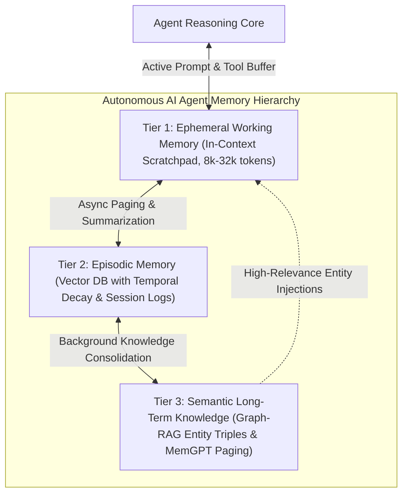
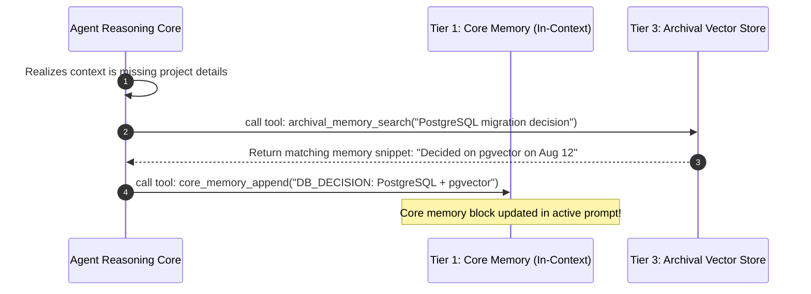

# Memory Hierarchies in Autonomous AI Agents: Ephemeral Scratchpads, Vector Episodic Memory & Graph-RAG Long-Term Stores

As autonomous AI agents (**Agent Fleet Orchestrator**, **MemGPT / Letta**, **Devin**, **AutoGPT**) evolve from single-turn chatbots into persistent software engineers and enterprise operators, managing state across hours, days, and months becomes the central architectural challenge.

While modern LLMs boast massive context windows (128k to 2M tokens), treating the raw context window as an unbounded memory buffer fails in production.

Stuffing raw conversation histories into the prompt triggers **attention dilution** (the "needle-in-a-haystack" retrieval degradation), dramatically slows down Time-to-First-Token (TTFT), and incurs quadratic compute costs ($O(N^2)$ self-attention).

To achieve human-like persistence, production agent architectures mimic biological cognition by implementing a **Hierarchical Memory Architecture**: separating fast **Ephemeral Working Scratchpads**, mid-term **Episodic Vector Stores with Temporal Decay**, and durable **Graph-RAG Semantic Long-Term Stores**.



---

## 🧠 1. The Context Window Fallacy & Cognitive Load

Why can't we simply append all conversation history to a 1M-token context window?

### The Three Context Window Failure Modes:
1. **The "Lost in the Middle" Phenomenon**: Transformer attention mechanisms prioritize tokens at the extreme beginning (system prompt) and end (latest user prompt). Retrieval accuracy drops by up to $40\%$ when critical facts reside in the middle $20\%\text{--}80\%$ of a massive context buffer.
2. **Context Contamination & Hallucination Propagation**: Outdated assumptions, dead-end tool errors, and temporary debugging scratchpad text remain in context, poisoning downstream reasoning.
3. **Quadratic Cost & Latency Inflation**: Re-ingesting 200,000 tokens on every autonomous tool step multiplies API token costs by $50\times$ and increases latency to unacceptable thresholds ($> 15\text{ seconds per step}$).

---

## 🏛️ 2. The Three-Tier Memory Hierarchy Architecture

```
+-----------------------------------------------------------------------------------------+
|                                 TIER 1: WORKING MEMORY                                  |
|   In-context FIFO buffer: System Persona + Active Plan + ReAct Scratchpad (8k-32k)       |
+-----------------------------------------------------------------------------------------+
                                      |   ^
                    Eviction & Summary|   |Context Injection
                                      v   |
+-----------------------------------------------------------------------------------------+
|                                 TIER 2: EPISODIC MEMORY                                 |
|   Vector Embeddings with Temporal Decay: Past Sessions, User Actions, Completed Tasks    |
+-----------------------------------------------------------------------------------------+
                                      |   ^
                          Async Sleep |   |Graph Traversal
                        Consolidation |   |
                                      v   |
+-----------------------------------------------------------------------------------------+
|                                 TIER 3: SEMANTIC GRAPH-RAG                              |
|   Entity Knowledge Graph: (Subject)-[Predicate]->(Object), User Preferences, Core Facts  |
+-----------------------------------------------------------------------------------------+
```

### Tier 1: Ephemeral Working Memory (The Active Scratchpad)
* **Scope**: Resides directly inside the LLM's active prompt.
* **Components**:
  * **System Persona**: Immutable operating guidelines and tool definitions.
  * **Core Memory Block**: Pinned user preferences and critical variables (e.g. `User: Alex, Language: TypeScript, DB: PostgreSQL`).
  * **Active Execution Scratchpad**: Current ReAct thought loop and recent tool invocation outputs.
* **Management**: When the scratchpad reaches a token budget threshold ($80\%$ of working limit), an automated **Summarization & Eviction Daemon** compresses older turns into an executive summary and flushes raw turns to Tier 2.

---

### Tier 2: Episodic Memory (Vector Store with Temporal Decay)
* **Scope**: Stores past user conversations, historical code diffs, and executed agent trajectories in PostgreSQL (`pgvector`) or Redis.
* **The Retrieval Scoring Function**:
  Standard cosine similarity is insufficient because recent memories should carry higher priority than ancient memories, even if semantically similar.
  Production agents use an **exponential temporal decay hybrid ranking function**:

$$\text{Memory Score}(m) = \alpha \cdot \cos(\vec{q}, \vec{m}_{\text{embedding}}) + (1 - \alpha) \cdot e^{-\lambda \cdot (t_{\text{now}} - t_{\text{created}})}$$

Where:
* $\cos(\vec{q}, \vec{m})$ is the cosine similarity between the current task query $\vec{q}$ and the memory embedding.
* $\lambda$ is the exponential decay half-life parameter.
* $\alpha \in [0.6, 0.8]$ balances semantic relevance against recency.

---

### Tier 3: Semantic Long-Term Knowledge (Graph-RAG & Entity Triples)
* **Scope**: Unstructured vector search struggles with multi-hop associative queries (e.g. *"What database did we decide to use for the project Alex mentioned last Tuesday?"*).
* **Graph-RAG Mechanics**:
  Tier 3 structures long-term memory as a **Knowledge Graph** of entity triples:
  $$\text{(Entity: Alex)} \xrightarrow{\text{OWNS}} \text{(Project: SpecForge)} \xrightarrow{\text{USES\_DATABASE}} \text{(PostgreSQL)}$$
* When an agent queries a concept, it performs a hybrid vector search to identify entry nodes, followed by a **2-hop graph neighborhood traversal** in Neo4j or Postgres recursive CTEs, injecting tightly grounded factual relationships into the Tier 1 prompt.

---

## ⚡ 3. MemGPT / Letta OS Memory Paging Mechanics

Inspired by operating system virtual memory management (RAM vs Disk paging), **MemGPT (Letta)** introduced function-calling tools that allow the LLM to actively manage its own memory hierarchy:



* **`core_memory_append(key, value)`**: Writes a permanent fact directly into the in-context persona block.
* **`archival_memory_insert(content)`**: Offloads large documents or long-form notes into Tier 3 storage.
* **`archival_memory_search(query, top_k)`**: Performs semantic search to page external knowledge back into working memory on-demand.

---

## 🛠️ Python Implementation: Multi-Tier Agent Memory Manager

Here is a production-grade Python implementation of a 3-tier agent memory manager with working context budgeting, temporal decay scoring, and entity extraction:

```python
import math
import time
from typing import Dict, List, Optional
import numpy as np

class MemoryItem:
    def __init__(self, content: str, embedding: np.ndarray, timestamp: float, metadata: Optional[Dict] = None):
        self.content = content
        self.embedding = embedding
        self.timestamp = timestamp
        self.metadata = metadata or {}

class MultiTierAgentMemory:
    """
    Production 3-Tier Memory Manager for Autonomous Agents:
    - Tier 1: Working Memory Buffer (FIFO with token threshold)
    - Tier 2: Episodic Memory with Temporal Decay Ranking
    - Tier 3: Semantic Entity Triple Graph
    """
    def __init__(self, max_working_tokens: int = 4000, alpha_relevance: float = 0.75, decay_lambda: float = 0.0001):
        self.max_working_tokens = max_working_tokens
        self.alpha = alpha_relevance
        self.decay_lambda = decay_lambda

        # Tier 1: Working Memory
        self.core_persona: str = "System Persona: Autonomous Systems Engineer."
        self.core_facts: Dict[str, str] = {}
        self.working_scratchpad: List[str] = []

        # Tier 2: Episodic Memory
        self.episodic_store: List[MemoryItem] = []

        # Tier 3: Semantic Graph Triples (Subject -> Predicate -> Object)
        self.knowledge_graph: Dict[str, List[tuple]] = {}

    # --- TIER 1 MANAGEMENT ---
    def add_working_turn(self, turn: str):
        self.working_scratchpad.append(turn)
        estimated_tokens = sum(len(t.split()) * 1.3 for t in self.working_scratchpad)
        
        if estimated_tokens > self.max_working_tokens * 0.8:
            self._evict_and_summarize_working_memory()

    def update_core_fact(self, key: str, value: str):
        print(f" 📌 [Core Memory Update] {key} -> {value}")
        self.core_facts[key] = value

    def _evict_and_summarize_working_memory(self):
        print(" 🧹 [Working Memory Eviction] Summarizing and flushing oldest turns to Tier 2...")
        turns_to_flush = self.working_scratchpad[:len(self.working_scratchpad)//2]
        self.working_scratchpad = self.working_scratchpad[len(self.working_scratchpad)//2:]
        
        # Flush to Tier 2 Episodic Store
        flushed_text = "\n".join(turns_to_flush)
        # Mock embedding (128-dim vector)
        mock_embedding = np.random.randn(128)
        mock_embedding /= np.linalg.norm(mock_embedding)
        
        self.episodic_store.append(MemoryItem(content=flushed_text, embedding=mock_embedding, timestamp=time.time()))

    # --- TIER 2 EPISODIC RETRIEVAL WITH TEMPORAL DECAY ---
    def retrieve_episodic_memories(self, query_embedding: np.ndarray, top_k: int = 2) -> List[tuple]:
        now = time.time()
        scored_memories = []

        for item in self.episodic_store:
            # Cosine similarity
            cosine_sim = float(np.dot(query_embedding, item.embedding) / (np.linalg.norm(query_embedding) * np.linalg.norm(item.embedding)))
            
            # Temporal exponential decay
            time_delta_seconds = now - item.timestamp
            recency_score = math.exp(-self.decay_lambda * time_delta_seconds)

            # Combined hybrid score
            final_score = (self.alpha * cosine_sim) + ((1.0 - self.alpha) * recency_score)
            scored_memories.append((final_score, item.content))

        scored_memories.sort(key=lambda x: x[0], reverse=True)
        return scored_memories[:top_k]

    # --- TIER 3 SEMANTIC GRAPH-RAG ---
    def insert_graph_triple(self, subject: str, predicate: str, obj: str):
        print(f" 🕸️ [Graph-RAG Insert] ({subject}) -[{predicate}]-> ({obj})")
        if subject not in self.knowledge_graph:
            self.knowledge_graph[subject] = []
        self.knowledge_graph[subject].append((predicate, obj))

    def query_graph_neighborhood(self, entity: str) -> List[str]:
        results = []
        if entity in self.knowledge_graph:
            for pred, obj in self.knowledge_graph[entity]:
                results.append(f"{entity} {pred} {obj}")
                # 2-hop traversal
                if obj in self.knowledge_graph:
                    for sub_pred, sub_obj in self.knowledge_graph[obj]:
                        results.append(f"{obj} {sub_pred} {sub_obj}")
        return results

    # --- CONTEXT PROMPT COMPILATION ---
    def compile_full_context_prompt(self) -> str:
        prompt = f"=== TIER 1: SYSTEM CORE PERSONA ===\n{self.core_persona}\n\n"
        prompt += "=== PINNED CORE FACTS ===\n"
        for k, v in self.core_facts.items():
            prompt += f"• {k}: {v}\n"
        prompt += "\n=== ACTIVE SCRATCHPAD TURNS ===\n"
        prompt += "\n".join(self.working_scratchpad[-5:])
        return prompt

# Demonstration Execution
if __name__ == "__main__":
    memory = MultiTierAgentMemory(max_working_tokens=500)

    # 1. Update Core Memory (Tier 1)
    memory.update_core_fact("USER_ROLE", "Lead Cloud Architect")
    memory.update_core_fact("PREFERRED_STACK", "FastAPI + Next.js + PostgreSQL")

    # 2. Insert Knowledge Graph Triples (Tier 3)
    memory.insert_graph_triple("SpecForge", "USES_DATABASE", "PostgreSQL pgvector")
    memory.insert_graph_triple("PostgreSQL pgvector", "INDEX_TYPE", "HNSW Cosine Distance")

    # 3. Simulate Working Memory Turns & Auto-Eviction
    for i in range(1, 10):
        memory.add_working_turn(f"Turn {i}: Executed code refactor step {i} on API Gateway router.")

    # 4. Query Graph-RAG
    graph_context = memory.query_graph_neighborhood("SpecForge")
    print("\n🔍 2-Hop Graph-RAG Query for 'SpecForge':")
    for fact in graph_context:
        print(f"   ↳ {fact}")

    # 5. Output Compiled Context
    print("\n📄 Final Compiled In-Context Prompt:")
    print("=" * 60)
    print(memory.compile_full_context_prompt())
```

---

## 🚨 Memory Architecture Gotchas & Best Practices

> [!IMPORTANT]
> **Never Rely Solely on Semantic Vector Distance for Time-Sensitive Actions**: In long-running tasks, an action taken $10\text{ seconds ago}$ with moderate semantic relevance is almost always more important than a highly similar action taken $3\text{ weeks ago}$. Always apply **exponential temporal decay** to your vector retrieval scoring.

> [!TIP]
> **Use Asynchronous Memory Consolidation (Sleep Cycles)**: Consolidating unstructured turns into Graph-RAG triples requires LLM token processing. Run consolidation in background worker threads during agent idle periods rather than blocking active user tool loops.

---

## 🔮 Next in the Series
In **Post 400 (Milestone Special)**, we will synthesize these principles into **The Blueprint for Production AI Agent Swarms: 10 Architectural Principles for 99.9% Reliable Autonomous Workflows**.
