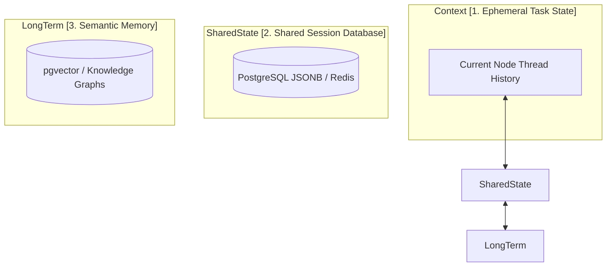

# Designing a Multi-Tiered Memory Architecture for Production-Grade LLM Agents

> ### 📖 Article Overview
> * **What this article is about:** Designing robust memory architectures for multi-agent LLM systems.
> * **Why it matters:** Prevents context contamination, improves agent coordination, and enables production-grade applications.
> * **What we synthesized:** A three-tiered memory model, strict context isolation principles, and an architectural checklist for reliable agentic systems.

In single-prompt LLM applications, memory is simple: you append messages to a linear array and feed it back into the context window.

In multi-agent systems, this naive memory model fails. If 5 specialized agents are writing code, auditing databases, and running tests, compiling *every* step's trace into a single shared context window results in **context contamination**, prompt confusion, and bloated token costs.

To build production-grade agentic applications, you must design a **Multi-Tiered Memory Architecture**.

---

## The Tiers of Agent Memory

A reliable multi-agent system divides memory into three distinct tiers, separating short-term task states from long-term database memory:

### 1. Ephemeral Task State (Local Context)
*   **What it is**: The immediate, message-by-message chat history inside an active agent node's context window.
*   **Lifecycle**: Cleared when the agent node completes its current subtask and returns its JSON output.
*   **Scope**: Private to that specific agent node (e.g., the researcher's local context is not seen by the code compiler).

### 2. Shared Session Database (Blackboard / Global State)
*   **What it is**: A centralized database table (typically PostgreSQL JSONB or Redis) storing key variables, compiled drafts, and active plans for the entire user session.
*   **Lifecycle**: Persisted across the entire task execution lifecycle (enabling task resumption and audit logging).
*   **Scope**: Read and written by supervisors or specialized router nodes, which selectively dispatch segments of this state to worker nodes.

### 3. Semantic Memory (Long-Term Vector Context)
*   **What it is**: Vector embeddings of past user interactions, successful code outputs, and corporate knowledge bases.
*   **Lifecycle**: Permanent.
*   **Scope**: Queried via similarity search (e.g., using `pgvector`) to inject historical context (e.g., "how this user preferred to format reports last month") into the active session.

---

## Memory Contamination and Context Isolation

The biggest issue in multi-agent memory is **Memory Contamination**. If Worker B receives the entire raw conversation between the User and Worker A, it will read past the relevant instruction, leading to attention dispersion.

To prevent this, enforce **Strict Context Isolation**:
*   **Decoupled Worker Prompts**: Worker prompts should only receive the specific subtask instructions and the minimum context needed to execute them (e.g., the database schema, but not the user's previous complaints).
*   **Read-Only Tools**: Specialized retrieval agents should have read-only access to long-term memory vector databases to retrieve relevant context on-demand, rather than dumping the entire dataset into the prompt initially.

---

## Memory Architecture Checklist

*   [ ] **Database-Backed Checkpointing**: Use database checkpointers (e.g., LangGraph Postgres checkpointer) to persist session state at every node transition. This ensures your agents can resume execution seamlessly after a crash.
*   [ ] **Token Budget Filters**: Implement prompt compressors or token filters to prune message histories inside worker nodes, keeping ephemeral contexts under 2,000 tokens.
*   [ ] **Audit Logging**: Write every agent input, output, tool call, and cost trace to a permanent audit database (e.g., PostgreSQL) for compliance and regression analysis.

---

## Conclusion & Key Takeaways

Building sophisticated multi-agent LLM applications demands a deliberate approach to memory management beyond simple linear context.
1. **Multi-Tiered Memory Architecture:** Implement a Multi-Tiered Memory Architecture, separating ephemeral task state, shared session data, and long-term semantic memory to optimize context relevance and reduce token costs.
2. **Strict Context Isolation:** Enforce strict context isolation by providing agents only the minimum necessary information for their subtask, preventing memory contamination and improving focus.
3. **Robustness & Auditability:** Integrate database-backed checkpointing, token budget filters, and comprehensive audit logging to ensure system resilience, cost efficiency, and compliance.

*Takeaway: A well-designed memory architecture is fundamental for scalable, reliable, and performant multi-agent LLM applications.*

---

## References & Further Reading

*   **Theory of Mind in MAS**: *Evaluating Theory of Mind and Internal Beliefs in LLM-Based Multi-Agent Systems* (February 2026). Analyzes how structured belief-state tables and memory layers improve coordination accuracy. [arXiv:2602.09432](https://arxiv.org/abs/2602.09432) (Needs verification)
*   **MemGPT Research**: Packer et al., 2023. *MemGPT: Towards LLMs as Operating Systems*. Introduces OS-style virtual memory management for LLM context windows. [arXiv:2310.08560](https://arxiv.org/abs/2310.08560)
*   **LangGraph Persistence**: [LangGraph Persistence & Memory Guide](https://langchain-ai.github.io/langgraph/concepts/persistence/) (2024). Details database-backed state checkpointing.

*To explore complete code implementations of all 17 agent microservices in a single monorepo, check out the public [agentic-apps-portfolio](https://github.com/akmalkhaniub/agentic-apps-portfolio) repository.*