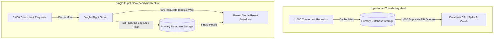

# Mitigating Cache Stampedes: Probabilistic Early Expiration & Single-Flight Coalescing

In high-concurrency systems, caching hot database queries handles thousands of reads per second. However, a major vulnerability exists when a popular cache key expires or is invalidated: the **Cache Stampede** (also known as the **Thundering Herd Problem**).

When a hot key expires, thousands of concurrent incoming requests miss the cache simultaneously. Every worker process attempts to query the primary database to recompute the missing value, creating an instantaneous spike in database CPU and connection pool exhaustion.

To protect backend databases from cache stampedes, software engineers deploy two complementary resilience patterns: **Single-Flight Request Coalescing** and **Probabilistic Early Expiration (XFetch Algorithm)**.

This article details the math and implementation of both anti-stampede strategies.

---

## 📖 Single-Flight Request Coalescing Topology

How Single-Flight coalesces 1,000 concurrent cache misses into a single database query:



### Anti-Stampede Algorithms
1. **Single-Flight Request Coalescing**: Manages in-flight database requests using a thread-safe mutex dictionary. If a query for key `k` is already executing, subsequent requests for `k` subscribe to the active execution channel, blocking until the first request completes and sharing the single returned result.
2. **Probabilistic Early Expiration (XFetch)**: Instead of waiting for a key to reach its hard expiration time ($\text{TTL}$), incoming requests probabilistically recompute the cache entry *before* it expires. The probability of early recomputation increases as the key approaches its expiration time and as computation cost $\delta$ increases:
   $$-\beta \cdot \delta \cdot \ln(\text{random}()) > \text{TTL} - \text{now}$$
   Where:
   * $\delta$: Time taken to compute the database query.
   * $\beta > 0$: Aggressiveness constant (default $\beta = 1.0$).
   * $\text{random}()$: Uniform random variable $u \in (0, 1]$.

---

## 🛠️ Python Implementation: Single-Flight & XFetch Engine

Here is a production-grade Python implementation of Single-Flight Request Coalescing and the XFetch Probabilistic Early Expiration algorithm:

```python
import time
import math
import random
import threading
from typing import Dict, Any, Callable, Tuple, Optional
from pydantic import BaseModel

class CacheEntry(BaseModel):
    value: Any
    ttl: float          # Hard expiration timestamp
    delta: float        # Computation time taken to compute value (in seconds)

class SingleFlightGroup:
    """
    Coalesces concurrent requests for the same key so only a single
    execution is in-flight at any given time.
    """
    def __init__(self):
        self._lock = threading.Lock()
        self._calls: Dict[str, Tuple[threading.Event, Dict[str, Any]]] = {}

    def do(self, key: str, fn: Callable[[], Any]) -> Any:
        self._lock.acquire()
        
        # If call is already in-flight, wait for existing execution
        if key in self._calls:
            event, result_container = self._calls[key]
            self._lock.release()
            print(f" 🤝 [Single-Flight] Coalesced request for key '{key}'! Waiting on active fetch...")
            event.wait()
            return result_container["val"]

        # Otherwise, become the single leader thread
        event = threading.Event()
        result_container = {}
        self._calls[key] = (event, result_container)
        self._lock.release()

        print(f" 🚀 [Single-Flight] Leader thread executing DB fetch for key '{key}'...")
        try:
            val = fn()
            result_container["val"] = val
            return val
        finally:
            self._lock.acquire()
            event.set()  # Notify all waiting threads
            del self._calls[key]
            self._lock.release()

class XFetchCacheStore:
    """
    Cache store implementing the XFetch Probabilistic Early Expiration algorithm.
    """
    def __init__(self, beta: float = 1.0):
        self.beta = beta
        self.store: Dict[str, CacheEntry] = {}
        self.sf_group = SingleFlightGroup()

    def get_or_fetch(self, key: str, fetch_fn: Callable[[], Any], ttl_seconds: float) -> Any:
        now = time.time()
        entry = self.store.get(key)

        # XFetch Evaluation: Check if we should probabilistically refresh early
        should_refresh = False
        if entry is None:
            should_refresh = True
        else:
            # Formula: -beta * delta * ln(random()) > (ttl - now)
            x_val = -self.beta * entry.delta * math.log(random.random())
            time_left = entry.ttl - now
            if x_val > time_left:
                print(f" 🎲 [XFetch] Early Refresh Triggered! (x_val: {x_val:.3f} > time_left: {time_left:.3f}s)")
                should_refresh = True

        if not should_refresh and entry is not None:
            return entry.value

        # Execute fetch using Single-Flight to prevent thundering herd
        def compute_wrapper():
            start = time.perf_counter()
            val = fetch_fn()
            delta = time.perf_counter() - start
            
            # Store in cache with computed delta and hard TTL
            self.store[key] = CacheEntry(
                value=val,
                ttl=time.time() + ttl_seconds,
                delta=delta
            )
            return val

        return self.sf_group.do(key, compute_wrapper)

# Demonstration Execution
if __name__ == "__main__":
    cache = XFetchCacheStore(beta=1.0)

    def expensive_db_query():
        time.sleep(0.05)  # Simulate 50ms DB query
        return {"data": "Expensive Analytics Payload", "timestamp": time.time()}

    print("🚀 Demonstrating Single-Flight & XFetch Anti-Stampede Engine...")
    print("=" * 75)

    # 1. Warm Cache (Initial Single-Flight Fetch)
    key = "dashboard_stats"
    res1 = cache.get_or_fetch(key, expensive_db_query, ttl_seconds=2.0)
    print(f" Initial Fetch Result: {res1['data']}")

    # 2. Simulate 5 Concurrent Threads Requesting Key Simultaneously
    print("\n⚡ Simulating 5 Concurrent Threads Requesting Key...")
    threads = []
    results = []

    def worker():
        val = cache.get_or_fetch(key, expensive_db_query, ttl_seconds=2.0)
        results.append(val)

    for i in range(5):
        t = threading.Thread(target=worker)
        threads.append(t)
        t.start()

    for t in threads:
        t.join()

    print(f" ✅ All {len(results)} threads completed successfully with shared result!")
```

---

## 🚨 Anti-Stampede Gotchas & Best Practices

When implementing anti-stampede protections:

> [!IMPORTANT]
> **Set $\beta$ According to Read Volume**: In the XFetch formula ($-\beta \cdot \delta \cdot \ln(u)$), increasing $\beta > 1.0$ makes early refresh more aggressive, while setting $\beta \to 0$ disables early expiration. For ultra-high traffic keys, a $\beta$ value between $1.0$ and $2.0$ guarantees that hot keys are seamlessly recomputed before expiration.

> [!CAUTION]
> **Handle Exceptions in Single-Flight Callbacks**: If the primary database query inside `singleflight` raises an unhandled exception, ensure the error is propagated safely to all waiting threads and the single-flight key is cleaned up immediately. Otherwise, subsequent calls will deadlock waiting on an abandoned event.

---

## 📈 Real-World Enterprise Impact
Teams implementing Single-Flight and XFetch report:
* **Zero Database Crashes During Cache Expirations**: Request coalescing prevents thousands of concurrent requests from overwhelming backend databases during key expirations.
* **Seamless Zero-Latency Refresh**: Probabilistic early expiration refreshes hot cache keys in the background, maintaining near 100% cache hit rates for end users.
