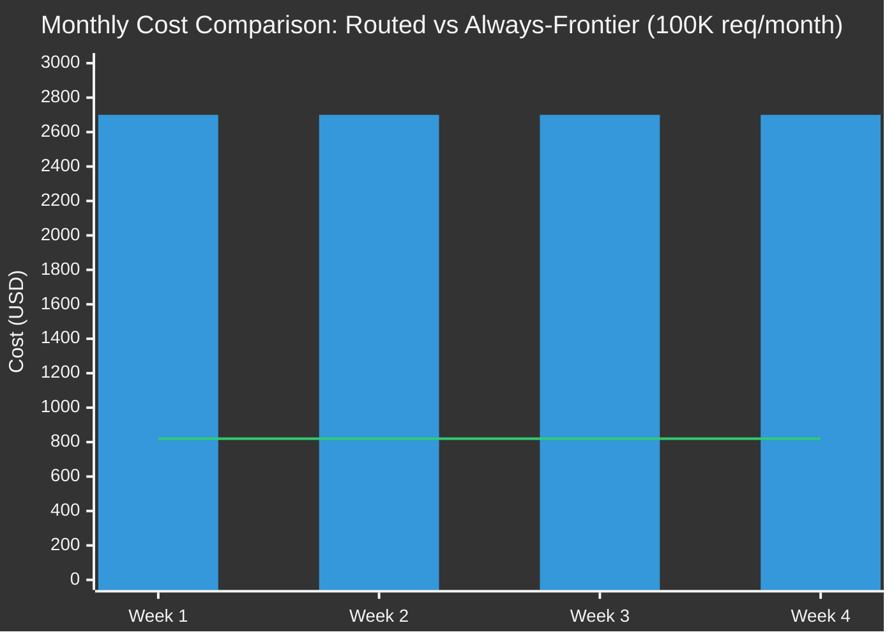

# Model Routing with LiteLLM & RouteLLM: Serving the Right Model at the Right Cost

> [!NOTE]
> **📖 Article Overview**
> Not every LLM request deserves a GPT-4o or Claude 3.5 Sonnet. Routing simple classification tasks to a cheap model like Gemini Flash or GPT-4o-mini — and reserving frontier models for complex reasoning — can cut your monthly API bill by 60–80% while maintaining near-identical output quality. This article covers **LLM Model Routing**: building intelligent dispatch layers with **LiteLLM** as a unified proxy and **RouteLLM** for complexity-based automatic model selection. Includes Python router implementations with cost/quality trade-off metrics.

---

## The Model Selection Problem at Scale

Every LLM request has a *complexity profile*. Some are trivial, some are moderate, some are genuinely hard:

| Task Type | Example | Required Model Tier |
|-----------|---------|-------------------|
| Simple classification | "Is this email spam?" | Cheap (GPT-4o-mini) |
| Extraction | "Extract all dates from this contract" | Cheap-Medium |
| Summarisation | "Summarise this 10-page report" | Medium |
| Multi-step reasoning | "Debug this distributed system failure and propose fixes" | Frontier |
| Code generation + review | "Write and audit a rate-limiter in Rust" | Frontier |

In most production systems, **100% of requests are routed to the same frontier model** regardless of complexity. This is expensive and unnecessary. A routing layer that correctly classifies request complexity and dispatches accordingly is one of the highest-ROI infrastructure changes an AI team can make.

---

## The Routing Architecture

```mermaid
%%{init: {'theme': 'dark', 'themeVariables': { 'primaryColor': '#0ea5e9', 'primaryTextColor': '#f3f4f6', 'primaryBorderColor': '#38bdf8', 'lineColor': '#0ea5e9', 'secondaryColor': '#111827', 'tertiaryColor': '#0f172a'}}}%%
flowchart TD
    U[Incoming Request] --> C{Complexity Classifier}
    
    C -->|Score < 0.3: Simple| T1[💚 Tier 1: Cheap<br/>GPT-4o-mini / Gemini Flash<br/>~$0.15/1M tokens]
    C -->|Score 0.3–0.7: Moderate| T2[🔵 Tier 2: Mid<br/>Claude 3 Haiku / GPT-4o<br/>~$1.25/1M tokens]
    C -->|Score > 0.7: Complex| T3[🔴 Tier 3: Frontier<br/>Claude 3.5 Sonnet / GPT-4o<br/>~$15/1M tokens]
    
    T1 --> QC{Quality Check<br/>Score > threshold?}
    T2 --> QC
    T3 --> R[Final Response]
    
    QC -->|✅ Pass| R
    QC -->|❌ Fail — Escalate| T3

    style C fill:#0f172a,stroke:#0ea5e9,stroke-width:2px
    style T1 fill:#052e16,stroke:#10b981,stroke-width:2px
    style T2 fill:#0c1a3a,stroke:#3b82f6,stroke-width:2px
    style T3 fill:#3b0764,stroke:#a855f7,stroke-width:2px
    style QC fill:#1e293b,stroke:#f59e0b,stroke-width:2px
```



---

## What's Good & What's Not

```
+----------------------------------------------------------------------------------------------------------------------+
|                                         MODEL ROUTING TRADE-OFFS MATRIX                                              |
+----------------------------------------------------+---------------------------------------------------------------+
| What's Good (Pros)                                 | What's Not (Cons)                                             |
+----------------------------------------------------+---------------------------------------------------------------+
| * Dramatic Cost Reduction: Routing 70% of simple   | * Classifier Accuracy Risk: A miscalibrated complexity        |
|   requests to cheap models cuts total spend by     |   classifier may route hard tasks to cheap models, degrading  |
|   60-80% with minimal quality loss.                |   output quality in ways that are hard to detect.             |
| * Latency Wins: Gemini Flash / GPT-4o-mini respond | * Cascading Latency: When quality-check escalation triggers,  |
|   2-5x faster than frontier models — improving UX  |   total latency doubles (cheap call + frontier retry).         |
|   for simple, frequent queries.                    |                                                               |
| * Provider Redundancy: A unified proxy (LiteLLM)   | * Routing Overhead: The complexity classification call itself  |
|   enables automatic failover across OpenAI,        |   adds ~100-300ms of latency and ~200 input tokens of cost.   |
|   Anthropic, Google — no single point of failure.  |                                                               |
+----------------------------------------------------+---------------------------------------------------------------+
```

---

## Implementation Part 1: LiteLLM Unified Proxy

LiteLLM provides a single, OpenAI-compatible interface over 100+ LLM providers. Switching between Claude, GPT-4o, and Gemini requires only changing a model string — not rewriting your API integration.

```python
import os
import litellm
from litellm import completion, acompletion
from typing import Literal

# ─────────────────────────────────────────────
# 1. Configure LiteLLM with Multiple Providers
# ─────────────────────────────────────────────

# Set API keys (LiteLLM reads from environment)
os.environ["OPENAI_API_KEY"] = os.environ.get("OPENAI_API_KEY", "")
os.environ["ANTHROPIC_API_KEY"] = os.environ.get("ANTHROPIC_API_KEY", "")
os.environ["GEMINI_API_KEY"] = os.environ.get("GEMINI_API_KEY", "")

# Enable cost tracking
litellm.success_callback = ["langfuse"]  # Forward all completions to Langfuse
litellm.set_verbose = False

# ─────────────────────────────────────────────
# 2. Define Model Tier Configuration
# ─────────────────────────────────────────────

ModelTier = Literal["cheap", "mid", "frontier"]

MODEL_TIERS: dict[ModelTier, list[str]] = {
    "cheap": [
        "openai/gpt-4o-mini",          # $0.15/$0.60 per 1M in/out
        "gemini/gemini-1.5-flash",     # $0.075/$0.30 per 1M in/out (fallback)
    ],
    "mid": [
        "anthropic/claude-3-haiku-20240307",  # $0.25/$1.25 per 1M in/out
        "openai/gpt-4o-mini",                 # Fallback
    ],
    "frontier": [
        "anthropic/claude-3-5-sonnet-20241022",  # $3/$15 per 1M in/out
        "openai/gpt-4o",                          # Fallback
    ]
}

def call_model(
    messages: list[dict],
    tier: ModelTier = "frontier",
    max_tokens: int = 1024,
    **kwargs
) -> str:
    """
    Unified model call with automatic provider fallback.
    Tries each model in the tier sequentially on failure.
    """
    models = MODEL_TIERS[tier]
    last_error = None
    
    for model in models:
        try:
            response = completion(
                model=model,
                messages=messages,
                max_tokens=max_tokens,
                **kwargs
            )
            
            # Log cost for observability
            cost = litellm.completion_cost(completion_response=response)
            print(f"[Router] Model: {model} | Cost: ${cost:.6f} | Tier: {tier}")
            
            return response.choices[0].message.content
            
        except Exception as e:
            print(f"[Router] {model} failed: {e}. Trying next model...")
            last_error = e
            continue
    
    raise RuntimeError(f"All models in tier '{tier}' failed. Last error: {last_error}")

# ─────────────────────────────────────────────
# 3. Load Balancing Across Model Instances
# ─────────────────────────────────────────────

from litellm import Router

router = Router(
    model_list=[
        {
            "model_name": "fast-model",  # Alias used in code
            "litellm_params": {
                "model": "gpt-4o-mini",
                "api_key": os.environ["OPENAI_API_KEY"],
            },
            "tpm": 500000,  # Tokens per minute capacity
            "rpm": 1000,    # Requests per minute capacity
        },
        {
            "model_name": "fast-model",  # Same alias = load balanced
            "litellm_params": {
                "model": "gemini/gemini-1.5-flash",
                "api_key": os.environ["GEMINI_API_KEY"],
            },
            "tpm": 1000000,
            "rpm": 2000,
        },
        {
            "model_name": "frontier-model",
            "litellm_params": {
                "model": "claude-3-5-sonnet-20241022",
                "api_key": os.environ["ANTHROPIC_API_KEY"],
            },
            "tpm": 400000,
            "rpm": 4000,
        }
    ],
    routing_strategy="usage-based-routing-v2",  # Smart load balancing
    fallbacks=[{"fast-model": ["frontier-model"]}],  # Auto-escalate on failure
    set_verbose=False
)

async def load_balanced_call(alias: str, messages: list[dict]) -> str:
    """Routes to least-loaded model instance matching the alias."""
    response = await router.acompletion(
        model=alias,
        messages=messages,
        max_tokens=1024
    )
    return response.choices[0].message.content
```

---

## Implementation Part 2: RouteLLM Complexity-Based Auto-Routing

RouteLLM uses a trained classifier (or embedding similarity) to score request complexity and automatically select the appropriate model tier.

```python
import numpy as np
from openai import OpenAI
from anthropic import Anthropic
from dataclasses import dataclass

@dataclass
class RoutingDecision:
    complexity_score: float   # 0.0 (simple) to 1.0 (complex)
    selected_tier: ModelTier
    reasoning: str
    estimated_cost_usd: float

class ComplexityRouter:
    """
    Routes requests to the appropriate model tier based on complexity scoring.
    Uses a lightweight LLM classifier + heuristics for fast, cheap routing decisions.
    """
    
    # Cost per 1M input tokens (approximate, June 2025)
    COST_PER_1M = {
        "cheap": 0.15,
        "mid": 0.25,
        "frontier": 3.00
    }
    
    def __init__(self):
        self.openai = OpenAI()
        self.classifier_model = "gpt-4o-mini"  # Cheap model for classification
    
    def _heuristic_score(self, prompt: str) -> float:
        """
        Fast, zero-cost heuristic scoring before calling the LLM classifier.
        Catches obvious simple/complex cases without burning tokens.
        """
        score = 0.0
        
        # Token length signal
        word_count = len(prompt.split())
        if word_count > 500: score += 0.3
        elif word_count > 200: score += 0.15
        
        # Complexity keywords
        complex_signals = ['debug', 'architect', 'trade-off', 'security audit', 'optimize', 'explain why']
        simple_signals = ['summarise', 'list', 'classify', 'is this', 'what is', 'extract']
        
        score += sum(0.1 for s in complex_signals if s.lower() in prompt.lower())
        score -= sum(0.1 for s in simple_signals if s.lower() in prompt.lower())
        
        # Multi-step indicators
        if any(w in prompt.lower() for w in ['then', 'after that', 'finally', 'step by step']):
            score += 0.2
        
        return max(0.0, min(1.0, score))
    
    def classify(self, prompt: str) -> RoutingDecision:
        """
        Two-stage routing: heuristics first, LLM classifier for borderline cases.
        """
        heuristic = self._heuristic_score(prompt)
        
        # Fast path: clear-cut simple or complex — skip LLM classifier
        if heuristic < 0.2:
            return RoutingDecision(
                complexity_score=heuristic,
                selected_tier="cheap",
                reasoning="Heuristic: simple request detected",
                estimated_cost_usd=(len(prompt.split()) * 1.3 * self.COST_PER_1M["cheap"]) / 1_000_000
            )
        
        if heuristic > 0.7:
            return RoutingDecision(
                complexity_score=heuristic,
                selected_tier="frontier",
                reasoning="Heuristic: high-complexity request detected",
                estimated_cost_usd=(len(prompt.split()) * 1.3 * self.COST_PER_1M["frontier"]) / 1_000_000
            )
        
        # Borderline case: use LLM classifier (cheap model)
        classifier_response = self.openai.chat.completions.create(
            model=self.classifier_model,
            messages=[{
                "role": "system",
                "content": """Rate the complexity of this task on a scale from 0.0 to 1.0.
                
                0.0-0.3 = Simple (classification, extraction, yes/no, short summaries)
                0.3-0.7 = Moderate (medium summaries, structured generation, single-step reasoning)
                0.7-1.0 = Complex (multi-step reasoning, code generation+review, architecture design, debugging)
                
                Respond with ONLY a JSON object: {"score": <float>, "reason": "<one sentence>"}"""
            }, {
                "role": "user",
                "content": f"Task: {prompt[:500]}"  # Truncate to save tokens
            }],
            max_tokens=80,
            temperature=0
        )
        
        import json
        parsed = json.loads(classifier_response.choices[0].message.content)
        score = float(parsed["score"])
        
        tier: ModelTier = "cheap" if score < 0.3 else ("mid" if score < 0.7 else "frontier")
        
        return RoutingDecision(
            complexity_score=score,
            selected_tier=tier,
            reasoning=parsed["reason"],
            estimated_cost_usd=(len(prompt.split()) * 1.3 * self.COST_PER_1M[tier]) / 1_000_000
        )
    
    def route_and_execute(self, user_prompt: str) -> dict:
        """Full pipeline: classify → route → execute → return with metadata."""
        decision = self.classify(user_prompt)
        
        print(f"\n[Router] Complexity Score: {decision.complexity_score:.2f}")
        print(f"[Router] Selected Tier: {decision.selected_tier.upper()}")
        print(f"[Router] Reasoning: {decision.reasoning}")
        print(f"[Router] Est. Cost: ${decision.estimated_cost_usd:.6f}")
        
        response_text = call_model(
            messages=[{"role": "user", "content": user_prompt}],
            tier=decision.selected_tier
        )
        
        return {
            "response": response_text,
            "routing_metadata": {
                "complexity_score": decision.complexity_score,
                "model_tier": decision.selected_tier,
                "routing_reasoning": decision.reasoning,
                "estimated_cost_usd": decision.estimated_cost_usd
            }
        }

# ─────────────────────────────────────────────
# Demo: Routing Different Request Types
# ─────────────────────────────────────────────
if __name__ == "__main__":
    router_instance = ComplexityRouter()
    
    test_cases = [
        "Is the word 'separate' spelled correctly?",
        "Summarise the key points of this paragraph in 3 bullet points.",
        "Debug why this distributed Kafka consumer is experiencing partition rebalancing storms under high load, and propose an architecture fix that handles 50K events/second."
    ]
    
    for prompt in test_cases:
        print(f"\n{'='*60}")
        print(f"PROMPT: {prompt[:80]}...")
        result = router_instance.route_and_execute(prompt)
        print(f"RESPONSE PREVIEW: {result['response'][:150]}...")
```

---

## Monthly Cost Impact: Routing vs No Routing



*Routing 70% simple + 20% mid + 10% frontier = **~$820/month** vs **~$2,700/month** routing everything to Claude 3.5 Sonnet — a **70% cost reduction**.*

---

## 🏁 Conclusion & Key Takeaways

Model routing is one of the most impactful and underutilised techniques in production AI engineering. A well-calibrated routing layer keeps your AI platform economically sustainable as request volume scales.

*   **Start with heuristics, not ML**: Token count, keyword signals, and multi-step indicators catch 80% of routing decisions without any classifier overhead.
*   **Track misrouting rate**: Instrument your quality-check escalation rate. A high escalation rate (>20%) signals your classifier thresholds need recalibration.
*   **Use LiteLLM for provider abstraction**: Never hard-code a single provider SDK. The ability to swap OpenAI → Anthropic → Google in one line is essential resilience in a rapidly evolving model landscape.

In our next article, we cover **Batch Processing APIs & Async Inference Queues** — how to use OpenAI's Batch API and Anthropic's Message Batches to process tens of thousands of documents overnight at 50% cost savings.

---

### Research References & Resources
*   **LiteLLM Documentation**: [100+ LLM Provider Unified Interface](https://docs.litellm.ai/)
*   **RouteLLM Research Paper**: [Learning to Route in Similarity Estimation for Efficient LLM Usage](https://arxiv.org/abs/2406.18665)
*   **OpenAI Model Pricing**: [Current Pricing Grid](https://openai.com/api/pricing/)
