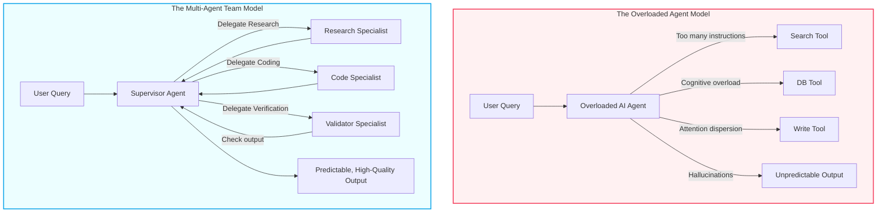

# From Prompt Hacking to Multi-Agent Teams: Designing Predictable AI Workflows

> ### 📖 Article Overview
> * **What this article is about:** This article explores the transition from single-prompt LLM utilities to stateful, collaborative multi-agent workflows that solve predictability and cost challenges in enterprise environments.
> * **Why it matters:** Moving to structured multi-agent architectures reduces context window bloat, minimizes tool hallucinations, and lowers API costs, making AI systems reliable enough for production.
> * **What we synthesized:** We synthesized the core limitations of single-agent prompt engineering and demonstrated how applying software design principles like the Separation of Concerns (SoC) creates highly predictable, specialized agent teams.

---

The software engineering landscape is undergoing a massive shift. We are moving from simple **single-prompt LLM utilities**—where a user sends a query and receives a text response—to **stateful, collaborative AI Agents and Workflows**. These systems plan execution paths, invoke specialized tools, evaluate intermediate outputs, and self-correct when errors occur.

However, when building agentic systems for enterprise environments, developers often struggle with predictability and cost. Giving a single LLM complete autonomy with dozens of tools frequently leads to attention dispersion, high latency, and hallucinations. 

To build reliable systems, we must choose the right architectural pattern. As highlighted in Anthropic's research, the gold standard is to **design for predictability, using workflows for structured paths, and reserving autonomous agent loops only for highly open-ended tasks.**

This article reviews why AI apps are moving from single chatbot interfaces to systems of agents, and how we apply standard software design principles to solve LLM limitations.

---

## The Limitations of Single-Agent Prompt Hacking

When Large Language Models (LLMs) first entered software development pipelines, prompt engineering was the dominant paradigm. Developers focused on building the "perfect prompt"—a highly detailed, multi-paragraph document describing the LLM's identity, tone, guidelines, negative constraints, and available API tools.

This approach works for simple, single-turn tasks (such as drafting an email, summarizing a clean transcript, or converting structured JSON). However, when developers attempt to use a single prompt to coordinate complex, multi-stage workflows (such as auditing a codebase, writing a test suite, and executing deployments), the single-agent model hits a hard ceiling.

In production, single-agent architectures suffer from three fatal system vulnerabilities:

### 1. Context Window Bloat & "Lost in the Middle"
Although modern LLMs advertise context windows of up to 1 million tokens, retrieval accuracy decreases significantly as the prompt size grows. When a system prompt is loaded with hundreds of lines of instructions, edge-case definitions, and multiple tool schemas, models suffer from **attention dispersion**. They frequently ignore constraints or fail to extract relevant data situated in the middle of their context window.

### 2. Tool Hallucination Rates
To interact with the outside world, models rely on function calling (tool use). The LLM reads JSON schemas describing functions and outputs a JSON object containing target arguments. When you pass 10 or 15 different tool schemas into a single model, the search space for the model increases. The likelihood of the model hallucinating arguments, mixing up variables, or invoking the wrong tool altogether increases exponentially.

### 3. High Token Costs
In a loop-based system, a single agent may iterate 10 to 15 times to solve a problem. If the system prompt is 3,000 tokens long, you pay for those 3,000 tokens *on every single turn* of the loop. This overhead results in high latency and API bills that scale quadratically relative to the complexity of the task.

---

## The Separation of Concerns: Single Agent vs. Multi-Agent Team

To build agentic systems that scale predictably, we must treat LLM development as a software engineering discipline. The first rule of software design is **Separation of Concerns (SoC)**—specifically, the **Single Responsibility Principle (SRP)**: *a module or class should have one, and only one, reason to change.*

When we apply SRP to agentic systems, we move from a single overloaded chatbot to a **Multi-Agent Team**.

Instead of one model trying to manage planning, execution, and validation, we divide the labor among specialized, narrow agents:

1.  **The Planner / Router**: A high-level agent that takes the user request, breaks it down into sub-tasks, and routes them.
2.  **Specialized Workers**: Narrowly scoped agent instances equipped with exactly 1–2 tools. For example, a `DatabaseQueryAgent` has access to read-only SQL execution; a `CodeGeneratorAgent` has access to write files; a `SearchAgent` has access to web search.
3.  **The Independent Validator**: An agent whose sole responsibility is to evaluate the worker's output against the planner's original requirements.

By isolating tasks, we ensure that each agent's system prompt is small (often under 200 words), has clear inputs and outputs, and possesses a narrow tool list. This drastically reduces tool hallucinations, minimizes context window overhead, and keeps latency to a minimum.

---

## 📋 Transition Checklist for Builders

If you are looking to refactor your current LLM system from prompt hacks to a multi-agent team, use this checklist:

*   [ ] **Audit the System Prompt**: If your prompt is longer than 1,000 words or contains more than 5 distinct instructions, it is a candidate for decomposition.
*   [ ] **Count the Tools**: If a single agent has access to more than 4 tools, split the tools among specialized worker nodes.
*   [ ] **Decouple Generation from Testing**: Never let the agent that generated the output be the sole agent that validates it. Create a separate validator node with a distinct, critical system prompt.
*   [ ] **Establish Input/Output Contracts**: Define strict JSON schemas for messages passed between agents, treating agent handoffs like standard API integration.

---

## 🏁 Conclusion & Key Takeaways

Transitioning from monolithic prompts to modular multi-agent systems is essential for building robust, production-ready AI applications.
1. **Embrace Separation of Concerns:** Dividing complex tasks among specialized, narrow agents with limited tools drastically reduces cognitive overload and tool hallucinations.
2. **Optimize Context and Costs:** Smaller, targeted system prompts minimize context window bloat, leading to lower latency and more predictable API token usage.
3. **Decouple Generation from Validation:** Implementing independent validator nodes ensures outputs are rigorously checked against requirements, preventing self-referential errors.

*Takeaway: Designing predictable AI systems requires shifting from single-agent prompt hacks to modular, specialized multi-agent teams governed by software engineering principles.*

---

## 📚 References & Further Reading

*   **Anthropic Research**: [Building Effective Agents](https://www.anthropic.com/research/building-effective-agents) (December 2024). Explains workflows, agents, and the benefits of modular orchestration over single-agent complexity.
*   **MetaGPT Paper**: Hong et al., 2023. *MetaGPT: Meta Programming for Multi-Agent Collaborative Framework*. Introduces how encoding human SOPs (Standard Operating Procedures) into multi-agent systems reduces chaos. [arXiv:2308.08155](https://arxiv.org/abs/2308.08155)
*   **LangGraph Conceptual Guide**: LangChain AI, 2024. Deconstructs state persistence, agent loops, and how to build graphs with separate nodes and edges. [Link](https://langchain-ai.github.io/langgraph/concepts/)

*To explore complete code implementations of all 17 agent microservices in a single monorepo, check out the public [agentic-apps-portfolio](https://github.com/akmalkhaniub/agentic-apps-portfolio) repository.*