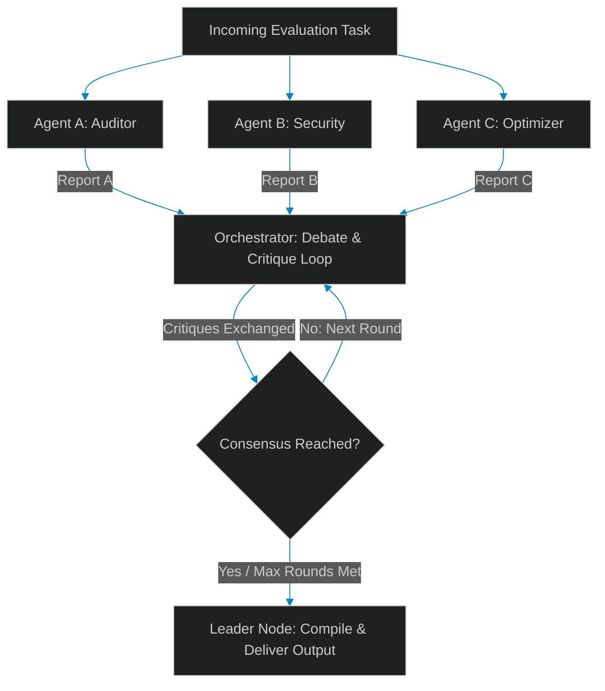

# Multi-Agent Consensus: Architecting Voting & Debate Topologies in LLM Swarms

> [!NOTE]
> **📖 Article Overview**
> Single LLM agents are highly effective at executing isolated, localized tasks. However, in complex reasoning pipelines—such as grading code, analyzing medical logs, or diagnosing server failures—individual agent evaluations are prone to bias, hallucinations, and high variance. To build resilient agent networks, we must implement **consensus architectures**. This article explores different consensus topologies for multi-agent systems—focusing on **Voting** and **Iterative Debate**—and provides a complete Python implementation of a debate-based consensus orchestrator.

---

## The Non-Deterministic Swarm Challenge

In a multi-agent system, agents execute tasks asynchronously. When evaluating complex inputs, different model instances or agent roles may arrive at conflicting conclusions. For example, a security agent might flag a code block as unsafe, while an optimization agent stamps it as production-ready.

If we rely on a single agent's final output, we create a single point of failure. Instead, we can resolve these discrepancies at runtime by introducing **Consensus Protocols**:



---

## Consensus Topologies

Depending on task latency, cost, and complexity constraints, we structure agent collaboration using three primary topologies:

### 1. Simple & Weighted Voting
Agents execute reviews independently. The orchestrator tallies the outputs:
* **Majority Rules**: Simple count consensus (e.g., 2 out of 3 pass).
* **Weighted Confidence Voting**: Agents output a confidence score along with their decision. The final decision is calculated as:
  $$\text{Weighted Score} = \sum (D_i \times C_i)$$
  where $D_i$ is the decision (-1 for Fail, 1 for Pass) and $C_i$ is the agent's confidence score (0.0 to 1.0).

### 2. Iterative Debate (Multi-Agent Debate)
Rather than a single vote, agents review each other’s drafts. In each round:
1. Every agent reviews the task and generates a solution.
2. In the next round, each agent receives the draft solutions of all other agents as part of its system context.
3. The agents critique the drafts and modify their own solutions.
4. The loop repeats until all agents converge on the same answer or the maximum number of rounds is reached.

---

## Implementing a Debate Consensus Orchestrator

Below is a production-ready Python orchestrator implementing the **Multi-Agent Debate** pattern. It uses distinct agent personalities to review a piece of code and debate its viability until they agree.

```python
import os
from typing import List, Dict

# Abstract wrapper representing our LLM API Call
def query_llm(system_prompt: str, user_prompt: str) -> str:
    # In production, replace with your actual LLM client call (e.g., OpenAI, Anthropic, Gemini)
    # mock execution helper
    import random
    if "Security" in system_prompt:
        return "[DECISION: FAIL] Reason: The code uses an unsafe eval() execution block."
    elif "Performance" in system_prompt:
        return "[DECISION: PASS] Reason: Code execution time is optimal."
    else:
        return "[DECISION: FAIL] Reason: Unhandled exception risks in input parsing."

class AgentNode:
    def __init__(self, name: str, role_description: str):
        self.name = name
        self.role_description = role_description
        self.current_opinion = ""

    def review(self, task: str, other_opinions: List[Dict[str, str]] = None) -> str:
        system = f"Role: {self.name}. Description: {self.role_description}. Always prefix your output with [DECISION: PASS] or [DECISION: FAIL]."
        
        user = f"Task to evaluate:\n{task}\n\n"
        if other_opinions:
            user += "Here are the opinions from the other agents in the previous round:\n"
            for op in other_opinions:
                if op['agent'] != self.name:
                    user += f"- {op['agent']} wrote: {op['opinion']}\n"
            user += "\nCritique the other opinions, re-evaluate the task, and output your updated decision and reasoning."
            
        self.current_opinion = query_llm(system, user)
        return self.current_opinion

class DebateOrchestrator:
    def __init__(self, agents: List[AgentNode], max_rounds: int = 3):
        self.agents = agents
        self.max_rounds = max_rounds

    def check_consensus(self) -> bool:
        decisions = []
        for agent in self.agents:
            op = agent.current_opinion.upper()
            if "[DECISION: PASS]" in op:
                decisions.append("PASS")
            elif "[DECISION: FAIL]" in op:
                decisions.append("FAIL")
        
        # If all agents share the same decision, consensus is achieved
        return len(set(decisions)) == 1

    def run_debate(self, task: str) -> Dict[str, any]:
        opinions = []
        
        # Round 1: Initial reviews
        print("--- Round 1: Initial Evaluations ---")
        for agent in self.agents:
            opinion = agent.review(task)
            opinions.append({"agent": agent.name, "opinion": opinion})
            print(f"{agent.name}: {opinion[:80]}...")

        if self.check_consensus():
            return {"rounds": 1, "consensus": True, "opinions": opinions}

        # Subesequent Rounds: Debate & Critique
        for r in range(2, self.max_rounds + 1):
            print(f"\n--- Round {r}: Debate & Critique ---")
            round_opinions = []
            for agent in self.agents:
                opinion = agent.review(task, other_opinions=opinions)
                round_opinions.append({"agent": agent.name, "opinion": opinion})
                print(f"{agent.name}: {opinion[:80]}...")
            
            opinions = round_opinions
            if self.check_consensus():
                return {"rounds": r, "consensus": True, "opinions": opinions}

        return {"rounds": self.max_rounds, "consensus": False, "opinions": opinions}

# Execution
if __name__ == "__main__":
    agents_swarm = [
        AgentNode("Security Agent", "Focuses on vulnerabilities, injections, and safe library usage."),
        AgentNode("Performance Agent", "Focuses on time-complexity, memory layouts, and execution bottlenecks."),
        AgentNode("Quality Agent", "Focuses on exception handling, code styling, and readability.")
    ]
    
    code_task = "def execute_calculation(exp): return eval(exp) # Fast execution path"
    
    orchestrator = DebateOrchestrator(agents_swarm, max_rounds=3)
    result = orchestrator.run_debate(code_task)
    print(f"\nDebate completed. Consensus achieved? {result['consensus']} in {result['rounds']} rounds.")
```

---

## 🏁 Conclusion & Takeaways

Implementing consensus in agent pools mitigates model bias and secures execution paths:
* [ ] **Use Voting for low-latency tasks**: Tallying votes is fast and cheap, making it perfect for high-throughput classification.
* [ ] **Deploy Debate for complex tasks**: Debate loops reduce hallucination rates by forcing agents to critique reasoning and verify assertions.
* [ ] **Define clear termination rules**: Always limit debate loops with a `max_rounds` boundary to prevent infinite token depletion when agents disagree.
* [ ] **Enforce strict output schemas**: Require agents to output a clear tag (like `[DECISION: PASS]`) at the start of their response to simplify programmatic consensus parsing.
