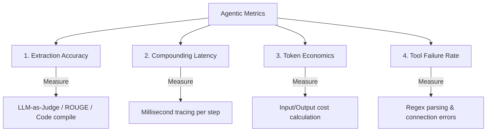

In traditional software development, tests are deterministic: a specific input always yields the same output (pass or fail). In LLM-based agentic applications, outputs are probabilistic. A prompt change that improves Agent A’s output might cause Agent B to fail its downstream task, introducing silent regressions that are difficult to detect with standard unit tests.

To deploy multi-agent systems with confidence, you must transition to **Automated Evaluation Pipelines (Evals)**.

This article details how to design and run evaluations at scale, drawing from recent research in system-level benchmarks like the 2026 **MASEval** library.

---

## The Metrics That Matter

A production evaluation harness must measure four core system dimensions:

### 1. Task Success and Accuracy
*   *Programmatic*: Does the code generated by your worker compile and pass the test suite?
*   *Semantic*: Does the generated report contain all required facts from the source context? We use LLM-as-a-judge prompts with strict scoring rubrics to evaluate this.

### 2. Compounding Latency
*   Track the execution duration of *every single node transition*. If a routing node takes too long, it should be refactored into deterministic code logic.

### 3. Token Economics (Cost-Per-Task)
*   Log input and output token counts per model call. Calculate the average cost per query. Set up alerts for runs that exceed a specific budget threshold (e.g., >$0.50 per task).

### 4. Tool Failure & Error Rates
*   Track the percentage of turns where a worker calls a tool with invalid JSON arguments, hits connection timeouts, or fails to handle API errors.

---

## Designing the Eval Pipeline: MASEval Case Study

The 2026 research paper *MASEval: Extending Multi-Agent Evaluation from Models to Systems* highlights a critical paradigm shift: **you must evaluate the topology, not just the model.**

A framework-agnostic eval harness runs as a continuous gate in your CI/CD pipeline:
1.  **Test Set Compilation**: Maintain a golden test dataset containing 100+ representative user queries, target contexts, and verified ground-truth outputs.
2.  **Autonomous Run Tracing**: Execute the test cases on a staging branch. Use observability tools (such as LangSmith, Phoenix, or DeepEval) to capture the full execution graph (inputs, outputs, tool calls, and latency) for every agent.
3.  **Automatic Regression Alerts**: Compare results against the main branch. If the success rate drops or token cost increases by more than 10%, fail the CI/CD build and block deployment.

---

## 📋 The Eval Stack Checklist

*   [ ] **CI/CD Eval Gate**: Integrate automated evaluations (e.g., using DeepEval or custom pytest-llm runners) to run on every commit.
*   [ ] **Observability Trace Logging**: Enable full telemetry tracing (OTel standards) on all model calls to log input/output prompts, token counts, latency, and system versions.
*   [ ] **Human Feedback Loop**: Set up a curation portal where administrators or users can flag incorrect agent outputs, automatically adding failed runs to your test dataset for future training.

---

## 📚 References & Further Reading

*   **MASEval Framework**: *MASEval: Extending Multi-Agent Evaluation from Models to Systems* (March 2026). Presents system-level evaluation libraries for topologies. [arXiv:2603.04852](https://arxiv.org/abs/2603.04852) (Needs verification)
*   **Evaluation Survey**: *A Survey on Evaluation of LLM-based Agents* (April 2026). Explains the emerging metrics and benchmarks for testing agentic workflows. [arXiv:2604.11952](https://arxiv.org/abs/2604.11952) (Needs verification)
*   **DeepEval Docs**: [Confident AI: DeepEval](https://github.com/confident-ai/deepeval) (2024). Python framework for unit testing LLM applications.

*To explore complete code implementations of all 17 agent microservices in a single monorepo, check out the public [agentic-apps-portfolio](https://github.com/akmalkhaniub/agentic-apps-portfolio) repository.*
