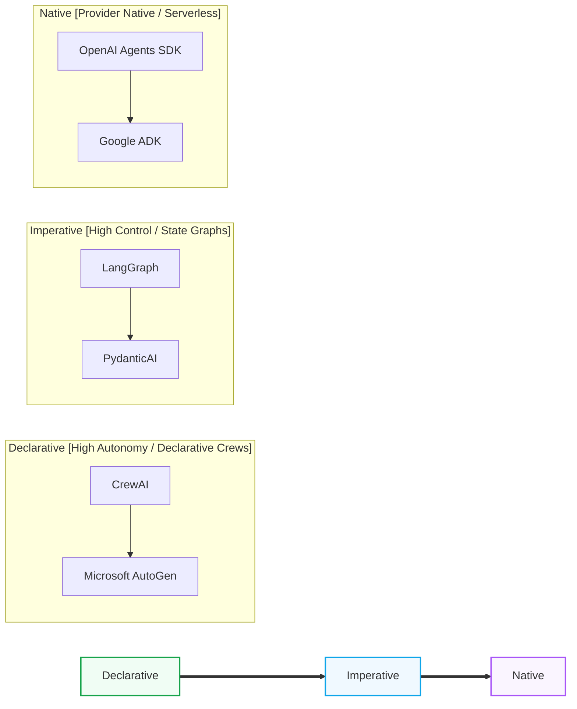

> ### 📖 Article Overview
> * **What this article is about:** This article provides a comparative analysis of leading agent orchestration frameworks—LangGraph, CrewAI, OpenAI Agents SDK, and Microsoft AutoGen—evaluating their architectural paradigms, state management, and control trade-offs.
> * **Why it matters:** Choosing the wrong framework locks you into rigid state and execution models, leading to massive refactoring bottlenecks, security risks, or performance issues as your agentic system scales.
> * **What we synthesized:** We synthesized a clear architectural alignment guide and selection checklist based on recent 2026 benchmark studies to help you map your project requirements to the ideal framework paradigm.

Choosing the right framework is the most critical decision when building agentic systems. A framework locks you into a specific way of managing state, executing loops, and handling tool calls. Selecting the wrong foundation can cause massive refactoring bottlenecks when your project requirements evolve.

This article provides a comparative analysis of the leading agent orchestration libraries, drawing from recent framework evaluations such as the 2026 **MAFBench** (Multi-Agent Framework Benchmark) study.

---

## The Framework Landscape

The current ecosystem is split into three paradigms based on the balance between **Autonomy** and **Deterministic Control**:

---

## Detailed Comparison

| Feature | LangGraph | CrewAI | OpenAI Agents SDK | Microsoft AutoGen |
| :--- | :--- | :--- | :--- | :--- |
| **Orchestration Model** | Imperative State Graph (DAG) | Declarative Sequential / Hierarchy | Serverless Event Loop | Peer-to-Peer Actor Model |
| **State Persistence** | DB Checkpointers (Postgres/Redis) | Ephemeral Memory Layer | Hosted Threads (Serverless) | Message-based Actor Memory |
| **Determinism Control** | Maximum (Step-by-step nodes & edges) | Low (Model determines task execution) | Medium (Client-side tool loops) | Low to Medium (Conversational) |
| **Learning Curve** | High (Requires graph concept design) | Low (Define agents and tasks in YAML/Python) | Minimal (Wrapper around API) | Medium (Actor model syntax) |
| **Production Readiness** | High (Built-in checkpointing & HITL) | Medium (Great for prototyping, hard to trace) | High (Hosted infra, less local control) | High (Ideal for event-driven apps) |

---

## The Architectural Alignment Guide

### Use **LangGraph** If:
1.  Your system requires complex loops, conditional branches, and human-in-the-loop approvals (e.g., procurement pipelines, medical triage).
2.  You need strict state checkpointing to recover from network drops or tool failures.
3.  You want 100% control over the execution graph, knowing exactly which node will run next.

### Use **CrewAI** If:
1.  You are prototyping business automation workflows that mimic organizational roles (e.g., content creation, automated customer research).
2.  You want to assign personas to agents quickly and let the framework handle the scheduling and handoffs dynamically.
3.  Your team is composed of product managers or data science students who prefer declarative configuration over low-level graph coding.

### Use **OpenAI Agents SDK** If:
1.  You are building OpenAI-native applications and want to minimize infrastructure management.
2.  You want to offload state storage, thread management, and vector indexing to OpenAI’s hosted infrastructure.
3.  You are building simple, client-side tool loops that do not require complex, multi-agent checkpointing.

### Use **Microsoft AutoGen** (or AutoGen v0.4+) If:
1.  Your system relies on decentralized, peer-to-peer agent communication where agents dynamically negotiate goals.
2.  You want to model your system using the **Actor Pattern**, where each agent is an isolated microservice communicating via asynchronous message buses.
3.  You are building multiplayer collaborative simulations or dynamic, event-driven chatbots.

---

## Framework Selection Checklist

*   [ ] **State Checkpointing requirement**: If your task requires resuming execution from step 8 after a failure, select a framework with first-class database checkpointing (e.g., **LangGraph**).
*   [ ] **Type-Safety Audit**: If building enterprise Python applications, consider strict validation libraries (e.g., **PydanticAI**) to enforce tool signatures at the compiler level.
*   [ ] **Autonomy Tolerance**: If the client requires strict audit logs and deterministic path compliance, avoid declarative frameworks (CrewAI/AutoGen) and use graph-based structures (LangGraph).

---

## Conclusion & Key Takeaways

Selecting the right agentic framework requires balancing the trade-offs between developer autonomy and deterministic control.
1. **Architectural Alignment is Critical:** Graph-based frameworks like LangGraph offer maximum determinism and state persistence for complex enterprise workflows, while declarative frameworks like CrewAI excel at rapid, role-based prototyping.
2. **State and Persistence Dictate Reliability:** Production-grade agentic systems require robust checkpointing to recover from failures, making native DB integration a key differentiator over ephemeral or serverless alternatives.
3. **Match the Paradigm to the Team:** Align your framework choice with your team's technical expertise and the system's required autonomy, choosing actor-based models like AutoGen for decentralized simulations or type-safe libraries like PydanticAI for strict validation.

*Takeaway:* *Always prioritize state control and execution determinism over initial prototyping speed when building production-ready multi-agent systems.*

## References & Further Reading

*   **MAFBench Study**: *Understanding Multi-Agent LLM Frameworks: A Unified Benchmark and Experimental Analysis* (February 2026). Evaluates frameworks on orchestration overhead, execution accuracy, and memory retention. [arXiv:2602.04952](https://arxiv.org/abs/2602.04952) (Needs verification)
*   **Engineering MAS Taxonomy**: *Engineering LLM-based Multi-Agent Systems: A Taxonomy of Emerging Frameworks* (June 2026). Compares graph-based, actor-based, and serverless agent frameworks. [diva-portal.org](https://diva-portal.org/) (Needs verification)
*   **PydanticAI Docs**: [PydanticAI: Agent Framework](https://ai.pydantic.dev/) (2024). Explains strict type-safe agent schemas.

*To explore complete code implementations of all 17 agent microservices in a single monorepo, check out the public [agentic-apps-portfolio](https://github.com/akmalkhaniub/agentic-apps-portfolio) repository.*