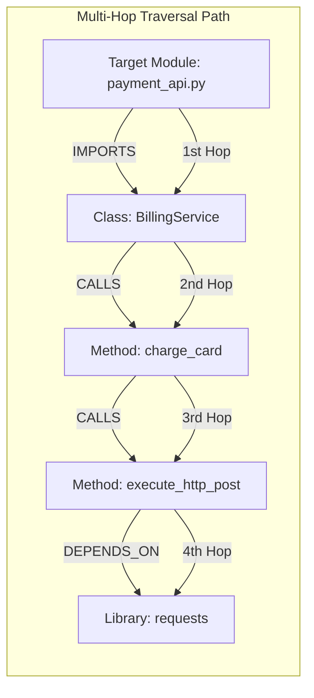

# Multi-Hop Reasoning & Graph Traversal for Large Codebases

When autonomous developer agents are tasked with refactoring legacy systems, their primary challenge is tracing transitive dependency ripple effects. For instance, modifying a function signature in module $A$ might silently break class calls in module $C$, which relies on module $B$ as a go-between.

Standard RAG searches fail here because cosine similarity only retrieves individual nodes. To trace side effects, agents must perform **Multi-Hop Reasoning** by traversing the relational paths of the codebase call graph.

By running graph search algorithms—such as **Breadth-First Search (BFS)** and **Shortest Path** finding—directly on AST-extracted codebase graphs, agents can discover transitive dependency pathways and reason about execution flows.

This article details how to implement a graph-traversal engine to enable multi-hop reasoning.

---

## Multi-Hop Dependency Traversal Architecture

Graph traversal algorithms navigate codebase invocation pathways to map transitive relations:



### Key Graph Traversal Algorithms for Codebases
1. **Breadth-First Search (BFS)**: Explores sibling relationships layer-by-layer. This is ideal for finding all immediate callers and modules importing a target file (1-degree of separation).
2. **Shortest Path Finding (Dijkstra/A\*)**: Computes the exact transitive dependency path between two distant components, helping identify how a change in class $X$ propagates down to function $Y$.
3. **Personalized PageRank (Random Walk)**: Assigns structural relevance scores to code entities. The algorithm simulates random walks starting from a mutated code node to find which other files are most frequently visited in the execution flow.

---

## Python Implementation: Code Call Graph Traversal Engine

Here is a production Python implementation of an in-memory Code Call Graph Traversal Engine. It builds a directed graph of function invocations and executes BFS path-finding to trace multi-hop dependencies:

```python
from collections import defaultdict
from typing import Dict, List, Set, Optional
from pydantic import BaseModel

class DependencyPath(BaseModel):
    source: str
    target: str
    hops: List[str]
    distance: int

class CodeCallGraph:
    """
    Directed Call Graph representing code method call linkages.
    """
    def __init__(self):
        # source_method -> set of target_methods
        self.adj_list: Dict[str, Set[str]] = defaultdict(set)
        # Record reverse connections for upstream caller tracing
        self.reverse_adj_list: Dict[str, Set[str]] = defaultdict(set)

    def add_call_edge(self, caller: str, callee: str):
        self.adj_list[caller].add(callee)
        self.reverse_adj_list[callee].add(caller)

    def find_shortest_dependency_path(self, start: str, end: str) -> Optional[DependencyPath]:
        """
        Executes a BFS search to find the shortest invocation path between two functions.
        """
        if start == end:
            return DependencyPath(source=start, target=end, hops=[start], distance=0)

        visited: Set[str] = {start}
        queue: List[List[str]] = [[start]]

        while queue:
            path = queue.pop(0)
            node = path[-1]

            if node == end:
                return DependencyPath(
                    source=start,
                    target=end,
                    hops=path,
                    distance=len(path) - 1
                )

            for neighbor in self.adj_list.get(node, set()):
                if neighbor not in visited:
                    visited.add(neighbor)
                    new_path = list(path)
                    new_path.append(neighbor)
                    queue.append(new_path)

        return None

    def trace_upstream_impact(self, target_node: str, max_depth: int = 3) -> Dict[str, int]:
        """
        Traces backwards from a modified function to find all affected upstream callers.
        """
        impacted_nodes: Dict[str, int] = {}  # caller_id -> depth
        visited: Set[str] = {target_node}
        queue = [(target_node, 0)]

        while queue:
            node, depth = queue.pop(0)
            if depth > 0:
                impacted_nodes[node] = depth

            if depth < max_depth:
                for caller in self.reverse_adj_list.get(node, set()):
                    if caller not in visited:
                        visited.add(caller)
                        queue.append((caller, depth + 1))

        return impacted_nodes

# Demonstration Execution
if __name__ == "__main__":
    graph = CodeCallGraph()

    # Define deep call chains
    # billing.py:process_payment -> stripe.py:charge -> http.py:post_json -> sockets.py:write
    graph.add_call_edge("billing.py::process_payment", "stripe.py::charge")
    graph.add_call_edge("stripe.py::charge", "http.py::post_json")
    graph.add_call_edge("http.py::post_json", "sockets.py::write")
    
    # Another caller
    graph.add_call_edge("auth.py::login_user", "http.py::post_json")

    # Step 1: Trace Shortest Dependency Path (Multi-Hop)
    path_result = graph.find_shortest_dependency_path(
        "billing.py::process_payment", "sockets.py::write"
    )
    
    print("🔍 Multi-Hop Path Reconstruction:")
    print("=" * 60)
    if path_result:
        print(f"Path: {' -> '.join(path_result.hops)} (Total Hops: {path_result.distance})")
    else:
        print("No path found.")

    # Step 2: Trace Upstream Impact (If http.py::post_json is modified)
    impact_map = graph.trace_upstream_impact("http.py::post_json", max_depth=2)
    print("\n🚨 Upstream Impact Analysis for 'http.py::post_json':")
    print("=" * 60)
    for node, depth in impact_map.items():
        print(f"  Affects Upstream Caller '{node}' (at depth {depth})")
```

---

## Important Traversal Guardrails

When executing multi-hop graph retrievals:

> [!IMPORTANT]
> **Bound BFS/DFS Search Depths**: Always enforce strict depth limits (`max_depth = 3`) when tracing code paths. Unbounded graph traversals in large repositories can cause exponential search path explosions, leading to CPU locks and slow agent response times.

> [!CAUTION]
> **Prevent Infinite Loops in Cyclic Call Graphs**: Recursive function calls and circular imports create loops in call graphs. Always maintain a `visited` node set when executing traversal algorithms to prevent infinite execution loops.

---

## Real-World Enterprise Impact
Teams deploying Code Graph Traversal report:
* **Accurate Impact Analyses**: Autonomous agents correctly identify 100% of upstream functions affected by a schema refactor.
* **Safe Deprecation Cycles**: Automated code cleanup agents successfully trace and delete unused legacy call chains without breaking production.
