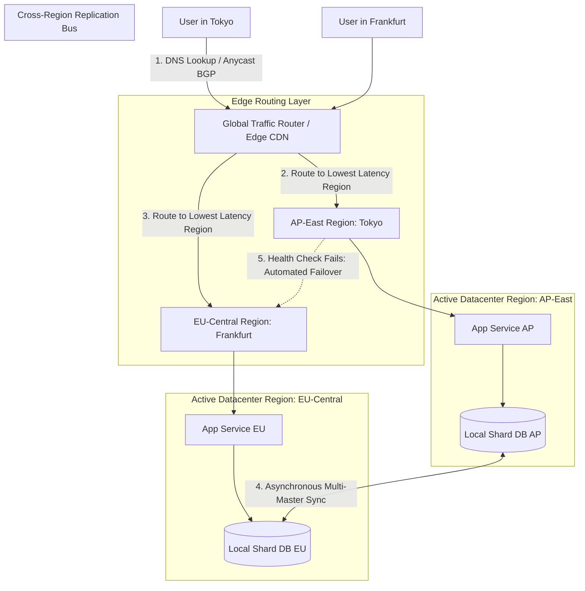

# Multi-Region Active-Active Deployments & Global Traffic Routing

Deploying a web application within a single cloud region (such as `us-east-1`) leaves systems vulnerable to cloud provider outages and imposes high round-trip network latencies ($150\text{ms}$ to $300\text{ms}$) for international users across Asia or Europe.

To achieve 99.999% availability and single-digit millisecond latency worldwide, enterprise architectures migrate to **Multi-Region Active-Active Deployments**.

In an Active-Active deployment, fully operational application and database instances run simultaneously across multiple geographic regions (**US-East**, **EU-Central**, **AP-East**). Global traffic routers steer client requests to the closest healthy region using **Anycast BGP** or **Geo-DNS**.

This article details how to design multi-region active-active architectures and automated failovers.

---

## 📖 Multi-Region Active-Active Routing Topology

Global Anycast DNS routing and cross-region asynchronous database replication:



### Core Multi-Region Principles
1. **Anycast BGP vs Geo-DNS Routing**: Anycast advertises identical IP addresses from multiple geographic Points of Presence (PoPs), routing client TCP packets to the nearest border router automatically via BGP. Geo-DNS resolves domain queries to the IP address of the data center closest to the client's DNS resolver.
2. **Cell-Based Architecture**: Microservice instances are partitioned into autonomous "Cells" within each region. Each cell operates independently with its own compute and database resources, preventing an outage in one cell from cascading to others.
3. **Conflict Resolution in Multi-Master Databases**: When writes occur concurrently in both US and EU regions, multi-master databases use **Last-Write-Wins (LWW)** vector timestamps or **CRDTs (Conflict-free Replicated Data Types)** to resolve write conflicts deterministically.

---

## 🛠️ Python Implementation: Multi-Region Traffic Router & Failover Engine

Here is a production-grade Python simulation of a Multi-Region Global Traffic Router featuring latency-based routing, health probing, and automated region failover:

```python
import time
import random
from typing import Dict, List, Optional
from pydantic import BaseModel

class RegionHealthStatus(BaseModel):
    region_code: str
    latency_ms: float
    is_healthy: bool
    active_connections: int

class MultiRegionTrafficRouter:
    """
    Routes global client requests to the lowest-latency healthy region
    and handles automated failover when a region degrades.
    """
    def __init__(self):
        # Region Code -> Health Status
        self.regions: Dict[str, RegionHealthStatus] = {
            "us-east-1": RegionHealthStatus(region_code="us-east-1", latency_ms=15.0, is_healthy=True, active_connections=120),
            "eu-central-1": RegionHealthStatus(region_code="eu-central-1", latency_ms=22.0, is_healthy=True, active_connections=85),
            "ap-northeast-1": RegionHealthStatus(region_code="ap-northeast-1", latency_ms=18.0, is_healthy=True, active_connections=90)
        }

    def route_request(self, client_location: str, client_ip: str) -> str:
        """
        Calculates optimal healthy region for incoming client.
        """
        healthy_regions = [r for r in self.regions.values() if r.is_healthy]
        if not healthy_regions:
            raise RuntimeError("CRITICAL: All Global Regions Unhealthy!")

        # 1. Simulate distance/latency matrix based on client location
        candidate_scores = []
        for region in healthy_regions:
            base_latency = region.latency_ms
            # Add synthetic network distance penalty
            if client_location == "ASIA" and region.region_code != "ap-northeast-1":
                base_latency += 120.0
            elif client_location == "EUROPE" and region.region_code != "eu-central-1":
                base_latency += 100.0
            elif client_location == "US" and region.region_code != "us-east-1":
                base_latency += 80.0

            candidate_scores.append((base_latency, region))

        # Sort candidate regions by expected latency
        candidate_scores.sort(key=lambda x: x[0])
        best_region = candidate_scores[0][1]

        best_region.active_connections += 1
        print(f" 🌐 [Global Traffic Router] Client '{client_ip}' ({client_location}) routed to '{best_region.region_code}' (Estimated Latency: {candidate_scores[0][0]:.1f} ms)")
        return best_region.region_code

    def update_region_health(self, region_code: str, is_healthy: bool, new_latency: Optional[float] = None):
        """Simulates automated edge health checker probing region availability."""
        if region_code in self.regions:
            self.regions[region_code].is_healthy = is_healthy
            if new_latency:
                self.regions[region_code].latency_ms = new_latency
            
            status_str = "HEALTHY" if is_healthy else "OUTAGE DETECTED (Failing Probes!)"
            print(f" 🏥 [Health Monitor] Region '{region_code}' Status -> {status_str}")

# Demonstration Execution
if __name__ == "__main__":
    router = MultiRegionTrafficRouter()

    print("🚀 Demonstrating Multi-Region Active-Active Global Router...")
    print("=" * 75)

    # 1. Route Global Clients under Normal Conditions
    print("\n1. Routing Requests Under Normal Active-Active Conditions...")
    router.route_request(client_location="ASIA", client_ip="203.0.113.5")
    router.route_request(client_location="EUROPE", client_ip="198.51.100.22")
    router.route_request(client_location="US", client_ip="192.0.2.88")

    # 2. Simulate Region Outage in AP-Northeast-1 (Tokyo Datacenter Crash)
    print("\n⚡ Simulating Outage in 'ap-northeast-1' (Tokyo Datacenter Blackout)...")
    router.update_region_health("ap-northeast-1", is_healthy=False)

    # 3. Subsequent Asian Client Request Automatically Fails Over to US/EU
    print("\n2. Routing Asian Client Request During 'ap-northeast-1' Outage...")
    router.route_request(client_location="ASIA", client_ip="203.0.113.99")
```

---

## 🚨 Multi-Region Gotchas & Best Practices

When building active-active multi-region systems:

> [!IMPORTANT]
> **Enforce Tenant Affinity Where Possible**: To avoid cross-region multi-master data conflicts, bind users or tenants to a "primary home region" (`home_region="eu-central-1"`). When a user writes data, route their request to their home region.

> [!CAUTION]
> **Beware of Cross-Region Data Transfer Costs**: Replicating high-frequency database writes across continental internet backbones incurs heavy egress data transfer charges from cloud providers. Compress binary replication streams and filter non-essential telemetry.

---

## 📈 Real-World Enterprise Impact
Teams deploying multi-region active-active architectures report:
* **99.999% High Availability**: Automated regional failover ensures seamless operation even during catastrophic cloud datacenter outages.
* **Single-Digit Latencies Globally**: Routing requests to the nearest edge datacenter dramatically improves user experience worldwide.
