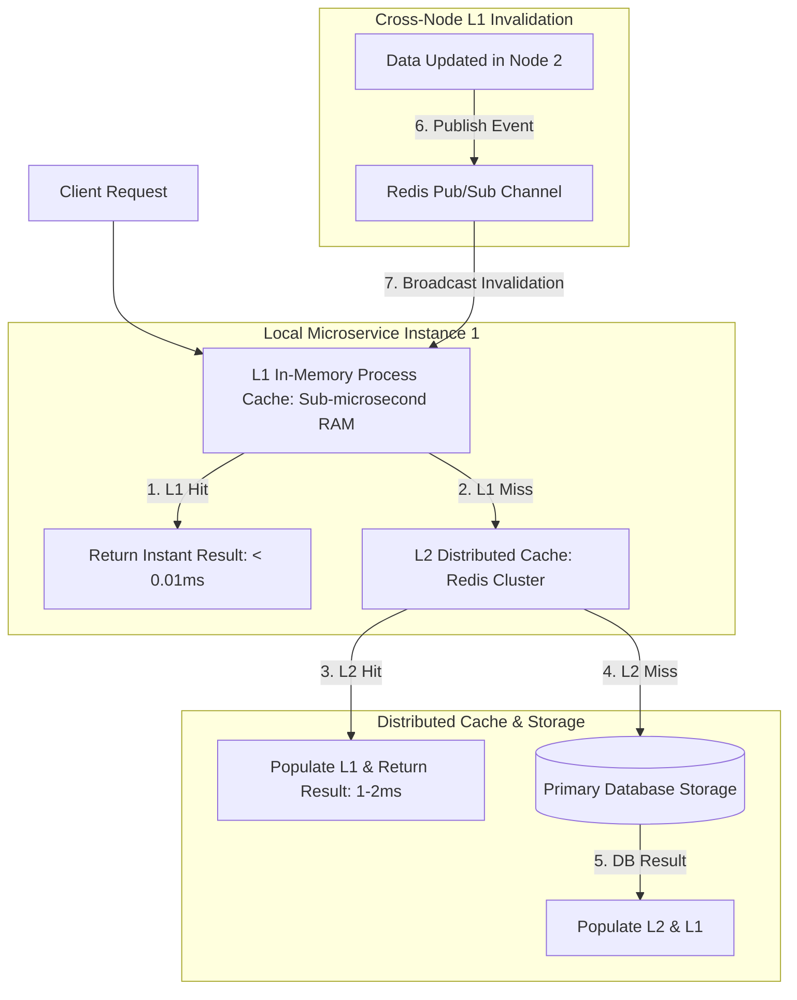

# Multi-Tier Hybrid Caching: In-Memory L1 + Distributed L2 Clusters

In high-concurrency microservice architectures, querying a distributed cache cluster (like **Redis**) delivers low-latency reads. However, even a Redis network hop takes $1\text{ms}$ to $3\text{ms}$ over TCP sockets. When a microservice receives 50,000 requests per second, making TCP calls to Redis for every single request creates network interface saturation and serial CPU overhead.

To achieve sub-microsecond read performance, software architects deploy **Multi-Tier Hybrid Caching**.

A Multi-Tier architecture co-locates a ultra-fast **L1 In-Memory Process Cache** directly inside application memory, backed by a high-capacity **L2 Distributed Cache Cluster (Redis)**.

When data changes, a **Pub/Sub Invalidation Bus** broadcasts invalidation events across all microservice instances, maintaining strict consistency across local L1 process caches.

This article details how to design and build a multi-tier L1/L2 caching engine.

---

## Multi-Tier L1/L2 Caching & Invalidation Architecture

The read path hierarchy and cross-node L1 invalidation bus:



### Multi-Tier Engine Characteristics
1. **L1 In-Memory Process Cache**: Co-located inside the application worker's process memory space. Reads execute in nanoseconds without network overhead. Space is bounded using LRU or LFU eviction policies.
2. **L2 Distributed Cache Cluster**: Shared across all microservice instances. Holds gigabytes/terabytes of data with high availability, acting as a secondary shield before queries reach primary database storage.
3. **Pub/Sub Invalidation Synchronization**: When any node updates or deletes a key, it publishes a message to a Redis Pub/Sub channel (`l1_invalidation_channel`). All subscribed microservice nodes receive the message and evict the corresponding key from their local L1 process memory instantly.

---

## Python Implementation: Multi-Tier L1/L2 Caching Engine

Here is a production-grade Python implementation of a Multi-Tier Cache Manager featuring an L1 Process Cache, L2 Distributed Cache, and Redis Pub/Sub invalidation synchronization:

```python
import time
import threading
from typing import Dict, Any, Optional, Callable
from pydantic import BaseModel

class CacheStats(BaseModel):
    l1_hits: int = 0
    l2_hits: int = 0
    db_hits: int = 0

class LocalL1ProcessCache:
    """Ultra-fast in-memory process cache (L1)."""
    def __init__(self, capacity: int = 100):
        self.capacity = capacity
        self.store: Dict[str, Any] = {}
        self.lock = threading.Lock()

    def get(self, key: str) -> Optional[Any]:
        with self.lock:
            return self.store.get(key)

    def put(self, key: str, value: Any):
        with self.lock:
            if len(self.store) >= self.capacity:
                # Evict oldest entry (Simple FIFO/LRU eviction)
                oldest_key = next(iter(self.store))
                del self.store[oldest_key]
            self.store[key] = value

    def evict(self, key: str):
        with self.lock:
            if key in self.store:
                del self.store[key]
                print(f" 🧹 [L1 Process Cache] Evicted Key '{key}' from local RAM.")

class DistributedL2Cache:
    """Simulates a shared Redis cluster cache (L2)."""
    def __init__(self):
        self.store: Dict[str, Any] = {}

    def get(self, key: str) -> Optional[Any]:
        return self.store.get(key)

    def set(self, key: str, value: Any):
        self.store[key] = value

    def delete(self, key: str):
        if key in self.store:
            del self.store[key]

class MultiTierCacheManager:
    """
    Coordinates L1 Process Cache, L2 Distributed Cache, and Pub/Sub Invalidation.
    """
    def __init__(self, node_id: str, l2_cache: DistributedL2Cache):
        self.node_id = node_id
        self.l1 = LocalL1ProcessCache(capacity=100)
        self.l2 = l2_cache
        self.stats = CacheStats()

    def get_or_fetch(self, key: str, db_fetch_fn: Callable[[], Any]) -> Any:
        # 1. Try L1 In-Memory Cache (Sub-microsecond)
        val = self.l1.get(key)
        if val is not None:
            self.stats.l1_hits += 1
            print(f" ⚡ [Node {self.node_id} - L1 HIT] Key '{key}' served from local process RAM.")
            return val

        # 2. Try L2 Distributed Cache (Redis 1-2ms)
        val = self.l2.get(key)
        if val is not None:
            self.stats.l2_hits += 1
            print(f" 💾 [Node {self.node_id} - L2 HIT] Key '{key}' fetched from L2 Redis. Warming L1...")
            self.l1.put(key, val)
            return val

        # 3. DB Miss -> Fetch from Primary Database
        self.stats.db_hits += 1
        print(f" 🗄️ [Node {self.node_id} - DB HIT] Key '{key}' fetched from Database. Warming L2 & L1...")
        db_val = db_fetch_fn()
        self.l2.set(key, db_val)
        self.l1.put(key, db_val)
        return db_val

    def invalidate_across_cluster(self, key: str, pubsub_bus: List['MultiTierCacheManager']):
        """Updates L2 and broadcasts L1 invalidation message across all nodes."""
        print(f"\n🔄 [Node {self.node_id}] Invalidating Key '{key}' across cluster...")
        self.l2.delete(key)
        
        # Broadcast L1 eviction to all subscribed node managers
        for node in pubsub_bus:
            node.l1.evict(key)

# Demonstration Execution
if __name__ == "__main__":
    l2_cluster = DistributedL2Cache()

    # Create 2 microservice node instances sharing L2 Redis
    node1 = MultiTierCacheManager("Node-1", l2_cluster)
    node2 = MultiTierCacheManager("Node-2", l2_cluster)
    cluster_nodes = [node1, node2]

    def fetch_product_from_db():
        time.sleep(0.01)  # Simulate DB query
        return {"id": "prod-901", "name": "Laptop", "price": 1299.00}

    print("🚀 Demonstrating Multi-Tier L1/L2 Hybrid Caching...")
    print("=" * 75)

    # 1. Node 1 reads product (DB Hit -> Warms L2 & L1)
    key = "product:prod-901"
    res1 = node1.get_or_fetch(key, fetch_product_from_db)

    # 2. Node 1 reads product again (L1 HIT - Sub-microsecond!)
    res1_cached = node1.get_or_fetch(key, fetch_product_from_db)

    # 3. Node 2 reads product (L2 HIT - Warms Node 2 L1)
    res2 = node2.get_or_fetch(key, fetch_product_from_db)

    # 4. Node 1 updates product and broadcasts cross-cluster invalidation
    node1.invalidate_across_cluster(key, cluster_nodes)

    # 5. Node 2 reads product after invalidation (DB Hit -> Fresh Fetch)
    print("\n🔍 Node 2 Reading Key After Cross-Node Invalidation...")
    res2_fresh = node2.get_or_fetch(key, fetch_product_from_db)
```

---

## Multi-Tier Caching Gotchas & Best Practices

When operating multi-tier caching architectures:

> [!IMPORTANT]
> **Keep L1 Time-To-Live (TTL) Short**: Because L1 process caches rely on Pub/Sub invalidation messages (which can occasionally be delayed or dropped during network partitions), configure short L1 TTLs (e.g. 5 to 30 seconds). Short TTLs guarantee that even if a Pub/Sub invalidation is missed, L1 keys expire quickly.

> [!CAUTION]
> **Set Bounds on L1 Process Memory Capacities**: Unlike Redis (which runs in its own container with explicit `maxmemory` settings), an un-bounded L1 dictionary inside a CPython or JVM application process will consume all available container memory, triggering operating system OOM kills. Always enforce strict capacity limits (`LRUCache(maxsize=1000)`).

---

## Real-World Enterprise Impact
Teams deploying multi-tier hybrid caching report:
* **Sub-Microsecond Latency**: Serving 90% of reads directly from L1 in-memory process caches delivers $100\times$ faster response times than single-tier Redis lookups.
* **90% Network Socket Reduction**: Co-locating L1 caches inside application processes dramatically reduces TCP socket overhead on Redis clusters.
