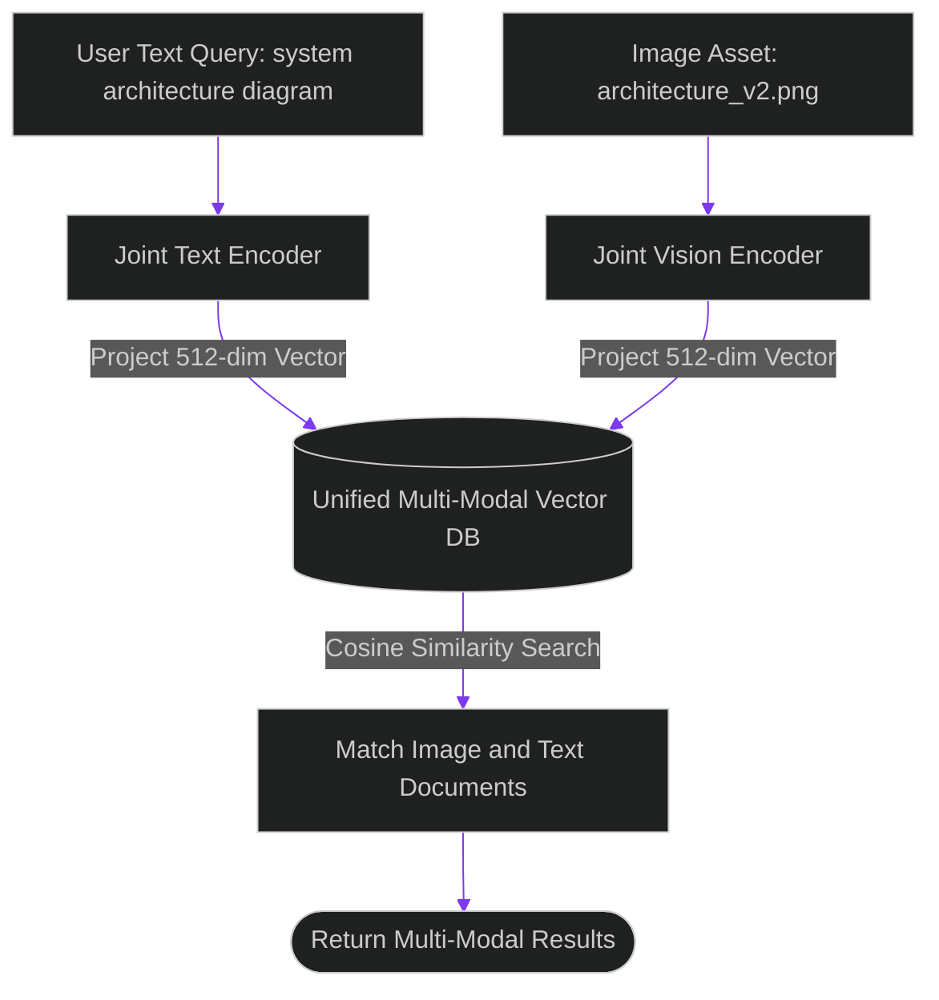

# Cross-Modal Vector Fusion: Joint Embeddings for Image and Text Retrieval

> [!NOTE]
> **📖 Article Overview**
> Enterprise knowledge bases do not consist solely of text documents. They contain technical architecture diagrams, UI screenshots, product photos, and design specifications. Searching text and image assets using separate databases requires running dual query flows and combining scores manually. To streamline multi-modal retrieval, advanced systems implement **Cross-Modal Vector Fusion**. By leveraging joint embedding models (such as CLIP or ImageBind), we map text descriptions and image features into a shared vector space, allowing text queries to match relevant image assets directly. In this article, we implement a multi-modal vector search manager in Python.

---

## Unifying Text and Image Semantic Search

In legacy search architectures:
* **Separated Data Silos**: Image metadata relies on alt-text tags, while text documents use vector embeddings, preventing cross-media semantic queries.
* **Mismatched Scoring**: Combining text similarity scores with image classification confidence yields inconsistent ranking outputs.
* **The Solution**: **Shared Embedding Spaces**. Joint multi-modal encoders project image features and text tokens into the same high-dimensional coordinate space. A query like *"database schema diagram"* matches image vectors of architecture diagrams without requiring text OCR.



---

## 1. Projecting into Shared Vector Spaces

To implement cross-modal retrieval:
* **Normalize Vector Projections**: Ensure text and image embeddings are normalized to unit length so dot-product calculations equal cosine similarity.
* **Unified Vector Indices**: Store image vectors and text vectors inside a single HNSW (Hierarchical Navigable Small World) index, tagged with media type metadata.

---

## 2. Executing Cross-Modal Queries

The multi-modal search manager coordinates retrieval:
1. **Embed User Query**: Pass text inputs to the joint text encoder to generate a 512-dimensional query vector.
2. **Retrieve Mixed Assets**: Perform a single vector search against the unified index to return matching images and text chunks simultaneously.

---

## Code Demo: Cross-Modal Vector Search Engine

Below is a Python implementation of a cross-modal search engine. It projects simulated text and image vectors into a shared index, calculates cosine similarity, and retrieves multi-modal assets.

```python
import numpy as np
from typing import List, Dict, Any

class CrossModalVectorSearch:
    def __init__(self, vector_dim: int = 512):
        self.vector_dim = vector_dim
        # Unified vector index storing both text and image assets
        self.index: List[Dict[str, Any]] = []

    def _normalize_vector(self, vec: np.ndarray) -> np.ndarray:
        norm = np.linalg.norm(vec)
        return vec / norm if norm > 0 else vec

    def add_asset(self, asset_id: str, media_type: str, raw_vector: np.ndarray, metadata: Dict[str, Any]):
        normalized_vec = self._normalize_vector(raw_vector)
        self.index.append({
            "id": asset_id,
            "media_type": media_type,
            "vector": normalized_vec,
            "metadata": metadata
        })
        print(f"📦 [Index] Added {media_type.upper()} asset '{asset_id}' to unified vector space.")

    def search_by_text(self, text_query_vector: np.ndarray, top_k: int = 2) -> List[Dict[str, Any]]:
        query_vec = self._normalize_vector(text_query_vector)
        results = []

        # Perform cosine similarity search across shared vector space
        for item in self.index:
            similarity = np.dot(query_vec, item["vector"])
            results.append({
                "id": item["id"],
                "media_type": item["media_type"],
                "score": float(similarity),
                "metadata": item["metadata"]
            })

        # Sort results by similarity score
        results.sort(key=lambda x: x["score"], reverse=True)
        return results[:top_k]

if __name__ == "__main__":
    search_engine = CrossModalVectorSearch(vector_dim=4)

    # 1. Populate unified index with image and text vectors
    # Image asset vector (e.g. system architecture diagram screenshot)
    image_vector = np.array([0.9, 0.1, 0.0, 0.2])
    search_engine.add_asset(
        asset_id="img_arch_diag",
        media_type="image",
        raw_vector=image_vector,
        metadata={"filename": "architecture_diagram.png", "resolution": "1920x1080"}
    )

    # Text asset vector (e.g. documentation paragraph)
    text_vector = np.array([0.1, 0.8, 0.2, 0.1])
    search_engine.add_asset(
        asset_id="doc_setup_guide",
        media_type="text",
        raw_vector=text_vector,
        metadata={"title": "Local Deployment Setup Guide"}
    )

    # 2. Execute text query vector (closely matching the image vector)
    query_text_vector = np.array([0.85, 0.15, 0.05, 0.1])

    print("\n🛡️ Executing Cross-Modal Vector Search...")
    print("------------------------------------------")

    matches = search_engine.search_by_text(query_text_vector, top_k=2)

    print("\n📈 --- Unified Multi-Modal Search Results ---")
    for idx, match in enumerate(matches):
        print(f"    [Match {idx + 1}] ID: {match['id']} ({match['media_type'].upper()}) | Similarity Score: {match['score']:.4f}")
        print(f"               Metadata: {match['metadata']}")
```

---

## Multi-Modal Vector Takeaways

* **Project to Shared Spaces**: Use joint embedding encoders (CLIP/ImageBind) to map text and images into the same coordinate space.
* **Normalize Vector Outputs**: Normalize embeddings to unit length before indexing to compute cosine similarity using fast dot products.
* **Tag Media Metadata**: Store media type tags alongside vector records to enable filtering by asset type.
