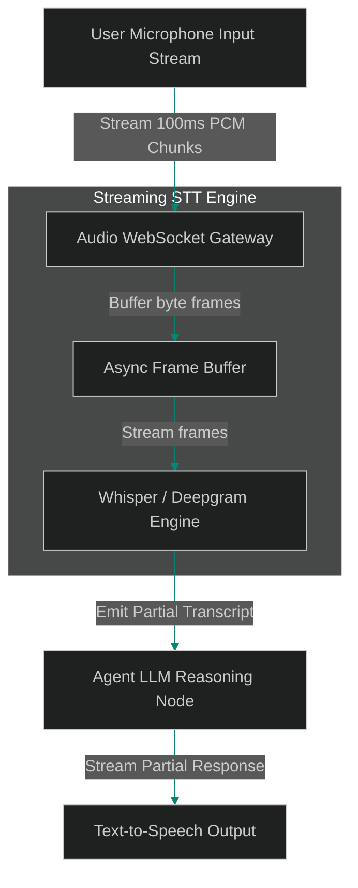

# Streaming Audio Telemetry: Low-Latency Speech Pipelines

> [!NOTE]
> **📖 Article Overview**
> Designing voice-driven AI agents introduces strict latency constraints. When users interact with a voice bot, delays greater than 500 milliseconds degrade conversational naturalness. Waiting to record a complete audio file before sending it to a Speech-to-Text (STT) model introduces unacceptable buffering delays. To achieve sub-second response times, engineering teams implement **Streaming Audio Telemetry Pipelines**. By partitioning incoming microphone streams into small binary chunks (e.g. 100ms frames) and processing them over WebSockets, we achieve continuous real-time transcription. In this article, we implement an async audio streaming gateway in Python.

---

## Eliminating Audio Buffering Latency

In traditional batch voice agent architectures:
* **The Silence Lag**: The system waits until the user finishes speaking before initiating STT transcription, adding 2–3 seconds of latency.
* **Large Memory Buffers**: Retaining uncompressed WAV files in memory consumes gateway RAM during long sessions.
* **The Solution**: **Chunked Audio Streaming**. We stream raw PCM/WAV byte chunks across persistent WebSocket connections directly to STT engines (like Whisper or Deepgram), generating incremental transcriptions in real time.



---

## 1. Frame Buffering and Windowing

To process audio byte streams:
* **Segment Micro-Frames**: Partition raw audio bytes into 100ms chunks to enable continuous processing.
* **Detect Silence Gates**: Implement Voice Activity Detection (VAD) algorithms to pause STT queries when users stop speaking.

---

## 2. Managing Async WebSocket Sockets

The streaming gateway manages audio connections:
1. **Asynchronous Frame Ingestion**: Read binary WebSocket frames without blocking the main event loop.
2. **Emit Partial Transcripts**: Stream partial transcription text to downstream agent nodes to begin prompt processing early.

---

## Code Demo: Streaming Audio Gateway

Below is a Python implementation of a streaming audio gateway. It processes binary audio chunks, buffers frame windows, and streams partial transcriptions asynchronously.

```python
import asyncio
import base64
from typing import List, Dict, Any

class StreamingAudioGateway:
    def __init__(self, frame_size_bytes: int = 1024):
        self.frame_size_bytes = frame_size_bytes
        self.audio_buffer = bytearray()
        self.is_listening = True

    async def ingest_audio_chunk(self, chunk: bytes) -> str:
        self.audio_buffer.extend(chunk)
        
        # Check if buffer has accumulated enough bytes for a frame window
        if len(self.audio_buffer) >= self.frame_size_bytes:
            frame_data = self.audio_buffer[:self.frame_size_bytes]
            # Slide window by clearing processed bytes
            del self.audio_buffer[:self.frame_size_bytes]
            
            # Simulate low-latency STT processing
            partial_text = await self._process_stt_frame(frame_data)
            return partial_text
        return ""

    async def _process_stt_frame(self, frame_bytes: bytes) -> str:
        # Simulate STT model inference delay (5ms)
        await asyncio.sleep(0.005)
        # Mock transcription based on byte length representation
        encoded_sample = base64.b64encode(frame_bytes[:4]).decode('utf-8')
        return f"[Partial Transcript: frame sample {encoded_sample}]"

if __name__ == "__main__":
    gateway = StreamingAudioGateway(frame_size_bytes=2048)

    async def run_audio_stream_scenario():
        print("🛡️ Starting Streaming Audio Telemetry Gateway...")
        print("--------------------------------------------------")

        # Simulate 3 incoming 1024-byte PCM audio chunks from client microphone
        mock_chunks = [
            b"\x00\x01\x02\x03" * 256, # 1024 bytes
            b"\x04\x05\x06\x07" * 256, # 1024 bytes (Triggers 2048 byte frame)
            b"\x08\x09\x0a\x0b" * 512  # 2048 bytes (Triggers second frame)
        ]

        for idx, chunk in enumerate(mock_chunks):
            print(f"🎤 [Mic] Pushing chunk {idx + 1} ({len(chunk)} bytes)...")
            transcript = await gateway.ingest_audio_chunk(chunk)
            
            if transcript:
                print(f"   ⚡ {transcript}")
            else:
                print("   ⏳ Buffering audio frame...")

    asyncio.run(run_audio_stream_scenario())
```

---

## Streaming Audio Takeaways

* **Stream Micro-Frames**: Partition audio inputs into 100ms frames to eliminate initial buffering delays.
* **Leverage Voice Activity Detection (VAD)**: Pause STT queries when silence is detected to save compute costs.
* **Emit Partial Transcripts**: Stream partial transcription text to LLM agents early to minimize end-to-end response latency.
