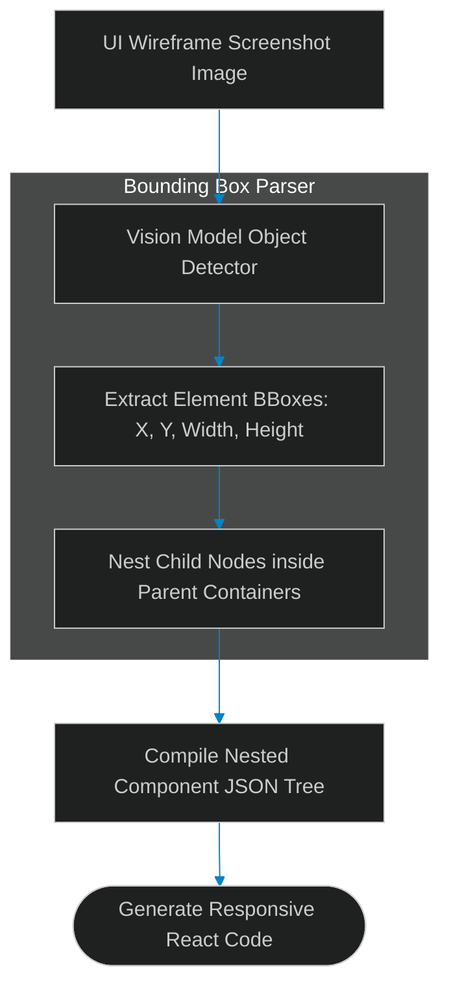

# Visual UI Layout Analysis: Converting Wireframe Images to Component Trees

> [!NOTE]
> **📖 Article Overview**
> Multi-modal AI models allow software engineering agents to operate visually by analyzing UI mockups, Figma designs, and website screenshots directly. However, feeding raw pixel images into code generation models without structural layout parsing generates messy, unmaintainable code. To convert design mockups into production-ready frontend components, developers deploy **Visual UI Layout Parsers**. By extracting element bounding boxes, detecting component hierarchies (containers, buttons, text nodes), and constructing clean nested trees, vision agents generate structured React and HTML code. In this article, we implement a visual layout tree compiler in Python.

---

## Bridging Vision Models and Code Generators

In typical design-to-code pipelines:
* **The Unstructured Pixel Problem**: Vision models can recognize text in an image but struggle to accurately nesting elements inside flexbox/grid containers based purely on raw pixel inputs.
* **Redundant DOM Elements**: Direct image-to-HTML generation often creates absolute positioning hacks that break responsive layouts.
* **The Solution**: **Visual Bounding Box Segmentation**. We process image element bounding boxes `[ymin, xmin, ymax, xmax]`, group adjacent elements into parent container nodes, and output clean component trees.



---

## 1. Extracting Visual Element Bounding Boxes

To partition UI wireframe layouts:
* **Segment Visual Bounds**: Identify normalized coordinates `[ymin, xmin, ymax, xmax]` for each detected UI element.
* **Label Element Types**: Categorize bounding boxes as `button`, `input`, `text`, or `container`.

---

## 2. Compiling Nested Component Trees

The layout compiler structures nested element hierarchies:
1. **Detect Containment**: If bounding box $B$ is completely enclosed within bounding box $A$, assign node $B$ as a child of container node $A$.
2. **Export Structured JSON**: Convert the resolved hierarchy into a clean component tree JSON payload.

---

## Code Demo: Visual Layout Component Compiler

Below is a Python implementation of a visual layout parser. It processes element bounding boxes, evaluates spatial containment, and exports a nested JSON component tree.

```python
import json
from typing import List, Dict, Any

class VisualLayoutCompiler:
    def __init__(self):
        pass

    def is_contained(self, child_box: List[int], parent_box: List[int]) -> bool:
        # BBox format: [xmin, ymin, xmax, ymax]
        c_xmin, c_ymin, c_xmax, c_ymax = child_box
        p_xmin, p_ymin, p_xmax, p_ymax = parent_box
        
        return (c_xmin >= p_xmin and c_ymin >= p_ymin and 
                c_xmax <= p_xmax and c_ymax <= p_ymax)

    def compile_component_tree(self, elements: List[Dict[str, Any]]) -> List[Dict[str, Any]]:
        # Sort elements by area (largest containers first)
        elements.sort(key=lambda el: (el["bbox"][2] - el["bbox"][0]) * (el["bbox"][3] - el["bbox"][1]), reverse=True)
        
        root_nodes: List[Dict[str, Any]] = []

        for el in elements:
            node = {
                "id": el["id"],
                "type": el["type"],
                "label": el.get("label", ""),
                "bbox": el["bbox"],
                "children": []
            }

            placed = False
            # Check if this node belongs inside an existing container
            for root in root_nodes:
                if root["type"] == "container" and self.is_contained(el["bbox"], root["bbox"]):
                    root["children"].append(node)
                    placed = True
                    break

            if not placed:
                root_nodes.append(node)

        return root_nodes

if __name__ == "__main__":
    compiler = VisualLayoutCompiler()

    # Mock detected elements from a vision model [xmin, ymin, xmax, ymax]
    detected_ui_elements = [
        {"id": "box_card", "type": "container", "bbox": [10, 10, 300, 200]},
        {"id": "txt_title", "type": "text", "label": "Card Header", "bbox": [20, 20, 250, 50]},
        {"id": "btn_submit", "type": "button", "label": "Submit", "bbox": [20, 140, 120, 180]},
        {"id": "nav_bar", "type": "container", "bbox": [0, 0, 1000, 60]}
    ]

    print("🛡️ Compressing Visual Layout Bounding Boxes...")
    print("----------------------------------------------")

    component_tree = compiler.compile_component_tree(detected_ui_elements)

    print("\n📈 --- Output Nested Component Tree ---")
    print(json.dumps(component_tree, indent=2))
```

---

## Visual Layout Takeaways

* **Sort by Surface Area**: Process container bounding boxes first to establish parent bounds before placing child elements.
* **Check Spatial Containment**: Verify bounding box overlaps to build nested component trees automatically.
* **Pass Structured Layouts**: Supply structured JSON layout maps to code generation models to avoid hardcoded absolute positioning.
