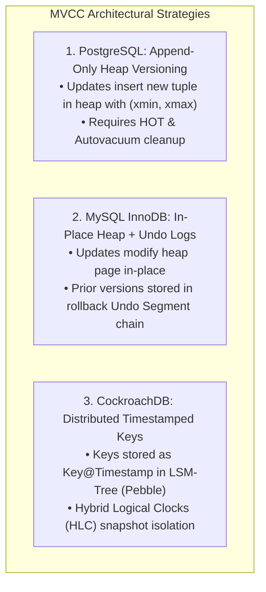
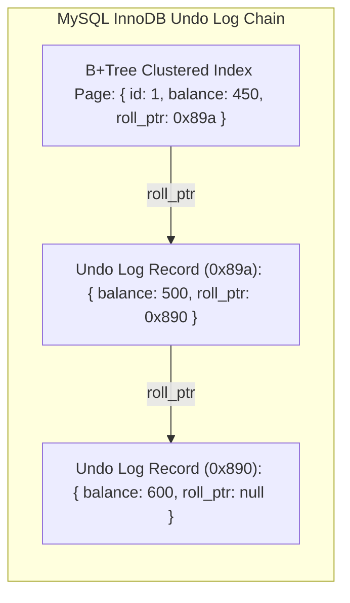

# MVCC (Multi-Version Concurrency Control) Deep Dive: PostgreSQL vs MySQL InnoDB vs CockroachDB

In relational database engineering, the foundational golden rule of high-throughput transactional engines is:

$$\mathbf{\text{Readers never block Writers, and Writers never block Readers.}}$$

Under classic **Two-Phase Locking (2PL)**, reading a row required acquiring a shared read lock (`S-lock`), which immediately blocked any concurrent transaction attempting to acquire an exclusive write lock (`X-lock`). Under high-concurrency e-commerce workloads, 2PL resulted in catastrophic lock contention, query timeouts, and cascading deadlocks.

To achieve lock-free concurrent reads without sacrificing ACID guarantees, modern relational and distributed database engines (**PostgreSQL**, **MySQL InnoDB**, **CockroachDB**, **Oracle**) implement **Multi-Version Concurrency Control (MVCC)**.

However, each database engine chose a fundamentally different architectural strategy to store, index, and garbage-collect older tuple versions—resulting in drastically different performance trade-offs under heavy write workloads.



---

## 1. How MVCC Achieves Snapshot Isolation

When Transaction $T_1$ executes `BEGIN TRANSACTION ISOLATION LEVEL REPEATABLE READ`:
1. The database creates a virtual **Transaction Snapshot**: recording the active transaction IDs at that exact microsecond.
2. When $T_1$ executes `SELECT * FROM accounts`, it sees a consistent snapshot of the database frozen in time.
3. If Transaction $T_2$ simultaneously executes `UPDATE accounts SET balance = 0`, $T_2$ creates a new version of the row.
4. $T_1$ continues reading the older immutable version without acquiring a single lock!

---

## 2. PostgreSQL vs MySQL InnoDB vs CockroachDB

```
> **MVCC IMPLEMENTATION COMPARISON MATRIX**
| Dimension            | PostgreSQL                | MySQL (InnoDB)            | CockroachDB        |
| Tuple Storage        | Append-only heap table    | In-place heap page        | LSM-Tree (Pebble)  |
| Old Version Location | Stored on heap data page  | Stored in Undo Log segment| Stored inline as key@ts|
| Version Identifiers  | `xmin` / `xmax` TXIDs     | Transaction ID + Roll Ptr | Hybrid Logical Clock|
| Garbage Collection   | Background Autovacuum     | Purge Threads             | Compaction Filters |
| Main Failure Mode    | Table bloat & TXID freeze | Long Undo Log traversal   | Write-Intent aborts|

```

---

### 1. PostgreSQL: Append-Only Heap Versioning
In Postgres, every row on disk contains two hidden system metadata columns:
* **`xmin`**: The Transaction ID that inserted this tuple.
* **`xmax`**: The Transaction ID that deleted or updated this tuple (set to `0` if active).

```
PostgreSQL Heap Page:

| Tuple 1: [xmin: 100, xmax: 105] -> { id: 1, balance: 500 }  (Dead)   |
| Tuple 2: [xmin: 105, xmax: 0  ] -> { id: 1, balance: 450 }  (Live)   |

```

When an `UPDATE` occurs, Postgres does not modify Tuple 1. It marks Tuple 1's `xmax = 105` and appends a brand new Tuple 2 with `xmin = 105`.
* **The Trade-Off (Table Bloat & Autovacuum)**: Because old "dead tuples" remain on disk, Postgres requires background **Autovacuum daemons** to reclaim space. If autovacuum falls behind, table size balloons by $10\times$.

---

### 2. MySQL InnoDB: In-Place Modification & Rollback Undo Logs
Unlike Postgres, MySQL InnoDB updates the row **in-place** inside the clustered B+Tree index page:
* The original row data is overwritten with the new values.
* The previous version is written to the **Undo Log Segment**.
* A hidden 7-byte pointer (`roll_ptr`) links the new row to its previous undo log record.



* **The Benefit**: Zero heap table bloat! High write throughput on fresh pages.
* **The Downside**: If a transaction runs for 4 hours, all intermediate undo logs must be retained, causing severe undo log contention.

---

### 3. CockroachDB: Distributed Timestamped MVCC Keys
In CockroachDB's distributed LSM-Tree storage engine (Pebble):
* Every mutation appends a timestamped key: `Key@Timestamp`.
* Snapshot isolation is enforced using **Hybrid Logical Clocks (HLC)** across distributed nodes.
* Obsolete MVCC keys are reclaimed automatically during background LSM-tree storage compactions.

---

## 3. The Write-Skew Anomaly in Snapshot Isolation

While Snapshot Isolation eliminates Dirty Reads and Non-Repeatable Reads, it remains vulnerable to **Write-Skew**:

```
The On-Call Doctor Anomaly:
Constraint: At least 1 doctor must remain active on call.
Current State: Doctor A = Active, Doctor B = Active.

Transaction 1 (Doctor A goes off call):
1. Reads active count = 2 (Valid)
2. Sets Doctor A = Inactive

Transaction 2 (Doctor B simultaneously goes off call):
1. Reads active count = 2 (Valid snapshot!)
2. Sets Doctor B = Inactive

Result: Both commit successfully -> Active Doctors = 0 (Data Corruption!)
```

To eliminate Write-Skew, database architects must upgrade isolation to **Serializable Snapshot Isolation (SSI)** or use explicit row locking (`SELECT FOR UPDATE`).

---

## Python Implementation: Complete MVCC Storage Engine Simulator

Here is a Python implementation simulating PostgreSQL-style `xmin`/`xmax` tuple versioning, snapshot visibility rules, and vacuum garbage collection:

```python
import time
from dataclasses import dataclass
from typing import Dict, List, Optional

@dataclass
class TupleRecord:
    tuple_id: int
    data: Dict
    xmin: int # Created by TXID
    xmax: int # Expired/Deleted by TXID (0 = active)

class MVCCStorageEngine:
    """
    Simulates PostgreSQL-style Heap MVCC with Snapshot Visibility and Vacuuming.
    """
    def __init__(self):
        self.global_txid_counter = 100
        self.heap_table: List[TupleRecord] = []

    def begin_transaction(self) -> Tuple[int, List[int]]:
        self.global_txid_counter += 1
        current_txid = self.global_txid_counter
        # Snapshot records active uncommitted transactions
        active_snapshot = [tx for tx in range(100, current_txid)]
        print(f"\n🚀 [TXID {current_txid}] Started Transaction (Snapshot Active: {active_snapshot})")
        return current_txid, active_snapshot

    def insert(self, txid: int, data: Dict):
        rec = TupleRecord(tuple_id=len(self.heap_table)+1, data=data, xmin=txid, xmax=0)
        self.heap_table.append(rec)
        print(f" 🟢 [TXID {txid}] Inserted Tuple #{rec.tuple_id}: {data} (xmin={txid}, xmax=0)")

    def update(self, txid: int, tuple_id: int, new_data: Dict):
        # Locate active tuple and set xmax
        for rec in self.heap_table:
            if rec.tuple_id == tuple_id and rec.xmax == 0:
                rec.xmax = txid
                # Append new version
                new_rec = TupleRecord(tuple_id=len(self.heap_table)+1, data=new_data, xmin=txid, xmax=0)
                self.heap_table.append(new_rec)
                print(f" 🔄 [TXID {txid}] Updated Tuple #{tuple_id} -> Appended Tuple #{new_rec.tuple_id}: {new_data}")
                return
        print(f" ❌ [TXID {txid}] Update failed: Tuple #{tuple_id} not found or deleted.")

    def select(self, txid: int, snapshot: List[int]) -> List[Dict]:
        visible_data = []
        for rec in self.heap_table:
            # PostgreSQL Visibility Rules:
            # 1. Created by committed transaction before snapshot
            created_visible = (rec.xmin <= txid) and (rec.xmin not in snapshot or rec.xmin == txid)
            # 2. Not deleted, or deleted by transaction after snapshot
            not_deleted = (rec.xmax == 0) or (rec.xmax > txid) or (rec.xmax in snapshot and rec.xmax != txid)

            if created_visible and not_deleted:
                visible_data.append(rec.data)

        return visible_data

    def vacuum_garbage_collect(self, oldest_active_txid: int):
        print(f"\n🧹 [Autovacuum Daemon] Reclaiming dead tuples older than TXID {oldest_active_txid}...")
        initial_len = len(self.heap_table)
        self.heap_table = [
            rec for rec in self.heap_table
            if not (rec.xmax != 0 and rec.xmax < oldest_active_txid)
        ]
        reclaimed = initial_len - len(self.heap_table)
        print(f" ✅ [Vacuum Complete] Reclaimed {reclaimed} dead tuple(s) from heap.")

# Demonstration Execution
if __name__ == "__main__":
    db = MVCCStorageEngine()

    # 1. Transaction 101 inserts user balance
    tx101, snap101 = db.begin_transaction()
    db.insert(tx101, {"user": "Alice", "balance": 500})

    # 2. Transaction 102 reads Alice balance
    tx102, snap102 = db.begin_transaction()
    print(f" 📖 [TXID 102 Read] Alice Balance: {db.select(tx102, snap102)}")

    # 3. Transaction 103 updates Alice balance to 450
    tx103, snap103 = db.begin_transaction()
    db.update(tx103, tuple_id=1, new_data={"user": "Alice", "balance": 450})

    # 4. Transaction 102 reads AGAIN (Snapshot Isolation guarantees Repeatable Read!)
    print(f" 📖 [TXID 102 Repeatable Read] Alice Balance: {db.select(tx102, snap102)} (Unchanged!)")

    # 5. Transaction 104 reads new committed state
    tx104, snap104 = db.begin_transaction()
    print(f" 📖 [TXID 104 Fresh Read] Alice Balance: {db.select(tx104, snap104)} (Shows 450)")

    # 6. Run Vacuum
    db.vacuum_garbage_collect(oldest_active_txid=104)
```

---

## Summary: MVCC Engine Trade-Offs

| System Metric | PostgreSQL Heap Versioning | MySQL InnoDB Undo Logs | CockroachDB Key@TS |
|---|---|---|---|
| **Read Speed (Fresh Data)** | Moderate (Scans heap tuples) | **Fastest (In-place clustered page)** | High (LSM-Tree lookup) |
| **Write Throughput** | High (Append-only) | High | **Highest (LSM Write path)** |
| **Table Bloat Vulnerability** | 🚨 High (Requires Autovacuum) | Low (Undo logs purged automatically) | Low (LSM Compactions) |
| **Long Transaction Impact** | Blocks vacuuming across table | Bloats undo tablespace | Memory buffer pressure |

---

## Architectural Takeaway
MVCC is one of the most elegant triumphs in computer science: allowing high-throughput concurrent systems to operate without blocking locks.

Understanding whether your database uses **PostgreSQL heap versioning**, **MySQL undo log rollback segments**, or **distributed LSM timestamps** is essential for optimizing query performance, preventing table bloat, and eliminating transactional concurrency bottlenecks.
