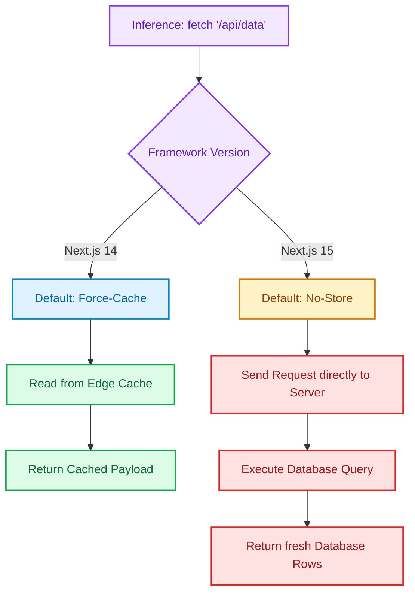

Upgrading your framework is rarely as simple as running `npm install next@latest`. 

While Next.js 15 introduces massive performance improvements (thanks to stable **Turbopack** and the **React Compiler**), it also ships with several fundamental breaking changes. 

If you attempt to upgrade a Next.js 14 application without modifying your components, you will immediately encounter compilation errors, broken ref bindings, and—worst of all—sudden server load spikes due to altered caching models.

This article reviews the **Top 5 gotchas** when migrating from Next.js 14 to 15, providing direct code comparisons and execution path diagrams to help you upgrade without bringing down your production environment.

---

## 🎨 Caching Behavior Shift: Next.js 14 vs. Next.js 15

The most dangerous gotcha in Next.js 15 is the silent flip in default caching behaviors. In Next.js 14, standard `fetch` queries, GET Route Handlers, and Client-Side Page cache paths were **cached by default**. In Next.js 15, they are **uncached by default**.

The diagram below maps the decision paths and visualizes how this swap impacts your database traffic:



---

## 🛠️ The Top 5 Gotchas and How to Fix Them

### Gotcha 1: Uncached Fetch by Default
* **The Problem**: Next.js 14 cached API requests globally. Upgrading to Next.js 15 immediately disables this. Every user visit will query your database directly, causing high server costs and slow loading times.
* **The Fix**: You must explicitly opt back in to caching where appropriate.

```diff
// --- NEXT.JS 14 (Old) ---
- const data = await fetch('https://api.example.com/items'); 
- // (Automatically cached)

// --- NEXT.JS 15 (New) ---
+ const data = await fetch('https://api.example.com/items', { 
+   cache: 'force-cache' 
+ }); 
+ // (Explicitly opted-in to caching)
```

---

### Gotcha 2: Asynchronous Dynamic APIs
* **The Problem**: In Next.js 14, request parameters (`params`, `searchParams`), `cookies()`, and `headers()` were synchronous. In Next.js 15, they are asynchronous.
* **The Fix**: You must await these functions before reading their properties, otherwise Next.js will throw build errors.

#### Component Layout Migration:
```diff
// --- NEXT.JS 14 (Old) ---
- interface PageProps {
-   params: { slug: string };
- }
- export default function Page({ params }: PageProps) {
-   const id = params.slug;
-   return <div>Item ID: {id}</div>;
- }

// --- NEXT.JS 15 (New) ---
+ interface PageProps {
+   params: Promise<{ slug: string }>;
+ }
+ export default async function Page({ params }: PageProps) {
+   const { slug } = await params;
+   return <div>Item ID: {slug}</div>;
+ }
```

---

### Gotcha 3: React 19 Ref Passing
* **The Problem**: Next.js 15 requires React 19. React 19 deprecates `forwardRef` in favor of passing references as standard props.
* **The Fix**: Remove the `forwardRef` wrapper from your custom input, form, or button components.

```diff
// --- NEXT.JS 14 / REACT 18 (Old) ---
- import { forwardRef } from 'react';
- const CustomInput = forwardRef((props, ref) => {
-   return <input {...props} ref={ref} />;
- });

// --- NEXT.JS 15 / REACT 19 (New) ---
+ // No import wrapper needed. Simply read 'ref' from props!
+ const CustomInput = ({ ref, ...props }) => {
+   return <input {...props} ref={ref} />;
+ };
```

---

### Gotcha 4: ESLint 9 Flat Configuration
* **The Problem**: Next.js 15 upgrades to ESLint 9, which switches from the old `.eslintrc.json` config format to the flat `eslint.config.js` format.
* **The Fix**: Migrate your rules manually or use the migration CLI tool.

#### Target File: `eslint.config.js`
```javascript
import { FlatCompat } from "@eslint/eslintrc";
import js from "@eslint/js";

const compat = new FlatCompat({
  baseDirectory: import.meta.dirname,
  recommendedConfig: js.configs.recommended,
});

export default [
  ...compat.extends("next/core-web-vitals", "next/typescript"),
  {
    rules: {
      "no-unused-vars": "error",
      "@typescript-eslint/no-explicit-any": "warn",
    },
  },
];
```

---

### Gotcha 5: Server Actions Parameter Security
* **The Problem**: Next.js 15 introduces strict validation checks to prevent parameter poisoning. Closures inside Server Actions are locked down.
* **The Fix**: Never pass dynamic, non-validated parameters directly to action parameters. Always parse inputs using validation schemas (like Zod).

```typescript
import { z } from 'zod';

const TaskSchema = z.object({
  id: z.string().uuid(),
  status: z.enum(['pending', 'completed']),
});

export async function updateTaskStatus(rawInput: unknown) {
  "use server";
  
  // Stricter runtime validation check
  const validated = TaskSchema.safeParse(rawInput);
  if (!validated.success) {
    throw new Error("Invalid parameters submitted.");
  }
  
  await db.updateTask(validated.data.id, validated.data.status);
}
```

---

## 📋 Migration Steps Checklist

* [ ] **Run Next Codemods**: Use `npx @next/codemod@latest next-async-request-api` to automatically convert synchronous dynamic API parameters to async awaits.
* [ ] **Audit Fetch Headers**: Audit every standard `fetch()` call across your layout tree. Explicitly declare `cache: 'force-cache'` or `next: { revalidate: X }` where data is static.
* [ ] **Clean ref Warnings**: Inspect custom UI code elements and refactor `forwardRef` to standard props.
* [ ] **Upgrade ESLint Rules**: Convert old `.eslintrc.json` configurations to `eslint.config.js` before executing build runs in your CI/CD pipeline.

---

## 📚 References & Further Reading

* **Next.js 15 Upgrade Guide**: [Next.js Migration Documentation](https://nextjs.org/docs/app/building-your-application/upgrading/version-15). Detailed, API-by-API specifications for Next.js 15 transitions.
* **React 19 Breaking Updates**: [React 19 Release Notes](https://react.dev/blog/2024/12/05/react-19). Details on `ref` prop bindings and `forwardRef` deprecation timelines.

*To see how clean layout components are structured and optimized across different framework environments, inspect the repository configurations inside [portfolio-ai-rota-manager](https://github.com/akmalkhaniub/portfolio-ai-rota-manager).*
