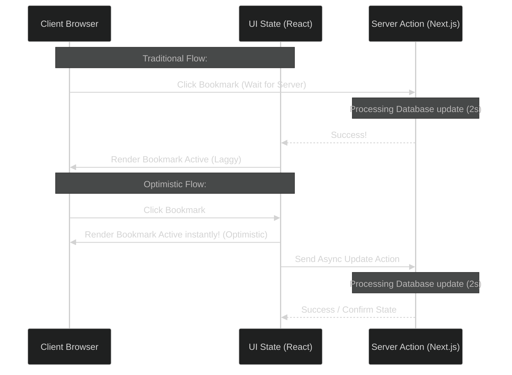

# Next.js 15 & React 19: Mastering the useOptimistic Hook

> [!NOTE]
> **📖 Article Overview**
> User experience is heavily defined by perceived latency. If a user clicks a "Like" button, toggles a bookmark, or submits a comment, waiting for a server round-trip to update the UI makes the application feel sluggish. React 19 introduces a native solution to this problem: the **`useOptimistic`** hook. When combined with Next.js 15 Server Actions, `useOptimistic` allows you to update the UI instantly under the assumption that the server request will succeed, while retaining the ability to roll back the state gracefully if the action fails. This article shows you how to implement this pattern.

---

## What is Optimistic UI?

Optimistic UI is a design pattern where the client interface behaves as if a server operation was successful before it actually completes. 

In standard architectures, updating state requires a round-trip:



If the server returns an error, the client UI rolls back the state changes immediately, prompting the user with an error notification.

---

## The `useOptimistic` Hook Mechanics

React 19's `useOptimistic` takes a base state and a reducer function, returning the current state (which may be optimistic) and a function to trigger the optimistic update:

```typescript
const [optimisticState, addOptimisticState] = useOptimistic(
  baseState,
  (state, updateValue) => {
    // Reducer logic to compute optimistic state
    return nextState;
  }
);
```

When an async Server Action starts, you call `addOptimisticState`. This applies the update instantly. Once the Server Action's promise resolves, React discards the optimistic state and reverts to the actual server-confirmed state.

---

## Implementation: Low-Latency Bookmark Component

Here is a complete, production-ready React 19 component that implements an optimistic bookmark toggle with a Next.js Server Action.

### 1. The Server Action (`actions.ts`)
This server-side function simulates database latency and randomly fails to demonstrate error recovery:

```typescript
// app/actions.ts
'use server';

export async function toggleBookmarkAction(id: string, currentState: boolean): Promise<{ success: boolean; newState: boolean }> {
  // Simulate network latency (e.g. 1.5 seconds)
  await new Promise(resolve => setTimeout(resolve, 1500));

  // Simulate a random database insertion failure (10% chance)
  const isFailure = Math.random() < 0.10;
  if (isFailure) {
    throw new Error('Database connection failed. Unable to update bookmark.');
  }

  // Return the toggled state
  return { success: true, newState: !currentState };
}
```

---

### 2. The Client Component (`BookmarkButton.tsx`)
The React component that uses `useOptimistic` to execute the state changes instantly:

```typescript
// app/BookmarkButton.tsx
'use client';

import { useOptimistic, startTransition, useState } from 'react';
import { toggleBookmarkAction } from './actions';

interface BookmarkProps {
  id: string;
  isBookmarkedInitial: boolean;
}

export default function BookmarkButton({ id, isBookmarkedInitial }: BookmarkProps) {
  // 1. Maintain the source-of-truth state confirmed by the server
  const [isBookmarked, setIsBookmarked] = useState<boolean>(isBookmarkedInitial);

  // 2. Define the optimistic hook
  const [optimisticBookmark, setOptimisticBookmark] = useOptimistic(
    isBookmarked,
    // Reducer: toggle the boolean state instantly
    (state: boolean, currentState: boolean) => !state
  );

  const handleToggle = async () => {
    // 3. Wrap the state trigger in startTransition (required by React 19)
    startTransition(async () => {
      // Set optimistic UI state instantly
      setOptimisticBookmark(isBookmarked);

      try {
        // Execute the server action
        const result = await toggleBookmarkAction(id, isBookmarked);
        
        // Update the source-of-truth state with the server response
        setIsBookmarked(result.newState);
      } catch (err: any) {
        console.error('Action failed, rolling back UI. Error:', err.message);
        alert(err.message || 'Something went wrong. Please try again.');
        // The optimisticState automatically reverts to the original isBookmarked value
      }
    });
  };

  return (
    <button
      onClick={handleToggle}
      className={`btn ${optimisticBookmark ? 'btn-primary' : 'btn-secondary'}`}
      style={{
        display: 'inline-flex',
        align_items: 'center',
        gap: '0.5rem',
        transition: 'background-color 0.2s'
      }}
      aria-label="Toggle Bookmark"
    >
      <i className={optimisticBookmark ? 'fa-solid fa-bookmark' : 'fa-regular fa-bookmark'}></i>
      {optimisticBookmark ? 'Bookmarked' : 'Bookmark'}
    </button>
  );
}
```

---

## Conclusion & Takeaways

The combination of Server Actions and `useOptimistic` provides desktop-like speeds in modern web interfaces:
* [ ] **Enforce `startTransition`**: Remember that `useOptimistic` triggers *must* be wrapped inside a React transition scope to run correctly.
* [ ] **Retain a base state**: Always maintain the server-confirmed state separately (using `useState`); the optimistic hook depends on this baseline to compute values and rollback.
* [ ] **Design error boundaries**: When actions fail, present user-friendly alerts or toast notifications explaining the rollback.
* [ ] **Prevent duplicate triggers**: Disable button clicks or throttle actions while the optimistic transition is pending to avoid double submission bugs.
