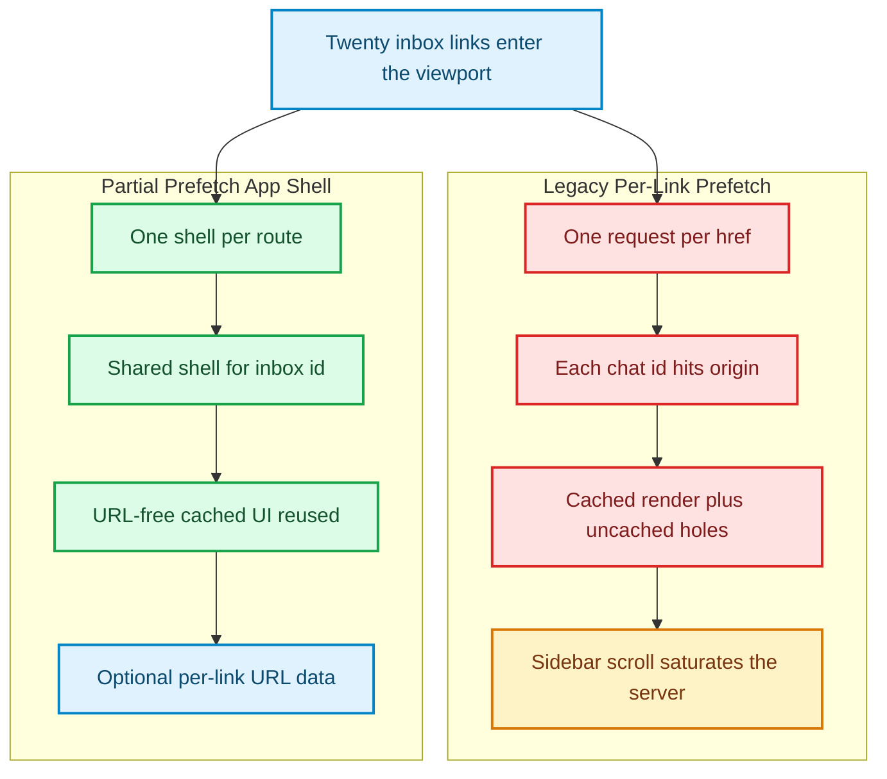
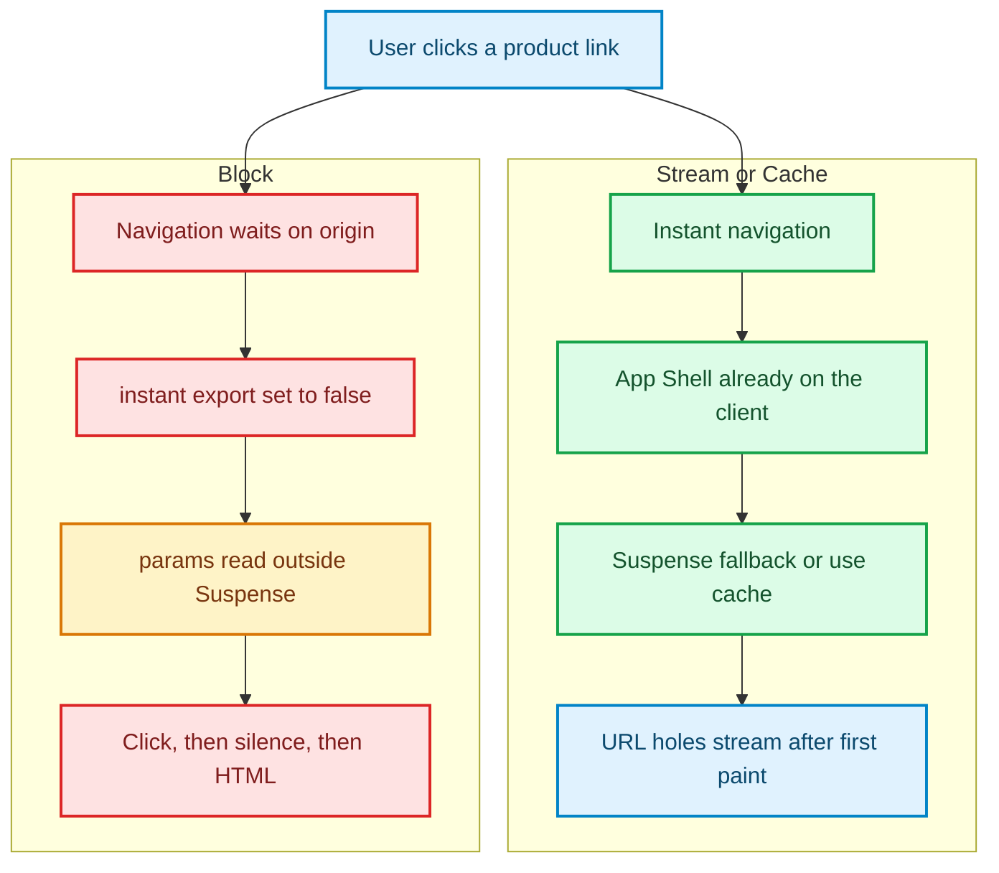

The Network tab on a production inbox should look like a conversation. On a Next.js 16.2 chat sidebar, it often looked like a distributed denial of service aimed at yourself.

Twenty `<Link>`s to `/inbox/[threadId]` entered the viewport. Twenty prefetch requests left the browser. Twenty of them asked the origin to render *the same route* with a different `threadId`, including dynamic holes that would be stale by the time anyone clicked [1]. Scroll the sidebar and the flurry repeated. The team that built the App Router had spent a year telling developers to stop hiding caches in `fetch`. The prefetch scheduler was still hiding a cache in the viewport.

Next.js 16.3, the current Active LTS line (16.3.4 as of this writing) [5], names the missing primitive and then opts you into it: **Instant Navigations**. Enable `cacheComponents` and `partialPrefetching`, and the client stops prefetching pages. It prefetches one **App Shell per route**—the URL-blind chrome plus cached subtrees that do not depend on `params`—and reuses that shell for every href that shares the pattern [1][2][3]. `prefetch={true}` is no longer “download the entire person.” It is “also resolve this link’s cached URL data,” at the cost of one extra origin invocation [3].

This is not Partial Prerendering. PPR is a *build-time* HTML document with holes. Instant Navigations is a *client-session* costume: a reusable route shell that can paint on click without waiting for the server to invent the next page from scratch [2][10]. Confusing the two is how teams will ship 16.3 and still await `params` at the top of `page.tsx`.

To see why twenty inbox links used to mean twenty origin trips, compare the schedulers in Figure 1.



*Figure 1: Legacy Cache Components prefetch fires once per href. Partial Prefetching extracts one App Shell per route and reuses it; `prefetch={true}` is the only remaining per-link origin tax. Adapted from the Next.js 16.3 Instant Navigations design [1][3].*

The left column is what senior engineers already knew was ridiculous. The right column is the SPA trick Next.js finally admitted it needed: download the *costume* of `/inbox/[threadId]` once, then stream the particular human who wears it.

---

## Costumes, not people

Single-page apps feel instant because the next view’s *code* is already on the client. The data may still be in flight. The chrome is not. Resource Hints called this out a decade ago: `prefetch` is a hint that a future navigation is likely, not a license to download every representation of a template [6]. HTTP caching (RFC 7234) already knew that a shared response cannot carry a URI-specific validator and remain reusable [7]. Next.js 16.2 violated both instincts at once. It treated each href as a distinct page even when the only difference was a dynamic segment.

Partial Prefetching restores the HTTP intuition inside a React Server Components tree. The App Shell is the representation that does **not** read `params` or `searchParams`. Session data from `cookies()` and `headers()` is allowed in, because it varies per *browser session*, not per link [3]. Cached subtrees join the shell only when their `cacheLife` `stale` window is at least five minutes—the `default`, `minutes`, `hours`, `days`, `weeks`, and `max` presets all qualify; `seconds` does not [4]. That threshold is not a taste. A prefetch that expires before the click is a prefetch that never happened, which is why `stale` also has a thirty-second floor for client reuse [4].

The flags are opt-in in 16.3 and scheduled to become defaults in a future major [1][2]:

```typescript
import type { NextConfig } from 'next';

const nextConfig: NextConfig = {
  cacheComponents: true,
  partialPrefetching: true,
};

export default nextConfig;
```

`cacheComponents` is the programming model: dynamic by default, `'use cache'` where you mean it, Suspense where you stream. `partialPrefetching` is the scheduler: one shell per route. Turning on the first without the second still leaves you in the leftover per-href world, which is why the adoption guide treats them as a pair [3].

Once both are on, a navigation has three honest outcomes. Stream with `<Suspense>`. Cache with `'use cache'`. Or admit you wanted the old website and export `instant = false`. Figure 2 is that fork.



*Figure 2: Instant Navigations require a client-resident App Shell. Blocking is explicit (`instant = false`) or accidental (`params` / `searchParams` outside Suspense). Source: Next.js 16.3 Instant Insights and Partial Prefetching [1][3][4].*

Interaction to Next Paint (INP) is a *click-to-paint* budget, not a TTFB budget [8]. A server-driven app can still win INP if the first pixels after the click are already in memory. That is the entire argument for shells. It is also why Instant Insights treats a slow navigation as a development error instead of a performance suggestion [1].

---

## What the shell is allowed to know

The failure mode is a one-line `await`. A product page that awaits `params` at the top of the default export ties the shell to one URL. Next.js will tell you, in development, that URL data escaped its Suspense boundary [3]. The fix is not a new cache API. It is the same React rule we already had: pass the promise down, await it behind a fallback [9].

```typescript
import { Suspense } from 'react';
import type { Metadata } from 'next';
import { cacheLife } from 'next/cache';
import { CatalogNav } from '@/components/catalog-nav';
import { ProductDetails } from '@/components/product-details';
import { DetailsSkeleton } from '@/components/details-skeleton';

export const metadata: Metadata = {
  title: 'Catalog',
};

type ProductPageProps = {
  params: Promise<{ sku: string }>;
};

async function loadCatalogChrome() {
  'use cache';
  cacheLife('hours');

  const controller = new AbortController();
  const timer = setTimeout(() => controller.abort(), 2_000);
  try {
    const res = await fetch('https://catalog.internal/v1/nav', {
      signal: controller.signal,
      headers: { accept: 'application/json' },
    });
    if (!res.ok) {
      throw new Error(`catalog nav failed: ${res.status}`);
    }
    return (await res.json()) as { departments: string[] };
  } finally {
    clearTimeout(timer);
  }
}

export default function CatalogSkuPage({ params }: ProductPageProps) {
  return (
    <div>
      <CatalogNav chrome={loadCatalogChrome()} />
      <Suspense fallback={<DetailsSkeleton />}>
        <ProductDetails params={params} />
      </Suspense>
    </div>
  );
}
```

`loadCatalogChrome` is allowed in the App Shell: it never reads the SKU, and `cacheLife('hours')` has a five-minute `stale` [4]. `ProductDetails` awaits `params` *inside* the boundary. Inventory that must stay fresh uses `cacheLife('seconds')` and therefore streams after navigation rather than riding the shell [4].

The child that *is* allowed to know the SKU looks like a normal Server Component with a timeout and a typed payload—not a `foo`:

```typescript
import { cacheLife } from 'next/cache';

type ProductRecord = {
  sku: string;
  title: string;
  listPriceCents: number;
};

export async function ProductDetails({
  params,
}: {
  params: Promise<{ sku: string }>;
}) {
  const { sku } = await params;

  async function loadProduct(id: string): Promise<ProductRecord> {
    'use cache';
    cacheLife('minutes');

    const res = await fetch(`https://catalog.internal/v1/products/${id}`, {
      signal: AbortSignal.timeout(1_500),
      headers: { accept: 'application/json' },
    });
    if (!res.ok) {
      throw new Error(`product ${id} failed: ${res.status}`);
    }
    return (await res.json()) as ProductRecord;
  }

  const product = await loadProduct(sku);
  return (
    <article>
      <h1>{product.title}</h1>
      <p>{(product.listPriceCents / 100).toFixed(2)}</p>
    </article>
  );
}
```

Keep `prefetch={true}` on the five SKUs the merchandising team insists must pop the title before the click. That is now an explicit origin tax: the shared shell plus one cached URL-specific hole per such link [3]. Real-time stock counts should not be on that list. A prefetch of live inventory is a lie you paid to tell.

A blog, or any route that should never flash a skeleton, opts out in the open:

```typescript
export const instant = false;
```

That is the honest Block path in Figure 2. Accidental Block is awaiting `params` in the page, or leaving `'use cache'` off a subtree you expected to be in the costume.

Adoption can be incremental. `export const prefetch = 'partial'` on a single `page.tsx` opts that destination in while the global flag is still off [3]. When every destination you care about is converted, enable `partialPrefetching` and delete the per-route exports with the `remove-partial-prefetch` codemod [3]. 16.3 also *inlines* tiny prefetches by default even without Partial Prefetching [2]. That is a byte-packing improvement. It is not a shell. Do not confuse a smaller request with a reusable costume.

---

## PPR is a build artifact. Instant Navigations are a client habit.

The catalog already has the PPR essay: a static HTML shell compiled at `next build`, with Suspense holes that stream on a single HTTP connection [10]. Instant Navigations reuse that mental model on the *client* after the first document. The App Shell is not necessarily the PPR HTML. It is whatever the router can paint without a network hop on the *next* click—Suspense fallbacks, `'use cache'` output with a long enough `stale`, session chrome [1][4].

The Great Un-Caching still holds. Next.js 15 inverted `fetch` to `no-store`. Next.js 16 made caching a directive [11][12]. Instant Navigations do not secretly restore `force-cache`. They make the *client* cache of a *named* shell a first-class outcome of `'use cache'` and Suspense. If you wanted implicit Data Cache back, this is not it. If you wanted SPA-speed clicks without shipping a client page graph, this is the LTS answer.

Vercel measured the difference on v0: Instant Insights pointed at routes that still blocked, then navigation times fell as shells landed [1]. They have not published the raw traces as a public harness. We can still reproduce the *scheduler arithmetic* they described.

---

## Twenty links, one route: the request that should not exist

The harness in `benchmarks/partial-prefetch-shell/prefetch_model.mjs` is an accounting model of the documented 16.3 scheduler, not a claim that we instrumented `next start`. It assigns 6,144 bytes to a shared App Shell (chrome plus Suspense fallbacks) and 41,984 bytes to a URL-specific thread hole, then counts requests the way the docs specify: one shell per unique route pattern; `prefetch={true}` adds a per-link URL fetch [1][3].

Hardware: Node.js v22.14.0, linux x64. Payload sizes are representative RSC JSON, labeled as such.

| Viewport | Legacy requests / bytes | Partial Prefetch requests / bytes | Request reduction |
|---|---|---|---|
| 20 links, 1 `/inbox/[threadId]` route | 20 / 962,560 | **1 / 6,144** | **95%** |
| Same, plus 5 `prefetch={true}` | 20 / 962,560 | **6 / 216,064** | **70%** |
| 20 links, 20 distinct routes | 20 / 962,560 | 20 / 122,880 | 0% requests, **87%** bytes |

The interesting row is the third. Partial Prefetching does not invent request coalescing across *different* route patterns. Twenty unique routes still mean twenty shells. They are just smaller than twenty full pages, which is why bytes still drop. The 95% request collapse only appears when the UI is honest about sharing a template—the inbox, the catalog SKU, the `/chat/[id]` list that started this essay.

Prefetch is disabled in `next dev`. Instant Insights, Navigation Inspector, and the Playwright `instant()` helper exist so you do not discover the costume by staring at a production Network tab [1][2]. The helper asserts what must be visible *before* the remaining network, which is the only regression test that matches the feature:

```typescript
import { expect, test } from '@playwright/test';
import { instant } from '@next/playwright';

test('catalog title paints from the App Shell', async ({ page }) => {
  await page.goto('/catalog/sku-steel-tumbler');

  await instant(page, async () => {
    await page.click('a[href="/catalog/sku-glass-carafe"]');
    await expect(page.locator('h1')).toContainText('Glass Carafe');
    await expect(page.getByText('Checking inventory')).toBeVisible();
  });

  await expect(page.getByText(/in stock/i)).toBeVisible();
});
```

Run it against a production build. If a future refactor awaits `params` in the layout, this test fails for the right reason: the costume learned a name it was not allowed to know.

---

## The culture war, encoded as a compiler error

For a decade, “feels like a website” was an insult and “feels like an app” was a budget. Server Components were supposed to end that argument by shipping less JavaScript. They also reintroduced the click, then the wait, then the HTML—the MPA cadence that product people had spent years extinguishing. Instant Navigations do not convert Next.js into a client router. They encode the SPA *habit* (paint a shell, then fill it) as a development-time invariant [1]. Slow navigation becomes an error with a fix card. Agents get a skill. Playwright gets `instant()`.

That is a cultural tell. The Next.js team no longer trusts `loading.tsx` folklore. They trust a shell the compiler can see. Interaction to Next Paint will not wait for us to remember a file in `app/` [8].

The antithesis is still available, and it is not a strawman. A newspaper that must never flash a skeleton *should* `export const instant = false`. A checkout that must not paint a cached total *should* keep that subtree out of `'use cache'`. Partial Prefetching is a bad idea when every href is a genuinely different document. Figure 1’s right column assumes you have a *route*, not twenty unrelated URLs. If your information architecture has no templates, you do not have shells. You have a website. Serve it like one.

---

You are no longer prefetching pages. You are prefetching costumes. Name them with `'use cache'` and Suspense. Keep `params` behind the curtain. Charge `prefetch={true}` only for the links that deserve a private rehearsal. And when a navigation should wait on the origin, say so in English: `instant = false`. The Network tab will finally look like a conversation again.

---

## References & Further Reading

1. **Vercel Engineering (2026)**. *Instant Navigations*. Next.js Blog. [https://nextjs.org/blog/next-16-3-instant-navigations](https://nextjs.org/blog/next-16-3-instant-navigations)
2. **Vercel Engineering (2026)**. *Next.js 16.3*. Next.js Blog. [https://nextjs.org/blog/next-16-3](https://nextjs.org/blog/next-16-3)
3. **Vercel Documentation (2026)**. *Adopting Partial Prefetching*. Next.js Docs. [https://nextjs.org/docs/app/guides/adopting-partial-prefetching](https://nextjs.org/docs/app/guides/adopting-partial-prefetching)
4. **Vercel Documentation (2026)**. *cacheLife*. Next.js Docs. [https://nextjs.org/docs/app/api-reference/functions/cacheLife](https://nextjs.org/docs/app/api-reference/functions/cacheLife)
5. **Vercel (2026)**. *Next.js Support Policy*. [https://nextjs.org/support-policy](https://nextjs.org/support-policy)
6. **Grigorik, I. (2014)**. *Resource Hints*. W3C Working Draft. [https://www.w3.org/TR/resource-hints/](https://www.w3.org/TR/resource-hints/)
7. **Fielding, R., Nottingham, M., and Reschke, J. (2014)**. *Hypertext Transfer Protocol (HTTP/1.1): Caching*. RFC 7234. [https://datatracker.ietf.org/doc/html/rfc7234](https://datatracker.ietf.org/doc/html/rfc7234)
8. **Google Chrome Team (2024)**. *Interaction to Next Paint (INP)*. web.dev. [https://web.dev/articles/inp](https://web.dev/articles/inp)
9. **React Team (2025)**. *`<Suspense>`*. React Documentation. [https://react.dev/reference/react/Suspense](https://react.dev/reference/react/Suspense)
10. **Khan, A. (2026)**. *Partial Prerendering & dynamicIO: The Anatomy of a Hybrid HTTP Stream*. [https://akmalkhaniub.github.io/blog/partial-prerendering-dynamicio-hybrid-http-streams-nextjs.html](https://akmalkhaniub.github.io/blog/partial-prerendering-dynamicio-hybrid-http-streams-nextjs.html)
11. **Khan, A. (2026)**. *The Great Un-Caching: Why Next.js 15 Inverted Its Most Controversial Default*. [https://akmalkhaniub.github.io/blog/the-great-un-caching-nextjs-15-caching-architecture-defaults.html](https://akmalkhaniub.github.io/blog/the-great-un-caching-nextjs-15-caching-architecture-defaults.html)
12. **Khan, A. (2026)**. *Hidden Traps in Next.js App Router Caching*. [https://akmalkhaniub.github.io/blog/nextjs-app-router-caching-traps.html](https://akmalkhaniub.github.io/blog/nextjs-app-router-caching-traps.html)
