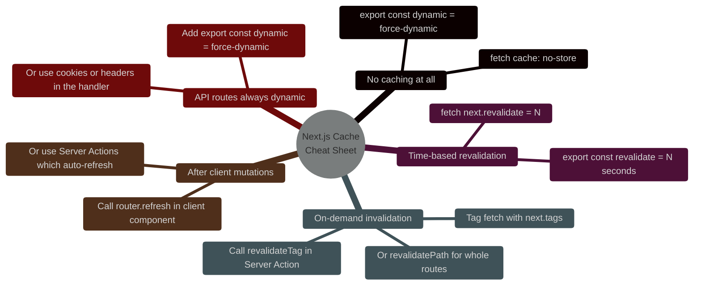

# The Hidden Traps in Next.js App Router Caching

> [!NOTE]
> **📖 Article Overview**
> Next.js App Router introduced the most aggressive caching system in modern web development — and the most confusing. Four overlapping cache layers (Request Memoisation, Data Cache, Full Route Cache, Router Cache) interact with each other in ways that produce baffling bugs: API routes returning stale data after deployments, `fetch()` calls mysteriously deduplicating, dynamic pages serving cached HTML to users with different sessions, and `revalidate` not triggering when you expect it to. This article maps all four caches, diagrams their interaction, and provides exact `export` directives and fetch options to make caching behave predictably in production.

---

## The Four Caches You Didn't Know You Had

When you call `fetch()` in a Next.js App Router Server Component, your request passes through up to four cache layers before hitting your origin. Each layer has different scope, TTL, and invalidation rules:

```mermaid
%%{init: {'theme': 'dark', 'themeVariables': { 'primaryColor': '#38bdf8', 'primaryTextColor': '#f3f4f6', 'primaryBorderColor': '#7dd3fc', 'lineColor': '#38bdf8', 'secondaryColor': '#111827', 'tertiaryColor': '#0f172a'}}}%%
flowchart LR
    R[Server Component<br/>fetch call] --> C1

    subgraph C1 [Cache 1: Request Memoisation]
        M1[Deduplicates identical<br/>fetch() calls in same render]
        M1 --> M1D[Scope: single request<br/>TTL: request lifetime]
    end

    C1 --> C2

    subgraph C2 [Cache 2: Data Cache]
        M2[Persistent fetch() cache<br/>across requests & deployments]
        M2 --> M2D[Scope: server-wide<br/>TTL: until revalidated]
    end

    C2 --> C3

    subgraph C3 [Cache 3: Full Route Cache]
        M3[Pre-rendered HTML<br/>cached at build time]
        M3 --> M3D[Scope: static pages only<br/>TTL: until next build]
    end

    C3 --> C4

    subgraph C4 [Cache 4: Router Cache]
        M4[Client-side prefetch<br/>cache in browser]
        M4 --> M4D[Scope: browser session<br/>TTL: 30s static / 5min dynamic]
    end

    C4 --> O[Origin / DB]

    style C1 fill:#0f172a,stroke:#38bdf8,stroke-width:2px
    style C2 fill:#0f172a,stroke:#a855f7,stroke-width:2px
    style C3 fill:#0f172a,stroke:#10b981,stroke-width:2px
    style C4 fill:#0f172a,stroke:#f59e0b,stroke-width:2px
```

---

## Trap 1: `fetch()` Is Cached Forever By Default

**Symptom**: You update your database. You deploy. Users still see old data. `console.log` in the Server Component confirms new data exists — but the page renders old HTML.

**Root cause**: Next.js App Router **caches all `fetch()` calls by default** (`cache: 'force-cache'`) — indefinitely, across deployments, until explicitly revalidated. This is the opposite of browser fetch behaviour.

```typescript
// ❌ This data is cached FOREVER — survives deployments
async function getProducts() {
  const res = await fetch('https://api.example.com/products');
  return res.json();
}

// ✅ Option A: No cache — always fresh (SSR behaviour)
async function getProducts() {
  const res = await fetch('https://api.example.com/products', {
    cache: 'no-store'  // ← Opt out of Data Cache entirely
  });
  return res.json();
}

// ✅ Option B: Time-based revalidation (ISR behaviour)
async function getProducts() {
  const res = await fetch('https://api.example.com/products', {
    next: { revalidate: 60 }  // ← Re-fetch at most every 60 seconds
  });
  return res.json();
}

// ✅ Option C: Tag-based revalidation (on-demand)
async function getProducts() {
  const res = await fetch('https://api.example.com/products', {
    next: { tags: ['products'] }  // ← Invalidate via revalidateTag('products')
  });
  return res.json();
}
```

**The key mental model**: In Next.js App Router, `fetch()` behaves like `fetch()` + `localStorage` — it caches on the server by default. You must **opt out** of caching, not opt in.

---

## Trap 2: `export const dynamic = 'force-dynamic'` vs `cache: 'no-store'`

**Symptom**: You add `cache: 'no-store'` to your fetch but the page still serves stale HTML. Or you add `dynamic = 'force-dynamic'` and your page is suddenly 10× slower.

**Root cause**: These two directives control **different cache layers**:

```typescript
// Controls the DATA CACHE (fetch() caching)
const res = await fetch(url, { cache: 'no-store' });
// → Prevents this specific fetch from being cached
// → Does NOT prevent the Full Route Cache from caching the rendered HTML

// Controls the FULL ROUTE CACHE (pre-rendered HTML)
export const dynamic = 'force-dynamic';
// → Forces the entire route to render on every request (SSR)
// → Implies cache: 'no-store' for all fetch() calls in the route
// → Performance cost: no static HTML served from edge

// Controls the FULL ROUTE CACHE via time-based revalidation (ISR)
export const revalidate = 60;
// → Page HTML is regenerated at most every 60 seconds
// → Individual fetch() calls can have their own revalidate values
// → The route revalidate is the MINIMUM of all values in the route

// What you usually actually want for a dynamic data page:
export const dynamic = 'force-dynamic';
// Then each fetch can still have its OWN revalidation strategy
```

**Decision matrix:**

| Scenario | Correct Directive |
|----------|------------------|
| Marketing page (rarely changes) | `export const revalidate = 3600` |
| Product catalogue (hourly updates) | `export const revalidate = 60` |
| User dashboard (per-user data) | `export const dynamic = 'force-dynamic'` |
| Real-time LLM streaming | `export const dynamic = 'force-dynamic'` |
| Admin page (no caching ever) | `export const dynamic = 'force-dynamic'` + `cache: 'no-store'` |

---

## Trap 3: Request Memoisation Deduplication Across Components

**Symptom**: You call the same API in three different Server Components that render on the same page. You expect three API calls. You see one in your server logs. Sometimes this is correct, sometimes it returns wrong data to the wrong component.

**Root cause**: Next.js **automatically deduplicates identical `fetch()` calls** within a single render cycle (Request Memoisation). This is good for performance but can bite you when:

```typescript
// These three components all fetch the same URL
// → Next.js makes ONE network request and shares the response
// ✅ This is intended and correct for READ operations

// app/dashboard/page.tsx
async function UserGreeting() {
  const user = await fetch('/api/user/me');         // ← First call: hits network
  return <p>Hello {user.name}</p>;
}

async function UserStats() {
  const user = await fetch('/api/user/me');          // ← Deduplicated: same response
  return <p>Posts: {user.postCount}</p>;
}

// ❌ But deduplication breaks for mutations or non-idempotent operations
async function LogAndFetch() {
  // If /api/log-visit has side effects (analytics, rate limiting),
  // deduplication means it only runs ONCE even if called from 3 components
  await fetch('/api/log-visit', { method: 'POST' }); // ← Only executes once!
}

// ✅ Opt out of deduplication for non-idempotent calls
async function LogVisit() {
  await fetch('/api/log-visit', {
    method: 'POST',
    cache: 'no-store'  // ← 'no-store' opts out of request memoisation too
  });
}
```

---

## Trap 4: Router Cache Serves Stale Pages for 5 Minutes

**Symptom**: A user updates their profile. They navigate away and back. They see their old profile data. Hard refresh fixes it. Happens only in navigation — not on initial load.

**Root cause**: Next.js Router Cache stores pre-fetched page payloads **client-side in the browser**. Dynamic routes are cached for **30 seconds**, static routes for **5 minutes**. `router.refresh()` is required to invalidate it after a mutation.

```typescript
// app/profile/page.tsx — User sees stale data for up to 30s after mutation
export default async function ProfilePage() {
  const profile = await getProfile();  // Server-fetched — correct on load
  return <ProfileForm profile={profile} />;
}

// ─── The fix: invalidate Router Cache after Server Actions ───
'use server'
import { revalidatePath, revalidateTag } from 'next/cache';

async function updateProfile(formData: FormData) {
  await db.profile.update({ data: Object.fromEntries(formData) });
  
  // Invalidate Full Route Cache + Data Cache for this path
  revalidatePath('/profile');           // ← Clears server-side caches
  
  // The Router Cache (client-side) is cleared automatically
  // when revalidatePath is called from a Server Action
}

// ─── For client-side navigation after mutations ───
'use client'
import { useRouter } from 'next/navigation';

function ProfileUpdateButton() {
  const router = useRouter();
  
  const handleUpdate = async () => {
    await updateProfileAction(formData);
    router.refresh();  // ← Forces Router Cache invalidation for current path
  };
  
  return <button onClick={handleUpdate}>Save Profile</button>;
}
```

---

## Trap 5: API Route Handlers Are Cached Too

**Symptom**: Your `app/api/data/route.ts` GET handler returns the same response for days, even though the database has new data. You assumed API routes are always dynamic.

**Root cause**: `GET` Route Handlers are **opted into Full Route Cache** if they don't use any dynamic APIs (cookies, headers, searchParams). They behave like static pages.

```typescript
// ❌ This GET handler IS cached — responses are static
// app/api/products/route.ts
export async function GET() {
  const products = await db.product.findMany();
  return Response.json(products);
  // ← Next.js sees no dynamic API usage → caches the response
}

// ✅ Option A: Use dynamic APIs to force dynamic rendering
export async function GET(request: Request) {
  const { searchParams } = new URL(request.url);  // ← Using searchParams = dynamic
  const products = await db.product.findMany();
  return Response.json(products);
}

// ✅ Option B: Explicit opt-out
export const dynamic = 'force-dynamic';

export async function GET() {
  const products = await db.product.findMany();
  return Response.json(products);
}

// ✅ Option C: Set Cache-Control header
export async function GET() {
  const products = await db.product.findMany();
  return Response.json(products, {
    headers: {
      'Cache-Control': 'no-store, max-age=0'
    }
  });
}
```

---

## Trap 6: `revalidateTag` Only Works If the Tag Was Set on the Fetch

**Symptom**: You call `revalidateTag('products')` in a Server Action. Nothing changes. The page still serves cached data.

**Root cause**: `revalidateTag` only invalidates fetch requests that were **tagged with that exact string** at call time. If you forgot to set the tag on the fetch, the invalidation is a no-op.

```typescript
// ❌ No tag — revalidateTag('products') will NOT affect this
async function getProducts() {
  const res = await fetch('/api/products');  // No tag set!
  return res.json();
}

// ✅ Tag the fetch — now revalidateTag('products') will bust this cache
async function getProducts() {
  const res = await fetch('/api/products', {
    next: { tags: ['products', 'inventory'] }  // Multiple tags supported
  });
  return res.json();
}

// Server Action that invalidates correctly
'use server'
import { revalidateTag } from 'next/cache';

async function addProduct(data: ProductData) {
  await db.product.create({ data });
  revalidateTag('products');   // ← Now correctly busts the tagged fetch cache
  revalidateTag('inventory');  // ← Also busts the second tag
}
```

---

## The Cache Cheat Sheet



---

## 🏁 Conclusion & Key Takeaways

Next.js App Router caching is powerful when understood and dangerous when not. The core mental shift: **everything is cached by default** — you must explicitly opt out of caching for dynamic data, not opt in.

*   **Learn the four cache layers by name** — Request Memoisation, Data Cache, Full Route Cache, Router Cache. Each has different scope and invalidation mechanisms. Confusing them is the root cause of 90% of Next.js caching bugs.
*   **Add `export const dynamic = 'force-dynamic'`** to any route that serves per-user data, reads cookies, or streams LLM responses.
*   **Always tag your fetches** if you plan to invalidate them programmatically — `revalidateTag` is a no-op without the corresponding `next: { tags }` on the fetch.

---

### Research References & Resources
*   **Next.js Caching Documentation**: [How Next.js caching works](https://nextjs.org/docs/app/building-your-application/caching)
*   **Next.js Data Fetching Patterns**: [Fetching, Caching, and Revalidating](https://nextjs.org/docs/app/building-your-application/data-fetching/fetching-caching-and-revalidating)
*   **Next.js Server Actions**: [Mutations and Revalidation](https://nextjs.org/docs/app/building-your-application/data-fetching/server-actions-and-mutations)
