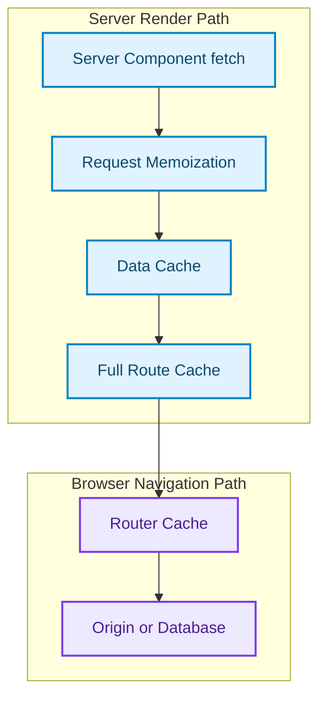
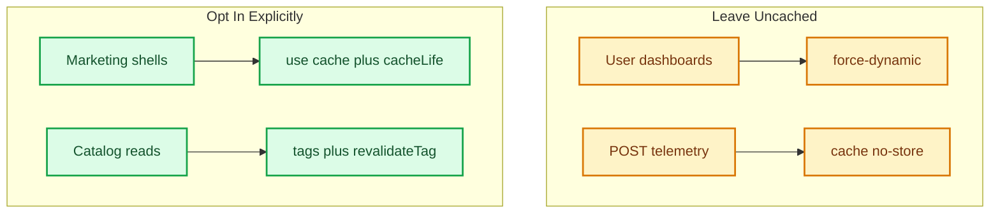

# The Hidden Traps in Next.js App Router Caching

> [!NOTE]
> **Update (September 2026)**: Next.js 16.3 is Active LTS. Next.js 15 is Maintenance LTS until 21 October 2026. Next.js 14 reached EOL on 26 October 2025. This article keeps the four-layer cache map, but **does not** treat Next.js 13/14 `fetch` defaults as current. For the 15 inversion itself, see [The Great Un-Caching](the-great-un-caching-nextjs-15-caching-architecture-defaults.html) [1][2].

> [!NOTE]
> **Article Overview**
> App Router still has four overlapping cache layers: Request Memoization, Data Cache, Full Route Cache, and Router Cache. The dangerous part is not that they exist. It is that **the default for `fetch` flipped in Next.js 15** (`no-store`) after two years of `force-cache`, and Next.js 16 made opt-in caching explicit with `'use cache'` / `cacheLife` [1][3]. Mixing those eras produces stale carts, silent no-op `revalidateTag` calls, and API routes that freeze GET responses.

---

## The Four Caches You Still Have to Name

A Server Component `fetch` can still pass through four layers. Each layer has a different scope, TTL, and invalidation API. Confusing them is the root cause of most App Router caching bugs [3]:



| Layer | Where it lives | Next.js 14 default | Next.js 15 / 16 default |
|---|---|---|---|
| Request Memoization | Per-request server memory | Dedup identical `fetch` in one render | Unchanged |
| Data Cache | Persistent server store | `fetch` → `force-cache` | `fetch` → `no-store`; opt in with `cache: 'force-cache'`, tags, or `'use cache'` |
| Full Route Cache | Static HTML / RSC payload | Static when no dynamic APIs | Dynamic routes stay dynamic unless you opt into caching |
| Router Cache | Browser memory | 30s dynamic / 5min static | Dynamic `staleTime` 0 [1] |

---

## Trap 1: Copying Next.js 14 `fetch` Defaults into 15/16

**Symptom**: A 2024 blog or internal snippet says "App Router caches `fetch` forever." You ship that mental model on Next.js 15 or 16. Either you over-fetch the database on every request, or you add `force-cache` blindly and recreate the stale-cart bugs of 2023.

**Root cause**: Next.js 13/14 patched `fetch` to `cache: 'force-cache'` by default. Next.js 15 inverted that to `no-store`. Next.js 16 kept the uncached default and added the `'use cache'` directive for explicit, profile-based caching [1][3].

```typescript
type ProductRecord = {
  sku: string;
  inventory: number;
  updatedAt: string;
};

// Next.js 14 (EOL): this was cached indefinitely.
// Next.js 15/16: this hits the origin on every render unless you opt in.
async function getCatalog(): Promise<ProductRecord[]> {
  const res = await fetch('https://api.catalog.internal/products', {
    signal: AbortSignal.timeout(2_000)
  });
  if (!res.ok) {
    throw new Error(`catalog_fetch_failed:${res.status}`);
  }
  return res.json();
}

// Next.js 15 explicit Data Cache (still valid)
async function getMarketingCatalog(): Promise<ProductRecord[]> {
  const res = await fetch('https://api.catalog.internal/products', {
    cache: 'force-cache',
    next: { revalidate: 60, tags: ['products'] },
    signal: AbortSignal.timeout(2_000)
  });
  if (!res.ok) {
    throw new Error(`catalog_fetch_failed:${res.status}`);
  }
  return res.json();
}
```

On Next.js 16, prefer the cache directive instead of hoping patched `fetch` options survive a compiler rewrite [3]:

```typescript
import { cacheLife, cacheTag } from 'next/cache';

async function getMarketingCatalog(): Promise<ProductRecord[]> {
  'use cache';
  cacheLife('minutes');
  cacheTag('products');

  const res = await fetch('https://api.catalog.internal/products', {
    signal: AbortSignal.timeout(2_000)
  });
  if (!res.ok) {
    throw new Error(`catalog_fetch_failed:${res.status}`);
  }
  return res.json();
}
```

**Mental model**: caching is now an explicit boundary. Uncached-by-default is the 15/16 contract. Opt in on purpose.

---

## Trap 2: `dynamic = 'force-dynamic'` vs `cache: 'no-store'`

**Symptom**: You add `cache: 'no-store'` to one fetch, but the page HTML still looks frozen. Or you stamp `force-dynamic` on a marketing page and watch TTFB collapse.

**Root cause**: those knobs address **different layers**. `cache: 'no-store'` (or omitting cache on 15/16) skips the Data Cache for that fetch. `export const dynamic = 'force-dynamic'` disables the Full Route Cache for the whole route [3].

```typescript
// Data Cache only — this fetch is fresh. The route HTML may still be static
// if the rest of the tree is cacheable.
const res = await fetch(url, { cache: 'no-store' });

// Full Route Cache — every request re-renders the route.
export const dynamic = 'force-dynamic';

// Time-based Full Route Cache (ISR).
export const revalidate = 60;
```

| Scenario | Correct boundary |
|---|---|
| Marketing page, hourly copy | `'use cache'` + `cacheLife('hours')` or `revalidate = 3600` |
| Product catalogue, minute-level stock | tagged Data Cache + `revalidateTag('products')` |
| User dashboard, cookies, session | `dynamic = 'force-dynamic'` (or a `cookies()` read) |
| LLM token stream | `dynamic = 'force-dynamic'` and no Full Route Cache |
| Admin tools | `force-dynamic` plus no shared Data Cache |

---

## Trap 3: Request Memoization Deduplicates Side Effects

**Symptom**: three Server Components call the same URL. You expect three origin hits. Logs show one. That is correct for reads and disastrous for POSTs that increment counters.

**Root cause**: Request Memoization still deduplicates identical `fetch` calls inside a single render. It is not the Data Cache. It dies when the request ends [3].

```typescript
async function UserGreeting() {
  const user = await fetchUserMe(); // first call: network
  return <p>Hello {user.name}</p>;
}

async function UserStats() {
  const user = await fetchUserMe(); // memoized: same render, same URL
  return <p>Posts: {user.postCount}</p>;
}

// Side-effecting fetch must not rely on GET-by-URL identity
async function logVisit(sessionId: string) {
  await fetch('https://api.telemetry.internal/visit', {
    method: 'POST',
    cache: 'no-store',
    headers: { 'content-type': 'application/json' },
    body: JSON.stringify({ sessionId }),
    signal: AbortSignal.timeout(1_000)
  });
}
```

---

## Trap 4: Router Cache and the Back Button

**Symptom**: profile save succeeds. Client navigation back to `/profile` shows the old name. Hard refresh is fine.

**Root cause**: Router Cache is a **browser** RSC payload cache. Next.js 14 used a 30-second dynamic stale window. Next.js 15 set dynamic `staleTime` to 0, but static payloads can still linger, and a Server Action that forgets `revalidatePath` will not bust the Full Route Cache [1][3].

```typescript
'use server';
import { revalidatePath, revalidateTag } from 'next/cache';

export async function updateProfile(formData: FormData) {
  const name = String(formData.get('name') ?? '').trim();
  if (!name) {
    throw new Error('profile_name_required');
  }
  await db.profile.update({ data: { name } });
  revalidatePath('/profile');
  revalidateTag('profile');
}
```

For client transitions after a mutation, `router.refresh()` still forces the current segment to refetch.

---

## Trap 5: GET Route Handlers Can Still Freeze

**Symptom**: `app/api/products/route.ts` returns yesterday's inventory. You assumed Route Handlers were always dynamic.

**Root cause**: a GET handler with no dynamic APIs (`cookies`, `headers`, `searchParams`, `connection`) can still be treated as static. Next.js 15 uncached `fetch`, but it did not make every Route Handler a live origin probe [1][3].

```typescript
export const dynamic = 'force-dynamic';

export async function GET() {
  const products = await db.product.findMany();
  return Response.json(products, {
    headers: { 'Cache-Control': 'no-store' }
  });
}
```

---

## Trap 6: `revalidateTag` Is a No-Op Without a Matching Tag

**Symptom**: `revalidateTag('products')` runs. The page does not change.

**Root cause**: invalidation only matches fetches (or `'use cache'` functions) that **declared that tag**. An untagged `fetch` cannot be busted by name [3].

```typescript
async function getProducts() {
  const res = await fetch('https://api.catalog.internal/products', {
    next: { tags: ['products', 'inventory'] },
    signal: AbortSignal.timeout(2_000)
  });
  if (!res.ok) throw new Error(`catalog_fetch_failed:${res.status}`);
  return res.json();
}

'use server';
import { revalidateTag } from 'next/cache';

export async function addProduct(sku: string) {
  await db.product.create({ data: { sku } });
  revalidateTag('products');
  revalidateTag('inventory');
}
```

---

## Cache Boundary Cheat Sheet



---

## Closing

App Router caching did not get simpler. It got **honest**. Next.js 13 tried to make the edge look free. Next.js 15 admitted that silent `force-cache` was a production incident generator. Next.js 16 kept that inversion and asked you to name the cache with `'use cache'` instead of hoping a patched `fetch` would remember your intent [1][2][3].

Name the layer. Opt in on purpose. Tag anything you plan to invalidate.

---

## References & Further Reading

1. **Vercel Engineering (2024)**. *Next.js 15*. Next.js Blog. [https://nextjs.org/blog/next-15](https://nextjs.org/blog/next-15)
2. **Vercel Engineering (2025)**. *Next.js 16*. Next.js Blog. [https://nextjs.org/blog/next-16](https://nextjs.org/blog/next-16)
3. **Vercel Documentation (2026)**. *Caching in Next.js*. Next.js Docs. [https://nextjs.org/docs/app/getting-started/caching](https://nextjs.org/docs/app/getting-started/caching)
4. **Fielding, R., Nottingham, M., and Reschke, J. (2014)**. *Hypertext Transfer Protocol (HTTP/1.1): Caching*. RFC 7234. [https://datatracker.ietf.org/doc/html/rfc7234](https://datatracker.ietf.org/doc/html/rfc7234)
5. **Khan, A. (2026)**. *The Great Un-Caching: Why Next.js 15 Inverted Its Most Controversial Default*. [https://akmalkhaniub.github.io/blog/the-great-un-caching-nextjs-15-caching-architecture-defaults.html](https://akmalkhaniub.github.io/blog/the-great-un-caching-nextjs-15-caching-architecture-defaults.html)
