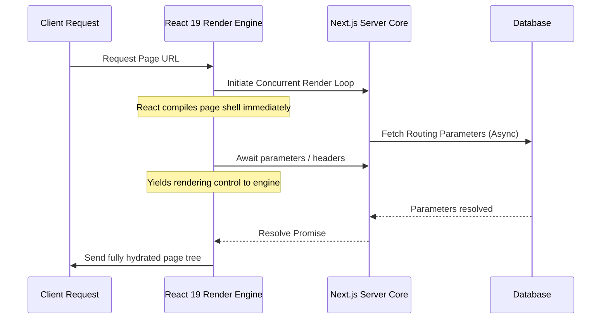

# The Async Request API Shift: Adapting to React 19's Non-Blocking Lifecycles

In Next.js 15 and 16, a major breaking change required developers to refactor how they access request-specific properties on the server: properties like dynamic routing parameters (`params`), query parameters (`searchParams`), cookies (`cookies()`), and headers (`headers()`) transitioned into **asynchronous** calls.

This article details the architectural reasons behind this change, why it is critical for React 19's concurrent rendering capabilities, and how to safely implement these changes in your production codebase.

---

## 📖 The Architectural Catalyst: Concurrent Rendering

In earlier versions of Next.js, parameters and headers were synchronous:
```typescript
// Legacy Next.js 14 code
export default function Page({ params }: { params: { id: string } }) {
  const id = params.id; // Synchronous access
  return <div>Product ID: {id}</div>;
}
```

While convenient, synchronous property access created a serious bottleneck. If React 19 attempts to compile and render a page concurrently, it needs to evaluate components *before* request parameters are fully loaded. Synchronous access forces React to block and halt component compilation until request details are available.

By converting these APIs into asynchronous promises, Next.js allows React 19 to initiate render loops concurrently. If dynamic parameters are required, the component yields execution back to the React scheduler via Promise resolution, enabling smooth, non-blocking rendering.



---

## 🛠️ Implementing Asynchronous Parameters in Production

### 1. Migrating Dynamic Route Layouts
In your dynamic page components, `params` and `searchParams` must be declared as Promises and awaited:

```typescript
interface PageProps {
  params: Promise<{ categoryId: string }>;
  searchParams: Promise<{ sort?: string; page?: string }>;
}

export default async function CategoryPage({ params, searchParams }: PageProps) {
  // Await the parameters concurrently to minimize rendering delays
  const [resolvedParams, resolvedSearchParams] = await Promise.all([
    params,
    searchParams,
  ]);

  const { categoryId } = resolvedParams;
  const sort = resolvedSearchParams.sort || 'default';
  const page = parseInt(resolvedSearchParams.page || '1', 10);

  return (
    <main className="container py-8">
      <h1>Category ID: {categoryId}</h1>
      <p>Sorting applied: {sort}</p>
      <p>Viewing Page: {page}</p>
    </main>
  );
}
```

### 2. Accessing Request Headers and Cookies Asynchronously
In Next.js 15/16, calling `cookies()` or `headers()` returns a Promise. Awaiting them explicitly is required:

```typescript
import { cookies, headers } from 'next/headers';

export async function DashboardWidget() {
  // 1. Fetch headers and cookies concurrently
  const [cookieStore, reqHeaders] = await Promise.all([
    cookies(),
    headers(),
  ]);

  const sessionId = cookieStore.get('session_id')?.value;
  const userAgent = reqHeaders.get('user-agent') || 'Unknown';

  if (!sessionId) {
    return <div className="widget-alert">Unauthorized access</div>;
  }

  return (
    <div className="widget-card">
      <h3>Active Session Details</h3>
      <p>Session ID: <code>{sessionId}</code></p>
      <p>Browser User Agent: {userAgent}</p>
    </div>
  );
}
```

---

## 🚀 Transitioning Production Repositories Safely

To migrate large codebases with hundreds of routes to the new async paradigms, production teams rely on codemods to automate the update cycle.

> [!TIP]
> **Use automated Codemods**: Instead of manually editing every route file, run `@next/codemod` via the CLI to parse AST syntax trees and rewrite layout properties automatically.
> ```bash
> npx @next/codemod@latest next-async-request-api .
> ```

> [!IMPORTANT]
> **Handling TypeScript Type Errors**: Ensure your type definitions for layout props are updated globally. Dynamic components should strictly expect `Promise<{ ... }>` rather than direct objects to satisfy compiler verifications.

---

## 📈 Production Adoption Case Studies
High-traffic applications have adopted the async request APIs to maximize server efficiency:
1. **Parallel Layout Streaming**: Sub-sections of dashboards (sidebar, top bar, user status) fetch headers and cookies in parallel, avoiding waterfall rendering bottlenecks.
2. **Predictable Edge Routing**: Edge middleware and layout renderers compile static page shells instantly, resolving route query parameters concurrently as dynamic content finishes loading.
