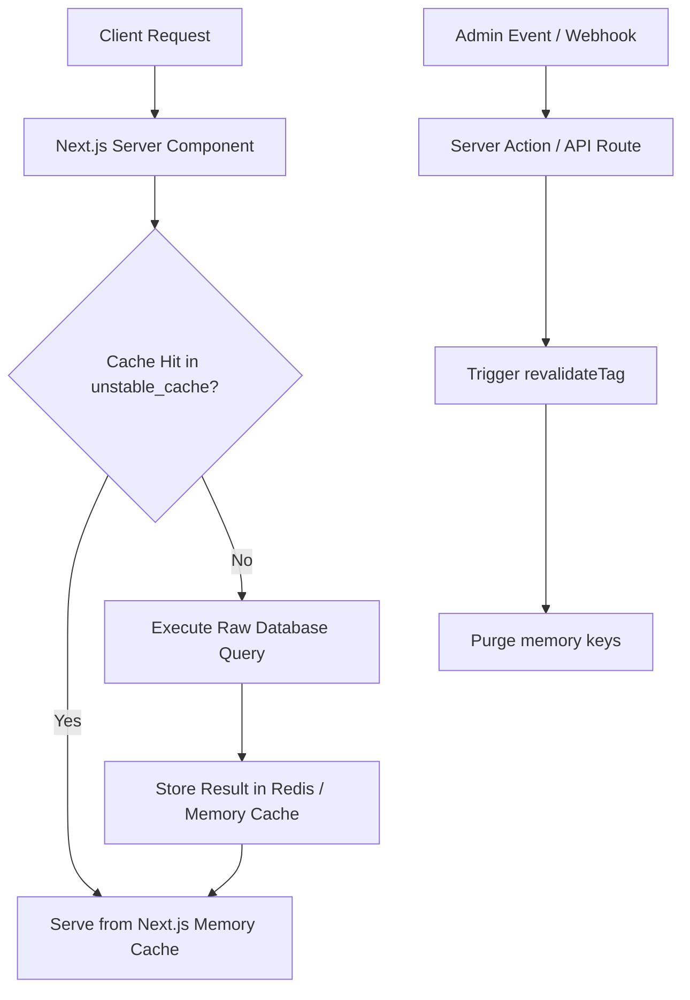

# The Caching Revolution: Mastering Uncached-by-Default Architectures in Next.js 15/16

For years, Next.js was notorious for its aggressive caching behavior. If you ran a standard `fetch` call in an App Router page, Next.js would automatically intercept and cache the response statically forever unless you explicitly configured dynamic routing parameters. In production, this resulted in countless "stale dashboard" and "out-of-sync product list" bugs that developers struggled to debug.

Next.js 15 flipped this model on its head by introducing **uncached-by-default** behavior. This article explores the architectural rationale behind this shift, the performance benefits, and how high-volume production platforms safely configure explicit, predictable caching.

---

## The Caching Dilemma: Static by Default vs. Uncached

In Next.js 13 and 14, standard network requests defaulted to `force-cache`. This decision was designed to make applications fast by generating static HTML at build time, but it severely violated the principle of least surprise:

* **Stale GET Requests**: GET Route Handlers and data fetches were cached permanently unless developers specified `{ cache: 'no-store' }`.
* **Out-of-Sync Client States**: Navigating back and forth between client components loaded pre-fetched pages from the client-side router cache rather than pulling fresh server state.

### The Next.js 15/16 Model

In the modern Next.js 15/16 architecture:
1. **Dynamic fetches by default**: All standard `fetch()` requests default to `no-store` unless explicitly configured.
2. **GET Route Handlers**: Defaults to uncached. You must export a `dynamic = 'force-static'` or configure custom caching to make them static.
3. **Client Navigations**: Client-side router caching resets more aggressively, pulling fresh server-rendered HTML snippets on standard push actions.

> [!IMPORTANT]
> **Performance Trade-Offs**: While uncached-by-default solves data consistency issues, it shifts the optimization burden to developers. Without explicit database or network caching, high-traffic apps can easily overwhelm downstream database clusters with duplicate queries.

---

## Implementing Selective Caching with `unstable_cache`

To achieve sub-50ms render times without serving stale data, production systems use Next.js's low-level `unstable_cache` API to wrap database and external API operations.

Here is a production-ready pattern for caching raw database queries in a Next.js server module:

```typescript
import { unstable_cache } from 'next/cache';
import { db } from '@/lib/db';

export interface Product {
  id: string;
  name: string;
  price: number;
  stock: number;
}

/**
 * Fetch products from database with strict tag-based caching.
 * Resolves to cached state if present, otherwise executes query.
 */
export const getProducts = unstable_cache(
  async (category: string): Promise<Product[]> => {
    console.log(`Executing raw database query for category: ${category}`);
    
    // Simulate database lookup
    return await db.query(
      'SELECT id, name, price, stock FROM products WHERE category = $1',
      [category]
    );
  },
  ['products-by-category'], // Cache key namespace
  {
    tags: ['products'],      // Revalidation tags
    revalidate: 3600,         // Cache TTL in seconds (1 hour)
  }
);
```

---

## Dynamic On-Demand Revalidation

When an administrator updates a product's price or stock, the cache must be purged instantly without waiting for the 3600-second TTL to expire. Production applications handle this via Server Actions and route-handler webhooks utilizing `revalidateTag` or `revalidatePath`:

```typescript
'use server';

import { revalidateTag } from 'next/cache';
import { db } from '@/lib/db';

/**
 * Server Action to update product inventory and purge cached values.
 */
export async function updateProductStock(productId: string, newStock: number) {
  // 1. Execute transactional update
  await db.transaction(async (tx) => {
    await tx.query(
      'UPDATE products SET stock = $1 WHERE id = $2',
      [newStock, productId]
    );
  });

  // 2. Trigger cache invalidation for all cached queries bound to 'products' tag
  console.log(`Purging cache tag: products for product ID: ${productId}`);
  revalidateTag('products');
}
```

> [!TIP]
> **Batch Revalidations**: If you need to refresh multiple layouts, you can invoke `revalidatePath('/products')` to rebuild all static components under the products route path, enabling smooth visual updates.

---

## Real-World Production Adoption

Production sites have adapted to the uncached-by-default shift by implementing tiered caching layouts:



1. **Static Shells, Dynamic Components**: Pages use Partial Prerendering (PPR) to server static layouts instantly, using `unstable_cache` to fetch dynamic components cleanly.
2. **CDN Bypass**: By relying on on-demand invalidation rather than global CDN caching, platforms keep dashboard views fresh down to the second while keeping server performance high.
