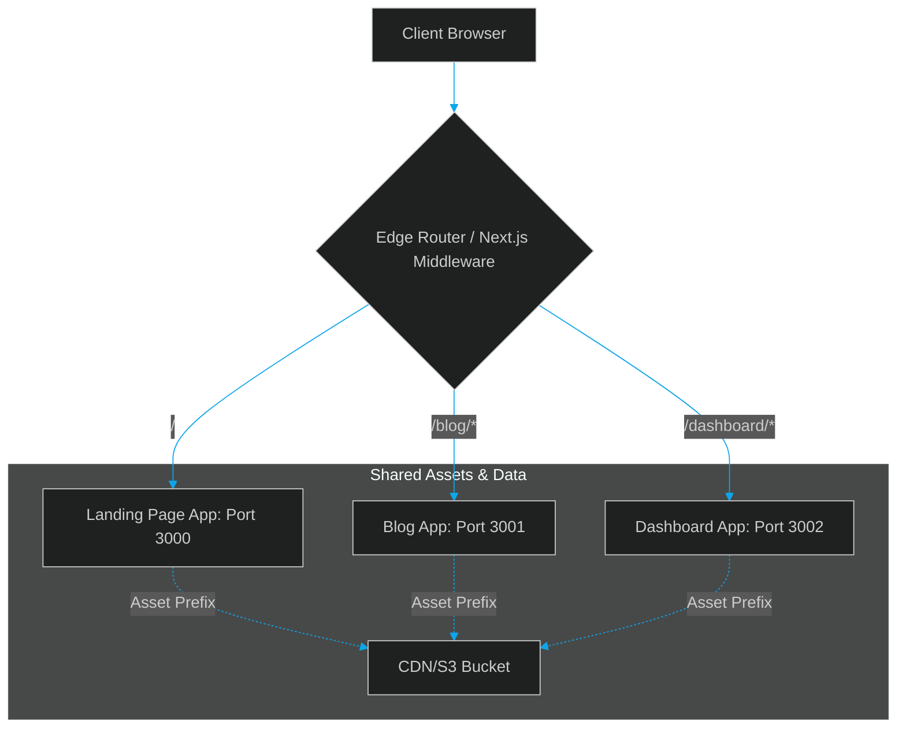

# Next.js Multi-Zones & Micro Frontends: Federating Server Components at the Edge

> [!NOTE]
> **📖 Article Overview**
> Micro frontends have long promised isolated, independently deployable frontend applications, but their real-world implementations have been plagued by heavy client bundles, asset chunk collisions, and hydration mismatch errors. Next.js solves these issues by bringing micro frontends to the server and the edge. By utilizing **Multi-Zones**, edge-level routing middleware, and React Server Components (RSC), developers can federate entire sub-applications with negligible client-side performance penalties. This article details the architecture, routing mechanics, and config patterns for building a production-grade Next.js micro frontend.

---

## The Micro Frontend Problem in Modern SSR

Standard micro frontend approaches (like Webpack Module Federation or Single-SPA) operate almost entirely in the browser. In server-side rendered (SSR) environments, this creates severe engineering challenges:
1. **Hydration Mismatches**: The server-rendered HTML must match the client-side JavaScript exactly. If a micro frontend dynamically injects a component on the client, React will throw a hydration mismatch error.
2. **Cascading Client Latency**: Downloading separate Webpack runtime bundles for every micro frontend increases JavaScript bloat, destroying Core Web Vitals (INP and LCP).
3. **Asset Collision**: Different micro frontends might build chunks with the same name, causing browser caches to swap modules incorrectly.



---

## Core Pillar 1: Next.js Multi-Zones

Next.js's native way of split-routing micro frontends is called **Multi-Zones**. In a Multi-Zone architecture, you split your system into multiple independent Next.js applications, each running on separate ports or server instances. 

To the end user, these separate apps appear as a single, unified site because they share the same top-level domain.

### Solving Chunk Clashes with `assetPrefix`
To prevent static files (JS/CSS) from overwriting each other, each zone must be configured with a unique `assetPrefix`. This forces Next.js to request its assets from a dedicated path (e.g. `/_next/static/blog/...` instead of the root folder).

---

## Core Pillar 2: React Server Components (RSC) Federation

One of the greatest benefits of modern Next.js is React Server Components. With RSCs, we can render the micro frontend components entirely on the server and stream the lightweight virtual DOM payload down to the client.

Instead of federating heavy JavaScript bundles that must be parsed and executed in the client's browser, you can query a federated sub-app over the network from your main app's server, receive the pre-rendered RSC payload, and inject it directly into the page stream. The client receives raw HTML without downloading the component's library dependencies.

---

## Core Pillar 3: Edge Middleware Routing

Rather than configuring heavy reverse proxies (like Nginx or Cloudflare Rules) which are slow to deploy and hard to maintain in code, you can use Next.js **Middleware** running at the Edge to handle path rewrites dynamically.

---

## Implementation: Zone Config & Edge Router

Let's look at how to configure two independent Next.js zones: a main Landing App and a Blog App, using path rewrites and asset prefixes.

### 1. Next.js Config for the Blog Sub-App (`next.config.js` on Port 3001)
Configure the sub-app to use a unique base path and asset prefix so its assets are kept isolated:

```javascript
// next.config.js (Blog Zone)
const nextConfig = {
  // Set asset prefix to separate static files from the landing app
  assetPrefix: '/_next/static/blog',
  async rewrites() {
    return {
      beforeFiles: [
        // Ensure static files are served correctly from the custom prefix path
        {
          source: '/_next/static/blog/_next/:path*',
          destination: '/_next/:path*',
        },
      ],
    };
  },
};

module.exports = nextConfig;
```

---

### 2. Edge Routing Middleware (`middleware.ts` on the Landing App on Port 3000)
This middleware acts as the intelligent orchestration gateway. It runs at the Edge and rewrites request paths to the respective zone port based on the URL context:

```typescript
// middleware.ts (Main Landing App)
import { NextResponse } from 'next/server';
import type { NextRequest } from 'next/server';

// Configuration maps for backend zone URLs
const ZONES = {
  blog: 'http://localhost:3001',
  dashboard: 'http://localhost:3002',
};

export function middleware(request: NextRequest) {
  const url = request.nextUrl.clone();
  const pathname = url.pathname;

  // 1. Route blog traffic to the Blog Zone
  if (pathname.startsWith('/blog')) {
    const targetUrl = new URL(pathname + url.search, ZONES.blog);
    return NextResponse.rewrite(targetUrl);
  }

  // 2. Route blog assets to the Blog Zone
  if (pathname.startsWith('/_next/static/blog')) {
    // Translate the asset prefix path back to the blog zone assets
    const cleanPath = pathname.replace('/_next/static/blog', '');
    const targetUrl = new URL(cleanPath + url.search, ZONES.blog);
    return NextResponse.rewrite(targetUrl);
  }

  // 3. Route dashboard traffic to the Dashboard Zone
  if (pathname.startsWith('/dashboard')) {
    const targetUrl = new URL(pathname + url.search, ZONES.dashboard);
    return NextResponse.rewrite(targetUrl);
  }

  // Fallback: Let the request pass through to the landing app
  return NextResponse.next();
}

// Limit middleware execution to these specific paths for performance
export const config = {
  matcher: [
    '/blog/:path*',
    '/_next/static/blog/:path*',
    '/dashboard/:path*',
  ],
};
```

---

## 🏁 Conclusion & Takeaways

Next.js transforms micro frontends from a client-side bundle nightmare into a fast, server-orchestrated pattern:
* [ ] **Always declare an `assetPrefix`**: Prevent client-side JS/CSS chunk collisions by separating static paths for each sub-app.
* [ ] **Orchestrate at the Edge**: Use Next.js Middleware to handle dynamic routing rewrites rather than static Nginx configs.
* [ ] **Leverage RSC for federation**: Render UI pieces on their respective zone servers, and stream the lightweight VDOM down to the shell app.
* [ ] **Shared styling variables**: Keep micro frontend styles consistent by using global CSS variables loaded at the root layout shell.
