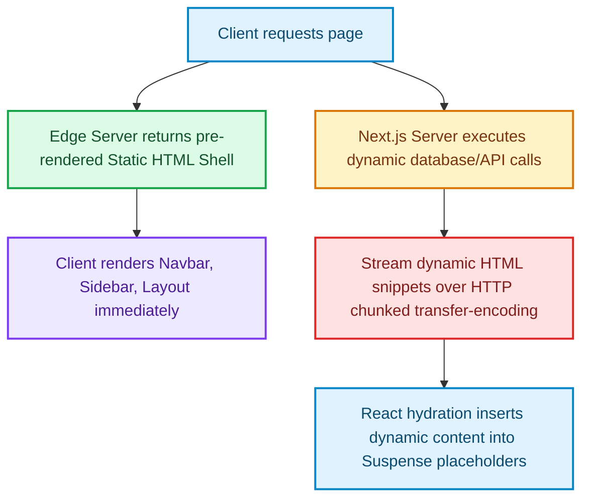

# Partial Prerendering (PPR) in Practice: Blending Static Shells and Dynamic Streams

> [!NOTE]
> **Update (September 2026)**: Next.js **16.3 is Active LTS**. Next.js 15 is Maintenance LTS until 21 October 2026. Next.js 14 reached EOL on 26 October 2025. Treat version-specific APIs below as historical unless a section is marked current. See [The Great Un-Caching](the-great-un-caching-nextjs-15-caching-architecture-defaults.html) for the 15 default inversion.


In the battle between static and dynamic web rendering, developers have historically faced a binary compromise:
* **Static Site Generation (SSG)**: Insanely fast Time to First Byte (TTFB) and robust CDN edge caching, but completely incapable of displaying real-time user-specific content [1].
* **Server-Side Rendering (SSR)**: Capable of generating personalized pages, but blocks delivery of the entire document until every database call completes, degrading TTFB.

**Partial Prerendering (PPR)** in Next.js 15/16 eliminates this compromise. It allows developers to compile a static, cached HTML layout shell containing nested dynamic holes that stream real-time data over a single connection as it resolves.

---

## Under the Hood: The PPR Compiler Model

During the build process (`next build`), when PPR is enabled, the Next.js compiler analyzes the React Server Component (RSC) tree. 

It splits the component tree at every **React Suspense Boundary**:
1. **The Static Shell**: Everything outside of `<Suspense>` is immediately pre-rendered into static HTML and cached globally at edge nodes.
2. **The Dynamic Holes**: Components wrapped in `<Suspense>` are compiled into dynamic execution instructions.



When a user visits the URL, they receive the static HTML shell in under 15ms. In the background, the server continues executing dynamic DB queries and streams the resolved HTML snippets over the same connection using HTTP `transfer-encoding: chunked`.

---

## Implementing a Dynamic Product Page

Here is a real-world production implementation of an e-commerce product page utilizing PPR. The page structure includes static details (title, description) while streaming real-time elements (pricing, cart status, recommendations).

### 1. Main Page Layout (Static Shell)
```typescript
import { Suspense } from 'react';
import { ProductGallery, ProductDetails } from '@/components/product-static';
import { RealtimePricing } from '@/components/pricing-dynamic';
import { CartButton } from '@/components/cart-dynamic';
import { Recommendations } from '@/components/recommendations-dynamic';

export const experimental_ppr = true; // Enable PPR for this route

interface PageProps {
  params: Promise<{ slug: string }>;
}

export default async function ProductPage({ params }: PageProps) {
  const { slug } = await params;

  return (
    <div className="product-layout container">
      {/* Static Shell Components: Pre-rendered & cached */}
      <div className="grid grid-cols-2 gap-8">
        <ProductGallery slug={slug} />
        <div className="info-column">
          <ProductDetails slug={slug} />

          {/* Dynamic Pricing Hole: Streams pricing calculation */}
          <Suspense fallback={<div className="skeleton h-8 w-24" />}>
            <RealtimePricing slug={slug} />
          </Suspense>

          {/* Dynamic Cart Status Hole: Streams customized user cart state */}
          <Suspense fallback={<div className="skeleton h-12 w-full" />}>
            <CartButton slug={slug} />
          </Suspense>
        </div>
      </div>

      {/* Dynamic Recommendation Swarm: Streams cross-sales */}
      <Suspense fallback={<div className="skeleton-grid h-48 w-full" />}>
        <Recommendations slug={slug} />
      </Suspense>
    </div>
  );
}
```

### 2. Dynamic Segment Component (The Streamed Content)
```typescript
import { fetchPersonalizedPrice } from '@/lib/pricing-service';
import { cookies } from 'next/headers';

interface PricingProps {
  slug: string;
}

export async function RealtimePricing({ slug }: PricingProps) {
  // Accessing cookies forces this component to run dynamically on request
  const cookieStore = await cookies();
  const userId = cookieStore.get('session_id')?.value;

  // Fetch real-time personalized pricing from backend
  const { originalPrice, discountPrice } = await fetchPersonalizedPrice(slug, userId);

  return (
    <div className="price-block my-4">
      {discountPrice ? (
        <div className="flex gap-2 items-center">
          <span className="text-2xl font-bold text-red-600">${discountPrice}</span>
          <span className="text-lg text-gray-400 line-through">${originalPrice}</span>
        </div>
      ) : (
        <span className="text-2xl font-bold">${originalPrice}</span>
      )}
    </div>
  );
}
```

---

## Important Pitfalls in Production

While PPR provides massive UX improvements, developers must design layouts with specific guardrails:

> [!WARNING]
> **Layout Thrashing**: If your dynamic component has a different height than its Suspense fallback component, the layout will shift violently when the chunk resolves. Always specify fixed-height container bounds or exact skeletons to preserve visual stability (CLS score).

> [!NOTE]
> **Cascading Resolves**: If your dynamic components are nested sequentially, they will stream in sequence. Keep Suspense boundaries parallel to optimize stream speed and avoid "pop-in waterfall" behaviors.

---

## Real-World Production Adoption

Production dashboards and e-commerce platforms have adopted PPR to achieve sub-10ms TTFB while maintaining dynamic capabilities:
* **E-Commerce Detail Views**: Pre-renders layout outlines, logos, footer maps, and description copy to CDNs, streaming real-time pricing and stock quantities on load.
* **SaaS Dashboards**: Instantly renders the workspace sidebar and top bar layouts, streaming slow third-party API graphs asynchronously without loading spinners. [2]

## References & Further Reading

1. **Vercel Engineering (2025)**. *Next.js 16*. Next.js Blog. [https://nextjs.org/blog/next-16](https://nextjs.org/blog/next-16)
2. **Vercel Engineering (2024)**. *Next.js 15*. Next.js Blog. [https://nextjs.org/blog/next-15](https://nextjs.org/blog/next-15)
3. **Vercel Documentation (2026)**. *Caching in Next.js*. Next.js Docs. [https://nextjs.org/docs/app/getting-started/caching](https://nextjs.org/docs/app/getting-started/caching)
4. **React Team (2024)**. *React Server Components and Related RFCs*. reactjs/rfcs. [https://github.com/reactjs/rfcs](https://github.com/reactjs/rfcs)
5. **Fielding, R., Nottingham, M., & Reschke, J. (2014)**. *Hypertext Transfer Protocol (HTTP/1.1): Caching*. RFC 7234. [https://www.rfc-editor.org/rfc/rfc7234](https://www.rfc-editor.org/rfc/rfc7234)
6. **DeCandia, G., et al. (2007)**. *Dynamo: Amazon's Highly Available Key-value Store*. SOSP. [https://www.allthingsdistributed.com/files/amazon-dynamo-sosp2007.pdf](https://www.allthingsdistributed.com/files/amazon-dynamo-sosp2007.pdf)
