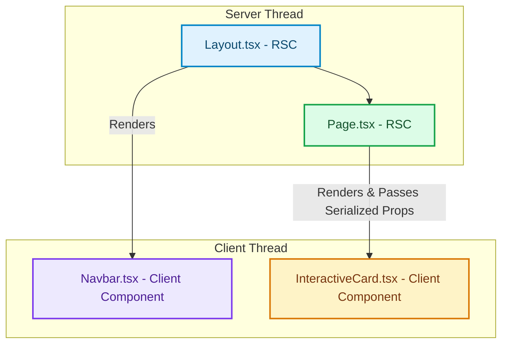

# The RSC Boundary: Deep Dive into Serialization, Shared State, and Thread Boundaries

> [!NOTE]
> **Update (September 2026)**: Next.js **16.3 is Active LTS**. Next.js 15 is Maintenance LTS until 21 October 2026. Next.js 14 reached EOL on 26 October 2025. Treat version-specific APIs below as historical unless a section is marked current. See [The Great Un-Caching](the-great-un-caching-nextjs-15-caching-architecture-defaults.html) for the 15 default inversion.


Understanding the boundaries of React Server Components (RSC) is one of the most critical shifts when moving from traditional client-side SPA frameworks to Next.js App Router [1]. 

Rather than executing all components in the browser, Next.js runs Server Components on the server and streams the resulting UI elements down to the client. This introduces a network and serialization boundary that dictates how we pass data, share state, and structure component trees.

---

## 1. Visualizing the Boundary

The boundary is unidirectional: Server Components can import and render Client Components, but Client Components cannot directly import and render Server Components as components. They can, however, receive Server Components as `children` or `props`.



---

## 2. Serialization Rules: What Crosses the Boundary?

When a Server Component passes props to a Client Component, that data must be converted into a string-based protocol (the **RSC Payload**) that the browser can deserialize and reconstruct. This protocol is JSON-like but extends support for streaming elements.

### Serializable Data (Supported)
* **Primitives:** `string`, `number`, `boolean`, `null`, `undefined`, `bigint`.
* **Arrays & Plain Objects:** `{ name: "John" }` (must be pure key-value objects, not instantiated classes).
* **Promises:** You can pass a pending promise from server to client, and the client can unpack it using the React 19 `use()` hook.
* **React Elements:** Server Component JSX nodes (e.g. `<ServerChild />`) can be passed as props.
* **TypedArrays:** `Uint8Array`, etc.

### Non-Serializable Data (Unsupported)
* **Functions:** Event handlers (e.g., `onClick={handleClick}`) cannot be passed across the boundary because code execution context cannot be serialized across threads.
* **Class Instances:** Instantiated class models (e.g., custom database schemas or ORM entities) lose their prototype chain during serialization.
* **Symbols:** Cannot be transferred across the network.
* **Circular Structures:** Cause infinite loops during serialization.

---

## 3. Common Architectural Pitfalls

### Pitfall A: The "Cannot Serialize Function" Error
This happens when you accidentally pass an event handler or callback from a Server Component to a Client Component.

```tsx
// ❌ WRONG: Fails because handleClick cannot be serialized
export default async function ServerPage() {
  const handleClick = async () => {
    "use server";
    console.log("Clicked");
  };

  return <ClientButton onClick={handleClick} />;
}
```

```tsx
//  CORRECT: Pass raw data, let the client component handle interactions locally
export default async function ServerPage() {
  const userId = "user_123";
  return <ClientButton userId={userId} />;
}
```

### Pitfall B: Passing ORM Objects Directly
If you query a database using Prisma or Drizzle, the return values are often objects that contain non-serializable fields (like custom Date objects or nested prototype functions).

```typescript
// ❌ WRONG: Might crash if task.createdAt is a raw Date object
const task = await db.task.findUnique({ id });
return <TaskDetailsCard task={task} />;
```

```typescript
//  CORRECT: Sanitize and transform the Data Transfer Object (DTO)
const task = await db.task.findUnique({ id });
const sanitizedTask = {
  id: task.id,
  title: task.title,
  createdAt: task.createdAt.toISOString() // Explicitly convert date to string
};
return <TaskDetailsCard task={sanitizedTask} />;
```

---

## 4. State Sharing: Moving Beyond Context Providers

In a client-side SPA, developers share global state using Context Providers (`useContext`, Redux, Zustand) wrapped around the root layout. 

In Next.js, wrapping your root layout in a Context Provider **forces all children to become Client Components**, completely disabling the benefits of Server Components for the entire application page.

### The Architectural Solution: URL State
Instead of React state, use the **URL query string** as your primary state coordinator.

```tsx
// components/filter-sidebar.tsx (Client Component)
"use client";

import { useRouter, useSearchParams } from "next/navigation";

export function FilterSidebar() {
  const router = useRouter();
  const searchParams = useSearchParams();

  const handleFilterChange = (category: string) => {
    const params = new URLSearchParams(searchParams.toString());
    params.set("category", category);
    router.push(`?${params.toString()}`);
  };

  return (
    <div>
      <button onClick={() => handleFilterChange("tech")}>Tech</button>
      <button onClick={() => handleFilterChange("finance")}>Finance</button>
    </div>
  );
}
```

```tsx
// app/dashboard/page.tsx (Server Component)
import { FilterSidebar } from "@/components/filter-sidebar";
import { fetchArticles } from "@/lib/db";

interface PageProps {
  searchParams: Promise<{ category?: string }>;
}

export default async function DashboardPage({ searchParams }: PageProps) {
  const { category } = await searchParams;
  
  // Data is fetched dynamically on the server based on URL state!
  const articles = await fetchArticles(category || "all");

  return (
    <div class="dashboard-layout">
      <FilterSidebar />
      <div class="article-grid">
        {articles.map(art => <ArticleCard data={art} />)}
      </div>
    </div>
  );
}
```

### Benefits of URL State:
1. **Zero Client Javascript:** The article cards remain pure Server Components; they don't load state engines in the browser.
2. **Bookmarkable Pages:** Users can bookmark or share the URL, and it will load the exact filtered layout instantly.
3. **Instant SEO:** Search engines index all filtered pages naturally because they render static HTML on load. [2]

## References & Further Reading

1. **Mohan, C., et al. (1992)**. *ARIES: A Transaction Recovery Method Supporting Fine-Granularity Locking and Partial Rollbacks*. ACM TODS. [https://doi.org/10.1145/128765.128770](https://doi.org/10.1145/128765.128770)
2. **O'Neil, P., Cheng, E., Gawlick, D., & O'Neil, E. (1996)**. *The Log-Structured Merge-Tree (LSM-Tree)*. Acta Informatica. [https://www.cs.umb.edu/~poneil/lsmtree.pdf](https://www.cs.umb.edu/~poneil/lsmtree.pdf)
3. **PostgreSQL Global Development Group (2024)**. *PostgreSQL Documentation*. postgresql.org. [https://www.postgresql.org/docs/current/](https://www.postgresql.org/docs/current/)
4. **Malkov, Y. A., & Yashunin, D. A. (2018)**. *Efficient and Robust Approximate Nearest Neighbor Search Using Hierarchical Navigable Small World Graphs*. IEEE TPAMI. [https://arxiv.org/abs/1603.09320](https://arxiv.org/abs/1603.09320)
5. **Jégou, H., Douze, M., & Schmid, C. (2011)**. *Product Quantization for Nearest Neighbor Search*. IEEE TPAMI. [https://hal.inria.fr/inria-00514462v2/document](https://hal.inria.fr/inria-00514462v2/document)
6. **Johnson, J., Douze, M., & Jégou, H. (2019)**. *Billion-scale Similarity Search with GPUs*. IEEE Transactions on Big Data. [https://arxiv.org/abs/1702.08734](https://arxiv.org/abs/1702.08734)
