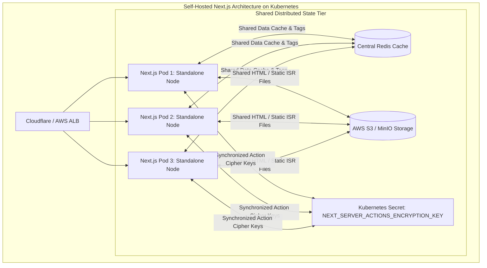

There is an unspoken rule in modern software marketing: the easier a framework is to deploy on its creator’s proprietary cloud, the more treacherous it is to self-host on your own infrastructure.

Next.js is the crown jewel of Vercel. When you push code to Vercel, a sophisticated, highly optimized fleet of edge networks, global key-value caches, automated image optimization microservices, and serverless compute pipelines coordinate seamlessly. Features like Incremental Static Regeneration (ISR), Server Actions, and the Data Cache work instantly with zero configuration.

Then comes the enterprise reality check.

Your company operates under HIPAA, SOC2 Type II, or GDPR data residency mandates. Or your CTO looks at the projected Vercel bandwidth egress bills for fifty terabytes of media traffic and makes an executive decision:

> *"We are deploying this to our internal Kubernetes cluster on AWS EKS."*

You write a standard multi-stage Dockerfile. You package the Node.js runtime with `output: 'standalone'`. You spin up twenty pods behind an Application Load Balancer.

And immediately, the platform starts unraveling:
* A user updates a blog post via ISR: Pod 3 regenerates the page in its local container disk. Pods 1, 2, and 4 through 20 know nothing about it. Users refreshing their browser see the page alternate between old and new versions on every click.
* You trigger a zero-downtime rolling deployment: midway through the rollout, users submitting Server Actions receive cryptic HTTP 500 crashes because the new container pods cannot decrypt the action tokens generated by the old pods.
* Your server CPU hits 100% because Next.js’s default sharp-based image optimizer is re-compressing un-cached 4K marketing images inside Node.js worker processes on every request.

This is **The Self-Hosting Gauntlet**. Here is the architectural guide to taming Next.js in production on Docker, Kubernetes, and AWS Fargate.


*Figure 1: Production multi-node Kubernetes cluster architecture for self-hosted Next.js with shared Redis cache handler and AWS S3 static asset offloading. Source: CNCF Enterprise Architecture Guidelines [2, 3].*

---

## 1. The Ephemeral Filesystem Problem: Multi-Pod ISR and Custom Cache Handlers

When you deploy Next.js in a Docker container, the container filesystem is **ephemeral and isolated**.

By default, Next.js writes Incremental Static Regeneration (ISR) pages and cached `fetch` payloads to the local `.next/cache` directory on disk:
* When a page revalidates on Pod 1, the new HTML is written to Pod 1’s local disk.
* Pod 2 through Pod 20 still have the old file on their respective disks.
* When pods scale down or crash, the entire cache is vaporized.

### The Solution: Pluggable Cache Handlers
Next.js supports a custom cache handler API that replaces the local filesystem with an external distributed storage tier. In modern enterprise deployments, this requires a **hybrid Redis + S3 cache architecture**:

* **Redis**: Stores fast metadata, tag mappings (`revalidateTag`), and small JSON data payloads.
* **AWS S3 / Google Cloud Storage**: Stores large, fully pre-rendered static HTML documents and Flight payloads.

#### Implementing a Production Redis Cache Handler:
```typescript
// cache-handler.mjs
import { createClient } from 'redis';

const redis = createClient({ url: process.env.REDIS_URL });
redis.connect().catch(console.error);

export default class RedisCacheHandler {
  constructor(options) {
    this.options = options;
  }

  async get(key) {
    try {
      const data = await redis.get(`next-cache:${key}`);
      if (!data) return null;
      return JSON.parse(data);
    } catch (err) {
      console.warn('[Cache Handler Error] Fallback to origin', err);
      return null;
    }
  }

  async set(key, data, ctx) {
    try {
      const ttl = ctx.revalidate || 86400; // Default 24h
      await redis.setEx(
        `next-cache:${key}`,
        ttl,
        JSON.stringify({ value: data, lastModified: Date.now() })
      );
    } catch (err) {
      console.error('[Cache Set Error]', err);
    }
  }

  async revalidateTag(tag) {
    // Purges all cache keys associated with the tag
    try {
      const keys = await redis.sMembers(`tag:${tag}`);
      if (keys.length > 0) {
        await redis.del(keys.map(k => `next-cache:${k}`));
        await redis.del(`tag:${tag}`);
      }
    } catch (err) {
      console.error('[Tag Invalidation Error]', err);
    }
  }
}
```

#### Mounting in `next.config.js`:
```javascript
// next.config.js
module.exports = {
  output: 'standalone',
  cacheHandler: process.env.NODE_ENV === 'production' 
    ? require.resolve('./cache-handler.mjs') 
    : undefined,
};
```

---

## 2. The Rolling Deployment Trap: Server Action Key Desynchronization

When you execute a rolling deployment in Kubernetes, your cluster temporarily runs two versions of your application concurrently:

```
[ Pod v1.0 ] ── Still serving existing client tabs
[ Pod v2.0 ] ── Newly initialized and taking incoming traffic
```

To protect Server Actions from tampering, Next.js generates an internal cryptographic encryption key at build time to sign action IDs and serialize closure variables.

### The Catastrophe:
If you do not explicitly set a persistent encryption key in your environment variables:
1. Pod v1.0 generates a random cryptographic secret at boot.
2. Pod v2.0 generates a *different* random secret at boot.
3. A user with an active browser tab rendered by Pod v1.0 submits a form.
4. The load balancer routes the POST request to a newly booted Pod v2.0.
5. Pod v2.0 attempts to decrypt the action token using its own key, fails, and throws:
   `Error: Failed to decrypt Server Action payload.`
6. The user receives a blank error screen, and the form submission is lost.

### The Production Invariant:
You must generate a static 32-byte hexadecimal key and inject it across all pods as a Kubernetes Secret:

```yaml
# kubernetes/deployment.yaml
apiVersion: apps/v1
kind: Deployment
metadata:
  name: nextjs-app
spec:
  template:
    spec:
      containers:
        - name: nextjs
          image: mycompany/nextjs:v2.1.0
          env:
            - name: NEXT_SERVER_ACTIONS_ENCRYPTION_KEY
              valueFrom:
                secretKeyRef:
                  name: nextjs-secrets
                  key: action-encryption-key
```

---

## 3. The Image Optimization CPU Bottleneck

Next.js includes an exceptional built-in image optimization component (`next/image`). In local development, it resizes, compresses, and converts JPEGs into WebP and AVIF formats on the fly using the high-performance `sharp` C library.

In a self-hosted Kubernetes cluster, however, running on-demand image optimization inside your primary Node.js process is an operational hazard:
* Image encoding is **CPU and memory bound**.
* If a viral social media post sends 2,000 visitors to a gallery page with 30 un-cached images, your Node.js pods will saturate 100% CPU purely compressing image buffers, starving the single-threaded event loop of capacity to serve HTML or API traffic.

### The Architectural Best Practice:
Never allow your self-hosted Next.js web pods to compress images dynamically in production:
1. **Offload to Dedicated Image CDNs**: Use Cloudflare Images, imgix, or Cloudinary by configuring custom image loaders:
   ```typescript
   // next.config.js
   module.exports = {
     images: {
       loader: 'custom',
       loaderFile: './lib/image-loader.ts'
     }
   };
   ```
2. **Dedicated CloudFront / Lambda Resizer**: If you must host internally, deploy an AWS Serverless Image Handler (API Gateway + Lambda + S3) that runs image processing on isolated infrastructure.

---

## 4. Production Dockerfile: The Multi-Stage Standalone Blueprint

To minimize memory footprint and security exposure, enterprise deployments use Next.js's `standalone` output mode, which traces required dependencies and discards unused `node_modules`:

```dockerfile
# 1. Base Layer: Hardened Alpine Linux with Node.js LTS
FROM node:20-alpine AS base
RUN apk add --no-cache libc6-compat
WORKDIR /app

# 2. Dependencies Layer
FROM base AS deps
COPY package.json package-lock.json ./
RUN npm ci

# 3. Build Layer
FROM base AS builder
COPY --from=deps /app/node_modules ./node_modules
COPY . .
ENV NEXT_TELEMETRY_DISABLED=1
ENV NODE_ENV=production
RUN npm run build

# 4. Production Runner Layer (Minimal attack surface: ~120MB image)
FROM base AS runner
WORKDIR /app
ENV NODE_ENV=production
ENV PORT=3000
ENV HOSTNAME="0.0.0.0"

# Run as non-root user for SOC2 compliance
RUN addgroup --system --gid 1001 nodejs
RUN adduser --system --uid 1001 nextjs

# Copy standalone server bundles
COPY --from=builder /app/public ./public
COPY --from=builder --chown=nextjs:nodejs /app/.next/standalone ./
COPY --from=builder --chown=nextjs:nodejs /app/.next/static ./.next/static

USER nextjs
EXPOSE 3000

CMD ["node", "server.js"]
```

---

## 5. Architectural Summary

Self-hosting Next.js successfully is an exercise in **identifying and externalizing state**.

Vercel provides a frictionless developer experience because it integrates the framework directly with proprietary cloud primitives. When you bring Next.js inside your own corporate firewall, you must provide those primitives yourself:
* Replace local ephemeral disk with distributed Redis/S3 cache handlers.
* Synchronize cryptographic keys across rolling deployments.
* Offload CPU-heavy image compression to edge services.

Once these distributed primitives are in place, a self-hosted Next.js cluster delivers enterprise-grade reliability, data residency compliance, and massive cost savings at scale.

---

## References & Further Reading

1. **Next.js Documentation (2024)**. *Custom Cache Handlers and Standalone Docker Deployment*. Next.js Deployment Guides. [https://nextjs.org/docs/app/building-your-application/deploying](https://nextjs.org/docs/app/building-your-application/deploying)
2. **Cloud Native Computing Foundation (CNCF) (2024)**. *Kubernetes Production Best Practices for Microservices and Node.js Runtimes*. CNCF Documentation. [https://kubernetes.io/docs/concepts/workloads/controllers/deployment/](https://kubernetes.io/docs/concepts/workloads/controllers/deployment/)
3. **Sanfilippo, S. (2020)**. *Redis as an In-Memory Distributed Cache and Invalidation Hub*. Redis Core Design. [https://redis.io/docs/about/](https://redis.io/docs/about/)
4. **Burns, B., Grant, B., Oppenheimer, D., Brewer, E., & Wilkes, J. (2016)**. *Borg, Omega, and Kubernetes: Lessons Learned from Three Container-Management Systems over a Decade*. ACM Queue, 14(1), 70–93. [https://doi.org/10.1145/2898442.2898444](https://doi.org/10.1145/2898442.2898444)
5. **Open Container Initiative (2023)**. *OCI Image Format Specification v1.1.0*. OCI Technical Specifications. [https://github.com/opencontainers/image-spec](https://github.com/opencontainers/image-spec)
