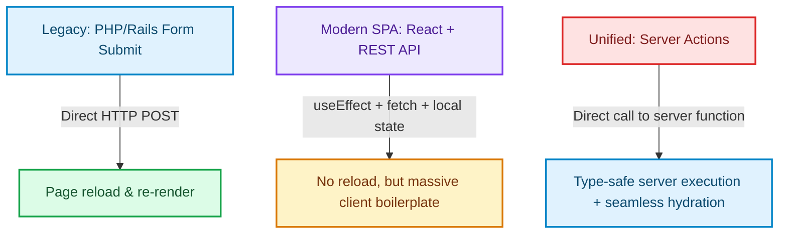

# Server Actions and the Unified Mutation Paradigm: Reclaiming the Server-Side

> [!NOTE]
> **Update (September 2026)**: Next.js **16.3 is Active LTS**. Next.js 15 is Maintenance LTS until 21 October 2026. Next.js 14 reached EOL on 26 October 2025. Treat version-specific APIs below as historical unless a section is marked current. See [The Great Un-Caching](the-great-un-caching-nextjs-15-caching-architecture-defaults.html) for the 15 default inversion.


Historically, data mutations in React applications were characterized by architectural fragmentation [1]. To update a simple record on a database, developers had to build and maintain multiple layers:
1. **API Endpoints**: Creating a dedicated REST `/api/update-user` or GraphQL mutation schema.
2. **Client-Side Fetching**: Writing asynchronous `fetch` wrappers inside component lifecycle handlers.
3. **State Management**: Managing local component flags (`isLoading`, `hasError`) or global stores (Redux, Zustand) to coordinate UI updates.
4. **Form Boilerplate**: Binding input states manually to prevent layout conflicts.

Next.js Server Actions (stabilized in v15) represent a massive paradigm shift. By unifying client-side interactions and server-side executions into a single, type-safe function call, Server Actions reclaim the simplicity of server-rendered forms.

---

## The Historical Evolution of Mutations

To understand the value of Server Actions, we must look at how React mutations evolved over time:



Server Actions return to the simple PHP/Rails concept of direct form actions, but update it for single-page applications. They allow a client component to invoke a secure, compiled function that runs directly on the server under the hood, handling network transport, serialization, and page state updates behind the scenes.

---

## Implementing Type-Safe Form Mutations

Here is a production pattern for executing user profile updates using Server Actions, incorporating schema validation via Zod and React 19's `useActionState` hook for state tracking.

### 1. The Server Action Module (`actions.ts`)
```typescript
'use server';

import { db } from '@/lib/db';
import { z } from 'zod';
import { revalidatePath } from 'next/cache';

const ProfileSchema = z.object({
  userId: z.string().uuid(),
  displayName: z.string().min(2, 'Name must be at least 2 characters'),
  bio: z.string().max(160, 'Bio must not exceed 160 characters'),
});

export type ActionState = {
  success: boolean;
  errors?: Record<string, string>;
  message: string;
};

/**
 * Server Action to validate and update user profiles.
 */
export async function updateProfile(
  prevState: ActionState,
  formData: FormData
): Promise<ActionState> {
  // Extract and validate inputs
  const parsed = ProfileSchema.safeParse({
    userId: formData.get('userId'),
    displayName: formData.get('displayName'),
    bio: formData.get('bio'),
  });

  if (!parsed.success) {
    const fieldErrors: Record<string, string> = {};
    parsed.error.errors.forEach((err) => {
      if (err.path[0]) fieldErrors[err.path[0].toString()] = err.message;
    });
    return { success: false, errors: fieldErrors, message: 'Validation failed' };
  }

  const { userId, displayName, bio } = parsed.data;

  try {
    // Execute database transaction
    await db.query(
      'UPDATE users SET display_name = $1, bio = $2 WHERE id = $3',
      [displayName, bio, userId]
    );

    // Force Next.js to purge cached states for this page route
    revalidatePath(`/profile/${userId}`);

    return { success: true, message: 'Profile updated successfully!' };
  } catch (err) {
    console.error('Database write error:', err);
    return { success: false, message: 'Internal server error' };
  }
}
```

### 2. The Client Form Component (`profile-form.tsx`)
```typescript
'use client';

import { useActionState } from 'react';
import { updateProfile, ActionState } from './actions';

interface FormProps {
  userId: string;
  initialName: string;
  initialBio: string;
}

const initialState: ActionState = {
  success: false,
  message: '',
};

export default function ProfileForm({ userId, initialName, initialBio }: FormProps) {
  // useActionState handles loading states and returns the latest action result
  const [state, formAction, isPending] = useActionState(updateProfile, initialState);

  return (
    <form action={formAction} className="space-y-4 max-w-md">
      <input type="hidden" name="userId" value={userId} />

      <div>
        <label htmlFor="displayName" className="block text-sm font-semibold">Name</label>
        <input
          type="text"
          id="displayName"
          name="displayName"
          defaultValue={initialName}
          className="w-full border rounded px-3 py-2 mt-1"
          disabled={isPending}
        />
        {state.errors?.displayName && (
          <p className="text-red-500 text-xs mt-1">{state.errors.displayName}</p>
        )}
      </div>

      <div>
        <label htmlFor="bio" className="block text-sm font-semibold">Bio</label>
        <textarea
          id="bio"
          name="bio"
          defaultValue={initialBio}
          className="w-full border rounded px-3 py-2 mt-1"
          disabled={isPending}
        />
        {state.errors?.bio && (
          <p className="text-red-500 text-xs mt-1">{state.errors.bio}</p>
        )}
      </div>

      <button
        type="submit"
        disabled={isPending}
        className="w-full bg-blue-600 text-white rounded py-2 font-semibold hover:bg-blue-700 transition"
      >
        {isPending ? 'Saving changes...' : 'Save Profile'}
      </button>

      {state.message && (
        <p className={`text-sm mt-2 ${state.success ? 'text-green-600' : 'text-red-600'}`}>
          {state.message}
        </p>
      )}
    </form>
  );
}
```

---

## Security Best Practices for Server Actions

Because Server Actions expose backend functions to the client-side bundle, developers must implement security checks to prevent unauthorized access:

> [!IMPORTANT]
> **Enforce Strict Input Validation**: Always treat parameters passed to Server Actions as untrusted. Validate types, formats, and value ranges using validation libraries like Zod before invoking database operations.

> [!CAUTION]
> **Verify Authentication and Authorization**: Never assume the user is authorized. Always retrieve the active session internally inside the Server Action and verify the caller's permissions before modifying database rows.

---

## Real-World Production Adoption
High-traffic portals utilize Server Actions to simplify data mutations:
* **E-Commerce Checkout Funnels**: Server Actions run secure transactions directly on edge runtimes, skipping public API latency.
* **Rapid Form Feedback**: The combination of dynamic layouts and React 19's `useActionState` provides instant loading transitions and validation errors without separate client router management. [2]

## References & Further Reading

1. **Vercel Engineering (2025)**. *Next.js 16*. Next.js Blog. [https://nextjs.org/blog/next-16](https://nextjs.org/blog/next-16)
2. **Vercel Engineering (2024)**. *Next.js 15*. Next.js Blog. [https://nextjs.org/blog/next-15](https://nextjs.org/blog/next-15)
3. **Vercel Documentation (2026)**. *Caching in Next.js*. Next.js Docs. [https://nextjs.org/docs/app/getting-started/caching](https://nextjs.org/docs/app/getting-started/caching)
4. **React Team (2024)**. *React Server Components and Related RFCs*. reactjs/rfcs. [https://github.com/reactjs/rfcs](https://github.com/reactjs/rfcs)
5. **Fielding, R., Nottingham, M., & Reschke, J. (2014)**. *Hypertext Transfer Protocol (HTTP/1.1): Caching*. RFC 7234. [https://www.rfc-editor.org/rfc/rfc7234](https://www.rfc-editor.org/rfc/rfc7234)
6. **DeCandia, G., et al. (2007)**. *Dynamo: Amazon's Highly Available Key-value Store*. SOSP. [https://www.allthingsdistributed.com/files/amazon-dynamo-sosp2007.pdf](https://www.allthingsdistributed.com/files/amazon-dynamo-sosp2007.pdf)
