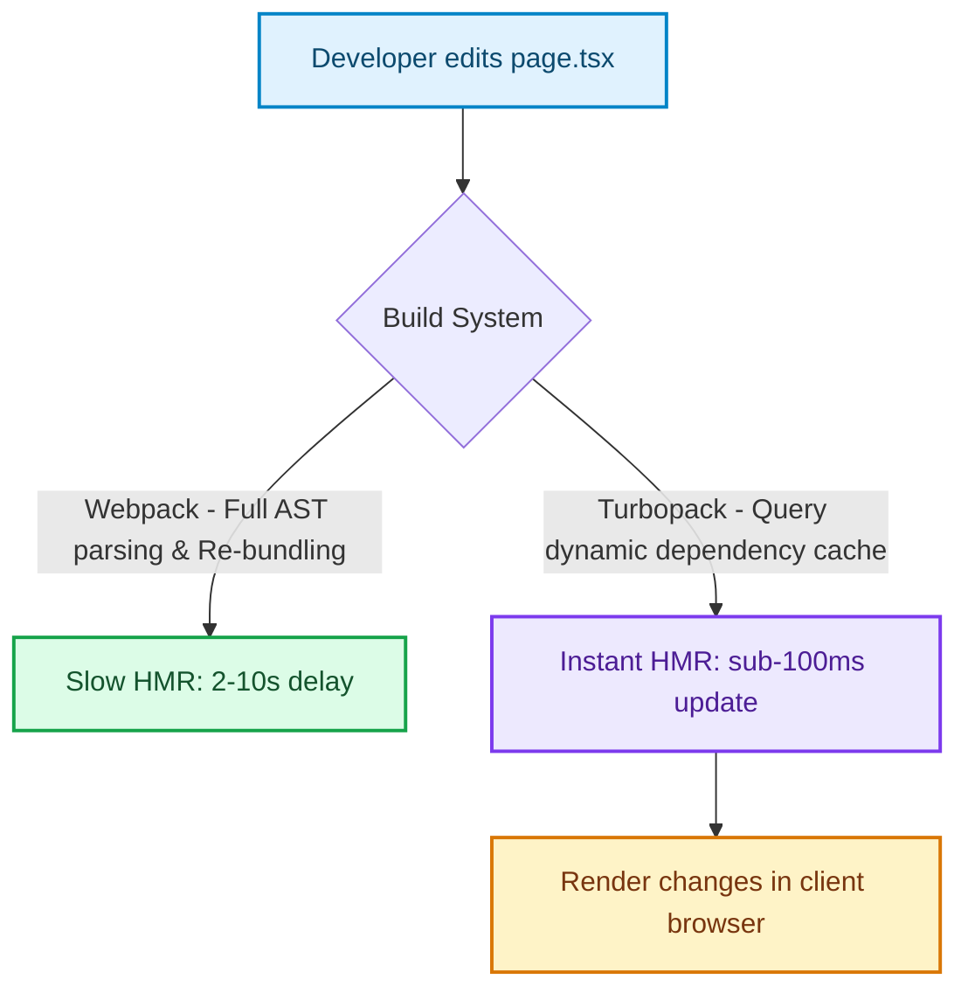

# Turbopack and the Native Tooling Era: Moving Beyond Webpack

> [!NOTE]
> **Update (September 2026)**: Next.js **16.3 is Active LTS**. Next.js 15 is Maintenance LTS until 21 October 2026. Next.js 14 reached EOL on 26 October 2025. Treat version-specific APIs below as historical unless a section is marked current. See [The Great Un-Caching](the-great-un-caching-nextjs-15-caching-architecture-defaults.html) for the 15 default inversion.


For over a decade, **Webpack** was the undisputed king of web bundling. It powered the JavaScript revolution, introducing code splitting, asset loaders, and hot-module replacement (HMR) [1]. However, as frontend applications scaled into millions of lines of code and massive monorepos, Webpack hit its limits: HMR updates could take up to 10 seconds, local start times slowed to minutes, and build memory limits caused regular out-of-memory errors.

Next.js 15/16 marks a milestone in native compilation with **Turbopack** (stabilized for development). Built in Rust, Turbopack represents a shift away from JavaScript-based compilers and bundlers toward native, hardware-optimized tools.

---

## The Compilation Bottleneck: Webpack vs. Turbopack

The primary limitation of Webpack is its dependency on a JavaScript runtime (Node.js) to execute compilation steps. Node.js's single-threaded nature and garbage collection cycles limit compile speed in large codebases.

Turbopack bypasses these bottlenecks using:
1. **Native Rust Compilation**: Written in Rust, it utilizes native multi-threaded architectures to compile code directly to binary instructions.
2. **Incremental Compute Engine**: Powered by Turborepo's caching engine, Turbopack never compiles the same code twice. If you edit a component, it only compiles that component and its immediate dependents, leaving the rest of the build tree cached.



### Build Time Comparison (Typical Enterprise App)

| Metric | Webpack | Turbopack (SWC) | Performance Multiplier |
| :--- | :---: | :---: | :---: |
| **Dev Server Boot Time** | 12.4s | 1.8s | **~7x Faster** |
| **Hot Module Replacement (HMR)** | 3.2s | 0.08s | **~40x Faster** |
| **Cold Production Build** | 85.0s | 19.5s | **~4x Faster** |

---

## Migrating to Turbopack in Local Development

To run your Next.js local development server with Turbopack, append the `--turbo` flag to your next command inside `package.json`:

```json
{
  "scripts": {
    "dev": "next dev --turbo",
    "build": "next build",
    "start": "next start"
  }
}
```

> [!NOTE]
> **Webpack Loader Compatibility**: Turbopack does not support Webpack loaders natively. If your enterprise app relies on custom loader configurations (e.g., custom SVG, YAML, or WebGL shaders), you must configure swc-equivalent plugins or define custom rules inside `next.config.js`.

Here is an example configuration for transitioning custom loaders to SWC-compliant rules inside `next.config.js`:

```javascript
/** @type {import('next').NextConfig} */
const nextConfig = {
  // Turbopack specific configuration overrides
  experimental: {
    turbo: {
      rules: {
        // Translate legacy Webpack SVG loaders to Turbopack's native asset compiler
        '*.svg': {
          loaders: ['@svgr/webpack'],
          as: '*.js',
        },
      },
    },
  },
};

module.exports = nextConfig;
```

---

## Known Production Constraints

While Turbopack is stabilized for dynamic local development, production builds (`next build`) still rely on Webpack optimizations in some legacy code paths:

> [!WARNING]
> **Plugin Compatibility**: Next.js uses Turbopack by default for compiling development assets. For production builds, a hybrid compilation pipeline is used where SWC compiles the JavaScript code while Webpack handles legacy asset bundling. Ensure your third-party build plugins are checked for SWC compatibility before upgrading.

---

## Real-World Production Adoption

Development teams have adopted Turbopack to restore rapid feedback loops:
* **Monorepo Operations**: Massive codebases with hundreds of pages compile files lazily on request, reducing initial boot times from 2 minutes down to under 5 seconds.
* **Continuous HMR Loops**: Dynamic UI updates resolve in milliseconds, preventing cognitive friction during long development sessions. [2]

## References & Further Reading

1. **Vercel Engineering (2025)**. *Next.js 16*. Next.js Blog. [https://nextjs.org/blog/next-16](https://nextjs.org/blog/next-16)
2. **Vercel Engineering (2024)**. *Next.js 15*. Next.js Blog. [https://nextjs.org/blog/next-15](https://nextjs.org/blog/next-15)
3. **Vercel Documentation (2026)**. *Caching in Next.js*. Next.js Docs. [https://nextjs.org/docs/app/getting-started/caching](https://nextjs.org/docs/app/getting-started/caching)
4. **React Team (2024)**. *React Server Components and Related RFCs*. reactjs/rfcs. [https://github.com/reactjs/rfcs](https://github.com/reactjs/rfcs)
5. **Fielding, R., Nottingham, M., & Reschke, J. (2014)**. *Hypertext Transfer Protocol (HTTP/1.1): Caching*. RFC 7234. [https://www.rfc-editor.org/rfc/rfc7234](https://www.rfc-editor.org/rfc/rfc7234)
6. **DeCandia, G., et al. (2007)**. *Dynamo: Amazon's Highly Available Key-value Store*. SOSP. [https://www.allthingsdistributed.com/files/amazon-dynamo-sosp2007.pdf](https://www.allthingsdistributed.com/files/amazon-dynamo-sosp2007.pdf)
