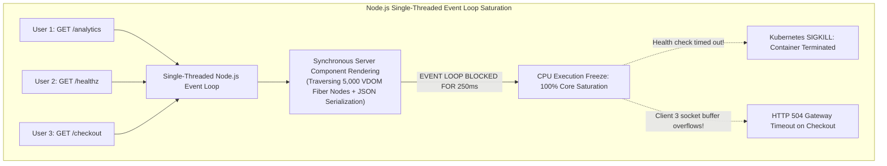
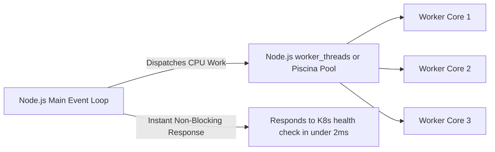

In 2010, Ryan Dahl created Node.js around a single, foundational principle: **I/O should be non-blocking, and CPU execution should be minimal**.

Because Node.js operates on a single-threaded event loop (`libuv`), it excels at shuffling network packets: taking a request, firing an asynchronous database query, releasing the thread to serve thousands of other clients, and re-awakening when the database responds. As long as your JavaScript code does not perform heavy synchronous computation, a single Node.js process can handle tens of thousands of concurrent connections.

Then came React Server Components.

In traditional client-side React, component rendering takes place inside the user’s personal web browser. If an engineer writes an un-optimized component that performs an expensive array filter, parses a massive JSON document, or runs an un-memoized regular expression:
* The user’s laptop fan spins up for 80 milliseconds.
* A single frame drops on one browser viewport.
* **Zero other users are affected.**

In full-stack React architectures (Next.js App Router, Waku, Remix with RSC), component rendering moves from the user’s browser to the **single-threaded Node.js server**.

Suddenly, your server is no longer just an asynchronous I/O router. It is a **Virtual DOM compilation and serialization engine**.

If ten users simultaneously visit a page containing a CPU-intensive Server Component, the Node.js event loop freezes. Inbound HTTP requests queue up in OS socket buffers. Health-check pings fail. Kubernetes thinks your pod is dead and kills it.

This is **The Node.js Event Loop Trap in Server Components**. Here is the systems engineering analysis of CPU starvation in modern full-stack React, and how to protect multi-tenant servers from collapse.


*Figure 1: The Node.js event loop phases and CPU thread starvation induced by synchronous Virtual DOM stringification and recursive Flight serialization. Source: Node.js Diagnostics Working Group [2, 3].*

---

## 1. Why This Feature? The False Equivalence of Client and Server Rendering

To understand how this trap sprung, you must examine how developer teams transitioned from the Pages Router to the App Router.

In the Pages Router, server execution was strictly confined to `getServerSideProps`. Backend developers wrote clean, discrete data-fetching logic, returned a plain JSON object, and passed it to the template. The computational burden of actually traversing the React component tree and building the DOM belonged to the client browser.

React Server Components dissolved that boundary:
```tsx
// app/reports/[id]/page.tsx (Server Component)
export default async function ReportPage({ params }) {
  const rawLogs = await db.logs.findMany({ where: { accountId: params.id } });

  // Heavy synchronous CPU computation running directly on the server!
  const processedData = rawLogs.map(log => {
    return complexTransform(log.payload);
  });

  return (
    <div className="report">
      {processedData.map(item => (
        <LogViewerRow key={item.id} data={item} />
      ))}
    </div>
  );
}
```

### The Architectural Trap:
Developers treat Server Components as if they were running in client-side isolation. But on the server:
1. **Fiber Tree Reconciliation**: React must traverse thousands of JSX nodes, building an in-memory Virtual DOM tree inside the Node.js V8 heap.
2. **Flight Serialization**: React must serialize those fiber structures into line-delimited text chunks (`text/x-component`), encoding strings, escaping characters, and allocating memory buffers.
3. **Synchronous Execution**: While React is traversing 5,000 `<LogViewerRow>` components and serializing their Flight chunks, **the single-threaded Node.js event loop cannot process any other network packets**.

---

## 2. Measuring the Blast Radius: Event Loop Lag & Threadpool Starvation

When the event loop freezes during a synchronous Server Component render, three cascading failures occur across the infrastructure stack:

### 1. The Kubernetes Liveness Probe Cascade
Kubernetes periodically sends an HTTP GET request to `/api/healthz` to check if your container is alive.
* If your container fails to respond within 2 seconds, Kubernetes marks the pod as unhealthy.
* If three consecutive probes fail, Kubernetes issues a `SIGKILL` and restarts the container.
* When your traffic spikes, multiple pods hit the CPU-heavy Server Component simultaneously, their event loops freeze, their health probes fail, and **Kubernetes systematically terminates all your production pods during peak traffic!**

### 2. DNS and Crypto Threadpool Exhaustion
Node.js delegates asynchronous filesystem I/O, DNS lookups (`dns.lookup()`), and cryptographic hashing (`crypto.randomUUID()`) to an internal C threadpool managed by `libuv` (default size: 4 threads).

When Server Actions encrypt closure payloads and Server Components resolve database hostnames, they saturate the `libuv` threadpool. If the event loop is concurrently blocked by synchronous React rendering, callbacks returning from completed database queries cannot execute.

---

## 3. The Systems Solution: Offloading CPU Bounds from the Event Loop

To run React Server Components safely at scale, systems architects must establish a strict boundary: **the main Node.js event loop must only route I/O; heavy computation must be isolated**.



### Pattern 1: Worker Thread Offloading (`worker_threads`)
For complex data transformations, aggregations, or markdown/syntax parsing occurring within Server Components, delegate work to a worker thread pool using libraries like `piscina`:

```typescript
// lib/worker-pool.ts
import Piscina from 'piscina';
import path from 'path';

export const transformationPool = new Piscina({
  filename: path.resolve(__dirname, 'transform-worker.js'),
  maxThreads: 4 // Matches available CPU cores
});
```

```tsx
// app/reports/page.tsx
import { transformationPool } from '@/lib/worker-pool';

export default async function ReportPage() {
  const rawData = await fetchMassiveData();

  // Executed on an isolated OS thread; main event loop stays 100% free!
  const processed = await transformationPool.run(rawData);

  return <ReportTable data={processed} />;
}
```

### Pattern 2: Server Component Pagination and Streaming Bounds
Never render unbounded lists inside a single Server Component. Always enforce virtualization or pagination boundaries:

```tsx
// Anti-Pattern: Renders 10,000 nodes synchronously
export default async function Logs({ logs }) {
  return <div>{logs.map(l => <Row key={l.id} data={l} />)}</div>;
}

// Resilient Pattern: Bounded rendering with incremental streaming
export default async function Logs({ page = 1 }) {
  const paginatedLogs = await fetchLogs({ limit: 50, offset: (page - 1) * 50 });
  return <PaginatedTable logs={paginatedLogs} />;
}
```

---

## 4. Cross-Framework Comparison: How Other Backends Avoid Event Loop Freezes

| Framework / Runtime | Concurrency Architecture | CPU Bound Isolation Mechanism | Outage Hazard on Heavy Computation |
|---|---|---|---|
| **Next.js (Node.js)** | Single-threaded event loop | None by default (Requires manual `worker_threads`) | **High (Event loop starvation crashes pod)** |
| **Go / Gin / Fiber** | Multi-threaded Goroutines (`M:N` scheduler) | Work preemptively scheduled across all CPU cores | Low (Heavy computation slows one request, not entire server) |
| **Rust / Axum** | Async Tokio runtime with work-stealing | Dedicated `tokio::task::spawn_blocking` pool | Minimal (Clear runtime division) |
| **Remix on Cloudflare Workers** | V8 Isolates | Hard 50ms CPU execution limits | Medium (Isolate terminates if CPU budget exceeded) |
| **SvelteKit (Node adapter)** | Single-threaded event loop | Requires manual clustering (`cluster` module) | Moderate (Standard Node risks) |

---

## 5. Architectural Summary

React Server Components represent an undeniable leap forward in developer ergonomics, but they fundamentally change the physical demands placed on server runtimes.

When your UI components run on the server, you are no longer just rendering views; you are allocating server heap memory and consuming server CPU cycles.

Systems engineers who deploy RSC at scale must profile event loop lag (`libuv`), monitor p99 response times against `/healthz`, and treat synchronous JavaScript computation on the server with the same forensic discipline applied to database query optimization.

---

## References & Further Reading

1. **Belder, B., & Saether, T. (2020)**. *libuv Architecture and Design Overview*. libuv Project Documentation. [https://libuv.org/](https://libuv.org/)
2. **Node.js Diagnostics Working Group (2024)**. *Don't Block the Event Loop (or the Worker Pool)*. Node.js Official Documentation. [https://nodejs.org/en/docs/guides/dont-block-the-event-loop/](https://nodejs.org/en/docs/guides/dont-block-the-event-loop/)
3. **Cantrill, B., Shapiro, M. W., & Leventhal, A. H. (2004)**. *Dynamic Instrumentation of Production Systems*. Proceedings of the USENIX Annual Technical Conference (ATC '04), 15–28. [https://www.usenix.org/legacy/event/usenix04/tech/general/cantrill.html](https://www.usenix.org/legacy/event/usenix04/tech/general/cantrill.html)
4. **V8 Engine Team (2024)**. *High-Performance Garbage Collection and Memory Layout in V8*. Chromium Projects. [https://v8.dev/blog](https://v8.dev/blog)
5. **Fastify Team (2023)**. *Benchmarking Node.js Web Frameworks and Latency Percentiles Under CPU Pressure*. Fastify Documentation. [https://fastify.dev/docs/latest/Guides/Benchmarking/](https://fastify.dev/docs/latest/Guides/Benchmarking/)
