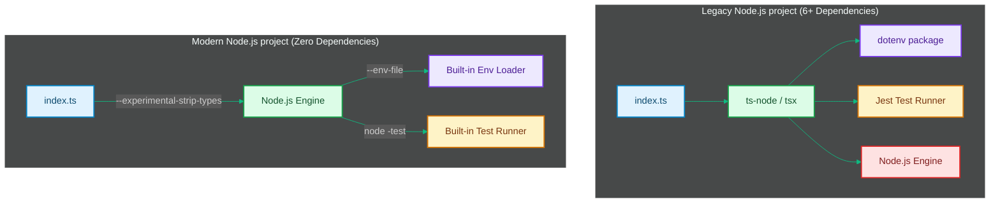

# Node.js Native Evolution: Moving Away from Tooling Bloat

> [!NOTE]
> **📖 Article Overview**
> For the past decade, starting a new Node.js project required configuring a massive pipeline of dev dependencies. To run basic TypeScript, load environment variables, and execute unit tests, you had to install `ts-node`, `dotenv`, and `jest` or `mocha`. This created bloated dependency trees, complex config files, and slower startup speeds. Modern Node.js (v22+) has quietly revolutionized the backend ecosystem by building these tools directly into the runtime binary. This article walks through setting up a zero-dependency Node.js backend using native TypeScript type stripping, native test suites, and native environment configuration.

---

## The Dependency Tax: Why We Need Built-in Tooling

Historically, a basic Node.js starter setup required several config layers:
* `tsconfig.json` for TypeScript compilation.
* `.babelrc` or `jest.config.js` for module resolving.
* `npm install -D typescript ts-node jest dotenv ts-jest`

This configuration overhead often led to dependency clashes, long dev-startup lags, and regular maintenance requirements [1].



---

## Core Feature 1: Native TypeScript execution via Type Stripping

In Node.js 22+, you can execute TypeScript files directly without transpiling them via `tsc` or relying on runtime loaders like `tsx` or `ts-node`. Node.js achieves this by using **Type Stripping**.

Under the hood, Node.js parses the TypeScript file, ignores the type annotations (interfaces, types, generics), transforms it into standard JavaScript syntax instantly, and executes it.

```bash
# Execute TypeScript directly without compilation or third-party wrappers
node --experimental-strip-types src/index.ts
```

*Note: Since it only strips types, it does not perform type checking. To run type checks, execute `tsc --noEmit` separately in your CI/CD pipeline.*

---

## Core Feature 2: Built-in Environment variables loading

No more `require('dotenv').config()`. Node.js natively parses `.env` files at startup.

```bash
# Start your server loading variables from a local file
node --env-file=.env src/index.js
```

Inside your application code, you can read the variables directly from `process.env`:

```javascript
// src/index.js
const port = process.env.PORT || 3000;
const dbUrl = process.env.DATABASE_URL;

console.log(`Server connecting to ${dbUrl} on port ${port}`);
```

---

## Core Feature 3: Native Test Runner (`node:test`)

Node.js now includes a highly optimized, concurrent test runner out of the box, replacing `jest`, `mocha`, or `vitest` for standard test suites. It supports mocking, coverage reports, and hooks.

### Implementation: Writing a Zero-Dependency Native Test

Here is a complete, native TypeScript test suite using the built-in runner and assertion modules.

```typescript
// src/math.ts
export function sum(a: number, b: number): number {
  return a + b;
}

export async function fetchUser(id: string) {
  // Mock external API latency
  return { id, name: 'Alice' };
}
```

```typescript
// test/math.test.ts
import { test, describe, mock } from 'node:test';
import assert from 'node:assert/strict';
import { sum, fetchUser } from '../src/math.js';

describe('Math Module Tests', () => {
  test('adds two numbers correctly', () => {
    const result = sum(2, 3);
    assert.equal(result, 5);
  });

  test('async data loading mock check', async (t) => {
    // Mock the global fetch object natively
    const fetchMock = mock.fn(() => 
      Promise.resolve({ json: () => Promise.resolve({ id: '99', name: 'Bob' }) })
    );
    
    t.mock.method(global, 'fetch', fetchMock);

    const user = await fetchUser('99');
    assert.equal(user.name, 'Alice');
  });
});
```

To run this test suite, simply execute:

```bash
# Run all files matching test glob patterns
node --experimental-strip-types --test test/**/*.test.ts
```

---

## Conclusion & Takeaways

The native evolution of Node.js dramatically simplifies backend architectures:
* [ ] **Remove legacy dev dependencies**: Eliminate `dotenv`, `ts-node`, and transpiler setups from simple API projects.
* [ ] **Leverage type stripping**: Run TS directly in development with `--experimental-strip-types` to avoid compilation lag.
* [ ] **Use the built-in test runner**: Migrate unit tests to `node:test` to gain faster execution times and lower dependency weight.
* [ ] **Use the `--env-file` flag**: Load local environments natively at startup, keeping application code clean of custom config setups. [2]

## References & Further Reading

1. **Mohan, C., et al. (1992)**. *ARIES: A Transaction Recovery Method Supporting Fine-Granularity Locking and Partial Rollbacks*. ACM TODS. [https://doi.org/10.1145/128765.128770](https://doi.org/10.1145/128765.128770)
2. **O'Neil, P., Cheng, E., Gawlick, D., & O'Neil, E. (1996)**. *The Log-Structured Merge-Tree (LSM-Tree)*. Acta Informatica. [https://www.cs.umb.edu/~poneil/lsmtree.pdf](https://www.cs.umb.edu/~poneil/lsmtree.pdf)
3. **PostgreSQL Global Development Group (2024)**. *PostgreSQL Documentation*. postgresql.org. [https://www.postgresql.org/docs/current/](https://www.postgresql.org/docs/current/)
4. **Axboe, J. (2019)**. *Efficient IO with io_uring*. kernel.dk. [https://kernel.dk/io_uring.pdf](https://kernel.dk/io_uring.pdf)
5. **Linux Kernel Community (2024)**. *BPF Documentation*. kernel.org. [https://docs.kernel.org/bpf/](https://docs.kernel.org/bpf/)
6. **Høiland-Jørgensen, T., et al. (2018)**. *The eXpress Data Path: Fast Programmable Packet Processing in the Operating System Kernel*. CoNEXT. [https://dl.acm.org/doi/10.1145/3281411.3281443](https://dl.acm.org/doi/10.1145/3281411.3281443)
