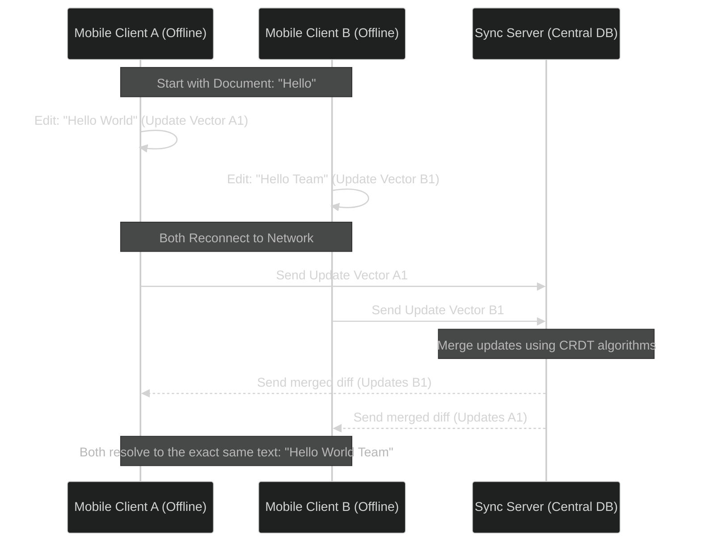

# Offline-First Mobile Apps: Syncing Data Natively with CRDTs

> [!NOTE]
> **📖 Article Overview**
> Designing mobile applications that operate offline is relatively simple when data is read-only. However, when users edit data while disconnected, syncing changes back to a central server leads to severe conflict resolution headaches. Traditional Last-Write-Wins (LWW) strategies frequently overwrite user edits. Modern collaborative apps (like Figma and Linear) use **Conflict-Free Replicated Data Types (CRDTs)** to resolve conflicts natively. This article covers the mechanics of CRDTs on mobile clients and demonstrates how to integrate a local Yjs sync engine with SQLite.

---

## The Conflict Problem in Distributed State

When two clients edit the same document offline, they generate conflicting versions:
* **Client A** updates the project description.
* **Client B** updates the project status.

Under a naive Last-Write-Wins (LWW) strategy, whichever client connects last overwrites the other client's changes completely. CRDTs solve this by treating data structures as trees of operations. Every edit (character typed, property changed) is registered as a unique operation tagged with a logical clock. These operations can be merged in any order and will mathematically produce the exact same final state.



---

## Building an Offline-First Sync Layer with SQLite & Yjs

Yjs is a high-performance CRDT library. To run Yjs on mobile devices, we need to persist the binary updates locally inside SQLite so the data survives app restarts.

### 1. Schema Design for the SQLite Store
Create a table to store document updates as binary blobs:

```sql
CREATE TABLE IF NOT EXISTS document_updates (
    id INTEGER PRIMARY KEY AUTOINCREMENT,
    doc_id TEXT NOT NULL,
    update_blob BLOB NOT NULL,
    created_at TIMESTAMP DEFAULT CURRENT_TIMESTAMP
);
```

---

### 2. TypeScript Local Sync Manager
Here is a TypeScript implementation showing how to load a document state, apply updates locally, store them in SQLite, and prepare a synchronization payload for the server.

```typescript
import * as Y from 'yjs';

interface DatabaseUpdate {
  doc_id: string;
  update_blob: Uint8Array;
}

export class MobileSyncManager {
  private docId: string;
  private ydoc: Y.Doc;

  constructor(docId: string) {
    this.docId = docId;
    this.ydoc = new Y.Doc();
  }

  /**
   * 1. Rebuild the document state by merging all SQLite updates
   */
  public loadDocumentFromLocalDB(updates: DatabaseUpdate[]) {
    // Disable transaction callbacks during initialization
    this.ydoc.transact(() => {
      for (const update of updates) {
        Y.applyUpdate(this.ydoc, update.update_blob);
      }
    }, 'local-db-load');
  }

  /**
   * 2. Make changes to the document while offline
   */
  public updateDocumentText(newText: string): Uint8Array {
    let updateBlob: Uint8Array = new Uint8Array();

    // Listen for the update event triggered by this transaction
    this.ydoc.once('update', (update: Uint8Array) => {
      updateBlob = update;
    });

    // Update the shared text object
    const ytext = this.ydoc.getText('content');
    this.ydoc.transact(() => {
      ytext.delete(0, ytext.length);
      ytext.insert(0, newText);
    }, 'user-edit');

    // Return the generated binary update blob (to be stored in SQLite)
    return updateBlob;
  }

  /**
   * 3. Generate a state vector to send to the server
   * The state vector tells the server exactly what updates this client already has
   */
  public getLocalStateVector(): Uint8Array {
    return Y.encodeStateVector(this.ydoc);
  }

  /**
   * 4. Merge incoming server updates
   */
  public applyServerUpdates(serverUpdateBlob: Uint8Array) {
    Y.applyUpdate(this.ydoc, serverUpdateBlob);
  }

  public getDocumentText(): string {
    return this.ydoc.getText('content').toString();
  }
}

// Example Run Simulation
const syncManager = new MobileSyncManager('doc-99');

// Mock data loaded from SQLite: Initial state "Hello"
const sqliteUpdates: DatabaseUpdate[] = [
  { doc_id: 'doc-99', update_blob: Y.encodeStateAsUpdate(new Y.Doc()) }
];
syncManager.loadDocumentFromLocalDB(sqliteUpdates);

// Simulate User editing document offline
const newUpdate = syncManager.updateDocumentText('Hello World');
console.log('Generated SQLite Update Blob Length:', newUpdate.length);
console.log('Current Document Text:', syncManager.getDocumentText());
```

---

## Conclusion & Takeaways

Implementing CRDTs ensures seamless data synchronization across unreliable mobile networks:
* [ ] **Avoid Last-Write-Wins**: Traditional database updates discard user data during offline sync cycles; CRDTs merge them mathematically.
* [ ] **Store incremental updates locally**: Store Yjs binary updates in a SQLite blob table, and merge them at startup to rebuild the active document state.
* [ ] **Optimize network bandwidth**: Use State Vectors (`Y.encodeStateVector`) to exchange only the missing updates during synchronization, keeping payload sizes small.
* [ ] **Throttle database writes**: Group rapid keypress updates into a single transaction to prevent SQLite connection pool write locks.
