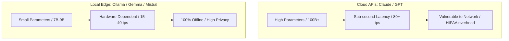
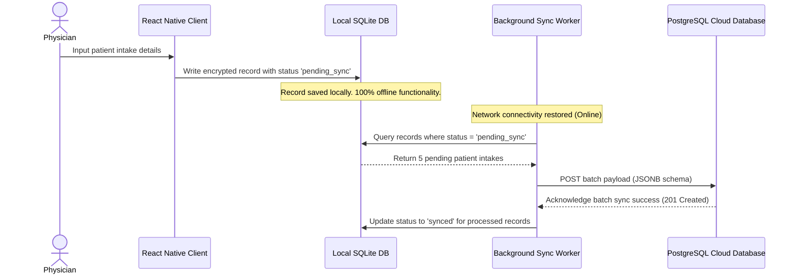

> ### 📖 Article Overview
> * **What this article is about:** This article explores how to transition from cloud-hosted AI APIs to local-first architectures using Ollama, open-weight models, and offline-first database synchronization for highly regulated clinical environments.
> * **Why it matters:** Deploying local-first AI ensures 100% offline reliability, zero API costs, and strict compliance with HIPAA data privacy standards by keeping sensitive patient data entirely on local edge hardware.
> * **What we synthesized:** We analyzed the performance tradeoffs of local vs. cloud inference, detailed a robust SQLite-to-PostgreSQL background synchronization pipeline, and outlined critical security and hardware guardrails for edge deployment.

In resource-constrained clinics or highly regulated medical environments, deploying cloud-hosted models (like Claude or GPT) is often impossible due to lack of stable internet connectivity or strict HIPAA patient data privacy standards.

To build reliable clinical assistants, we must shift from cloud APIs to **Local-First AI Architectures**. This means deploying open-weight models (like Gemma 2 or Mistral 7B) directly on local edge hardware and managing database synchronization locally.

This article reviews the setup, performance tradeoffs, and offline-first database synchronization strategies modeled on my clinical decision assistant, [MedEdge](https://github.com/akmalkhaniub/MedEdge).

---

## Running Local Models via Ollama

Ollama has become the standard execution layer for running open-weight models on local servers. It packages model weights, configurations, and runtime dependencies into a single, unified service exposed via a local HTTP server (`localhost:11434`).

### 1. Local CLI Deployment
To run a clinical-grade Mistral model locally, we pull and run it directly on the edge machine:
```bash
ollama run mistral
```
Ollama automatically detects system hardware (Apple Silicon unified memory, Nvidia CUDA, or AMD ROCm) and offloads weights to the GPU accordingly to maximize inference speed.

### 2. JavaScript Intake Client
Inside our local React Native clinical dashboard, we query the local server directly:
```typescript
async function generateClinicalSummary(rawTranscription: string) {
  const response = await fetch('http://localhost:11434/api/generate', {
    method: 'POST',
    headers: { 'Content-Type': 'application/json' },
    body: JSON.stringify({
      model: 'mistral',
      prompt: `Translate the following doctor-patient audio transcription into a structured SOAP clinical note:\n\n${rawTranscription}`,
      stream: false
    })
  });
  const data = await response.json();
  return data.response;
}
```

---

## Cloud vs. Local Inference Performance

Deploying local models requires understanding the performance and resource tradeoffs:



*   **Accuracy**: Frontier cloud models outperform local 7B models on open-ended logic. However, for specialized structured extraction (like parsing transcription into a standard SOAP note template), fine-tuned 7B models match or exceed general cloud models while costing $0 in API fees.
*   **Latency**: While cloud calls are highly optimized, they require a round-trip network call. Under offline conditions, a local Nvidia RTX GPU executing Mistral at **45 tokens per second** delivers sub-500ms response times without any external dependencies.

---

## Offline-First Syncing: SQLite to Postgres

A clinical assistant must save records even when the clinic is completely disconnected from the network. We implement a **Local-First Synchronization Pipeline**:



1.  **Local Writes**: The mobile and web clients write encrypted patient files directly to a local **SQLite database**. Every entry is tagged with a `sync_status = 'pending_sync'` flag and a unique UUID.
2.  **Connectivity Detection**: A background service monitors system network events.
3.  **Batch Synchronization**: Once internet connectivity is detected, the sync worker gathers all pending records, packages them into a compressed JSON payload, and posts them to our centralized **PostgreSQL** database. 
4.  **Acknowledge and Clear**: Upon receiving a success status from the cloud API gateway, the local sync worker updates the local SQLite records to `sync_status = 'synced'`.

---

## Local-First Implementation Guardrails

*   [ ] **GPU VRAM Checks**: Ensure the edge server has sufficient dedicated VRAM to hold the model weights in memory (minimum 8GB VRAM for 7B models). If memory is exceeded, execution falls back to CPU, increasing latency by 10x.
*   [ ] **Encryption-at-Rest**: Encrypt the local SQLite database using SQLCipher to ensure patient records remain protected if the physical device is stolen.
*   [ ] **Conflict Resolution Policies**: Implement a "last-write-wins" policy using local timestamp UUIDs to handle synchronization conflict cases.

---

## Conclusion & Key Takeaways

Transitioning to a local-first architecture empowers healthcare applications to remain resilient, secure, and highly performant without relying on constant cloud connectivity.
1. **Local-First Privacy & Compliance:** Running open-weight models like Mistral 7B locally via Ollama eliminates external data transmission, ensuring strict adherence to HIPAA and other data privacy regulations.
2. **Offline-First Synchronization:** Implementing a robust SQLite-to-PostgreSQL pipeline allows clinical assistants to function seamlessly offline and securely sync encrypted records once connectivity is restored.
3. **Hardware & Security Guardrails:** Successful edge deployment requires careful VRAM management to avoid CPU fallback latency, alongside robust local encryption (like SQLCipher) to protect data-at-rest.

*Takeaway:* *By shifting to local-first AI, developers can build highly secure, zero-cost, and resilient clinical assistants that perform reliably in any environment.*

---

## References & Further Reading

*   **Local LLM Quantization**: *LLM.int8(): 8-bit Matrix Multiplication for Transformers*. Explains how model weights are compressed to run on consumer hardware. [arXiv:2208.07339](https://arxiv.org/abs/2208.07339)
*   **Offline-First Data Sync**: [SQLCipher Database Encryption](https://www.zetetic.net/sqlcipher/). Standard for local-first database encryption.

*To inspect our local clinical decision assistant codebase, check out the public [MedEdge](https://github.com/akmalkhaniub/MedEdge) repository.*