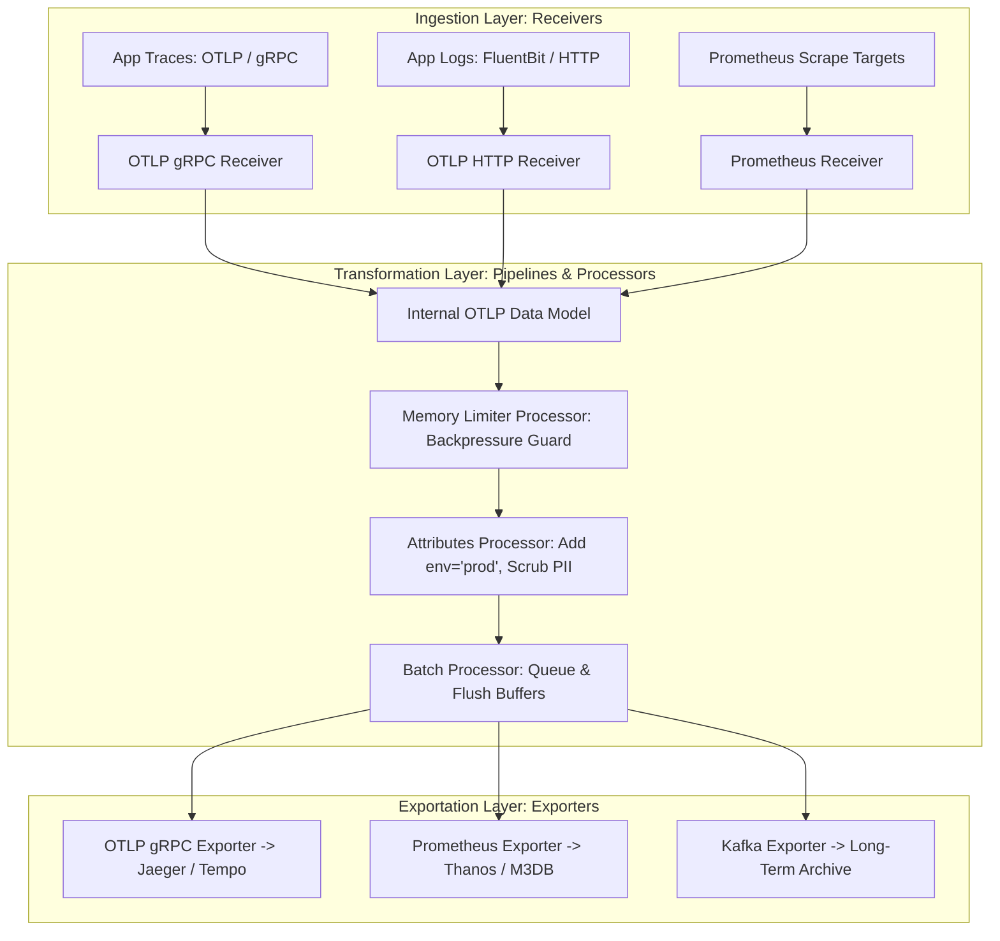

# OpenTelemetry Collector Architecture: Receiver, Processor & Exporter Pipelines

In modern cloud-native systems, monitoring microservice platforms required deploying fragmented, proprietary agent daemons for each observability vendor (e.g. Datadog agent, New Relic agent, Jaeger collector). This created vendor lock-in, inflated CPU memory overhead, and forced complex application instrumentation changes.

To establish a unified open standard, the Cloud Native Computing Foundation (CNCF) formed **OpenTelemetry (OTel)**.

At the core of OpenTelemetry is the **OTel Collector**—a vendor-agnostic proxy daemon that receives, processes, and exports telemetry data (metrics, logs, and traces).

The OTel Collector decouples application telemetry instrumentation from storage backends, allowing platform teams to route telemetry streams dynamically.

This article details the internal Receiver, Processor, and Exporter pipeline architecture of the OpenTelemetry Collector.

---

## 📖 OpenTelemetry Collector Internal Pipeline Architecture

How the OTel Collector ingests, transforms, batches, and exports telemetry streams:



### Core Collector Component Architecture
1. **Receivers**: Ingestion endpoints configured to accept telemetry data in specific protocols (e.g., `otlp/grpc` on port `4317`, `otlp/http` on port `4318`, `prometheus`, `jaeger`). Receivers convert incoming raw protocol payloads into OpenTelemetry's internal **OTLP Data Model**.
2. **Processors**: Sequential data transformation pipelines that manipulate OTLP data in memory:
   * **Memory Limiter Processor**: Monitors collector heap usage. If memory exceeds soft thresholds, it drops or throttles incoming telemetry data to prevent OOM process crashes.
   * **Attributes Processor**: Adds, updates, or redacts metadata labels (e.g., appending `k8s.pod.name` or scrubbing sensitive PII fields).
   * **Batch Processor**: Groups individual telemetry items into bulk batches before forwarding, reducing network socket call overhead.
3. **Exporters**: Egress components that translate internal OTLP objects into external storage backend formats (e.g. sending traces to Tempo via OTLP, metrics to Prometheus, or logs to Kafka). Multiple exporters can be chained to fan out a single telemetry stream to multiple backends simultaneously.

---

## 🛠️ Python Implementation: OpenTelemetry Collector Pipeline Engine

Here is a production-grade Python simulation of an OpenTelemetry Collector Pipeline featuring Receivers, Attribute Scrubbing, Batching, and Fan-Out Exporters:

```python
import time
from typing import List, Dict, Any, Tuple
from pydantic import BaseModel

class TelemetrySpan(BaseModel):
    trace_id: str
    span_id: str
    name: str
    attributes: Dict[str, Any]
    timestamp: float

class OTLPGRPCReceiver:
    """Simulates an OTLP gRPC Receiver converting wire data to internal OTLP."""
    def receive(self, raw_payload: Dict[str, Any]) -> TelemetrySpan:
        return TelemetrySpan(
            trace_id=raw_payload.get("trace_id", "0x0"),
            span_id=raw_payload.get("span_id", "0x0"),
            name=raw_payload.get("name", "unknown_span"),
            attributes=raw_payload.get("attributes", {}),
            timestamp=time.time()
        )

class AttributesScrubberProcessor:
    """Processor: Adds environment metadata and redacts sensitive PII fields."""
    def process(self, span: TelemetrySpan) -> TelemetrySpan:
        # Append cluster environment metadata
        span.attributes["deployment.environment"] = "production"
        span.attributes["collector.version"] = "v0.95.0"

        # Redact PII attributes (e.g., user email)
        if "user.email" in span.attributes:
            span.attributes["user.email"] = "[REDACTED_PII]"

        print(f" ⚙️ [Processor: Attributes] Enriched Span '{span.name}' | Redacted PII.")
        return span

class BatchProcessor:
    """Processor: Groups spans into batches before flushing."""
    def __init__(self, batch_size: int = 2):
        self.batch_size = batch_size
        self.buffer: List[TelemetrySpan] = []

    def add(self, span: TelemetrySpan) -> List[TelemetrySpan]:
        self.buffer.append(span)
        if len(self.buffer) >= self.batch_size:
            flushed = list(self.buffer)
            self.buffer.clear()
            print(f" 📦 [Processor: Batch] Batch size threshold ({self.batch_size}) reached. Flushing batch!")
            return flushed
        return []

class JaegerExporter:
    """Exporter: Sends batched spans to Jaeger / Tempo distributed tracing backend."""
    def export(self, span_batch: List[TelemetrySpan]):
        print(f" 📤 [Exporter: Jaeger] Exporting {len(span_batch)} spans to Jaeger Tracing Backend...")
        for span in span_batch:
            print(f"    • Span '{span.name}' (Trace: {span.trace_id[:8]}) -> Attrs: {span.attributes}")

class OTelCollectorPipeline:
    """
    Simulates the OpenTelemetry Collector Engine.
    """
    def __init__(self):
        self.receiver = OTLPGRPCReceiver()
        self.attr_processor = AttributesScrubberProcessor()
        self.batch_processor = BatchProcessor(batch_size=2)
        self.exporter = JaegerExporter()

    def ingest_telemetry(self, raw_wire_data: Dict[str, Any]):
        # 1. Receiver
        span = self.receiver.receive(raw_wire_data)
        # 2. Attributes Processor
        processed_span = self.attr_processor.process(span)
        # 3. Batch Processor
        flushed_batch = self.batch_processor.add(processed_span)
        # 4. Exporter (If batch flushed)
        if flushed_batch:
            self.exporter.export(flushed_batch)

# Demonstration Execution
if __name__ == "__main__":
    collector = OTelCollectorPipeline()

    print("🚀 Demonstrating OpenTelemetry Collector Architecture...")
    print("=" * 75)

    # 1. Ingest Sample Spans containing PII
    sample_spans = [
        {"trace_id": "4bf92f3577b34da6a3ce929d0e0e4736", "span_id": "00f067aa0ba902b7", "name": "HTTP GET /checkout", "attributes": {"http.status_code": 200, "user.email": "alice@example.com"}},
        {"trace_id": "4bf92f3577b34da6a3ce929d0e0e4736", "span_id": "5fb397be34d23b22", "name": "DB SELECT * FROM orders", "attributes": {"db.system": "postgresql", "db.statement": "SELECT..."}},
    ]

    for wire_data in sample_spans:
        print(f"\n📥 Ingesting Telemetry Wire Data: '{wire_data['name']}'...")
        collector.ingest_telemetry(wire_data)
```

---

## 🚨 OTel Collector Gotchas & Best Practices

When deploying the OpenTelemetry Collector:

> [!IMPORTANT]
> **Always Place the Memory Limiter Processor First**: In processor pipeline configurations, position `memory_limiter` *before* `batch` or other processors. This guarantees that memory checks execute before allocating buffers for incoming telemetry streams.

> [!CAUTION]
> **Deploy Agent + Gateway Topologies**: For large Kubernetes clusters, run lightweight OTel Collector **Agents** as DaemonSets on each node (to handle local metric scraping and log tailing), which forward telemetry to a centralized HA pool of OTel Collector **Gateways** for heavy batching and multi-tenant routing.

---

## 📈 Real-World Enterprise Impact
Organizations adopting the OpenTelemetry Collector report:
* **Zero Vendor Lock-In**: Switching telemetry backends (e.g. from Datadog to Grafana Tempo) requires only updating collector exporter YAML configs without altering application code.
* **40% Reduction in Telemetry Egress Costs**: Pre-scrubbing unused metrics and batching trace payloads at the collector layer reduces network egress fees significantly.
