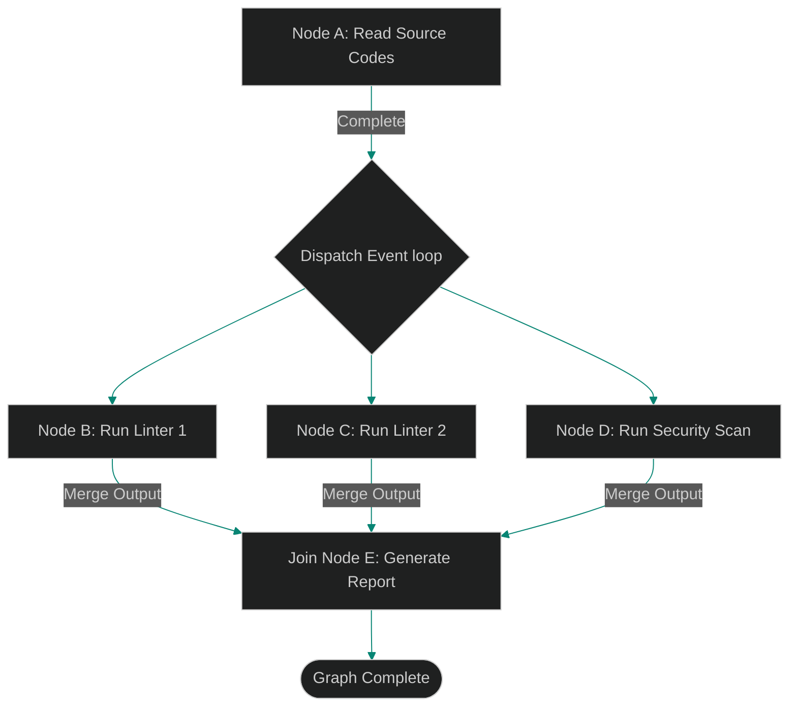

# Concurrent Graph Execution: Running Parallel Tool Branches Concurrently

> [!NOTE]
> **📖 Article Overview**
> When executing multi-step agent graphs, running every task node sequentially is highly inefficient. If an agent needs to lint 5 code files and run 3 database checks, executing them one after another wastes hardware capacity. To optimize execution times, systems must run independent graph branches in parallel. In this article, we design a concurrent graph execution engine, coordinate parameter dependencies, and implement an asynchronous branch runner in Python using `asyncio`.

---

## The Efficiency Loss of Sequential Execution

In basic agent runtimes:
* **The Idle Worker Problem**: If Node B and Node C are independent of each other but both depend on Node A, running them sequentially blocks the CPU and increases execution times.
* **Under-utilized Resources**: Sequential tool calls fail to leverage async features, increasing latency.
* **The Solution**: **Concurrent Graph Execution**. We track node dependencies. As soon as all parent nodes of a task are complete, we immediately launch that node in an async event loop, running independent paths concurrently.



---

## 1. Under the Hood: Tracking Node Execution States

To execute a graph concurrently, we maintain node states:
* **`PENDING`**: Dependencies are still executing.
* **`READY`**: All parent dependency nodes have completed successfully.
* **`RUNNING`**: The node is executing its tool payload.
* **`COMPLETED`**: The node has finished executing and its output data is available for downstream tasks.

---

## 2. Setting up Async Event Dispatchers

The graph dispatcher runs an event loop:
1. It scans the graph for all nodes in the `READY` state.
2. It wraps their payloads in asynchronous tasks and dispatches them concurrently.
3. Upon task completion, it updates child node dependencies and dispatches the next set of ready nodes.

---

## Code Demo: Asynchronous Graph Execution Engine

Below is a Python implementation of an async graph executor. It tracks node dependencies, coordinates parallel execution branches, and schedules tasks concurrently.

```python
import asyncio
import time
from typing import Dict, List, Set

class AsyncGraphExecutor:
    def __init__(self):
        # adj_list maps: task_name -> dependency tasks
        self.dependencies: Dict[str, List[str]] = {}
        self.completed_tasks: Set[str] = set()

    def add_node(self, task_name: str, deps: List[str]):
        self.dependencies[task_name] = deps

    async def execute_task_node(self, task_name: str):
        # Simulate variable runtime delays across tool components
        print(f"🚀 [Dispatcher] Starting execution: {task_name}")
        
        # Simulating active work delays
        await asyncio.sleep(0.5)
        
        self.completed_tasks.add(task_name)
        print(f"✅ [Dispatcher] Completed task: {task_name}")

    async def run_execution_loop(self):
        # Main execution loop runs until all tasks complete
        all_tasks = set(self.dependencies.keys())
        
        while len(self.completed_tasks) < len(all_tasks):
            ready_nodes = []
            
            for task in all_tasks:
                if task in self.completed_tasks:
                    continue
                # If all dependencies are in completed list, dispatch task
                deps = self.dependencies[task]
                if all(d in self.completed_tasks for d in deps):
                    ready_nodes.append(task)
            
            if not ready_nodes:
                # Cycle check validation fallback
                print("⚠️ [Error] Deadlock detected or no ready nodes found.")
                break

            print(f"\n⚡ Dispatching concurrent batch: {ready_nodes}")
            
            # Execute all ready nodes concurrently
            await asyncio.gather(*(self.execute_task_node(task) for task in ready_nodes))

if __name__ == "__main__":
    executor = AsyncGraphExecutor()

    # Define DAG layout
    # Node B and C execute in parallel after Node A completes
    executor.add_node("READ_FILE", [])
    executor.add_node("LINT_MODULE_1", ["READ_FILE"])
    executor.add_node("LINT_MODULE_2", ["READ_FILE"])
    executor.add_node("SECURITY_AUDIT", ["READ_FILE"])
    executor.add_node("COMPILE_REPORT", ["LINT_MODULE_1", "LINT_MODULE_2", "SECURITY_AUDIT"])

    print("🌲 Initializing Concurrent Graph Execution...")
    start_time = time.time()
    
    asyncio.run(executor.run_execution_loop())
    
    end_time = time.time()
    print(f"\n🎉 Total Graph Execution Time: {end_time - start_time:.2f} seconds.")
```

---

## Concurrent Execution Takeaways

* **Map Dependencies**: Define clear prerequisite mappings for all task nodes before starting execution.
* **Execute Concurrently**: Dispatch independent task branches concurrently to minimize total execution times.
* **Monitor Shared State**: Enforce read-only locks on shared states to prevent data corruption during concurrent execution.
