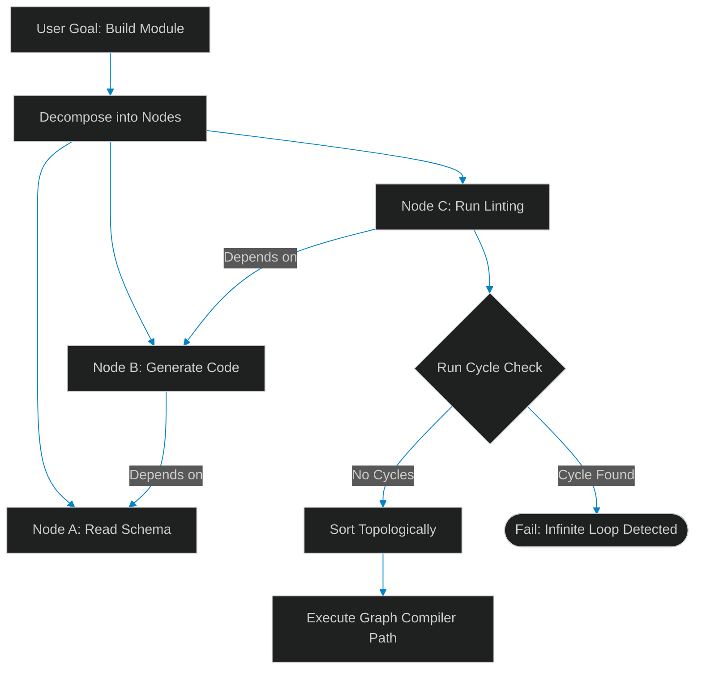

# DAG Compilation: Decomposing Goals into Directed Acyclic Graphs

> [!NOTE]
> **📖 Article Overview**
> Basic autonomous agents execute tasks in a simple linear loop. While this works for simple sequences, it fails for complex engineering objectives (e.g. migrating database tables, generating code modules, and running test suites). Tasks have dependencies: you cannot run code tests before compiling the source files. To manage these relationships, execution engines must compile goals into **Directed Acyclic Graphs (DAGs)**. In this article, we design a goal decomposer and implement a cycle-detecting graph compiler in Python.

---

## Moving Beyond Linear Execution Loops

When agents execute tasks sequentially:
* **Blocked Execution Paths**: If a step fails, the agent cannot easily identify which independent steps can still proceed.
* **Redundant Operations**: The agent repeats prerequisite checks for every sub-task rather than mapping them to a single shared dependency.
* **The Solution**: **DAG Compilation**. We parse the user's high-level goal, decompose it into a set of dependency-linked task nodes, run topological sorting to verify order, and check for cycles to prevent infinite loops.



---

## 1. Topological Sorting: Verifying Execution Order

To determine execution order:
* **The Concept**: Topological sorting takes a directed graph and returns a linear ordering of its vertices such that for every directed edge $U \rightarrow V$, node $U$ comes before $V$ in the ordering.
* **Cycle Detection**: If the graph contains a cycle (e.g., Node A depends on Node B, which depends on Node A), topological sorting is impossible. We use Depth-First Search (DFS) state tracking to flag cycle errors.

---

## 2. Compiling Graph Specifications

The graph compiler structures the execution schema:
1. **Deconstruct Goals**: Decompose the user request into discrete task nodes (e.g., `READ_FILE`, `WRITE_CODE`, `TEST_CODE`).
2. **Define Dependencies**: Set prerequisite identifiers for each node.
3. **Sort and Verify**: Validate topological sorted paths before launching agent executors.

---

## Code Demo: Cycle-Detecting DAG Compiler

Below is a Python implementation of an agent graph compiler. It builds execution trees, checks for loops using DFS state tracking (white, gray, black nodes), and generates topologically sorted execution paths.

```python
from typing import Dict, List, Set, Tuple

class AgentDAGCompiler:
    def __init__(self):
        self.adj_list: Dict[str, List[str]] = {}

    def add_task(self, task_name: str, dependencies: List[str]):
        # Add task node and map incoming dependencies
        self.adj_list[task_name] = dependencies

    def compile_execution_path(self) -> Tuple[bool, List[str]]:
        visited: Dict[str, int] = {node: 0 for node in self.adj_list} # 0=unvisited, 1=visiting, 2=visited
        ordered_path: List[str] = []

        def dfs_has_cycle(node: str) -> bool:
            visited[node] = 1 # Mark as visiting (gray)
            
            # Check dependency edges
            for dep in self.adj_list.get(node, []):
                if dep not in visited:
                    continue
                if visited[dep] == 1:
                    return True # Found cycle link
                if visited[dep] == 0:
                    if dfs_has_cycle(dep):
                        return True
                        
            visited[node] = 2 # Mark as visited (black)
            ordered_path.append(node)
            return False

        # Run DFS across all nodes
        for node in list(self.adj_list.keys()):
            if visited[node] == 0:
                if dfs_has_cycle(node):
                    return False, [] # Cycle found

        return True, ordered_path

if __name__ == "__main__":
    compiler = AgentDAGCompiler()

    # Case 1: Valid task dependencies
    # Goal: Compile and test API module
    compiler.add_task("READ_SCHEMA", [])
    compiler.add_task("GENERATE_CODE", ["READ_SCHEMA"])
    compiler.add_task("RUN_LINTER", ["GENERATE_CODE"])
    compiler.add_task("RUN_UNIT_TESTS", ["GENERATE_CODE"])

    print("🌲 Compiling Agent Execution Graph...")
    print("---------------------------------------")

    success, path = compiler.compile_execution_path()
    print(f"[Valid Graph] Compilation Success: {success} | Path: {path}")

    # Case 2: Invalid circular dependencies
    circular_compiler = AgentDAGCompiler()
    circular_compiler.add_task("WRITE_TESTS", ["RUN_COMPILER"])
    circular_compiler.add_task("RUN_COMPILER", ["WRITE_TESTS"]) # Circular loop

    success_c, path_c = circular_compiler.compile_execution_path()
    print(f"[Circular Graph] Compilation Success: {success_c} | Path: {path_c}")
```

---

## Architectural Guidelines

* **Verify Graph Paths**: Run cycle detection checks on all execution trees before calling downstream agent executors.
* **Decompose Granularly**: Keep task nodes focused on single tool operations to simplify execution tracking.
* **Decouple Inputs**: Pass input and output data parameters between nodes using explicit graph context variables.
