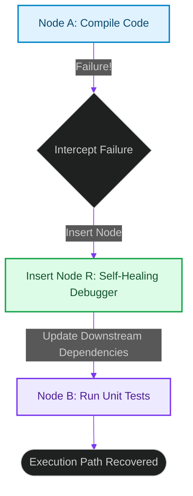

# Dynamic Plan Recovery: Restructuring Execution Trees on Node Failures

> [!NOTE]
> **📖 Article Overview**
> In complex multi-agent workflows, task failures are inevitable. If a code execution node hits a compiler error, running downstream testing and deployment nodes blindly wastes resources. However, halting the entire workflow requires manual intervention. To build resilient systems, orchestration engines must implement **Dynamic Plan Recovery**. When a node fails, the execution coordinator intercepts the error, adjusts the remaining DAG paths, and inserts recovery or repair tasks dynamically. In this article, we design a self-healing graph executor in Python.

---

## The Fragility of Static Graphs

In standard execution pipelines:
* **The Cascade Failure**: A failure in an early step causes all downstream tasks to fail automatically without attempting recovery [1].
* **Lack of Adaptive Replanning**: Static graph designs cannot modify paths dynamically based on runtime outputs.
* **The Solution**: **Dynamic Plan Recovery**. We intercept task exceptions. Instead of aborting, the graph coordinator inserts a repair node (e.g. calling a debugger agent) and rewrites downstream dependency paths to resolve the error.



---

## 1. Under the Hood: Graph Restructuring Operations

To support dynamic plan recovery, the orchestration engine must support:
* **Node Mutation**: The ability to add new task nodes to the active DAG during execution.
* **Dependency Edge Rewriting**: Modifying the target parents of pending nodes to route them through the newly inserted recovery nodes.
* **State Rollbacks**: Resetting the state of failed nodes to enable retries after repair attempts.

---

## 2. Setting up Repair Loops

The self-healing execution loop handles failures systematically:
1. **Intercept Failure**: Detect when a task raises an exception or returns a failure status.
2. **Execute Replanning**: Call a replanning model to generate a recovery strategy.
3. **Rewrite DAG**: Insert the generated repair nodes and update remaining task dependencies before resuming execution.

---

## Code Demo: Self-Healing Graph Executor

Below is a Python implementation of a self-healing graph manager. It simulates task execution, intercepts failures, inserts repair nodes dynamically, updates downstream dependencies, and recovers execution paths.

```python
from typing import Dict, List, Set, Tuple

class SelfHealingGraphCoordinator:
    def __init__(self):
        # Initial graph layout: Node A -> Node B
        self.adj_list: Dict[str, List[str]] = {
            "COMPILE_CODE": [],
            "RUN_UNIT_TESTS": ["COMPILE_CODE"]
        }
        self.completed: Set[str] = set()

    def insert_recovery_node(self, failed_node: str, repair_node: str):
        print(f"🔧 [Recovery] Intercepted failure in '{failed_node}'. Modifying graph...")
        
        # 1. Insert the new repair task node
        self.adj_list[repair_node] = []
        
        # 2. Update downstream dependencies to route through the repair node
        for node, deps in list(self.adj_list.items()):
            if failed_node in deps:
                deps.remove(failed_node)
                deps.append(repair_node)
                
        print(f"🌲 [Recovery] Updated Graph Schema: {self.adj_list}")

    def execute_graph(self) -> bool:
        # Simple simulation runner
        all_nodes = set(self.adj_list.keys())
        
        while len(self.completed) < len(all_nodes):
            ready_nodes = [n for n in self.adj_list if n not in self.completed and all(d in self.completed for d in self.adj_list[n])]
            
            if not ready_nodes:
                return False

            for node in ready_nodes:
                print(f"\n🚀 Executing task: {node}")
                
                # Simulate compilation failure
                if node == "COMPILE_CODE":
                    print("❌ Error: Compilation failed due to syntax error.")
                    # Insert recovery node to debug code
                    self.insert_recovery_node("COMPILE_CODE", "DEBUGGER_REPAIR")
                    # Mark failed node as completed to unblock execution path
                    self.completed.add(node)
                    all_nodes.add("DEBUGGER_REPAIR") # Register new node
                    break
                else:
                    print(f"✅ Success: Completed {node}")
                    self.completed.add(node)
        return True

if __name__ == "__main__":
    coordinator = SelfHealingGraphCoordinator()

    print("🌲 Starting Self-Healing Graph Execution...")
    print("------------------------------------------")

    success = coordinator.execute_graph()
    print(f"\n🎉 Graph Run Finished. Status Success: {success}")
```

---

## Orchestration Takeaways

* **Intercept Failure Points**: Catch exceptions at the task node level rather than allowing them to abort the entire workflow.
* **Mutate Graphs Dynamically**: Implement APIs to insert new task nodes and update dependencies during graph execution.
* **Implement Recovery Limits**: Set maximum retry limits on repair loops to prevent infinite self-healing cycles. [2]

## References & Further Reading

1. **Malkov, Y. A., & Yashunin, D. A. (2018)**. *Efficient and Robust Approximate Nearest Neighbor Search Using Hierarchical Navigable Small World Graphs*. IEEE TPAMI. [https://arxiv.org/abs/1603.09320](https://arxiv.org/abs/1603.09320)
2. **Jégou, H., Douze, M., & Schmid, C. (2011)**. *Product Quantization for Nearest Neighbor Search*. IEEE TPAMI. [https://hal.inria.fr/inria-00514462v2/document](https://hal.inria.fr/inria-00514462v2/document)
3. **Johnson, J., Douze, M., & Jégou, H. (2019)**. *Billion-scale Similarity Search with GPUs*. IEEE Transactions on Big Data. [https://arxiv.org/abs/1702.08734](https://arxiv.org/abs/1702.08734)
4. **Axboe, J. (2019)**. *Efficient IO with io_uring*. kernel.dk. [https://kernel.dk/io_uring.pdf](https://kernel.dk/io_uring.pdf)
5. **Linux Kernel Community (2024)**. *BPF Documentation*. kernel.org. [https://docs.kernel.org/bpf/](https://docs.kernel.org/bpf/)
6. **Høiland-Jørgensen, T., et al. (2018)**. *The eXpress Data Path: Fast Programmable Packet Processing in the Operating System Kernel*. CoNEXT. [https://dl.acm.org/doi/10.1145/3281411.3281443](https://dl.acm.org/doi/10.1145/3281411.3281443)
