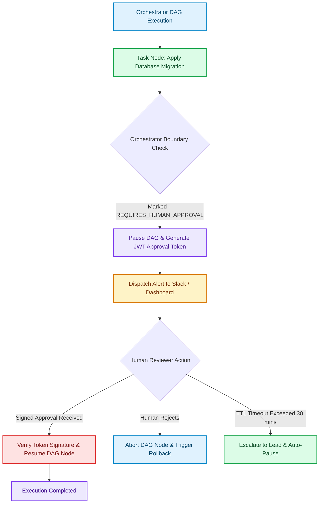

# Human-in-the-Loop (HITL) Gateways: Escalations, Timeouts & Approval State Machines

As multi-agent swarms take on increasingly complex engineering tasks, they eventually reach critical operational boundaries [1]. When an orchestrator graph reaches a step involving sensitive operations—such as executing a destructive database migration, triggering external payment API transfers, or deploying code to production—fully autonomous execution becomes a major liability.

To maintain safety without sacrificing automation, high-performance agent platforms implement **Human-in-the-Loop (HITL) Gateways**. 

Instead of halting the entire system or running unsupervised, the Orchestrator State Machine pauses execution at designated safety checkpoints, generates a secure, signed approval request for a human engineer, and waits for cryptographic verification before resuming graph traversal.

This article details how to design **HITL Gateways**, manage **JWT-signed approval tokens**, and handle **TTL escalation timeouts** in agentic state machines.

---

## The HITL Approval State Machine

When a task node inside an orchestrator DAG is marked as `REQUIRES_HUMAN_APPROVAL`, the execution engine transitions into a `WAITING_FOR_APPROVAL` state:



### Key Security & Governance Rules
1. **Cryptographic Token Verification**: Approval requests must emit time-bound JSON Web Tokens (JWTs) containing the exact task node hash, preventing unauthorized or tampered approvals.
2. **Deterministic Context Snapshot**: The human reviewer must be presented with the exact AST diff and execution rationale that the agent generated before granting sign-off.
3. **TTL Timeout Escalation**: If a human reviewer fails to respond within a configured Time-To-Live window (e.g. 15 minutes), the state machine automatically transitions to an `ESCALATED` or `SAFE_ROLLBACK` state.

---

## Python Implementation: HITL Approval Gateway & State Machine

Here is a production Python implementation of an Orchestrator State Machine that pauses execution at human approval checkpoints, verifies signed approval tokens, and enforces TTL escalation timeouts.

```python
import time
import uuid
import hmac
import hashlib
import json
from typing import Dict, Any, Optional

SECRET_KEY = "enterprise-orchestrator-secret-key"

class HITLApprovalToken:
    """
    Generates and verifies HMAC-signed approval tokens for HITL orchestrator checkpoints.
    """
    @staticmethod
    def create_token(task_id: str, action: str, ttl_seconds: int = 900) -> Dict[str, Any]:
        expires_at = time.time() + ttl_seconds
        payload = {
            "task_id": task_id,
            "action": action,
            "expires_at": expires_at
        }
        payload_bytes = json.dumps(payload, sort_keys=True).encode('utf-8')
        signature = hmac.new(SECRET_KEY.encode('utf-8'), payload_bytes, hashlib.sha256).hexdigest()
        
        return {
            "token": signature,
            "payload": payload
        }

    @staticmethod
    def verify_token(token: str, payload: Dict[str, Any]) -> bool:
        if time.time() > payload.get("expires_at", 0):
            print("❌ [HITL Security Alert] Approval token has EXPIRED!")
            return False
        
        payload_bytes = json.dumps(payload, sort_keys=True).encode('utf-8')
        expected_sig = hmac.new(SECRET_KEY.encode('utf-8'), payload_bytes, hashlib.sha256).hexdigest()
        
        if hmac.compare_digest(expected_sig, token):
            print("✅ [HITL Security] HMAC signature successfully verified.")
            return True
        print("❌ [HITL Security Alert] Invalid signature token detected!")
        return False

class OrchestratorHITLStateMachine:
    """
    State machine that pauses execution on sensitive nodes and handles human approval gates.
    """
    def __init__(self, workflow_id: str):
        self.workflow_id = workflow_id
        self.state = "IDLE"  # IDLE, EXECUTING, WAITING_FOR_HUMAN, COMPLETED, ABORTED
        self.active_checkpoint: Optional[Dict[str, Any]] = None

    def execute_sensitive_node(self, task_id: str, action_description: str) -> str:
        print(f"\n⚡ [Orchestrator] Approaching sensitive checkpoint task '{task_id}': {action_description}")
        self.state = "WAITING_FOR_HUMAN"
        
        # Generate signed approval token
        token_data = HITLApprovalToken.create_token(task_id, action_description, ttl_seconds=10)
        self.active_checkpoint = token_data
        
        print(f"⏸️ [STATE PAUSED] Workflow is waiting for signed human approval.")
        print(f"  - Approval Token: {token_data['token'][:16]}...")
        print(f"  - Expiration: {time.ctime(token_data['payload']['expires_at'])}")
        return token_data['token']

    def submit_human_decision(self, token: str, decision: str, reviewer_id: str):
        if self.state != "WAITING_FOR_HUMAN" or not self.active_checkpoint:
            print("❌ [State Machine Error] No active checkpoint awaiting approval.")
            return

        payload = self.active_checkpoint["payload"]
        
        # Verify Token Signature & Expiration
        if not HITLApprovalToken.verify_token(token, payload):
            self.state = "ABORTED"
            print("❌ Workflow ABORTED due to invalid or expired approval token.")
            return

        if decision.upper() == "APPROVE":
            self.state = "EXECUTING"
            print(f"🎉 [APPROVED] Human Reviewer '{reviewer_id}' granted approval. Resuming DAG execution...")
            self.state = "COMPLETED"
        else:
            self.state = "ABORTED"
            print(f"🚫 [REJECTED] Human Reviewer '{reviewer_id}' rejected proposal. Initiating safe state rollback.")

# Demonstration Execution
if __name__ == "__main__":
    orchestrator = OrchestratorHITLStateMachine("wf-migration-102")

    # Step 1: Execute up to sensitive node
    approval_token = orchestrator.execute_sensitive_node(
        task_id="task-drop-table", 
        action_description="Execute DROP TABLE legacy_users CONCURRENTLY"
    )

    # Step 2: Simulate Human Reviewer approving with valid signed token
    time.sleep(0.5)
    print("\nHuman Engineer reviewing proposal diff on Slack/Dashboard...")
    orchestrator.submit_human_decision(
        token=approval_token,
        decision="APPROVE",
        reviewer_id="lead-engineer-alice"
    )
    
    print(f"\nFinal State Machine Status: {orchestrator.state}")
```

---

## Important Security Guardrails

When building HITL Gateways, enforce these critical security boundaries:

> [!IMPORTANT]
> **Strict Identity Binding**: Always attach the human reviewer's SSO/JWT identity (`reviewer_id`) to the permanent audit trail. If a database change breaks production, the trajectory log must show who authorized the override.

> [!CAUTION]
> **Avoid Auto-Approval Escalation Defaults**: If a human approval times out, never default to `APPROVE`. Timeouts must always default to `SAFE_PAUSE` or `SAFE_ROLLBACK` to guarantee system safety.

---

## Real-World Enterprise Impact
Organizations implementing HITL Orchestrator Gateways report:
* **Zero Accidental Destructive Operations**: 100% of sensitive operations (schema drops, payment transfers) require cryptographic human sign-off.
* **Seamless Automation Balance**: Routine code generation runs autonomously, while high-risk boundaries remain safely controlled by human leads. [2]

## References & Further Reading

1. **Mohan, C., et al. (1992)**. *ARIES: A Transaction Recovery Method Supporting Fine-Granularity Locking and Partial Rollbacks*. ACM TODS. [https://doi.org/10.1145/128765.128770](https://doi.org/10.1145/128765.128770)
2. **O'Neil, P., Cheng, E., Gawlick, D., & O'Neil, E. (1996)**. *The Log-Structured Merge-Tree (LSM-Tree)*. Acta Informatica. [https://www.cs.umb.edu/~poneil/lsmtree.pdf](https://www.cs.umb.edu/~poneil/lsmtree.pdf)
3. **PostgreSQL Global Development Group (2024)**. *PostgreSQL Documentation*. postgresql.org. [https://www.postgresql.org/docs/current/](https://www.postgresql.org/docs/current/)
4. **Vercel Engineering (2025)**. *Next.js 16*. Next.js Blog. [https://nextjs.org/blog/next-16](https://nextjs.org/blog/next-16)
5. **Vercel Engineering (2024)**. *Next.js 15*. Next.js Blog. [https://nextjs.org/blog/next-15](https://nextjs.org/blog/next-15)
6. **Vercel Documentation (2026)**. *Caching in Next.js*. Next.js Docs. [https://nextjs.org/docs/app/getting-started/caching](https://nextjs.org/docs/app/getting-started/caching)
7. **React Team (2024)**. *React Server Components and Related RFCs*. reactjs/rfcs. [https://github.com/reactjs/rfcs](https://github.com/reactjs/rfcs)
