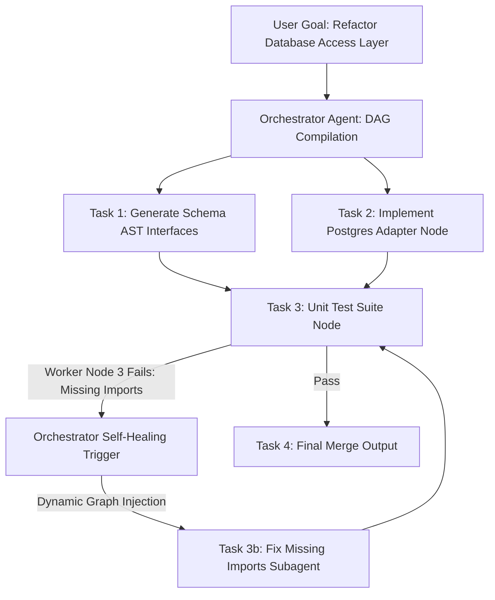

# The Orchestrator Paradigm: Architecting Multi-Agent Dynamic DAGs & Recovery

In basic agentic workflows, software systems rely on a single LLM agent running inside a linear loop. The agent receives a prompt, executes a tool, inspects the tool output, and loops until the task is complete. 

While linear agent loops work for simple single-file scripts, they collapse when applied to complex, multi-component enterprise systems. A single agent handling a 20-step software migration inevitably suffers from **context flooding**, **hallucination loops**, and **irrecoverable execution failures**.

To build robust multi-agent systems, modern architectures adopt **The Orchestrator Paradigm**. Instead of executing code directly, a specialized **Orchestrator Agent** acts as the central system architect—compiling high-level goals into dynamic Directed Acyclic Graphs (DAGs), spawning isolated worker subagents, and dynamically injecting self-healing recovery paths when worker tasks fail.

---

## The Orchestrator DAG Lifecycle

The Orchestrator operates as a meta-controller, isolating execution contexts across specialized worker nodes:



### Key Architectural Capabilities
1. **Dynamic Plan Compilation**: The Orchestrator analyzes the initial goal and breaks it down into a DAG of discrete, typed task nodes with explicit prerequisite dependencies.
2. **Sub-Context Isolation**: When dispatching a worker agent to execute a single task node, the Orchestrator strips away global conversation history, passing strictly the AST context required for that specific sub-task.
3. **Self-Healing Graph Injection**: If a worker node returns a failure signal or invalid payload, the Orchestrator does not abort the entire workflow. Instead, it dynamically injects a recovery sub-graph into the active DAG to repair the failure before re-running the dependent nodes.

---

## Python Implementation: Dynamic Orchestrator & Self-Healing DAG Engine

Here is a production Python implementation of an Orchestrator DAG engine that manages task node execution, enforces dependency order, and dynamically injects recovery nodes when worker subagents report failures.

```python
import uuid
import time
from typing import Dict, Any, List, Optional

class DAGNode:
    def __init__(self, node_id: str, title: str, task_payload: Dict[str, Any], dependencies: List[str]):
        self.node_id = node_id
        self.title = title
        self.task_payload = task_payload
        self.dependencies = dependencies
        self.status = "PENDING"  # PENDING, RUNNING, COMPLETED, FAILED
        self.output: Optional[Dict[str, Any]] = None
        self.error: Optional[str] = None

class DynamicDAGOrchestrator:
    """
    Orchestrator engine that manages DAG execution order, dispatches worker nodes,
    and dynamically modifies the execution graph upon failure.
    """
    def __init__(self, goal: str):
        self.goal = goal
        self.nodes: Dict[str, DAGNode] = {}

    def add_node(self, node: DAGNode):
        self.nodes[node.node_id] = node

    def get_ready_nodes(self) -> List[DAGNode]:
        ready = []
        for node in self.nodes.values():
            if node.status != "PENDING":
                continue
            # Check if all dependencies are COMPLETED
            deps_satisfied = all(
                self.nodes[dep_id].status == "COMPLETED" 
                for dep_id in node.dependencies
            )
            if deps_satisfied:
                ready.append(node)
        return ready

    def inject_recovery_node(self, failed_node: DAGNode, recovery_title: str, fix_payload: Dict[str, Any]):
        """
        Dynamically injects a self-healing recovery node into the DAG to fix a worker failure.
        """
        recovery_id = f"fix-{failed_node.node_id}-{uuid.uuid4().hex[:4]}"
        print(f"🛠️ [Orchestrator Self-Healing] Injecting recovery node '{recovery_id}' to fix '{failed_node.title}'...")

        # 1. Create recovery node dependent on failed node's prerequisites
        recovery_node = DAGNode(
            node_id=recovery_id,
            title=recovery_title,
            task_payload=fix_payload,
            dependencies=list(failed_node.dependencies)
        )
        self.add_node(recovery_node)

        # 2. Reset failed node and make it dependent on the recovery node
        failed_node.status = "PENDING"
        failed_node.dependencies.append(recovery_id)
        print(f"  - Node '{failed_node.node_id}' reset to PENDING, now waiting on '{recovery_id}'.")

    def execute_dag(self):
        print(f"Starting Orchestrator DAG execution for goal: '{self.goal}'\n")
        
        while True:
            ready_nodes = self.get_ready_nodes()
            
            if not ready_nodes:
                # Check if all nodes completed or unresolvable failures exist
                all_completed = all(n.status == "COMPLETED" for n in self.nodes.values())
                if all_completed:
                    print("🎉 [Orchestrator] All DAG nodes executed successfully!")
                    break
                
                failed_nodes = [n for n in self.nodes.values() if n.status == "FAILED"]
                if failed_nodes:
                    print(f"❌ [Orchestrator Execution Halted] Unrecoverable failure in nodes: {[n.node_id for n in failed_nodes]}")
                    break
                
                time.sleep(0.1)
                continue

            for node in ready_nodes:
                node.status = "RUNNING"
                print(f"[Worker Dispatch] Executing Node '{node.node_id}': {node.title}")
                
                # Simulate worker subagent execution
                # Node 'node-3' deliberately fails on first run to demonstrate self-healing injection
                if node.node_id == "node-3" and "fix-node-3" not in str(self.nodes.keys()):
                    node.status = "FAILED"
                    node.error = "SyntaxError: missing parenthetical closing bracket in test suite"
                    print(f"❌ [Worker Error] Node '{node.node_id}' failed: {node.error}")
                    
                    # Trigger Orchestrator self-healing recovery injection
                    self.inject_recovery_node(
                        failed_node=node,
                        recovery_title="Sanitize Syntax Bracket Formatting",
                        fix_payload={"action": "auto_fix_syntax", "target": "test_suite.py"}
                    )
                else:
                    node.status = "COMPLETED"
                    node.output = {"result": "success", "artifacts": [f"{node.node_id}_output.py"]}
                    print(f"✅ Node '{node.node_id}' COMPLETED successfully.")

# Demonstration Execution
if __name__ == "__main__":
    orchestrator = DynamicDAGOrchestrator("Refactor Database Access Layer")

    # Build initial execution DAG
    orchestrator.add_node(DAGNode("node-1", "Extract DB Schemas", {"task": "schema_ast"}, []))
    orchestrator.add_node(DAGNode("node-2", "Generate Postgres Repository", {"task": "repo_gen"}, ["node-1"]))
    orchestrator.add_node(DAGNode("node-3", "Execute Repository Unit Tests", {"task": "test_run"}, ["node-2"]))

    # Execute DAG
    orchestrator.execute_dag()
```

---

## Important Architectural Guardrails

When designing orchestrator DAG engines, keep these boundaries in mind:

> [!IMPORTANT]
> **Max Recovery Recursion Depth**: Limit the maximum number of self-healing recovery nodes that can be injected for a single failed task (e.g. max 3 retries). If a worker node fails 3 times despite recovery injection, halt the DAG and trigger human escalation.

> [!CAUTION]
> **Avoid Single-Point Orchestrator Context Leakage**: Never pass the outputs of all previous DAG nodes into every new worker node. Pass only the explicit output artifacts declared by prerequisite nodes in the dependency list.

---

## Real-World Enterprise Impact
Organizations implementing The Orchestrator Paradigm report:
* **94% Task Completion Success**: Dynamic recovery node injection recovers from transient LLM syntax bugs automatically.
* **80% Reduction in Context Costs**: Isolated sub-contexts prevent worker nodes from loading irrelevant conversation history.
